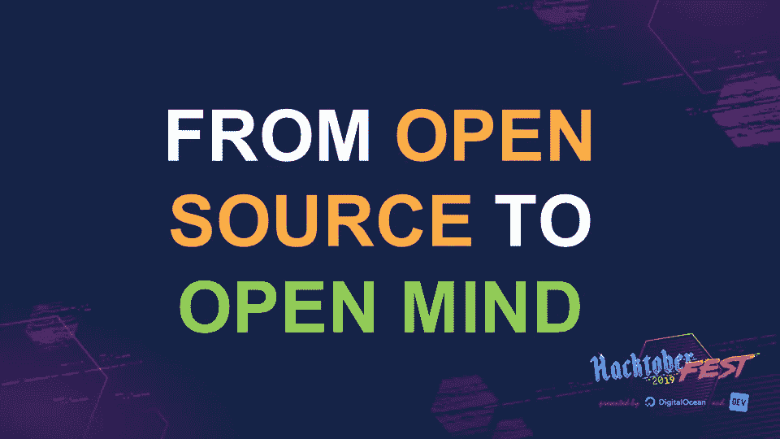
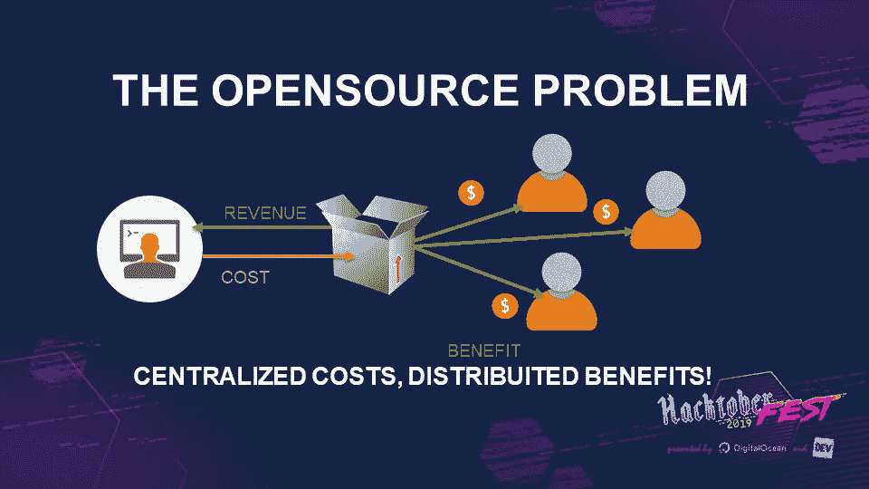
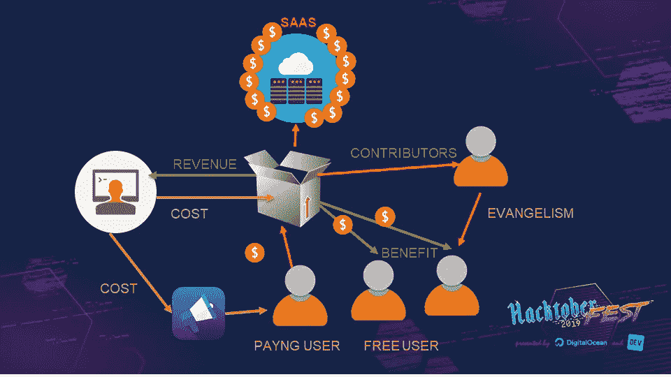
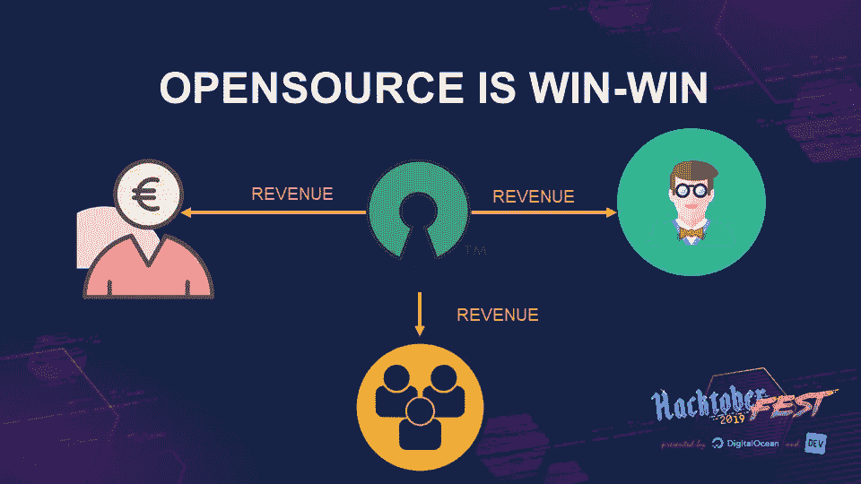

# 从开源到开放思想

> 原文：<https://betterprogramming.pub/from-open-source-to-openmind-cb61ce05593a>

## 开始开源之旅，并学习如何将其作为增长的驱动力

作为一名活跃的开源开发人员，我想告诉您使用开源方法来为您的业务带来最佳收益并让您的公司成长的机会。

# 我的开源之旅

直到 2006 年，我对开源的了解是有一个 OS 叫 Linux，它的源代码是公开的。

回想起来，这是一个非常有限的想法，现在当我听到“开源就是 Linux”时，我仍然会笑。

然后，在 2006 年，我阅读了 GPL 许可证，我明白我可以发布我的自制作品，并与世界分享它们。太棒了。我觉得自己受到了执照的保护，就像律师为我写的一样。

我的第一个应用很成功，当时我才 21 岁，移动应用还不存在。我发布了我的开源 CSS IDE，几年内就有 100，000 人下载了它(仅仅是在所有主要 IDE 上包含这个特性所花的时间)。这很有趣，我明白在这个项目中我学到了比在大学里更多的关于开发的知识。

这就是我没有止步于此的原因:开源是我作为开发人员和 IT 专业人员成长的驱动力。那么什么是开源呢？

开源不仅仅是自由软件。这也更像是他们的 GPL 或者其他许可证。开源是一种心态。这是思考源代码的方式，不要把它当成财产，而是可以共享的东西。

当古代人类开始写作来传递知识时，古代程序员开始在开源中发布代码，因为他想传递他的知识。这不仅仅是一种被倾听和满足自我的方式。这更像是一种向社区赠送东西的方式——作为社区给予你的回报。

# 是什么阻止了公司开发开源软件？

为什么一个公司要向所有人发布他们的部分源代码——甚至可能是免费的？

这毫无意义，因为公司花钱让开发人员写代码。他们生产的所有东西都有可以出售和释放的价值。我们知道公司并不都是非营利的，那么他们如何从中获益呢？

“没有痛苦就没有收获”反过来也是正确的:如果最终没有任何收获，没有人想要痛苦(或代价)。那是受虐狂。如果你很快地看一下开源商业模式，就会发现非常大的问题。

生产开源产品的大问题:集中成本和利益分配给其他人

# 公司的收入

所以微软、谷歌、IBM、红帽……所有这些亿万富翁公司都是受虐狂？我不这么认为，我认为他们的业务实际上是以产生利润为导向的。

那么他们为什么投资开源呢？答案很简单:开源不仅仅是一种成本。它产生利润。怎么会？

开源可以通过许多方式为公司带来价值:

*   品牌资产和身份:它给公司带来可见性，并有助于说服他们的技术用户，品牌是酷的，并对扩展开放。
*   **社区:**社区用户是可以传播你的产品的发起人和传播者。
*   **Open sounds free:** 开源软件可以下载，据了解大多数用户都是免费的(本地托管不是)。这鼓励人们无义务地尝试产品。
*   免费调试器:如果某个东西是开放的，每个使用它的人都可以测试和修复问题。反馈和修复有很大的价值，可以防止付费用户出现问题。
*   有助于采用:公开也意味着透明，这有助于让人们信任产品并采用它。
*   **提高质量:**一般来说，暴露在公众面前的东西需要很多关注，应该是高质量的，因为它代表了整个公司。这迫使人们保持高标准。

考虑到这几点，我们知道前面的图表是一个开源机会的简单设想。我们错过了什么？只有重要的事情。

你开发的社区可以通过解决 bug 和提供反馈来做出贡献。是返现。社区本身就是你的销售力量——因为他们是产品的传播者。这降低了营销成本。这有助于你的产品的传播和采用。

开源已经成为推动销售的动力。

请看下面的完整图表:

开源是改进产品和增加采用的驱动力

## 解决冲突

到目前为止，我们了解到开源社区对公司来说是一个巨大的机会。

但是那些靠软件销售为生的公司呢？俗话说“没钱没蜜。”但是，令人惊讶的是，这里也有支持开源的理由。对于大多数企业产品来说，开源版本是允许人们采用它的特洛伊木马。

当然，产品所有者通常会很好地调整产品，所以大多数未付费用户是不愿意为完整版本付费的用户。这一目标通常是通过在付费版本中添加一些额外的功能来实现的，这些功能对于企业用户来说是必不可少的，对于入门级客户来说是可选的。

对于软件即服务(SaaS)产品，通常内部版本是开放的，托管版本是付费的——因此用户必须做出选择，是希望将所有的复杂性带到内部，还是只为服务支付一点钱。

# 对开发者的好处

当我和许多开发者谈论开源时，我从他们的眼中读到了这一点:“为什么我应该免费工作？”

## 培养

发展不仅仅是工作。

开发者就像一个运动员。他必须每天醒来并训练自己。这就像你正在跑一场马拉松，每当你要接近终点时，有人将终点线向前移动了一米。

作为一名开发人员，你必须不断训练自己——有时要重塑自己以跟随市场趋势。

你认为在职培训足够吗？有多少公司让你在家呆一天学习？嗯，做开源项目就是培训，你学到的东西就是你的。那很大。

## 道德的

每天你都从社区得到一些东西。每天都是。你用 WordPress，Bootstrap，Angular，Java 等。每个开发人员都在他们的项目中使用或包含一些开源作品。

那么，为什么索取而不回报是公平的呢？想想看:你需要多少天或多少钱来替换你的开源依赖或工具？嗯，回报一些东西，即使是很小的贡献，也可以帮助偿还债务。

## 遇见人

这个社区是由人组成的，认识新朋友很有趣——尤其是对我来说，因为我是一个外向的人。

## 做实验

谁愿意冒着在工作场所使用正确技术的风险？测试一个新的框架并不是一个确定的赌注。这有一定的风险。

一个开源项目可以是一个在不影响生产环境的情况下测试新事物的机会。也许你可以利用社区的力量，在这个过程中得到一些帮助。

# 带什么回家

开源更多的是一种哲学，而不是你可以买到的东西。

对于开发人员来说，这是一个好习惯，可以提高专业水平，为开发人员和社区创造价值。

对于一个公司来说，它有助于提高知名度和分享你的产品，从而增加利润。这就是为什么所有的大玩家都搬进去了。作为一家公司，你仍然有时间在开源游戏中起步，并由于你的开源活动而与众不同。不过，不要等太久。

## 开源威胁

当然，开源热潮有许多窍门。在本文中，我重点介绍了很多好处。我这样做是因为通常没有太多关于进入开源思维模式所能获得的机会的知识。

但是也有威胁。根据我在许多失败项目后了解到的情况，威胁如下:

*   **你没有足够的精力来建立社区:**没有这些，你会失去所有的附带利益(传道、反馈)
*   **你分享了一些对你的竞争优势有利的东西:**如果你找到了长生不老的神奇药水，请申请专利。

## 总结

如果做得正确，开源是软件开发的双赢方法。

