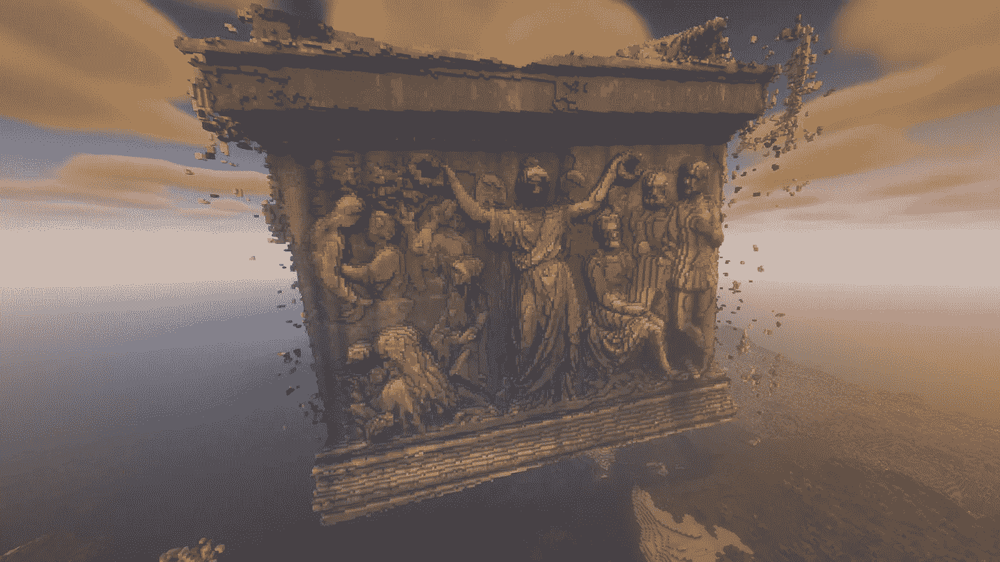
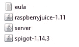
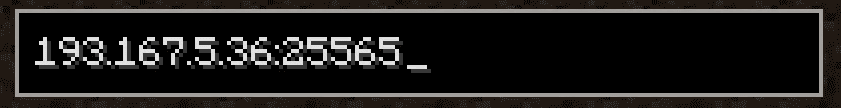
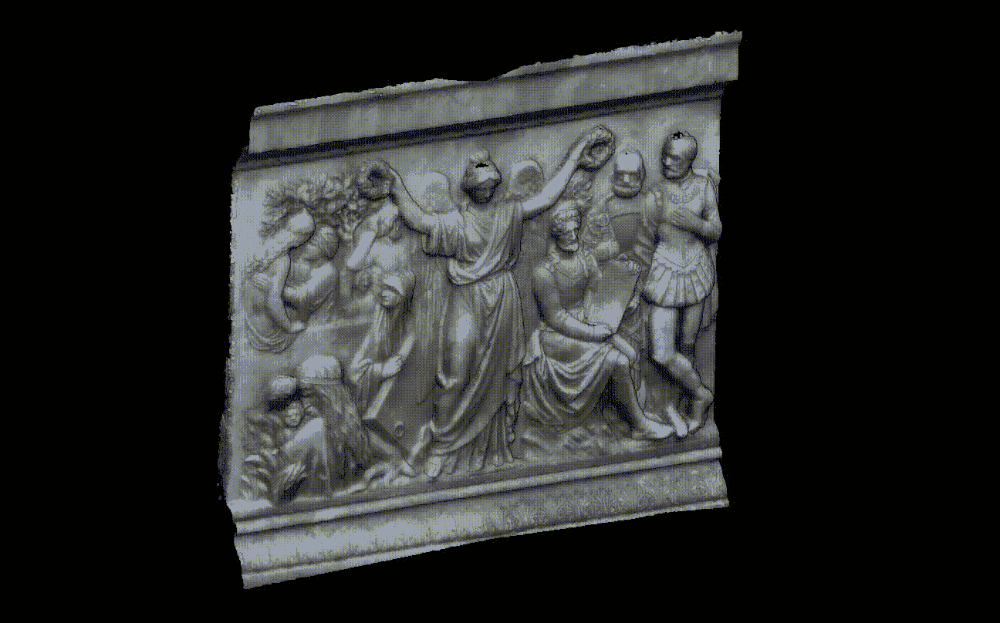
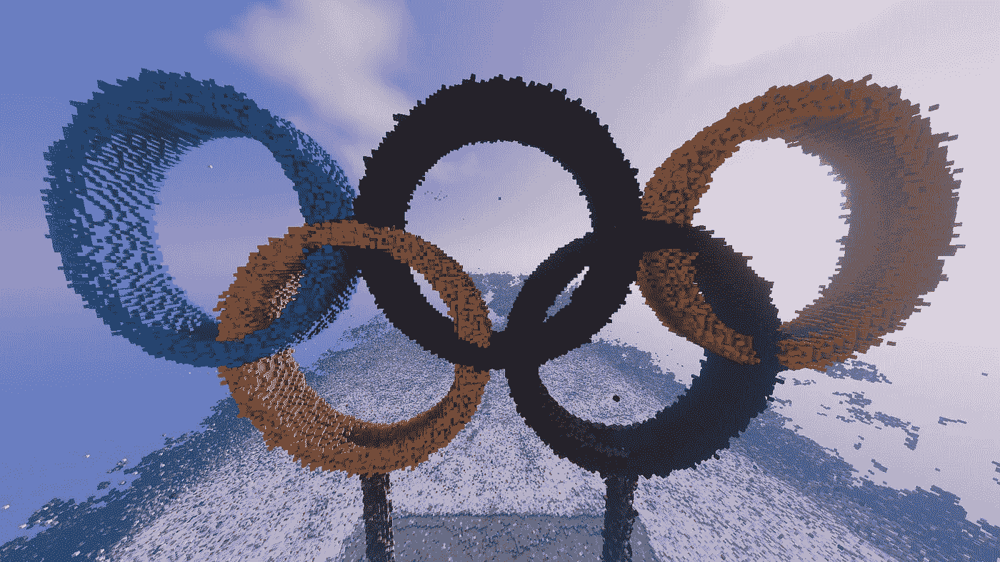
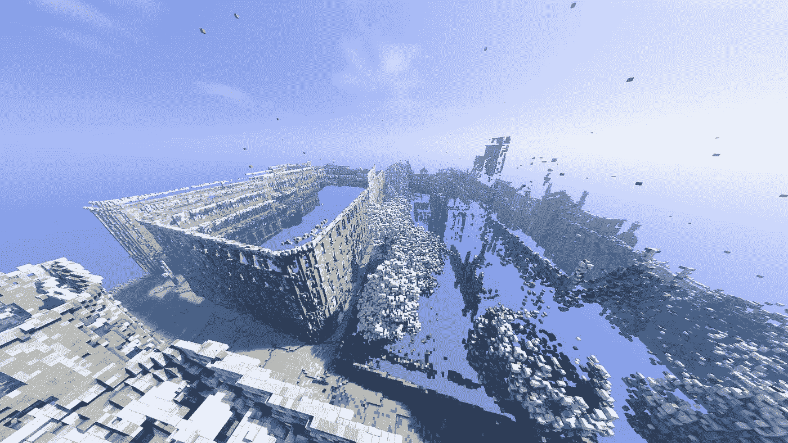

# 从点云到《我的世界》——Python 教程

> 原文：<https://betterprogramming.pub/from-point-clouds-to-minecraft-a-python-tutorial-1b14a87f3f0b>

## 使用 Python 和 open3d 在《我的世界》自动生成海量点云的实用教程。结合创造力的指南🎨而且编程简单！



minecraft 中的巨幅壁画

如今，由于公共实体或专业人员共享激光雷达和摄影测量数据，3D 点云正变得越来越容易为普通公众所获取。你也可以用你的 iPhone(激光雷达)生成它们，或者通过在你想要建模的物体周围拍摄几十张照片，并用适当的软件处理图像。

点云简单易懂！对于每个点，它们大部分由 3 个坐标(x、y 和 z)、颜色和强度来表示。

# 安装自己的《我的世界》服务器并使用 Python 对其进行控制的步骤

首先，我们将从设置您的 Python 环境开始。我推荐 anaconda，它很容易使用:

1 ) [安装《我的世界》Java 版](https://www.minecraft.net/)

2)安装[蟒蛇](https://www.anaconda.com/products/distribution)🐍

3)设置您的 Anaconda 环境

在 anaconda 窗口中创建您的环境:

```
conda create -n minecraft_pc python=3.7
```

激活您的环境:

```
conda activate minecraft_pc
```

通过将每一行复制/粘贴到您的 anaconda 控制台中，安装适合本教程的库:

```
pip install open3d 
pip install laspy
python3 -m pip install "laspy[lazrs,laszip]"
pip install numpy
pip install mcpi
conda install -c anaconda openjdk
```

*   `Open3d`:点云处理☁️
*   `LasPy`:读取点云格式(。laz，。las)
*   `Numpy`:用于矩阵操作和科学计算
*   `Mcpi`:用 Python 操作 minecraft
*   `openjdk`:Java 平台☕的开源实现

4)下载[《我的世界》服务器](https://www.minecraft.net/en-us/download/server)、[龙头](https://getbukkit.org/download/spigot)和[树莓汁](https://dev.bukkit.org/projects/raspberryjuice):

请下载相同版本的文件。《我的世界》的最新版本可能有一些兼容性问题——所以在本教程中我们将使用 minecraft 1.14。

5)新建一个文件夹(`minecraft-server`)并移动。在步骤 4 中下载的 jar 文件。

6)在这个文件夹中，用下面一行创建一个名为`*eula.txt*`的文本文件:

```
eula=TRUE
```

复制文件夹的路径，我们将在下一步中使用它。

您应该有这样一个文件:



minecraft_server 文件夹的内容

7)使用 cd 命令转到`minecraft_server`文件夹，然后启动服务器:

```
cd path_of_your_files
java -jar spigot-1.14.3.jar
```

8)在服务器创建结束时，在 anaconda 窗口中按 control + z 关闭`spigot`，然后移动 RaspberryJuice。jar 文件放到 spigot 创建的`plugins`目录中。

9)使用与之前相同的命令重启`spigot`:

```
java -jar spigot-1.14.3.jar
```

让我们等几秒钟，让服务器设置好。⌚

10)事情没那么复杂，对吧？现在让我们从 minecraft 的“多人”菜单连接到你的服务器！

对于服务器地址，输入您的 IPv4 地址，方法是: *windows +* R 并键入 cmd。出现一个控制台，输入`ipconfig`复制你的地址！

默认情况下，端口为 25565。你应该有这样的东西:



进入多人游戏菜单的 ip 地址示例

点击连接和… Tadoowww！！！你有自己的服务器，可以和 Python 通信！

让我们从点云开始，用 Python 显示自动化。

# 逐步显示《我的世界》点云的 Python 脚本

## 设置脚本

像任何自重的 Python 脚本一样，让我们从上面提到的库的导入开始:

```
from laspy import read
from numpy import sqrt, vstack, linspace
from open3d import geometry, utility
from mcpi.minecraft import Minecraft
```

然后我们来填充 minecraft 中要显示的点云的路径:

```
input_path=r"C:/point_clouds/"    #path to folder
dataname="mural.laz"              #point cloud name 
```

您可以从以下链接下载摄影测量创建的点云:

 [## GitHub-bbellocq/cloud _ to _ minecraft

### 此时您不能执行该操作。您已使用另一个标签页或窗口登录。您已在另一个选项卡中注销，或者…

github.com](https://github.com/bbellocq/cloud_to_minecraft) 

摄影测量生成的壁画点云

## 检索点云

好了，现在让我们用`LasPy`读取我们的云并生成一个 Open3D 对象。点的坐标存储在`pcd.points`中:

```
point_cloud = read(input_path + dataname) 
pcd = geometry.PointCloud()pcd.points = utility.Vector3dVector(vstack((point_cloud.x,
                                            point_cloud.y,
                                            point_cloud.z)
                                           ).transpose())
```

## 添加一些颜色

插入没有颜色的积木有点乏味。

> 我对颜色很感兴趣。
> 
> — PartyNextDoor

处理颜色的概念很简单。

首先，我们需要检索点云颜色，并通过使用以下代码行将它们转换为更方便的值:

```
pcd.colors = utility.Vector3dVector(np.vstack((sub_points.red, 
                                               sub_points.green,
                                               sub_points.blue)
                                    ).transpose() / 65535)
```

然后，我们将使用以下形式声明一个全局字典:

```
BLOCK_DICT = {(r, g, b) : [block_id, var]}
```

通过将`rgb`值设置为每个块的主色，我们将能够创建一个调色板来匹配点的颜色

然后，定义下面的函数，将云的每个点的颜色与`BLOCK_DICT`键最接近的颜色关联起来。

```
def closest_color(rgb):
     r, g, b = rgb
     r*=256;g*=256;b*=256color_diffs = []for color in COLORS:
            cr, cg, cb = color
            color_diff = sqrt((r - cr)**2 + (g - cg)**2 +
                              (b - cb)**2)
            color_diffs.append((color_diff, color))
     return min(color_diffs)[1]
```

[](https://stackoverflow.com/questions/54242194/python-find-the-closest-color-to-a-color-from-giving-list-of-colors) [## Python 从给定的颜色列表中查找最接近的颜色

### 我有一个 20 种颜色的列表，每种颜色都像这样(0，0，0)(rgb)但具有不同的值，我需要找到最接近…

stackoverflow.com](https://stackoverflow.com/questions/54242194/python-find-the-closest-color-to-a-color-from-giving-list-of-colors) 

## 体素化时间

体素就像图像中的像素，但在三维环境中，所以是立方体！

现在我们将根据体素的大小生成一个网格。让我们从定义你的体素大小开始。

然后从 Open3D 的几何库中使用`VoxelGrid.create_from_point_cloud`方法计算体素:

```
v_size = 0.10voxel_grid = geometry.VoxelGrid.create_from_point_cloud(pcd,
             voxel_size=v_size)voxels = voxel_grid.get_voxels()
```

提醒一下，体素越小，你的点云就越精确。小心点，点太多会炸了你的服务器，合理点…

## 进口到《我的世界》！

一切都设置正确，时间来加载点！

首先连接到服务器:

```
mc = Minecraft.create(address="localhost", port=4711)
mc.postToChat("Hello world") #display message in the mc chat
```

然后使用这个小循环将这些点加载到服务器中:

```
for i in tqdm(range(len(voxels))):
    colorr = voxels[i].color
    index = voxels[i].grid_index
    color = closest_color(colorr) mc.setBlock(index[1] - 500, #i, game X
                index[2], #in game Z
                index[0] - 200, #in game Y
                *BLOCK_DICT[color] #block type + variant
               )
```

提示:使用`tqdm`库在命令行中显示估计的时间和进度。

保存您的脚本，运行它并…


恭喜你，你可以随意将点云导入《我的世界》。你现在可以享受导入你的日常物品、你的房子、甚至一个城市的乐趣！请随意改进代码以导入更详细的云。

以下是我的一些最佳结果:



奥运五环(来自 GeoSLAM 激光雷达数据集)



英国诺丁汉蕾丝市场(来自 GeoSLAM 激光雷达数据集)

# 结论

现在你可以导入点云到《我的世界》！我们已经开发了一个性能更好的应用程序。*敬请期待，稍后再说*。

# 参考

1.  **Poux，F.** (2021)。如何用 Python 实现三维点云体素建模自动化，*走向数据科学？*[https://medium . com/forward-data-science/how-to-automate-voxel-modeling-of-3d-point-cloud-with-python-459 F4 d43 a 227](https://medium.com/towards-data-science/how-to-automate-voxel-modelling-of-3d-point-cloud-with-python-459f4d43a227)
2.  彼得森，J. (2022)。在 macOS 12.3 上使用 mcpi Python 库控制《我的世界》Java 版，*杰里米·佩德森个人博客*，[https://jeremypedersen.com/posts/2022-03-28-mcpi-macos/](https://jeremypedersen.com/posts/2022-03-28-mcpi-macos/)

```
This article was co-authored by [Antoine MIRAS](https://medium.com/@antoine.miras).
```