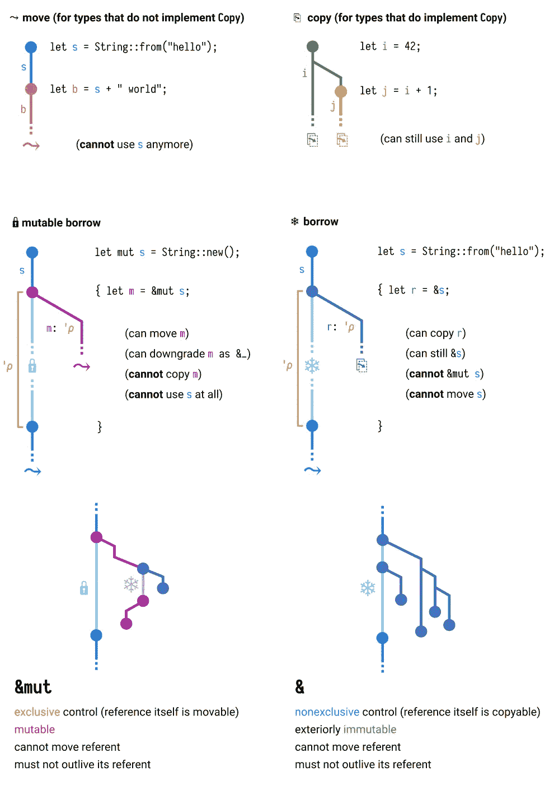

# 从 Python 到 Rust:一些关键差异和要点

> 原文：<https://betterprogramming.pub/from-python-to-rust-some-key-differences-and-takeaways-151da8293b9a>

## 并排的代码片段

[Unsplash](https://unsplash.com?utm_source=medium&utm_medium=referral) 上 [AltumCode](https://unsplash.com/@altumcode?utm_source=medium&utm_medium=referral) 拍摄的照片

将近 10 年来，Python 一直是我的第一门编程语言。在花了 3 年时间使用 C++之后，我喜欢上了 Python 的简单——不需要担心分配内存、空指针或引用:梦想成真了！

然而，在过去的几个月里，我花了相当多的时间使用 Rust，原因如下所述，我将在这个故事的结尾分享一些我喜欢的 Rust 的特性，这些特性不是 Python 语言的一部分。

***NB。这不是又一个关于哪种语言更好的故事。我只是分享我在学习和使用 Rust 几周后的想法，我来自一个主要是 Pythonic 的环境。***

# 动机

我使用 Python 编写脚本，用模板渲染建立网站(嗨，Django！)和训练机器学习模型，同时在庞大的代码库中保持语言的一致性，相当方便。所以当从头开始一个新项目时，使用 Python 是很自然的。

那么，为什么我现在在考虑另一种语言呢？我确实喜欢一直学习新的东西，但这不是唯一的原因。

> **一般来说，在某些时候，质疑你的过程和选择总是一件好事。总是使用相同的语言或工具，只是因为你习惯了，并不总是最好的决策过程。**

因此，关注其他人正在使用的工具是一种很好的做法，了解他们是如何工作的，这样你就可以快速确定他们什么时候适合你。最近人们谈论了很多关于铁锈的话题。根据最近的堆栈溢出开发者调查(2021 年)，它甚至是最受欢迎的语言:

> 最喜欢、最害怕和最想要的[https://insights . Stack Overflow . com/survey/2021/# technology-最喜欢、最害怕和最想要的](https://insights.stackoverflow.com/survey/2021/#technology-most-loved-dreaded-and-wanted)
> - Stack Overflow 2021 年开发者调查

此外，我参与了一个项目，其中 Python 的使用开始受到质疑，主要有两个原因。第一个是表演。因为我们构建的应用程序在幕后做了很多事情。第二个原因是代码混淆。

即使我对开源充满热情，它也不能总是被应用，尤其是在没有清晰的商业模式的情况下。由于这两点，Rust 似乎是一个很好的调查对象，这也是我开始阅读 [*这本书的原因。*](https://doc.rust-lang.org/stable/book/) 事实证明，与 Python 相比，我发现了用完全不同的范式学习语言的其他优势！

# 如何从 Python 过渡到 Rust

这两种语言根本不同。虽然 Python 允许您编写代码而不必担心程序内存分配，但由于垃圾收集器程序与您的代码并行运行，Rust 通过其他机制实现了内存安全，即它的“所有权规则”。理解它们并不是这个故事的目标，但是你可以在下面找到访问和“移动”一个变量的不同方法的例子(例如，从一个函数到另一个函数)。

来源:[https://rufflewind.com/2017-02-15/rust-move-copy-borrow](https://rufflewind.com/2017-02-15/rust-move-copy-borrow)

但是对我来说，理解所有权和生存期并不是从 Python 迁移到 Rust 时最困难的——可能是因为我已经有了一些 C/C++的背景知识，并且引用的概念对我来说并不陌生。最困难的是无法在 Rust 中使用面向对象编程和继承(注意:这不完全正确，你可以用 Rust 模仿一些行为，但这绝对不是 Rust 开发人员的思维方式)。它迫使我以完全不同的方式思考代码。更熟悉使用接口的语言(如 Java)的人可能会觉得更容易。

在下一节中，我将讨论 Rust 的几个方面，在我看来，它们可以真正帮助开发人员编写更好的代码。这里的“更好”意味着更容易阅读、维护和使用。

# 从 Python 开发人员的角度看 Rust

## 默认隐私和不变性

在 Python 中，一切(变量、类、类的方法和属性……)都是公共的，可以从包中的任何地方访问。我们依靠约定来模拟隐私(比如在变量名前加下划线；如果您在变量作用域之外使用该变量，IDE 将会发出警告，但是您的代码将会运行。相反，在 Rust 中，默认情况下所有东西都是私有的，你必须用前缀`pub`显式声明公共对象，并将它们导出到父模块。这看起来像是一个细节，但它迫使我更好地考虑应用程序的公共 API，哪些是我希望我公司的其他开发人员在他们自己的模块中访问的元素，哪些是我希望向外部开发人员公开的元素，哪些是我认为不应在非常有限的范围之外使用的元素？

## 所有权

作为一名普通的 Python 开发人员，所有权可能是你从未听说过的东西，但它非常强大。这个概念让我爱上了 Rust，下面是一个令人兴奋的例子。考虑一个数据库事务，从中可以执行查询，然后提交或回滚，最后关闭事务。

下面的列表显示了如何实现一个`Transaction` 对象(实际的方法实现与当前主题无关，所以我省略了它们)。我们可以在一个`do_stuff`函数中使用这个对象，如你所见，如果你不注意的话，Python 会让你关闭事务两次:一次是在`do_stuff` 函数中，另一次是在`main`函数中的`do_stuff`完成之后。这将不可避免地导致运行时错误(我们可以讨论在`do_stuff` 函数中关闭事务是糟糕的设计，但是同样，这里的要点是 Python 允许您这样做，没有人可以说他从未犯过这种错误)。

下一个文件展示了用 Rust 编写的几乎相同的代码，利用了 Rust 所有权系统。

所有权示例 Python 和 Rust 中的相同代码

这都是关于方法签名中的`**&**self`对`self`！`execute_query`方法将对`self`的引用作为第一个参数，这意味着调用该方法的对象在该方法完成后仍然存在(该对象只是被“借用”)。另一方面，`close`方法将对象本身作为第一个参数(它是“steeled”)，这意味着它在函数之后将不再存在。换句话说，在第`do_stuff(tx)`行之后，变量`tx`不能再被使用，Rust **编译器**不会让你再次使用它，如果你试图使用它，它会发出一个错误。这样的行为比不上无法达到的生产，即使你*忘记*去测试你的代码。

## 添加具有特征的功能

我相信你可以通过几个例子理解所有权的概念和规则。正如我上面所说的，对我来说最困难的部分是没有面向对象编程！我习惯并且喜欢继承的想法，允许封装共享的行为。这在 Rust 中是不可能的，或者至少 Rust 不是用这种目标设计制造的。相反，您应该定义一个结构(包含属性、数据)和特征(包含函数定义)。然后，您可以为给定的结构实现一个 trait 来描述给定的结构在某些操作下将如何表现。

特征类似于接口。Python 中最接近的是 mixins，您可以使用它向您的对象添加一些可能的操作。然而，它们是 Rust 的真正核心，因此提供了更强大的功能。

考虑下面的例子，我们为可缓存的对象创建一个 mixin (Python 版本)和一个 trait (Rust 版本):它们需要公开两个方法，`get_key`和`serialize`。生成的代码显示在下面代码片段中的前两个文件中。

Trait 示例 Python 和 Rust 中的相同代码

这两个实现非常相似，我们在这里还没有看到真正的好处，除了，同样，虽然 Python 会让你“忘记”实现一些方法，但是如果你忘记了 trait 中任何一个必需的方法，Rust 编译就会停止，并显示有意义的错误消息。

关于 Rust 中的特征还有很多要说的，我会让你通读下面的例子，它模仿了一种“继承”，但是我会让你去发现更多。作为练习，您可以尝试并思考如何用 Python 实现一个等效的行为。

Rust Trait 继承和完全限定的消歧语法(请参见[https://doc . rust-lang . org/book/ch19-03-advanced-traits . html # full-Qualified-Syntax-for-diffusion-calling-methods-with-the-same-name](https://doc.rust-lang.org/book/ch19-03-advanced-traits.html#fully-qualified-syntax-for-disambiguation-calling-methods-with-the-same-name))

## 带约束和动态调度的泛型

我今天要讲的第三点也是最后一点是泛型。由于 Rust 是一种强类型语言，因此很难涵盖所有情况。在前面的`Cachable`特征的例子中，我们已经不得不处理两次几乎相同的代码，唯一的区别是:`serialize`方法返回值的类型。我们可以使用泛型重写它，按照惯例命名为`T`:

非专利产品的生锈特性

Rust 的一个很好的特性是它能够根据变量的预期类型找到合适的方法来调用。声明`serialized_data_str`必须是类型`String`足以让它发现它必须使用`Cachable<String>`的`serialize`方法，而不是来自`Cachable<HashMap<String, String>>`的方法。很整洁，不是吗？

让我们更进一步(然后我停下来，我保证！).前面的代码片段将让我们为任何类型的泛型`T`实现`Cache`特征。在某些情况下，我们希望`T`满足一些约束，比如拥有一些方法，或者，用术语来说，实现一些其他特征。例如，我们将为我们的`Cachable`特征添加一个方法`serialize_and_print`，它将打印`serialize`方法的结果。在 Rust 中，为了被打印，一个类型必须实现标准库中的一些特征，比如`Display`或`Debug`。为了简单起见，我们将要求类型`T`实现这里的`Debug`特征，语法为:`T: Debug`:

用约束来信任泛型(这里，T 必须从标准库中实现‘Debug’特征)

如果用`Display`替换`Debug`，Rust 编译器会出错，因为`HashMap`没有实现`Display`特征。Python 不提供这种类型的保护。在一个 mixin 中，你可以使用一个没有在这个 mixin 中实现的方法，但是你可以*假设*这个方法会在其他地方实现。Rust 在编译时检查*是否被*实现。

这个故事我已经讲得比预期的多了，所以我就讲到这里。

# 外卖食品

我已经用铁锈做了几个月的实验。我认为它提供了 Python 无法达到的安全和信任度。这无疑拓宽了我在代码组织方面思路，超越了 OOP。

我还没有感到足够的舒适来开始移动我正在使用的整个代码库。我觉得我仍然缺少一些使用 Rust 的“惯用”方法，有时仍然试图让我的代码过于“面向对象”。但是 Rust 也可以很好地与 Python 集成，我目前的阅读内容都是关于如何利用 Rust 的速度来处理关键组件，同时保持 Python 对 API/SDK 的优势……(参见“进一步阅读”部分)。

但是除了明确使用 Rust 之外，探索 Rust 社区如何构建他们的代码，以及 Rust 的一些功能，如本故事中展示的那些，给了我全新的见解，我已经可以感受到对我的 Python 代码的影响。我会在后续的故事中说明这一点，敬请关注！

# 进一步阅读

以下是我在 Rust 学习过程中使用的资源:

*   关于 Rust 的一切:[*Rust 编程语言*](https://doc.rust-lang.org/stable/book/) (Rust 官方文档)
*   拉胡尔·夏尔马、维萨·凯赫拉维塔和克劳斯·马青格(Packt 出版社)的《Rust 编程参考指南》 【从零开始】学习 Rust
*   在 Python 中使用 Rust:[*用 Rust*](https://www.amazon.com/Speed-Your-Python-Rust-performance/dp/180181144X/) 加速您的 Python