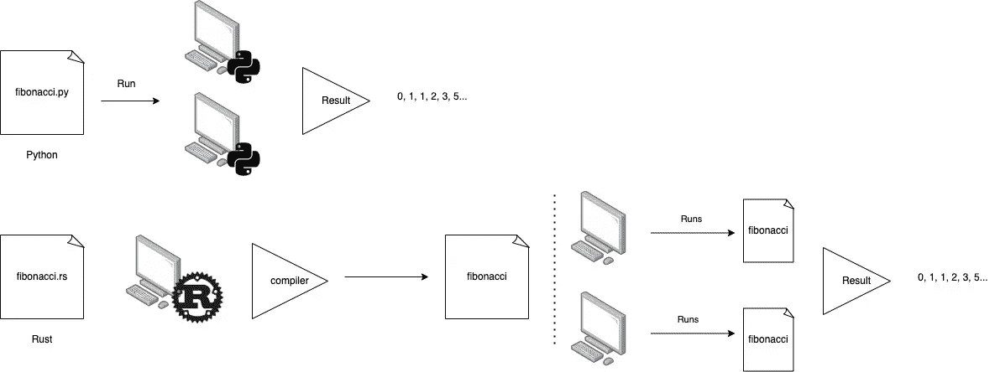
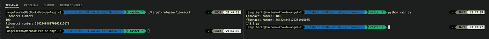

# 如果我们用 Python 和 Rust 写同样的算法会怎么样？

> 原文：<https://betterprogramming.pub/from-pythonic-to-rustacean-this-is-the-way-6ee46ee63033>

## 从 Pythonic 到 Rustacean——是这条路吗？

照片由 [Unsplash](https://unsplash.com?utm_source=medium&utm_medium=referral) 上的[尼克·费因斯](https://unsplash.com/@jannerboy62?utm_source=medium&utm_medium=referral)拍摄

再次嗨，亲爱的读者们！很久以后，我来这里写一篇关于我第一次使用 Rust 的经历。

也许你在问自己(或没有)为什么写这篇文章。几周前，我读了 AWS 的一篇文章，他们谈到并展示了所有语言代码的图表，比较了所有语言代码的可持续性。链接到[帖子](https://aws.amazon.com/es/blogs/opensource/sustainability-with-rust/)。在那篇文章中，他们谈到了如何扩展他的平台，以及用 rust 来做有多好。那一刻我“哇，真的吗？”。几天后，我读了一篇 Twitter 帖子，作者认为这篇帖子没有说出全部真相。但我不是来谈这个的。反正如果你也想看，这里有[链接](https://twitter.com/_rsc/status/1496352325157457922?s=12)。

我是一个很好奇的人，也是一个对这个话题很极客的人，所以刚开始查关于 Rust 的资料。像入门的第一步，一些 GitHub 库，看看它是怎样的语言，我喜欢它！

# **什么是铁锈？**

从他的页面上你可以得到一个定义，比如"*一种让每个人都能够构建可靠而高效的软件的语言。*“但真正的意思是什么呢？

Rust 是一种编译语言代码，这使得我们的代码转换成机器语言，我们可以说我们的整个过程运行就像硬件获得我们的应用程序并运行它一样，这应该非常快。

Rust 由 Mozilla 于 2010 年创建，十年后由 Rust foundation 创建，旨在将这种语言作为 Python 等开源语言进行维护，在他们的调查中，这是一种非常受欢迎的堆栈溢出语言，例如 2015 年的调查。

主要特点是什么？当他们开发这种语言时，他们认为安全是最重要的，当编译器被调用时，它会检查你的代码，检查是否有内存错误或错误的指针引用。

# **您可以构建的应用**

如果你想到任何语言代码，你可能会联想到任何类型的应用，例如， **Swift** 用于 iOS 移动应用， **Python** 用于 web 服务器和 ML，JS 用于 Web 开发，或者 **Java** 用于 30 亿台设备。

但是没有人会说 JS 可以做 web 服务器或者 Python 不能抓取 web，因为可能有人会这么说。这就是为什么 rust 可以做很多类型的应用程序:CLI，web 服务器，web assembly(一些浏览器可以执行 Rust 代码)，Scraping，微控制器(嵌入式设备)。最重要的是，与其他语言代码相比，它总是具有最佳的性能和较低的资源。

# **动机**

当我还是学生的时候，我开始学习 C 和 Java，但是当我遇到 Python 时，我爱上了它。我认为这是一门非常好的语言，它有一个很棒的社区，有很多强大的库，你可以从中学习到很多关于软件的知识并理解它。

最后，当你有了经验，你认为你已经准备好了，你可以加入编译器语言的联盟，因为你有设计模式，知道软件如何工作，你只需要再增加一个新的变量，内存控制。

这就像一个赛车电子游戏，你不能从最大难度开始，你从低级或中级开始，当你得到控制时就成长了。这个很像。

# **Python vs. Rust:通过斐波那契算法**

正如我之前说过的，Python 是开始学习编码的一种很好的语言。它是一种解释型语言，这个脚本需要在我们想要运行它的任何设备上使用 python。它是弱类型的，有一个非常酷的语法，叫做 Pythonic。

相对于 Rust，我们可以看到下一张图，其中 Python 可以在任何安装了 Python 的设备上执行，Rust 只需编译脚本，将其翻译成机器语言，最后在任何设备上执行，因为机器可以理解它。

Python 给了我们快速的开发，但是它有一个大的缺点，他的执行是昂贵的和较低的。如果我们比较相同的斐波那契算法，我们可以看到时间之间的巨大差异。

为了以一种实用的方式看到它，我将相同的算法编码到 Python 和 Rust 中。

首先，如果我们看一下 Python 代码，我们会发现代码的行数不如 Rust。这是因为 python 核心开发人员将 Python 设计成易读的。他们做得很好。

在 Rust 代码中，我们关闭重复的行。Rust 用花括号分隔代码块，而在 python 中，代码块由制表符和空格分隔。此外，我们必须导入一些库来管理大数、io 等。

Python 解释器默认管理内存，但是在 Rust 中，你必须定义变量的类型，因为 int 的最大静态类型是`u128 (2¹²⁸ bytes = 3.4028237e+38)`或`usize`类型，编译器从硬件中动态获取。所以这就是我实现 BigUint 的原因。这个库保存在一个字节向量中，并动态分配内存。

再说性能。

这里，就是锈域全景的所在。

首先，在执行我们的 Rust 脚本之前，我们必须为我们的机器编译它，以理解需要执行什么指令。

有两种方法，用`rustc <script.rs>` 或者用 cargo，一个管理包、编译、格式化等等的工具。我们可以用`cargo build [ — release]`来做。如果添加了发布标志，它将优化脚本，并比其他方式更快地执行代码。

计算第 100 个斐波那契数

在执行完第 100 个斐波那契数后，我们可以注意到:

Rust 执行 26 s，Python 执行 142 s。

很显然，这两种语言的性能是无法相比的。记住，我们没有控制记忆，是解释器帮我们控制的。这并不意味着 Python 核心开发者设计的很差。这是因为代码首先被解释器读取，它检查执行中的错误。

我们可以简单地说，如果你必须和任何人交谈。如果你们都懂这门语言，你们会交流得很快。另一方面，如果你需要一个翻译与他人交流，流程中会有更多的延迟。

# **我的经历**

我可以说 Rust 很酷，在花了大部分时间试图获得简单的 Fibonacci 解决方案之后，我可以说如果你不习惯键入变量、管理内存、指针以及所有的库都不是标准的，那么从 Python 的改变可能有点困难，所以你必须寻找、尝试并继续开发。

另一方面，虽然开始有点困难，但 Rust 有一本很棒的[网络书籍](https://doc.rust-lang.org/book/)，里面有详细的解释和实际的例子向你介绍这种语言。

通过一个斐波那契问题，我已经能够精确地验证我们使用的硬件资源不是无限的，并且 python 将我们从许多问题中抽象出来。我给了你一些有趣的资源。

*   [官方页面](https://www.rust-lang.org/)
*   [货物登记簿](https://doc.rust-lang.org/cargo/)
*   [拥有大量资源的媒体](https://towardsdatascience.com/you-want-to-learn-rust-but-you-dont-know-where-to-start-fc826402d5ba)
*   [API 基准](https://www.techempower.com/benchmarks/)

总之，如果你是一个好奇的人，喜欢学习新的东西，有一个主题有很多东西可以寻找，你可以加入，或者如果你在等待任何信号开始新的东西，这是你的帖子。

感谢阅读，希望你喜欢！我很想听听你对语言代码知识或新知识的看法。