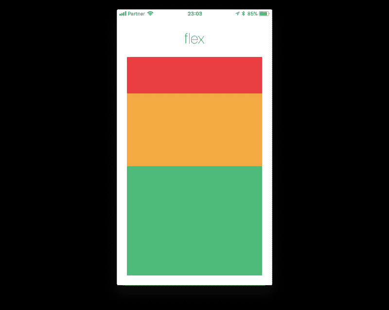
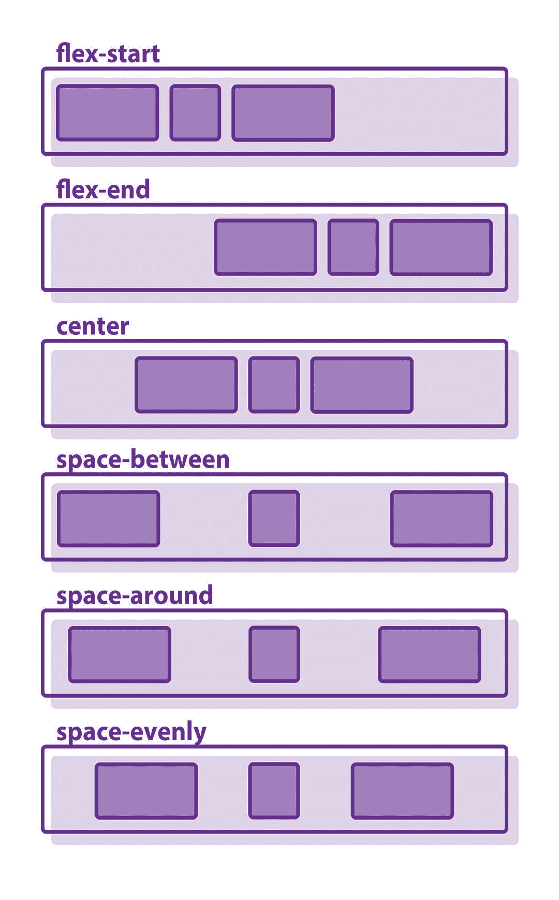
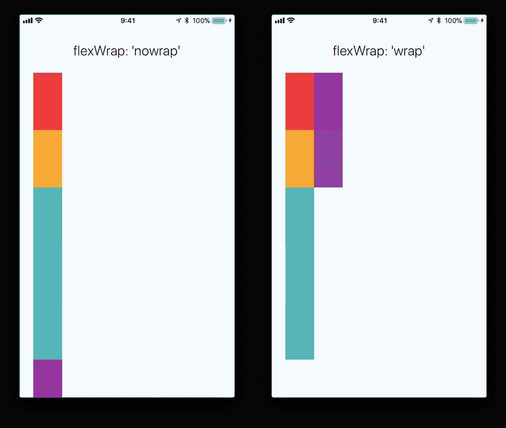

# 从反应到自然反应

> 原文：<https://betterprogramming.pub/from-react-to-react-native-5d884a1632d7>

## 移动开发入门


图片来自[未来心灵](https://www.futuremind.com/blog/pros-and-cons-react-native-and-native-apps)。

根据我的经验，从原生 Android 开发到 [React Native](https://reactnative.dev/) 简直是一种享受。虽然灵活性普遍较低，但在我看来，开发要快得多，也干净得多，我就是喜欢这样。所以事不宜迟，我们开始吧。

# 什么是 React Native？

React Native 是一个库，它与 React 库一起将本机组件呈现给 iOS 或 Android 设备。因此，您将需要一些 React 知识来深入了解 React Native。

# 为什么反应原生？

最大的优势在于跨平台开发。有了 React Native，你就有了一个可以为 iOS 和 Android 设备构建的单一代码库。对于大多数公司来说，这节省了大量的时间和金钱，因为原生移动开发需要两个不同的代码库和两个不同的团队——原生 iOS 开发在 Swift 中完成，原生 Android 开发在 Java/Kotlin 中完成。特别是如果你是一个懂 JavaScript 但不懂 Swift、Java 或 Kotlin 的开发人员，那么简单地使用 React Native 开发一个移动应用程序是有意义的，因为这样可以缩短运输时间(即学习一种新语言和开发环境所节省的时间)。

另一个新兴的跨平台开发框架是 [Flutter](https://flutter.dev/) ，这是一个由谷歌创建的开源 UI 工具包。据我所知，唯一的缺点是它使用 Dart 语言(所以你需要花时间学习它)，而且它相对较新，所以可能没有太多的社区支持。不过我可以看到 Flutter 是未来跨平台开发的新主流方式，所以我觉得如果你有时间的话绝对值得学习。但目前来看，React Native 仍然是这种跨平台业务的王者。

# 成分

React Native 为您提供了内置组件和 API，您可以使用它们在移动设备上呈现视图。这些组件的使用方式与您在普通 React web 应用程序开发中使用它们的方式完全相同。

请务必查看 React 本机组件的最新文档，因为在新版本中可能会添加、删除或更新组件。您还可以详细查看何时以及如何使用它们。

# 快速入门和设置

有两种方法可以设置 React 本地开发的环境。最推荐使用 Expo CLI，尤其是对初学者。它速度快，易于设置，并且易于开发。此外，您可以随时“退出”并转移到 React Native CLI。

但是，如果您不介意更陡峭的学习曲线，更重视灵活性和性能，那么 React Native CLI 可能适合您。

# 世博 CLI

假设您安装了节点 12 LTS 或更高版本，您可以使用 npm 来安装 Expo CLI 命令行实用程序:

```
npm install -g expo-cli
```

然后运行以下命令创建一个名为“AwesomeProject”的新 React 本地项目:

```
expo init AwesomeProject
cd AwesomeProject
npm start # you can also use: expo start
```

这将为您启动一个开发服务器。

在谷歌 Play 商店或 App Store 上搜索 Expo，然后扫描显示的二维码，即可将其安装到您的移动设备上。让应用程序编译代码，在几秒钟内，你应该看到你的应用程序在你的设备上运行！就这么简单。

# 反应本机 CLI

你首先需要安装 Xcode 或 Android Studio 来开始。如果你还没有它们，预计要花大约一个小时来安装和配置它们。完成设置后，您可以使用以下命令创建应用程序:

```
npx react-native init AwesomeProject
```

然后，在启用 USB 调试的情况下，连接您的 iOS 或 Android 设备(或者，连接您的虚拟设备),然后简单地运行:

## 机器人

```
npx react-native run-android
```

## ios

```
npx react-native run-ios
```

设置每个环境的细节可以在[官方文档](https://reactnative.dev/docs/environment-setup)中找到。

# React Native 中的新功能

我认为普通 React 和 React Native 的主要区别在于 Flexbox 的样式和使用。除此之外，它是从 ReactJS 到 React Native 的一个快速转换，比如使用`View`或`ScrollView`组件来代替`div`。

## 式样

在 React Native 中，您使用 JavaScript 来设计应用程序的样式。大多数组件接受一个叫做`style`的道具。它基本上是一个指定样式名称和值的 JavaScript 对象，主要遵循 CSS 在 web 上的工作方式，除了名称是使用骆驼大小写(例如，`backgroundColor`而不是`background-color`)。

*注意:某些组件的样式，如* `*Button*` *组件，将不起作用。所以要设计一个按钮的样式，你需要把它放在一个* `*View*` *组件下，并设计一个* `*View*` *组件。*

使用`StyleSheet.create`在一个地方定义几个样式，将`styles.container`传递给一个`style`道具，将`style.blueHeader`传递给另一个`style`道具，通常会更干净。例如:

## Flexbox

在 React Native 中，Flexbox 用于提供响应设计，以适应不同的屏幕尺寸。下面解释了一些更常见的属性。一切都可以在官方文档中看到更详细的[。](https://reactnative.dev/docs/flexbox)

根据[文档](https://docs.expo.io/versions/v37.0.0/react-native/flexbox/)，“`flex`将定义你的项目将如何“填充”你主轴上的可用空间。”

比如红色视图用`flex: 1`，黄色视图用`flex: 2`，绿色视图用`flex: 3`。1+2+3 = 6，即红色视图获得 1/6 的空间，黄色视图获得 2/6 的空间，绿色视图获得 3/6 的空间。



图片来自[世博会](https://docs.expo.io/versions/v37.0.0/react-native/flexbox/)。

`flexDirection`控制节点子节点的布局方向，代表主轴。横轴是垂直于主轴的轴。

*   `column`(默认值):从上到下对齐子项。
*   `column-reverse`:从下到上对齐子项。
*   `row`:从左到右对齐子项。
*   `row-reverse`:从右向左对齐子项。

`justifyContent`描述如何在容器的主轴内对齐子对象。

*   `flex-start`(默认值):将容器的子容器与容器主轴的起点对齐。
*   `flex-end`:将容器的子容器与容器主轴的末端对齐。
*   `center`:将容器的子容器在容器主轴的中心对齐。
*   `space-between`:沿容器的主轴均匀隔开子件，在子件之间分配剩余空间。
*   `space-around`:沿容器的主轴均匀隔开子件，将剩余空间分布在子件周围。与`space-between`相比，使用`space-around`会导致空间被分配到第一个孩子的开头和最后一个孩子的结尾。
*   `space-evenly`:沿主轴均匀分布对齐容器内的子代。每对相邻项目之间的间距(`main-start`边缘和第一个项目，以及`main-end`边缘和最后一个项目)完全相同。



图片来自[位度](https://www.bitdegree.org/learn/css-flexbox)。

`alignItems`描述如何沿容器的横轴对齐子对象。

*   `stretch`(默认值):拉伸容器的子容器，以匹配容器横轴的高度。
*   `flex-start`:将容器的子容器与容器横轴的起点对齐。
*   `flex-end`:将容器的子容器与容器横轴的末端对齐。
*   `center`:将容器的子容器在容器横轴的中心对齐。

根据[文件](https://docs.expo.io/versions/v37.0.0/react-native/flexbox/):

> "`flexWrap`设置在容器上，控制当子容器沿主轴溢出容器的大小时会发生什么。默认情况下，子元素被强制排成一行(这可以收缩元素)。如果允许换行，项目将根据需要沿主轴线换行。



图片来自[博览会](https://docs.expo.io/versions/v37.0.0/react-native/flexbox/)。