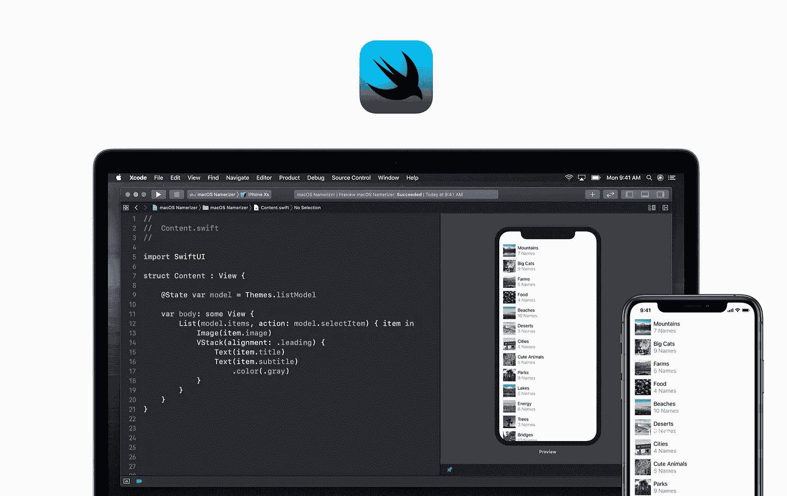

# 从 React 到 SwiftUI

> 原文：<https://betterprogramming.pub/from-react-to-swiftui-f08c29b7d3b>

## 来自 React 背景的 SwiftUI 工作原理的解释



# 基本组件

*   `function/class`变成了`struct`
*   `React.Component`变成了`View`，一个纯粹的 UI 元素
*   `function return/render(...)`变成了`var body: some View { ... }`

# 状态

## 初始化

使用`@State`装饰器为组件定义一个状态属性:

相当直接。使用`self.stateProperty`代替`this.state`，就像任何 struct 属性一样。

## 更新

没有`setState`，没有`setProperty`，只要马上更新值，组件就会相应地重新渲染。

# 小道具

应该使用组件属性定义属性:

*   设置默认值:

```
var message: String = "Goodbye"
```

*   这里的道具和 React 中的一样是不可变的
*   道具可以通过设置而变得可变:

```
// Calling component
@State var message = "Hello"
Home(message: $message)// Home
@Binding var message: String
```

*   这里的属性是一个状态属性，因为我们需要在它上面保留一个引用，因为它会发生变化
*   注意`message`变量前面的`$`，表示这个值是一个绑定(双向绑定)
*   `@Binding`表示子节点和父节点之间的关系

# 生命周期

非常有限，因为我们只能分别使用`onAppear`和`onDisappear`获得`didMount`和`willUnmount`的挂钩:

# 碎片

与`React.Fragment`类似，`Group`派上了用场:

# 风格

## 基础

使用视图修改器定义样式:

## 布局

忘记`div`:

*   使用`HStack`进行水平布局
*   使用`VStack`进行垂直布局
*   使用`ZStack`堆叠视图

# 可选渲染

使用`if value != nil { ... }`代替`value && (...)`:

# 手势

`onClick`变为`tapAction`:

有更多的手势可用，但开始时不太直观。

Majid Jabrayilov 在 SwiftUI 上写了一篇非常棒的关于手势的文章，如果你有兴趣，我鼓励你去读一读。

# 从这里去哪里？

*   苹果推出了[一个很棒的 SwiftUI 入门教程](https://developer.apple.com/tutorials/swiftui/tutorials)
*   如果你喜欢欣赏今年来自 WWDC 的精彩演讲:[所有设备上的 swift ui](https://developer.apple.com/videos/play/wwdc2019/240)， [SwiftUI Essentials](https://developer.apple.com/videos/play/wwdc2019/216)
*   在伟大的`[awesome-swiftui](https://github.com/chinsyo/awesome-swiftui)`列表中找到更多

如果你好奇想了解更多，可以在 Medium 上关注我(或者 [Github](https://github.com/eveningkid) )。

关于语法，SwiftUI 潜力有什么想法吗？🙋