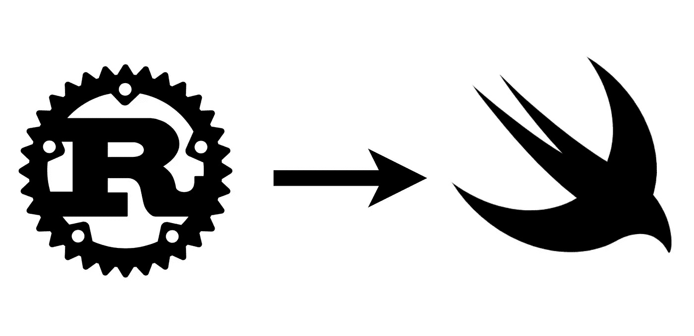

# 从铁锈到雨燕

> 原文：<https://betterprogramming.pub/from-rust-to-swift-df9bde59b7cd>

## 如何打包用 Rust 编写的本地库，以便与 Swift 分发工具一起使用。正确的方式。



## **TL；博士**

[用 Rust 和 Swift 工件完成样本代码库](https://github.com/tmarkovski/rust-to-swift)。

# 我们的目标

有没有想过如何分发您的原生 Rust 库以用作 Swift 库，特别是以这样一种方式分发它，使它可以作为所有 Apple 平台的其他库或应用程序的包依赖项？如果答案是肯定的，这个指南就是为你准备的。

在本文中，我们将经历用 Rust 编写的简单库的构建过程。我们将向 Swift 公开它的方法，为所有平台和设备编译它，最后，将所有东西打包成一个可再分发的档案，可以使用 [Swift Package Manager](https://www.swift.org/package-manager/) 或其他分发工具，如 CocoaPods 或 Carthage 来引用。

# 工具和环境

为了烤这个馅饼，我们需要一个安装了 Xcode 工具的 MacOS 设备。我们还需要 [Rust 工具链](https://www.rust-lang.org/tools/install)来构建我们的本地库。

还需要一些其他的工具和组件，比如不同架构的运行时，但是我们会在以后的工作中解决这些问题。

# 写一个小小的 Rust 库

让我们从在 Rust 中创建一个小库开始。

```
mkdir mathwiz && cd mathwiz
cargo init --lib
```

我们称它为 MathWiz，我们在`src/lib.rs`文件中添加了几个简单的函数来定义我们的 API:

```
#[no_mangle]
pub extern "C" fn add(*a*: *i32*, *b*: *i32*) -> *i32* {
    *a* + *b* }#[no_mangle]
pub extern "C" fn flip(*a*: *bool*) -> *bool* {
    !*a* }
```

这里的目标是使用 Rust 中对[外部函数接口](https://doc.rust-lang.org/nomicon/ffi.html)的支持，使我们的 Rust 函数成为 C-callable 函数。在实践中，您的方法看起来会稍微复杂一些，但这超出了本练习的范围。

> 我将在另一篇文章中介绍一些关于如何定义高度可维护、安全和可扩展的 FFI 契约的良好实践，敬请关注！

为了将这个项目构建为一个静态库，我们需要将下面几行添加到我们的`Cargo.toml`文件中

```
[lib]
name = "mathwiz"
crate-type = [ "staticlib" ]
```

# 制作标题和模块图

为了在其他平台中使用静态库，我们需要提供一个 C 头文件来描述 API 中的方法和类型。

另外，我们需要提供一个[模块映射](https://clang.llvm.org/docs/Modules.html#module-maps)，这是 Swift 在导入 C 头文件时需要的[。省略模块映射经常是许多令人头痛的原因，所以确保不要跳过这一步。](https://riptutorial.com/swift/example/1418/use-a-module-map-to-import-c-headers)

为了构建头文件，我们可以使用一个名为`cbindgen`的 Cargo 工具。这个工具自动解析我们的库文件并构建一个兼容的 C 头文件。让我们安装这个工具并生成头文件。

```
cargo install --force cbindgencbindgen --lang c --output include/mathwiz.h
```

接下来，让我们在`include`文件夹中创建一个名为`module.modulemap`的文件，紧挨着我们刚刚生成的头文件。我们将该文件的内容设置为:

```
module MathWiz {
    header "mathwiz.h"
    export *
}
```

标头的最终目录结构应该如下所示:

```
include/
├── mathwiz.h
└── module.modulemap
```

# 为所有平台编译静态库

好了，现在我们已经实现并定义了基本的 API，我们可以通过运行`cargo build`从终端构建这个库。然而，很简单，这将为我们正在运行的当前平台构建一个库，这个平台就是你的装有英特尔或苹果硅芯片的 MacOS。

在发布库时，我们希望支持 iOS、iOS Simulator、macOS 以及适用于英特尔和苹果芯片的 mac Catalyst。在 Rust 中，我们可以通过为特定目标编译库来轻松实现这一点。 [Rustup 工具支持](https://doc.rust-lang.org/nightly/rustc/platform-support.html)这些目标架构，它们可以作为单独的组件安装。

让我们为 iOS 设备安装和构建库。这就需要`aarch64-apple-ios`目标。我们运行以下命令:

```
rustup target add aarch64-apple-ioscargo build --release --target aarch64-apple-ios
```

让我们对以下 6 个目标重复相同的步骤:

*   `x86_64-apple-darwin`和`aarch64-apple-darwin` — macOS
*   `x86_64-apple-ios`和`[aarch64-apple-ios-sim](https://doc.rust-lang.org/nightly/rustc/platform-support/aarch64-apple-ios-sim.html)` — iOS 模拟器
*   `x86_64-apple-ios-macabi`和`aarch64-apple-ios-macabi` — Mac 催化剂

我们就此打住。如果您想要支持其他架构，比如 tvOS，只需通过从[支持的平台](https://doc.rust-lang.org/nightly/rustc/platform-support.html)中指定目标三元组来构建该目标。虽然您不需要支持所有的架构，但是您的库只支持一种架构就可以了，您可能会遇到不满意的开发人员，他们希望获得额外的支持。

> 在撰写本文时，Mac Catalyst 的最后两个架构还不是标准库的一部分，所以我们需要使用夜间工具链手工构建它们。这很容易做到，因为:

```
cargo +nightly build --release -Z build-std --target x86_64-apple-ios-macabicargo +nightly build --release -Z build-std --target aarch64-apple-ios-high macabi
```

至此，我们完成了静态库的构建。一切都要建在`target`文件夹下。
让我们用`find target -type f -name 'libmathwiz.a'`检查一下里面有什么——我们应该会看到类似这样的内容:

```
target/x86_64-apple-darwin/release/libmathwiz.a
target/x86_64-apple-ios-macabi/release/libmathwiz.a
target/aarch64-apple-darwin/release/libmathwiz.a
target/aarch64-apple-ios/release/libmathwiz.a
target/x86_64-apple-ios/release/libmathwiz.a
target/aarch64-apple-ios-macabi/release/libmathwiz.a
target/aarch64-apple-ios-sim/release/libmathwiz.a
```

酷豆！

# 将所有内容捆绑在一起进行二进制分发

输入 XCFrameworks！Apple 将 xc framework 定义为由 Xcode 创建的可分发二进制包，其中包含框架或库的变体，以便可以在多个平台(iOS、macOS、tvOS 和 watchOS)上使用，包括模拟器构建。XCFramework 捆绑是优于通用框架或静态库的首选方式。

在我们做最后的捆绑之前，我们需要把一些东西缝合在一起。同一平台的不同架构的库必须组合在一个文件中，称为 fat 库。这可以通过`lipo`工具轻松实现。
我们将为 MacOS、iOS 模拟器和 Mac Catalyst 库执行此步骤。

```
lipo -create \
  target/x86_64-apple-darwin/release/libmathwiz.a \
  target/aarch64-apple-darwin/release/libmathwiz.a \
  -output libmathwiz_macos.alipo -create \
  target/x86_64-apple-ios/release/libmathwiz.a \
  target/aarch64-apple-ios-sim/release/libmathwiz.a \
  -output libmathwiz_iossimulator.alipo -create \
  target/x86_64-apple-ios-macabi/release/libmathwiz.a \
  target/aarch64-apple-ios-macabi/release/libmathwiz.a \
  -output libmathwiz_maccatalyst.a
```

我们将把这些 fat 库用于框架捆绑包，此外还有 iOS 库，它不是 fat 捆绑包的一部分，因为它没有多个架构。
如果你想看看 fat 库中有哪些架构，使用`lipo -info`。

```
lipo -info libmathwiz_macos.aArchitectures in the fat file: libmathwiz_macos.a are: x86_64 arm64
```

让我们构建最后一个包:

```
xcodebuild -create-xcframework \
  -library ./libmathwiz_macos.a \
  -headers ./include/ \
  -library ./libmathwiz_iossimulator.a \
  -headers ./include/ \
  -library ./libmathwiz_maccatalyst.a \
  -headers ./include/ \
  -library ./target/aarch64-apple-ios/release/libmathwiz.a \
  -headers ./include/ \
  -output MathWiz.xcframework
```

这将在当前目录中创建一个 XCFramework，内容如下:

```
MathWiz.xcframework
├── Info.plist
├── ios-arm64
│   ├── Headers
│   │   ├── mathwiz.h
│   │   └── module.modulemap
│   └── libmathwiz.a
├── ios-arm64_x86_64-maccatalyst
│   ├── Headers
│   │   ├── mathwiz.h
│   │   └── module.modulemap
│   └── libmathwiz_maccatalyst.a
├── ios-arm64_x86_64-simulator
│   ├── Headers
│   │   ├── mathwiz.h
│   │   └── module.modulemap
│   └── libmathwiz_iossimulator.a
└── macos-arm64_x86_64
    ├── Headers
    │   ├── mathwiz.h
    │   └── module.modulemap
    └── libmathwiz_macos.a
```

我们应该将所有内容压缩在一起，因为我们稍后需要上传该文件:

```
zip -r bundle.zip MathWiz.xcframework
```

我们还需要计算这个文件的校验和，以备后用，所以让我们记下这个命令的输出:

```
openssl dgst -sha256 bundle.zip
```

至此，我们已经具备了开始在 Swift 中使用我们的库所需的一切。XCFrameworks 可以在任何 Xcode 项目中引用，也可以直接使用。我们创建的框架应该可以工作了，当你`import MathWiz`的时候，你应该可以看到所有可用的 API。

但是，我们希望更进一步，将该框架作为可与 Swift Package Manager (SPM)一起使用的 Swift 软件包进行分发。

# 创建 Swift 包

对于这一步，我们将使用同一个存储库。[苹果的文档](https://developer.apple.com/documentation/xcode/creating_a_standalone_swift_package_with_xcode)有一些关于如何创建 Swift 包的介绍性文本。我们的目标是制作一个包含我们的 Rust 库的包，并有选择地包装本地方法，其他开发人员可以使用 SPM 在他们的项目中简单地引用这些方法。我们将使用 GitHub 作为我们的包的远程位置。

让我们在回购的根位置创建一个`Package.swift`,内容如下:

```
// swift-tools-version:5.3import PackageDescriptionimport Foundationlet package = Package(
        name: "RustToSwift",
        platforms: [
            .iOS(.v13), 
            .macOS(.v11)
        ],
        products: [
            .library(
                name: "RustToSwift",
                targets: ["RustToSwift"]),
        ],
        targets: [
            .target(
                name: "RustToSwift",
                dependencies: ["MathWiz"]),
            **.binaryTarget(
                name: "MathWiz",
                url: "https://github.com/...../bundle.zip",
                checksum: "ea7a.....35b2"),**
            .testTarget(
                name: "RustToSwiftTests",
                dependencies: ["RustToSwift"]),
        ]
)
```

注意我们在`.binaryTarget`元素中导入包的位置。Swift Package Manager 将自动解析该引用，下载并解包 XCFramework，并使用`import MathWiz`导入库。这是我们在`module.modulemap`文件中定义的名称。

继续将`bundle.zip`文件上传到您的 repo，并更新上一步中的链接和校验和散列。

就是这样！

我们现在可以使用我们的 repo，并将其作为依赖项导入到任何使用 SPM 的项目中。这将自动为正确的平台带来所有静态库，并自动打包它们，每当我们为 AppStore 构建 iOS 应用程序时，无需手动处理静态文件。您还可以在另一个包中引用这个包，并让依赖链正确地管理静态库的使用。

# 椰子和迦太基呢？

你可以毫不费力地使用它们。整个魔术是构建一个正确配置的 XCFramework。之后，这个框架可以按照您喜欢的任何方式进行捆绑。以下是一些描述如何使用替代分发平台的文章:

*   使用 Cocoapods 将通用 iOS 框架作为 XCFramework 发布——您可以跳过描述使用通用框架的部分，因为我们已经有了一个 xc framework
*   [关于使用 XCFrameworks 的 Carthage 官方文档](https://docs.sentry.io/platforms/apple/guides/ios/install/carthage/#macs-with-apple-silicon-and-xcframeworks)

# 给我看看代码

本文引用的代码可以从下面的链接获得。我添加了简单的 Swift 包装器和测试来说明如何包装本地调用，因为这是通常的情况。回购中的代码可以用`swift build`和`swift test`克隆后构建和测试。

**GitHub 资源库**→[https://github.com/tmarkovski/rust-to-swift](https://github.com/tmarkovski/rust-to-swift)

希望你会觉得有用！快乐包装！