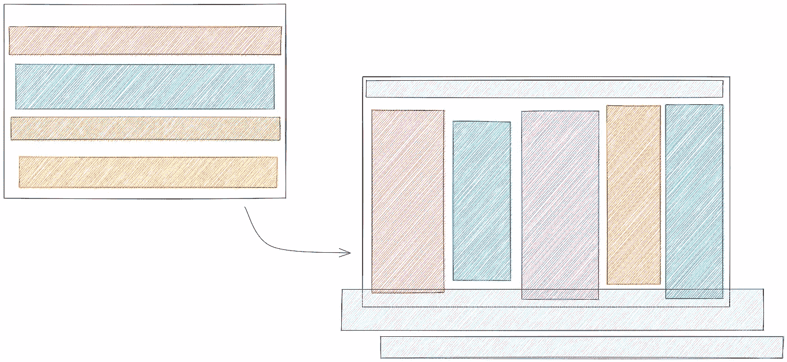
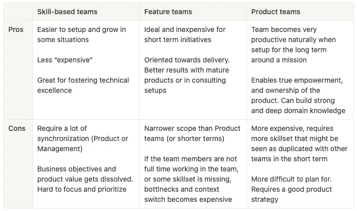
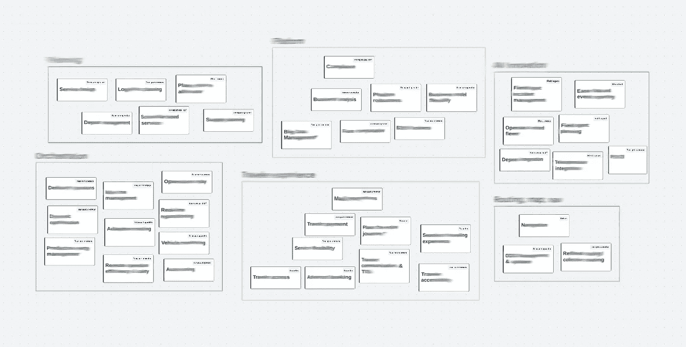

# 从技能型团队到产品型团队

> 原文：<https://betterprogramming.pub/from-skill-based-teams-to-product-teams-239909ce1392>

## 平稳过渡和强大团队的秘诀

作者图片

和我们的工程团队一起从 Bestmile 到 ZF，我们有机会认真思考我们的产品策略，以及 T2 的康威定律！(TL；灾难恢复——产品如何受到组织孤岛的限制。)

我们决定尝试改变产品工程团队的结构，为我们的发展做好准备。现在说这个决定是否正确还为时过早，但它已经带来了相当多的教训。下面我想抓住触发因素、思考、过程和学习。所有这些都非常具体地针对我们的情况，但它可能对其他正在寻找同类转换的人有用。

# 一点定义

我们可以看到主要有三种类型的产品工程团队。[后两者显然被一些](https://www.svpg.com/product-vs-feature-teams/)交替使用。我会这样快速地定义它们:

*   基于技能的团队:想想“前端团队”和“后端团队”
*   特性团队:有时被称为“项目团队”，或者“交付团队”，专注于“完成”特性或者项目
*   产品团队:包含开发产品和执行战略的最基本的技术技能和领域知识

没有正确或错误的设置。和往常一样，这是一种视具体情况而定的权衡。以下是我对这种权衡的看法:

[点击以上表格文本的要点](https://gist.github.com/BetterProgramming/971505f7f848fa817fccf3433533524d)

# 为什么要改变团队的设置？

简而言之，环境、财务资源和目标的变化可以要求和/或创造变革的机会，从而推动增长、改进和新的可能性。

我们还希望提升人们——给他们成长的机会——并根据他们的背景和领域知识将权力下放给团队，以大规模发展产品，而不仅仅是提供功能。

在 Bestmile，我们有四个基于技能的团队。不管是好是坏，它贯穿于创业的整个过程(前台、后台、SRE、研究)。在这个设置中，我遇到最多的三个问题是:

*   随时随地都有广泛的同步需求。所有的团队都需要所有的信息才能正常工作。当我们稍微失败时，我们看到优先级和瓶颈不成比例的脱节
*   个人贡献者很少有或没有机会正式成长为不同的角色
*   后端团队处于阴影中；前端团队受到外部利益相关者的过多关注。这两种情况都产生了各自的问题

## 机遇和需求

我认为，在一个已经运转良好(相当不错)的组织中，应该有一系列因素来触发变革。

*   环境的重大变化(资源和/或业务目标)
*   产品路线图和范围的变化
*   对增长和规模的需求(需要更多的头脑和人手)

更换所有者给了我们重新思考产品愿景、路线图和战略的机会和需要。第一和第二个触发器。

增长的需求以前就存在了:我们的产品既广泛又复杂。在创业环境中，我们必须快速、积极地确定优先顺序，不能解决所有问题，但现在是时候深入一些重要领域了，因为这符合新的需求。

当加入一个大型组织时，另一个机会是建立在现有的交叉关注团队之上，例如开发人员经验或平台(SRE)。我知道今天这是必要的，以使产品团队专注于产品。

# 决策过程

为了拥有产品团队，我们需要产品。为了拥有正确的产品，我们首先需要正确的战略。因此，在做其他事情之前，我们努力思考产品应该如何发展，以及在新的环境中什么不再有意义。

在第二步中，我们开始识别用例、用户和产品的高级特性，并对它们进行分组，以查看子产品或我们称之为产品领域的产品是否出现。

我们将一个领域定义为主解决方案中的一个更窄的产品，该产品符合它的战略和使命——甚至几乎可以是它自己的创业公司。(实际上，我们的一些领域几乎是其他初创公司的核心产品。)

这个过程是反复的，但是最终，一幅好的画面出现了。

对高级用例及特性进行聚类，以了解产品领域

# 执行过程:从一个组织到另一个组织

改变总是需要大量的精力。我们不得不接受、解释、说服并为每个团队找到人。

这种变化背后的动机之一是获得真正授权和自治的团队。这意味着我们需要确保我们能够发展这些团队，使其拥有正确的技能和使命。不是一夜之间。但最终。如果团队不得不依赖其他团队成员去做他们职责范围内的事情，那就违背了整个目的。

另一个动机是为个人成长到新的职位创造机会，如管理(团队领导)和产品(产品负责人)。

我们为每个团队设计并开放了一个 Lead 和一个 PO 角色。然后，我们让人们“申请”他们最感兴趣的角色和团队。
在这一步，我们幸运地看到了领导角色的独特和相关应用，以及贡献者在团队中的平均分布。我认为这也是对这些产品领域有效性的某种确认。

## 使命和目的

在承诺转型之前，我们起草了使命陈述。这有助于确保我们不试图强迫它，并可以为这些团队找到一个明确定义的任务和目的。不仅仅是特性和组件所有权。

首先，作为草稿，向涉众“推销”团队并获得反馈。之后与团队成员一起，获得认同和确认，并将所有权转移给他们。

# 余波，几个月后…

## 好人

每个人都以新的活力承担了角色。新的想法出现了，新的过程，新的互动，团队很快接受了他们的挑战和任务。这可能是一个激动人心的开始，但这是一个好的开始，我们将尽最大努力培养这种能量。

招聘很快就开始了。每个团队在分配的范围内自下而上地定义他们缺少的角色，团队领导从第一天起就在招聘过程中采取主动。

同步需求得到了更好的分配。项目负责人相互之间以及与项目经理之间进行交流，领导承担了团队内部以及与外部利益相关者之间的大部分交流。当你不必一直考虑整个产品时，你可以开始更深入地考虑你的领域。专注。和更少的瓶颈。

## 坏事

这不是魔法。该解决方案仍然需要端到端的工作，团队之间的交互非常多，尤其是在开始时，因为招聘缓慢且困难，每个团队都缺乏他们所需的部分技能。

一些组件和特性落在了两个团队之间。虽然所有权在一些地方有所改善，但在另一些地方却变得更加模糊。

从长远来看，我也预计康威定律的影响会在我们最意想不到的时候回来咬我们一口。

## 丑陋的

跨团队的关注点，例如 UX、基础设施、工具和安全性等等，需要新的所有者。或者新的所有权模式。无论是团队内部、团队周围的角色，还是大型组织中的外部参与者。这需要时间，即使这是有计划的，贡献者必须填补空白。

## 亲身体验康威定律

我们多次看到的一个突出的例子是在讨论我们的一些技术组件的所有权时。那些组件，以前由基于技能的团队拥有，有很强的技术目的(例如，“数据收集”)，但非常松散(或聚集)的产品目的。

如果我们想要加强代码库的所有权，他们现在需要一个“再利用”:我们是否在每个团队中拆除它们并将产品特性移植到新的服务中？他们需要共同所有权吗？在我们的新产品策略中，我们真的需要它们吗？

无论答案是什么，这些都是理智的辩论，以确保我们正在建设正确的东西。

# 技术卓越和知识共享呢？

基于技能的团队的优势之一是相同技能的专业人员之间的协同作用(例如，React、Scala、UX、Mobile 等)。)这是团队结构免费提供的。这些技能得到了关注，密切的互动带来了更短的反馈循环和更多的优秀。

我们[仍然]需要更好地解决的一个问题是通过“技术领导”或“实践社区”来提升这些技能。这需要额外的努力，这在以前是理所当然的。虽然这不是产品和业务的直接关注点，但这对工程团队来说非常重要。

有许多组织方式，我喜欢的一点是，这可能会给其他人带来不同的机会:成长为技术领导角色，而无需学习或掌握人员管理技能。

# 再多说几句

顾名思义，打造一个产品似乎需要产品团队。然而，有很多原因可以解释为什么这是不可能的。一个明显的例子是财政资源状况。

改变产品工程团队的结构本身不应该是一个目标。我在这里强调这一点，但它不是凭空发生的。这种想法已经和我们在一起讨论了好几年了。如上所述，应该满足规模、产品和环境触发条件。我相信我们三个都有，并且抓住了机会。

和通常的工程一样，细节决定成败。我相信这将产生良好的长期效果(> 1 年)。但在短期内，有很多细节需要处理、讨论和沟通。细节很重要，尽管很难计划。

在我们的案例中，我认为康威定律限制了我们的产品，因为它的多样性和复杂性。我们可以在转型过程中体验它，我相信我们在某种程度上利用它来为自己的成功做准备。