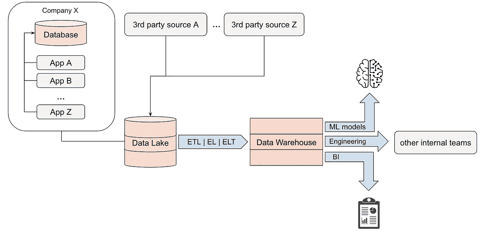

# 从软件工程师到数据工程师—基础知识

> 原文：<https://betterprogramming.pub/from-software-engineer-to-data-engineer-the-basics-part-1-535c0837b591>

## 你需要在头几个月掌握的概念

弗拉德·巴加西安在 [Unsplash](https://unsplash.com?utm_source=medium&utm_medium=referral) 上拍摄的照片

你有没有四处逛逛，探索一个你从未去过的地方，然后不知何故，你走到了一条你熟悉的街道上？我相信你知道这种感觉。这就像在游戏中解锁地图的新区域。这正是我如何思考你以前听过或顺便读过的理论概念，然后有一天有人向你解释它并将其与实际用例联系起来，你就会有那种令人满意的“啊哈”时刻。

作为一名软件工程师，你可能会使用面向用户的应用程序或后端应用程序，最多与数据库进行一些交互，也许你会向流或 API 发送事件/消息，但一般来说，整个数据管道和数据的使用方式对你来说是一个黑盒，一个你不需要理解的抽象概念。你可能听说过仓库、湖泊、卡夫卡等等，但是有足够多的语言、框架和用户需求需要考虑，所以为什么要更深入地挖掘别人的责任呢？

当我担任数据工程师的角色时，我有很多顿悟的时刻，我将以前听到的东西与实际用例结合起来，并对它有了更深入的理解。

以下是我在工作中学习时在脑海中形成的一些概念。

# 数据仓库，数据湖，数据库

我看到这些概念被解释为一种选择——你可以使用任何一种，每种都有利弊。

然而，这并不是 100%正确的。在理想情况下，在大数据主导的公司中，您将拥有一切，您将需要一切，并且每个人都有特定的用途。他们不能互换使用，嗯他们*可以*，但是会有点勉强。

## 数据库ˌ资料库

这个词已经演变成一个包罗万象的术语——对于企业/非技术人员来说，这是一个数据和数据本身所在的神奇地方。对于软件工程师来说，这是存储和管理信息的软件。

*   数据库用于存储**操作**数据，即您的应用程序每天工作所需的数据。
*   数据库是 **OLTP** (在线事务处理)，这意味着它们允许许多人同时实时执行大量事务。
*   数据库是基于记录的存储，这意味着即使您在查询中选择了单个列，也必须在磁盘上打开整个记录/行。它们针对频繁的**更新**和**写入**进行了优化，而不是针对读取。

在数据库类别中，有多个子类别可供选择:开源与专有、关系型与非 SQL 型、云计算与内部部署。我不打算详细讨论这个问题，因为它本身至少值得写一整篇文章，但还是坚持基本原则，让我们看看这个:

*   对于具有预定义模式的结构化数据，可以使用关系数据库。一些广泛使用和熟悉的例子是 Oracle、Postgres、MySQL 和 CloudSQL。
*   对于半结构化或非结构化数据，可以使用非 SQL 数据库。在这个类别中，有多个子类别，如

— —键值数据库是键值对的简单存储，通常用于存储会话数据和用户偏好。例如迪纳摩 DB、雷迪斯、伯克利 DB

— —文档存储以 XML 或 JSON 等结构化文档的形式保存数据。文档存储使得在面向对象的软件中映射对象变得容易，它们通常用于存储用户配置文件和内容。比如 MongoDB、CouchDB、Lotus Notes。

— —图形数据库用于存储面向图形的数据结构，如社交网络信息、推荐引擎、风险评估。例如 Neo4j、OrientDB、AllegroGraph。

## 数据仓库

它用于在一个集中的位置存储来自多个来源的大量结构化数据。创建数据仓库的过程比创建数据库需要更多的工作。它需要精心规划和设计。数据仓库中的数据通常经过预处理、清理和丰富。

*   数据仓库用于分析目的、商业智能、重新发布或用于 ML 模型进行预测，并且不保证实时性和完整性。
*   数据仓库是 OLAP(在线分析处理)，这意味着它们旨在用于对大量数据进行高速多维分析。
*   数据仓库针对读取和追加数据进行了优化，但对于频繁的写入和更新，它们的性能通常没有那么好

一些受欢迎的仓库是亚马逊红移，雪花，IBM Db2，BigQuery，Vertica。

## 数据湖

数据湖支持所有类型的数据-结构化、半结构化和非结构化。来自各种来源的原始数据没有经过任何处理或模式就被倾倒入湖中，只有在检索时，您才能以特定用例所需的格式应用一个结构。

*   数据湖以本地格式——blob 和文件——存储数据
*   数据湖是可扩展的，允许处理、接收、存储和分析任何类型和数量的数据。添加新类型的数据很容易，因为它不需要额外的工作
*   数据湖的原始数据通常应该最终被处理并放入数据仓库。大多数情况下，归档、备份、快照是永久保存在湖中的数据类型

总结:在一个成熟的数据管道中，你将拥有这三者，每一个都服务于一个目的，它们将协同工作。

图片来源:作者

# EL，ELT，ETL

你可能已经发现了上图中的缩写。作为一名软件工程师，我曾与其中一个有过短暂的接触，但从来没有时间或需要去深入研究它。

# 提取、加载

*   只有当源和目标格式完全一致，并且源数据是干净的，不需要处理时，才使用这种变体
*   最容易实现——只需从源获取数据并放入目标
*   通常用于批量加载历史数据或定期加载日志文件

# 提取、加载、转换

*   当源和目标模式不匹配或源需要清理时使用。
*   数据首先被加载到目标中的临时表或具有通用列的表中，例如，您可以将整个 json 有效负载放在这些表中，或者放在一个永久表中，然后在其上创建一个视图，使用视图动态转换物化列
*   当转换可以作为仓库中的一个 SQL 查询来完成时，可以使用这种方法(以使用它的优化并节省成本和复杂性)
*   当您不确定需要什么样的转换时，这也是一个不错的选择

# ETL(提取、转换、加载)

*   当所需的转换更加复杂，并且不能像 SQL 查询那样进行转换(调用不同的 API)时，这是正确的选择
*   此选项需要使用额外的转换工具—应用程序或流框架、时间安排等
*   这在需要丰富数据时使用
*   当需要与 CI/CD 集成并对所有组件进行测试时，会用到这一点

示例转换包括:

*   提高数据质量
*   检查有效性—数据是否符合业务规则
*   检查准确性——数据是否符合客观事实
*   检查完整性—是否有任何数据丢失
*   检查一致性-根据数据进行的计算是否正确
*   删除视图中质量差的行
*   处理空值和空白等。

我将把这篇文章分成几个部分，因为一下子抛出一大堆概念有点让人不知所措，如果你想并且需要的话，我也会给你机会去阅读更多关于这些的内容。

感谢阅读！