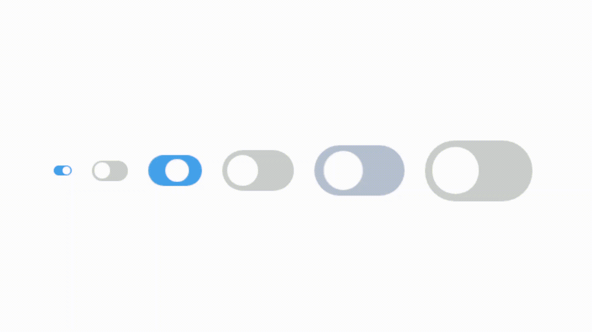
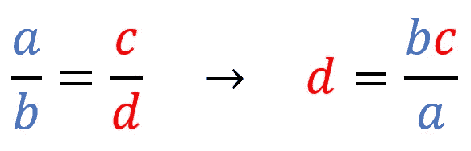

# 从静态到动态的 CSS 值

> 原文：<https://betterprogramming.pub/from-static-to-dynamic-css-values-23b2d258f60d>

## 风格一次，修补无限



过于热情的开关— [来源](https://gist.github.com/osharaki/6af5bcac020fef3b04ab47a9e8790500)

在开发谷歌 Chrome 扩展时，我发现自己需要一个拨动开关。这些是你在手机或平板电脑上最常看到的小家伙，用来启用/禁用东西。

# 找到正确的开关

所以我很快开始寻找一个我可以很容易地整合到我正在建设的东西。我首先查看的地方之一是谷歌的材料设计，果然，他们有一个[开关组件](https://material.io/develop/web/components/switches)，我只需几行代码就可以安装和使用。

然而，一旦我开始摆弄它，我很快意识到我对他们的开关[的行为方式](https://forum.freecodecamp.org/t/disabling-focus-highlight-in-material-web-components/416033)并不完全满意。由于所有的样式和功能都被抽象在包文件中，所以修改起来并不容易。

所以我想到了一个简单的 switch [实现](https://www.w3schools.com/howto/howto_css_switch.asp)，它仅由几行 HTML 和一个适用于所有样式的 CSS 文件组成。

静态风格切换开关的 HTML 和 CSS 改编自 [W3Schools](https://www.w3schools.com/howto/howto_css_switch.asp)

坏消息呢？开关太大了。好消息是什么？它是无限可定制的。


转换:“我只是骨架大”

# 无扭曲的重新缩放

所以，没什么大不了的，对吧？我所需要做的就是把开关做得更小，同时确保它的长宽比保持不变。为此，就像生活中的大多数其他事情一样，我有一个可靠的助手:[交叉乘法](https://en.wikipedia.org/wiki/Cross-multiplication)。



真正的 MVP

本质上，交叉乘法可以用来寻找两个相等分数的未知数。这对我们来说意味着，给定两个旧的尺寸，例如宽度和高度，我们可以设置一个新的高度并确定其相应的宽度。

因此，我可以将`.switch`选择器的高度属性设置为一个更小的`20px`而不是默认的`34px`，然后计算新的宽度为`(old width*new height)/old height`或`(60*20)/34`。这同样适用于所有其他值，因为它们将相对于`.switch`选择器的 height 属性值重新计算。因此，更通用的公式应该是`new value=(old value*new height)/old height`。

请注意，使用。作为计算所有其他值的基础的切换选择器的 height 属性值是任意的。人们也可以从任何其他选择器中选择任何其他属性。

# 用动态值替换静态值

一种方法是手工单独计算新值，然后将结果硬编码到样式表中。

这样做的问题是你失去了大量的灵活性。如果您后来决定新的尺寸太大或太小，您必须重新计算一切。幸运的是，我们有 CSS 的 [calc()](https://developer.mozilla.org/en-US/docs/Web/CSS/calc) 函数。

显示。切换选择器现在使用 calc()来动态计算其值

```
When using the calc() function, be mindful of how you use units! In the case of multiplication operations, at least one operand has to be a unitless number (e.g. calc(5px*5) not calc(5px*5px)). For division, the right-hand side also has to be a unitless number (e.g. calc(5px/5) not calc(5px/5px)). These rules, as well as [others](https://drafts.csswg.org/css-values-3/#calc-syntax), must be followed in order for the expressions to be valid. Click [here](https://forum.freecodecamp.org/t/pure-variable-calculations-in-css/416432/4) for more on working with units in calc().
```

将相同的原则应用于所有的风格，我们最终得到这样的结果:

使用 CSS 变量和动态值的开关的重构样式

你会注意到，在最终版本中，我使用 CSS 变量给整个代码添加了更多的结构。

现在，我可以很容易地尝试不同尺寸的开关，只需更换`--slider-new-height`。

*感谢阅读！如果你有任何问题，请告诉我。*

# 资源

*   [Jason Knight](https://levelup.gitconnected.com/scalable-styled-checkboxes-using-just-css-its-called-em-use-em-db21bae5f216)[对构建可扩展交换机](https://medium.com/u/37f0bc4e5b3f?source=post_page-----23b2d258f60d--------------------------------)的深入探讨
*   [W3Schools 实施的拨动开关](https://www.w3schools.com/howto/howto_css_switch.asp)
*   [具有动态值的重构开关实现](https://gist.github.com/osharaki/ead7ac72ea188b37b236993555f6c59c)
*   交叉乘法
*   [calc()简介](https://developer.mozilla.org/en-US/docs/Web/CSS/calc)
*   [calc()语法(TL；博士)](https://forum.freecodecamp.org/t/pure-variable-calculations-in-css/416432/4)
*   [calc()语法(正式)](https://forum.freecodecamp.org/t/pure-variable-calculations-in-css/416432/4)
*   [用于在封面图像中创建开关的代码](https://gist.github.com/osharaki/6af5bcac020fef3b04ab47a9e8790500)