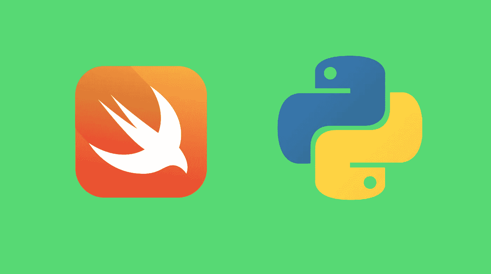
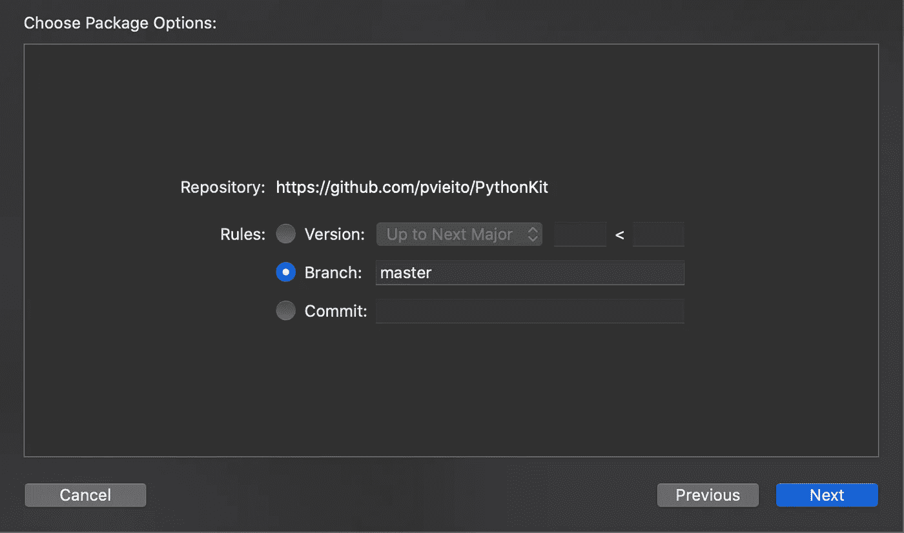
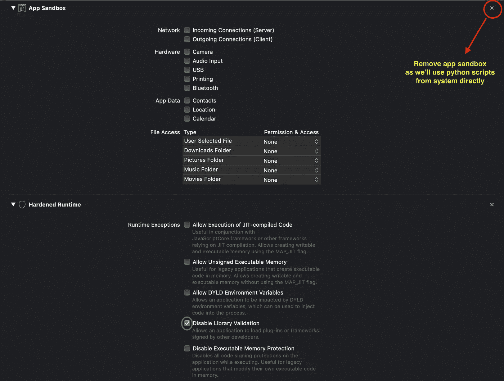
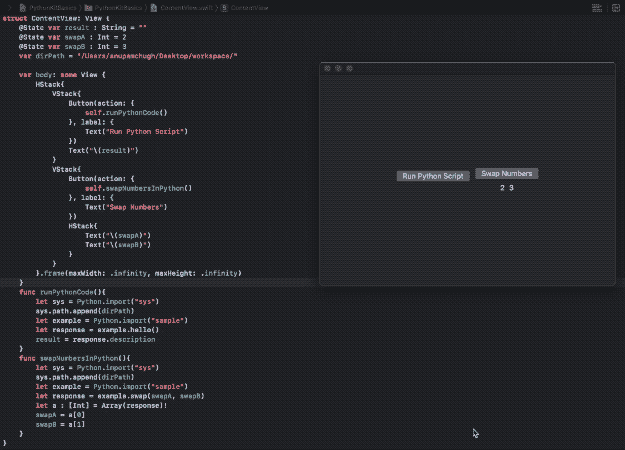

# 从 Swift 导入 Python

> 原文：<https://betterprogramming.pub/from-swift-import-python-f2fc2a997d4>

## 构建一个 macOS 应用程序，从 SwiftUI 代码库运行 Python 脚本



Python 早已确立了自己作为数据科学无可争议的领导者的地位。但是随着数据量的不断增加，Python 的缺点也开始被注意到。在大规模应用中，速度慢、并行性受限以及缺乏类型安全性都是一个障碍。

谷歌显然将赌注压在 Swift 上，认为它是深度学习的未来。难怪，他们为了 Tensorflow 对 Swift 进行了大量投资。

虽然 Python 自诩拥有大量的库，但从它身上转移并不容易，但我们仍然可以利用它与 Swift 的互操作性。

是的，您可以通过使用 PythonKit 从 Swift 运行 python 代码，python kit 是一个基于 TensorFlow 项目 [Swift 的`Python`模块的框架。](https://github.com/tensorflow/swift)

需要注意的是，Python 在 iOS 上不可用。但是你可以为 macOS 和 Linux 构建非常棒的实用程序。

# PythonKit 的优势

*   您的 Swift 代码库可以直接访问丰富的 Python 模块和包。
*   Python 开发人员可以轻松构建 macOS 应用程序来运行自动化脚本和执行数值计算。
*   无需在 Swift 中捆绑大型 OpenCV 和 Tensorflow 框架，您可以简单地在您的系统上安装 Python 对应物，并在所有涉及 PythonKit 的 macOS 应用程序中使用它。

在接下来的几节中，我们将看到如何在 SwiftUI macOS 应用程序中设置 PythonKit 并执行一些有趣的任务。

# 在 macOS 应用程序中添加 PythonKit

首先，以 macOS 为目标创建一个新的 Xcode 项目，并使用 Swift Package Manager 添加以下包依赖项:

```
.package(url: "https://github.com/pvieito/PythonKit.git", .branch("master")),
```



文件->Swift 包->添加包依赖->输入[这个 git URL](https://github.com/pvieito/PythonKit)

现在，您可以`import PythonKit`在您的 Swift 视图中开始。要检查当前 python 版本并进行更新，请使用以下代码行:

```
print(Python.version)
PythonLibrary.useVersion(2)
//or 
PythonLibrary.useVersion(3, 8)
```

注:`PythonLibrary.useVersion`需要放在进口声明的正下方。您不能在运行时动态更改 Python 版本号。

接下来，确保您已经从签名和功能部分删除了 App sandbox，因为我们将直接在 mac 上使用 Python 程序:



# 在 Swift 中运行您的第一个 Python 脚本

让我们在一个`.py`文件中编写一个 hello world 风格的 Python 函数:

```
def hello():
    return "Hello Swift, I'm Python"
```

现在，将它保存在一个文件中，并记下它的路径。

下面的 Swift 方法调用上面的 Python 函数并返回结果:

```
func runPythonCode(){
  let sys = Python.import("sys")
  sys.path.append(dirPath)
  let example = Python.import("sample")
  let response = example.hello()
}
```

从上面这段 Swift 代码中可以观察到一些东西:

*   `dirPath`是文件位置的路径。对我来说是:`/Users/anupamchugh/Desktop/workspace/`。
*   `Python.import`用于导入一个 Python 模块。在我们的例子中，我们导入了包含 hello world 代码的`sample.py`文件。
*   `example`是 PythonObject 类型的 Swift 实例。我们对它调用`hello`函数。
*   响应实例也是一个`PythonObject`，在我们的例子中，它被隐式地转换成一个字符串。

我们可以通过以下方式将`PythonObject`显式转换为原生 Swift 类型:

```
let str = String(pythonString)!
let arr = Array(pythonArray)!
```

# 交换 Python 变量并返回 Swift

让我们看看在 Python 函数中互换 Swift 中两个变量内容的经典案例:

```
def swap(a, b):
    a, b = b, a
    return a, b
```

现在，让我们从 Swift 函数中调用它来获取结果:

```
func swapNumbersInPython(){
  let sys = Python.import("sys")
  sys.path.append(dirPath)
  let example = Python.import("sample")
  let response = example.swap(swapA, swapB)
  let arr : [Int] = Array(response)!
  swapA = arr[0]
  swapB = arr[1]
}
```

`swapA`和`swapB`是 SwiftUI 状态变量，最终会在屏幕上更新。

让我们用上面的 Python 脚本运行我们的 macOS SwiftUI 应用程序:



据此，我们成功构建了第一个具备 Swift 和 Python 互操作性的 macOS 应用程序。

但这是微不足道的。让我们写一个更好的 Python 脚本。

# 使用 Python 脚本下载视频并在 SwiftUI VideoPlayer 中显示

Python 有一个流行的包，名为`youtube-dl`，用于从 YouTube 和许多其他网站下载视频。

让我们把它安装在我们的 mac 上。以下 pip 命令适用于 Python3:

```
pip3 install youtube-dl
```

现在，在 Python 文件中添加以下函数:

```
import youtube_dl

videoName = "NA"

def hello():
    return "Hello Swift, this is Python"

def swap(a, b):
    a, b = b, a
    return a, b

def downloadVideo(link, path):
    ydl_opts = {
    'format': 'best',
    'writesubtitles' : 'writesubtitles',
    'outtmpl': path + '/%(title)s.%(ext)s'
    }

    with youtube_dl.YoutubeDL(ydl_opts) as ydl:
        info_dict = ydl.extract_info(link, download=False)
        videoName = info_dict.get('title', None) + '.' + info_dict.get('ext', None)
        ydl.download([link])

    return videoName
```

`link`和`path`参数从 Swift 传递，前者是视频链接，后者是保存视频的目录路径。

`ydl.download()`下载视频，我们将`videoName`返回给 Swift 代码:

```
func downloadVideo(link: String){
  let sys = Python.import("sys")
  sys.path.append(dirPath)
  let example = Python.import("sample")
  let response = example.downloadVideo(link, dirPath)
  videoPath = String(response)
}
```

现在，WWDC 2020 的 SwiftUI 在运行 macOS 11.0 和 iOS 14 的设备上引入了对`VideoPlayer`的内置支持。不过，对于 iOS 13，你可以利用`UIViewRepresentable`协议来创建自定义视频视图。

通过使用`videoPath`，我们能够在 SwiftUI 中显示下载的视频文件，如下所示:

```
let url = URL(fileURLWithPath:dirPath+videoPath)
VideoPlayer(player: AVPlayer(url: url))
```

让我们运行上面的 mac 应用程序来查看输出:


该视频是对[蝙蝠侠的挑逗](https://www.youtube.com/watch?v=NLOp_6uPccQ)的一瞥

您可以在 [GitHub 资源库](https://github.com/anupamchugh/iowncode/tree/master/PythonKitBasics)中找到 SwiftUI 应用程序和 Python 脚本的完整源代码。

# 结论

我们看到了 Python-Swift 互操作性如何使从 Swift 运行 Python 代码成为可能。除了视频下载，您还可以运行自动化任务，如批处理文件重命名，磁盘空间分析器，等等。

Python 和 Swift 是两种语法简洁明了的语言。虽然后者被视为深度学习的未来，但前者将在未来几年作为第二把交椅发挥关键作用。

PyCon 2022 中 PyScript 的推出带来了从 HTML 运行 Python 的新方式。由于 Python 和 Swift 已经可以互操作，在移动应用中使用 Python 的可能性是无限的。