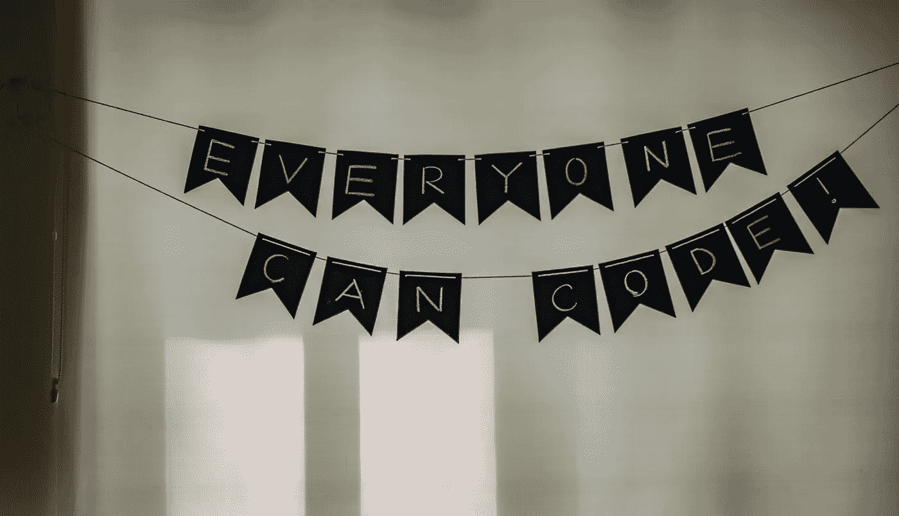

# 从单词块到上下文

> 原文：<https://betterprogramming.pub/from-word-blobs-to-context-5-steps-in-nlp-and-text-cleaning-db9c15e11a4c>

## 自然语言处理和文本清理的 5 个步骤

帕特里克·托马索在 [Unsplash](https://unsplash.com/s/photos/books?utm_source=unsplash&utm_medium=referral&utm_content=creditCopyText) 上的照片

你不必说或写很多来表达你的观点。

许多人欣赏这种直接的方法，当涉及到执行分析时，计算机也是如此。数据清理的目标之一是为计算机提供清晰简明的信息，以获得最有意义的结果。这就是为什么要丢弃空值、纠正重复数据、进行转换以及执行其他技术来获得数据的细化版本。

文本数据也不例外，在本文中，我将讨论[自然语言处理](https://en.wikipedia.org/wiki/Natural_language_processing) (NLP)。我将使用 Python 库 [NLTK](https://www.nltk.org/) ，一个用于处理人类语言数据的库，用我最近的 [Twitter 情感分析项目](https://github.com/MarcelinoV/Twitter-Covid-NLP-KMeans)中的数据来检查文本清理过程。

# 自然语言处理

通过 NLP 进行情感分析已经成为一种流行的用于研究或商业目的的文本分析方法。用例示例包括分析客户对某些产品的评论，可视化论坛或评论线程中的政治极性，或挖掘一些社交媒体源的意见。

像这样的洞察力非常有用，因为它给企业提供了做出有效决策的智慧，并帮助社会科学研究人员通过语言研究人类行为。

然而，就像数字数据一样，在进行任何分析之前，文本数据也必须经过处理，或者说*清理*。Python 是一种很好的语言，像 NLTK 这样的库使得文本清理过程变得平滑而容易。

NLTK，即自然语言工具包，是一个 Python 库，用于词干、标记化、分类等字处理技术。我们将使用它来回顾常规 NLP 中的五个实践:

*   小写转换
*   标记化
*   删除标点符号
*   停止单词删除
*   词干化和词汇化

照片由[晨酿](https://unsplash.com/@morningbrew?utm_source=unsplash&utm_medium=referral&utm_content=creditCopyText)在[破浪](https://unsplash.com/s/photos/twitter?utm_source=unsplash&utm_medium=referral&utm_content=creditCopyText)

# 对新冠肺炎疫苗的看法

我们将对一组关于新冠肺炎疫苗情绪的推文进行文本清理。这些推文是由 [TwitterScraper](https://github.com/taspinar/twitterscraper) 抓取的，这是一个基于关键词和标签抓取推文的 Python 库。

如果您是第一次使用 NLTK，那么您需要将它下载到您的虚拟环境或笔记本中。请参见以下单元格:

取消对“nltk.download()”的注释，并运行代码

## 转换成小写

> 当您进行解析时，将所有数据转换为小写有助于预处理过程以及 NLP 应用程序的后续阶段
> 
> —[Jalaj Thanaki via O ' Reilly](https://www.oreilly.com/library/view/python-natural-language/9781787121423/9742008f-6384-42a4-9711-2721dd6fd382.xhtml#:~:text=Converting%20all%20your%20data%20to,when%20you%20are%20doing%20parsing.)

这是我们 NLP 流程的第一步。记住，文本处理的全部目的是使数据更容易被计算机理解。将文本数据转换成小写有助于实现这一目标。

将文本和 hashtag 列的数据转换为小写

使用字符串库和列表理解，我使用`.lower()`函数转换`text`和`hashtag`列中的数据。注意，我必须循环两次`hashtag`列，因为它由列表中的列表组成——或者，换句话说，它是一个嵌套列表。

## 标记化

> 由于标记是自然语言的组成部分，处理原始文本的最常见方式发生在标记级。例如，基于 Transformer 的模型 NLP 中最先进的(SOTA)深度学习架构——在令牌级别处理原始文本。”
> 
> —[ara vind Pai via Analytics vid hya](https://www.analyticsvidhya.com/blog/author/aravindpai/)

记号化就是简单地把我们的文本数据一个字一个字或者一句一句的分解。这进一步将数据翻译成更计算机友好的语法。

单词和句子标记化

对于我们的 tweet 数据，我们将使用 NLTK 的`tokenize`类，并在我们的`text`列上实现`word_tokenize()`函数，逐词分解文本。我还使用了 `sent_tokenize()`函数来演示句子标记化。

## 删除标点符号

照片由 [engin akyurt](https://unsplash.com/@enginakyurt?utm_source=unsplash&utm_medium=referral&utm_content=creditCopyText) 在 [Unsplash](https://unsplash.com/?utm_source=unsplash&utm_medium=referral&utm_content=creditCopyText) 上拍摄

从我们的文本数据中删除标点符号最终取决于数据所基于的模型的目的。在这种情况下，对于基于新冠肺炎疫苗情绪的聚类推文，标点符号没有多大用处，所以我们将删除它。

使用 re (regex)库，我们删除了所有标点符号

使用用于模式识别的 [re](https://regexlib.com/?AspxAutoDetectCookieSupport=1) 库，我们创建一个 regex 对象来搜索所有形式的标点符号和非字母数字术语。然后我们调用对象上的`sub()`函数，这样它将检查记号(单词记号化的单个元素/单词)是否是标点符号。如果标记不是标点符号，该标记将被添加到我们的新列表中，`no_punc`。

## 删除停用词

> “预处理的主要形式之一是过滤掉无用的数据。在自然语言处理中，无用的词(数据)，被称为停用词
> 
> — [通过 GeeksforGeeks 发布的实用程序](https://www.geeksforgeeks.org/removing-stop-words-nltk-python/)

更详细地说，停用词是常用词，如 *is，but，an，to，him，*等。并且被认为是无用的数据，因为它们没有给文本数据添加上下文含义。无论是构建数据库还是执行聚类，预处理的文本数据通常没有停用词，NLTK 的停用词列表非常适合从我们的推文中删除它们。

导入 NLTK 的“停用字词”类来检查英语停用字词

在这段代码中，我只是检查我们的文本数据中是否有任何英文停用词，并将那些没有的词添加到我们的新列表中，`new_term_vector`。

## 词干化和词汇化

亚历克斯·杜哈诺夫在 [Unsplash](https://unsplash.com/?utm_source=unsplash&utm_medium=referral&utm_content=creditCopyText) 上拍摄的照片

> 词干化和词尾化都产生词根形式的词形变化。区别在于词干可能不是一个真实的单词，而 lemma 是一个真实的语言单词。词干提取遵循一种算法，对单词进行分步处理，这样速度会更快。”
> 
> —[haf sa Jabeen via data camp](https://www.datacamp.com/community/tutorials/stemming-lemmatization-python)

在 NLP 中，词干化就是通过去掉后缀来简化一个单词，比如 *-er，-ing，-es，*等等。于是 *runner* 变成了 *runn，*T21【句子】变成了 *sentenc，*和 *growing* 变成了*grown。*

但是 *runn* 和 *sentenc* 显然不是词。这就是词汇化的用武之地，因为它涉及到查阅英语词典以及将词干与实际语言中的对等词进行匹配。这就用词根替换了带后缀的单词，使得数据对计算机更加友好。

首先把这个单词加工成一个词干。然后转向它的引理

我们首先从 NLTK 导入`PorterStemmer`和`WordNetLemmatizer`类。然后我们创建`stemmer`和`lemmatizer`对象，并使用它们对文本数据中的每个单词执行`stem()`和`lemmatize()`功能。

## 额外收获:微调

[本杰明·达达](https://unsplash.com/@dadaben_?utm_source=unsplash&utm_medium=referral&utm_content=creditCopyText)在 [Unsplash](https://unsplash.com/?utm_source=unsplash&utm_medium=referral&utm_content=creditCopyText) 上的照片

我注意到在处理完这些推文后，我仍然有一些带有网络术语的词，比如`html`、`www`、`http`等等。所以我创建了一个新的 regex 对象来搜索这些特定的术语，并实现了与删除标点符号时相同的方法。

删除由 web 术语组成的元素

# 结论

阿迪·戈尔茨坦在 [Unsplash](https://unsplash.com/?utm_source=unsplash&utm_medium=referral&utm_content=creditCopyText) 上的照片

> “NLP 的最终目标是以一种有价值的方式阅读、破译、理解和理解人类语言。”
> 
> — [迈克尔·j·嘉宝博士通过成为人类](https://becominghuman.ai/a-simple-introduction-to-natural-language-processing-ea66a1747b32)

总之，自然语言处理促进了计算机对文本数据的解释。小写转换、标记化、标点/停用词移除、词干化和词汇化是自然语言处理中使用的一些最重要但又最基本的文本处理技术。

更熟悉这门学科的最好方法是亲自尝试！选择一个你真正感兴趣的话题，并就此做一个 NLP 项目。它可以是分析亚马逊上的客户评论或社交媒体上的意见挖掘。

在处理文本数据时，您还使用了哪些 NLP 技术？你觉得知道哪些最有用？你想学哪些？

# 资源

这个由 Unfold Data Science 制作的[视频归功于，我就是在这里学会了用于我的 Twitter 集群项目和这篇文章的 NLP。](https://www.youtube.com/watch?v=KhXU7KOxQcg&t=380s)

最后一段代码:如何保存我们清理过的文本数据。

使用 pandas 的 to_csv()保存你的数据帧