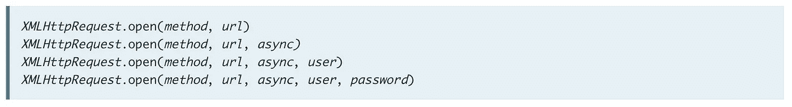

# 从 XHR 到终点的异步/等待取货

> 原文：<https://betterprogramming.pub/from-xhr-to-fetch-with-async-await-on-the-finish-line-b021de1d226b>

## 看看 JavaScript 中请求的发展和历史


照片由[格雷格·拉科齐](https://unsplash.com/@grakozy?utm_source=unsplash&utm_medium=referral&utm_content=creditCopyText)在 [Unsplash](https://unsplash.com/s/photos/javascript-error?utm_source=unsplash&utm_medium=referral&utm_content=creditCopyText) 上拍摄

距离我的上一篇文章已经有一段时间了。我一直忙于探索与我的技术相关的其他技能。但是现在是时候分享一些关于我最喜欢的语言的激动人心的事情了:JavaScript！

## XMLHttpRequest 同步

在异步 JavaScript 出现之前很久，我们使用`XMLHttpRequest` (XHR)调用 API 来获取数据，而无需刷新页面。

XHR 是基于事件的。因此，当我们使用 AJAX 调用时，调用下面的所有代码都必须等待，直到我们从服务器获得响应(又名同步)。我们的 JavaScript 阻塞了所有其他代码。

如果我们得到的不是我们期望的响应，而是一个错误，那么 JavaScript 中的错误就变得很大:

在下面的例子中，您可以看到这个`XMLHttpRequest`正在阻塞它下面的所有东西，直到从 API 返回一个成功的消息。

## XMLHttpRequest 异步

我们不希望我们的代码暂停，直到我们的响应从服务器返回。—我们只想在从服务器收到结果后返回。

幸运的是，有一种方法可以通过`async`参数使`XMLHttpRequest`异步。



XMLHttpRequest open 方法的可能性[https://developer . Mozilla . org/en-US/docs/Web/API/XMLHttpRequest/open](https://developer.mozilla.org/en-US/docs/Web/API/XMLHttpRequest/open)

我们通过将`xhr.open(“GET”, url, false);`改为`xhr.open(“GET”, url);`来做到这一点，因为如果我们跳过 open 方法中的最新参数，那么异步参数的值将为真。

在下一个示例的控制台中，您可以看到 DOM 操作的控制台日志排在第一位，因为 XHR 现在是异步的。

## Fetch:基于异步 AJAX 请求做出承诺

[Fetch API](https://developer.mozilla.org/en-US/docs/Web/API/Fetch_API) 是 XHR 的新的、更强大的替代品——完全异步和基于承诺的。

```
fetch('[http://example.com/movies.json'](http://example.com/movies.json'))
  .then(function(response) {
    return response.json();
  })
  .then(function(myJson) {
    console.log(JSON.stringify(myJson));
  });
```

如果你问我，你可以读取更有意义，因为你可以按顺序读它采取的步骤。如果你想更详细地了解如何使用 Fetch API，Mozilla 有一个很好的资源。

在下面的例子中，您可以看到 Fetch API 以异步方式工作。首先，来自 DOM 更改的 console.logs 在控制台中是可见的。

## Async/Await:异步 AJAX 以同步可读的方式调用

```
(async () => {
   const resp = await fetch("[https://api.github.com/users/github](https://api.github.com/users/github)");
   const jsonData = await resp.json();
   console.log("jsonData: ", jsonData);
})();
```

要将`await`与`Fetch`一起使用，我们必须将其包装在一个`async`函数中。在这种情况下，我们将它包装在一个 IIFE 中(*立即调用函数表达式*)。

当 fetch 第一次返回一个`Promise`时，结果被放入`const resp`中，因此下一个变量会一直等到 fetch 得到响应。只有当`jsonData`变量得到数据时，控制台才输出数据。

所有这些的好处在于，用 JavaScript 处理异步 AJAX 请求不再那么困难。但是对你和你的团队来说，使用哪种方法很重要。

`[XMLHttpRequest](https://caniuse.com/#search=XMLHttpRequest)`多年来一直被广泛使用和支持。`[Fetch](https://caniuse.com/#feat=fetch)` [API](https://caniuse.com/#feat=fetch) 也得到广泛支持，但如果要支持 IE11，则需要考虑使用`Babel`。

在所有现代浏览器中，对 [Async/Await 的支持都很棒，但是对于 IE11，你仍然需要使用`Babel`来使用它进行开发。](https://caniuse.com/#feat=async-functions)

尽情体验异步 JavaScript 吧！一如既往，如果您有任何问题或需要帮助，请告诉我！

# 谢谢！


读完这个故事后，我希望你学到了一些新的东西，或者受到启发去创造一些新的东西！🤗

如果我给你留下了问题或一些要说的话作为回应，向下滚动并给我键入一条消息。如果你想保密，请在 Twitter @DevByRayRay 上给我发一条 [DM。我的 DM 永远是开放的😁](https://twitter.com/@devbyrayray)

## 通过电子邮件获取我的文章点击这里 | [购买 5 美元的中级会员资格](https://byrayray.medium.com/subscribe)

# 阅读更多


[射线射线](https://byrayray.medium.com/?source=post_page-----b021de1d226b--------------------------------)

## 荒诞的故事

[View list](https://byrayray.medium.com/list/angular-stories-24674407532a?source=post_page-----b021de1d226b--------------------------------)6 stories

[雷雷](https://byrayray.medium.com/?source=post_page-----b021de1d226b--------------------------------)

## 最新的 JavaScript 和 TypeScript 故事

[View list](https://byrayray.medium.com/list/latest-javascript-typescript-stories-0358ad941491?source=post_page-----b021de1d226b--------------------------------)14 stories