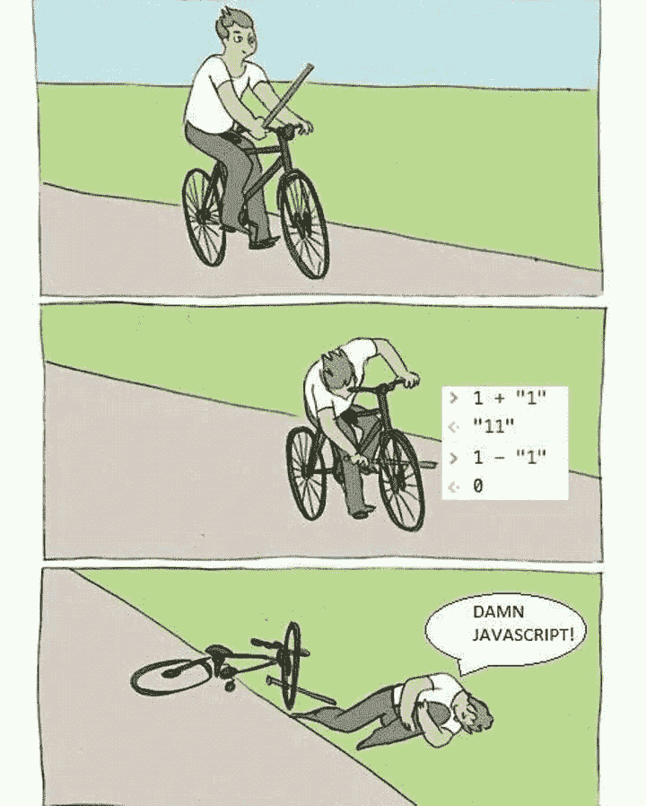

# 前端、后端以及二者之间的模糊界限

> 原文：<https://betterprogramming.pub/front-end-back-end-and-the-blurring-line-in-between-df3b8a938075>

## 一个关于分离是如何开始的，以及为什么现在要离开的故事。

从 shutterstock.com 获得许可

如果你接近 web 开发，你一定听说过前端和后端角色的区别。然而，久而久之，他们之间的界限已经开始模糊，鸿沟正在缩小。这个故事讲述了分离是如何开始的，以及它为什么会消失。

# 青铜时代

在 web 诞生之前，编程只是编程。开发人员编写代码在屏幕上呈现用户界面，操作磁盘上的文件，并与本地网络上的其他计算机通信。如果他们需要做一些新的事情，他们会学着去做。没有角色的区分，程序员是多面手。

即使在动态网站开始出现的时候，开发人员也使用旧的“C”语言编写服务器代码(称为 [CGI](https://en.wikipedia.org/wiki/Common_Gateway_Interface) )来将动态 HTML 内容直接发送到 web 浏览器:

CGI“Hello World”

然后事情开始失控。

# 铁器时代

互联网的繁荣给软件开发者带来了两个意想不到的后果:

## #1 失去明确的边界

web 应用程序不是像传统的企业或个人软件那样为相对固定的用户群服务，而是向全球人口开放。你无法预料会有多少人使用它，会存储多少数据，野外的人会有多恶意的攻击它。结果，服务器端编程变得比以前更加复杂和紧张。

## #2 可用性高于功能性

功能是传统软件的货币；然而，对于 web 应用程序，你必须在可用性上竞争。能做的已经做了，可能很多次了。每个细分市场都有足够多的玩家，不同品牌提供的功能或多或少是一样的。最终，那些设计巧妙、用户体验直观的产品会胜出。UI 不再是暴露产品特性的浅层。它是产品。

这些结果导致了 web 开发中的两个重心:

*   需要安全、可靠、可伸缩和经济高效的后端(服务器端程序)
*   一个前端(浏览器端程序)需要快速，流畅，易于理解

两者都很有挑战性，需要完全不同的技能。质心的分裂最终造成了工程角色的分离，前端开发人员大多讲 HTML/CSS/Javascript，构建花哨的 UI，后端乡亲用 PHP/Java/C#/…实现服务器端的业务逻辑。

正如人类历史上的许多其他案例一样，专业化至少在某种程度上提高了效率。每个角色都不用担心太多，可以专注于做好一件事。但是它也带来了几个明显的缺点:

1.  建立一个在线创业公司变得更加昂贵。前端和后端开发者都很贵；不幸的是，它们通常不可交换，也不容易兑换。
2.  很难让后端开发人员“以客户为中心”，因为他们已经在担心服务器，而不是支付者。它会引起文化问题。
3.  团队边界为相互指责创造了空间，带来了更多的文化问题。

幸运的是，随着“Javascript 无处不在”的运动，事情开始发生变化。

# 现代

2009 年发生了一件重要的事情: [Node.js](https://nodejs.org/) 宣布，有史以来第一次，web 开发者可以用 Javascript 编写严肃的后端代码，这在以前只用于前端。这是一件大事，不仅因为 Node.js 是一个优秀的工具，还因为它打开了统一前端和后端开发的大门，至少在语言层面上是如此。因此，前端开发人员在不需要切换到另一种语言(和相应的工具)时，更容易(从心理上和实践上)开始搞乱后端代码。

很多后端开发者(包括我自己的一个年轻版本)鄙视 Javascript，这是可以理解的。信任一种在设计上有严重不一致性的语言需要一些勇气。

https://devrant.com/rants/1039914/damn-javascript

不管喜欢与否，“Javascript 无处不在”的趋势是明确的、严肃的、不可逆转的。从 2009 年快进到今天，你可以用 HTML + CSS + Javascript 构建任何东西:网站、SaaS、桌面应用、移动应用、游戏、VR/AR、区块链、机器学习系统、汽车、机器人……你能想到的。

> 任何可以用 JavaScript 编写的应用程序，最终都会用 JavaScript 编写。—杰夫·阿特伍德

前端和后端之间的界限已经开始模糊。

# 未来时代

即使有了 Node.js，成为通才(也就是全栈开发人员)仍然很难，因为语言只是障碍之一:数据库、安全性、分布式设计、大数据——这些都是需要多年经验才能完善的深度领域。

好消息是，有创新精神的人正在努力进一步缩小差距:

## 前端框架变得越来越后端化

以最流行的前端框架之一 [Next.js](https://nextjs.org/) 为例:Next.js 允许你创建用于在服务器端执行代码的 API 端点。这使得在前端框架内完成类似后端的事情成为可能，比如查询数据库或验证用户。在某些情况下，您现在可以完全用一个框架和一种语言实现一个成熟的应用程序(如果我们可以将 HTML/CSS/Javascript 合二为一的话)。

## 服务器端的复杂性正在被抽象化

服务器端编程有其令人讨厌的复杂性。幸运的是，新一代创业公司正在构建解决方案来减轻痛苦。例如，众所周知，用户认证和授权很难正确实现，而 [Auth0](https://auth0.com/) 致力于通过提供一组即插即用的 API 来隐藏复杂性。因此，您现在可以专注于高级工作流，而不是考虑技术细节。这种趋势在其他领域有更多的例子，如支付系统、CMS、电子商务等。

这两股力量共同打破了前端和后端之间的墙，将前端开发人员推向了另一边。在未来，web 开发范例将是以前端为中心的:用户体验下的 API 交响乐。

前端推进其边界，从 shutterstock.com 获得许可

你知道吗？当角色的界限被打破，文化问题就会消失。

> 软件开发的未来是光明的。—埃里克·西蒙斯，Stackblitz 的创始人

前端开发的未来更加光明🚀。