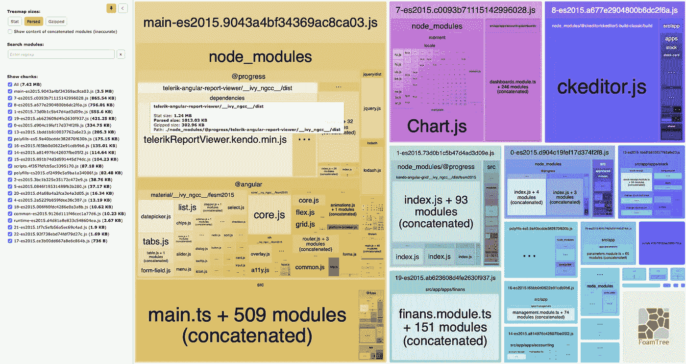
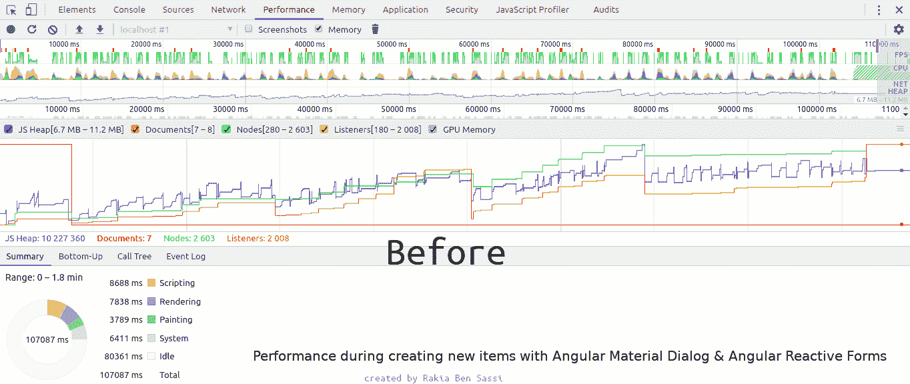

# 我从设计企业应用程序中学到的 10 个教训

> 原文：<https://betterprogramming.pub/frontend-architecture-376e6323ef9b>

## [软件工程](https://rakiabensassi.medium.com/list/software-engineering-7a179a23ebfd)

## 前端架构从来都不是“一劳永逸”的命题，没有任何设计或计划是完美或完整的

照片由[在](https://unsplash.com/@thisisengineering?utm_source=medium&utm_medium=referral) [Unsplash](https://unsplash.com?utm_source=medium&utm_medium=referral) 上拍摄

> “我们有一个大型 ERP 项目，我们在后端使用 DotNet 核心微服务。在这个 ERP 项目中，我们希望使用 Angular 在遗留系统中完成与 windows 窗体相同的事务和功能。最重要的是，我们希望在键盘上使用可编辑的角度网格。”

从一个新的业务联系人那里收到这条消息几天后，在与他讨论了这个项目后，我开始构建一个内嵌的可编辑网格，它满足了 [web accessibility (A11y)](/angular-keyboard-listeners-good-practices-b208edc6bf89) 的需求。

它为最终用户提供了使用鼠标和键盘或仅使用键盘来执行以下(及更多)功能的可能性:

*   编辑、删除、添加和保存行。
*   在行、列和单元格之间导航。
*   将不可编辑的行转换为可编辑的模式(使用键盘箭头和 ENTER 键)。
*   在某些特定列中使用自动完成功能，让用户可以搜索值。
*   当焦点在显示自动完成的单元格中时，按 F2 键后打开一个显示更详细结果的对话框。
*   在对话框中的数据列表中导航并在其中执行搜索(或从中打开其他对话框)，然后使用键盘箭头和 ENTER 键选择一个值。
*   用键盘关闭对话框，并将焦点设置回网格或先前打开的对话框。

带有动态表格的角度材料自定义自动完成

在内嵌可编辑网格中使用的角度材料自定义自动完成(带有动态表格)

有了这个关键特性——带键盘监听器的内联可编辑网格——的控制，项目中团队成员的数量增加了，应用程序开始形成大规模应用程序(ERP)的形状。然后我被委以前端架构师的角色。我实现了许多动态组件，在多个模块中使用，并在需要时调整代码设计，以降低复杂性并促进新队友的集成。

在这篇文章中，我将分享我从这次旅程中学到的十个教训。他们的目的不是教你如何设计一个企业 web 应用程序，而是帮助你熟悉前端架构和软件工程的许多问题。我将分解要考虑的问题，并给出一些技巧，您可以利用这些技巧来提高工作效率并构建更好的 web 应用程序。

下面我要告诉你的一切都来自我的个人经历和感受，以及我在 IT 领域十多年来所学到的东西。

事不宜迟，我们开始吧。

# 1.集装箱-呈递人模式

随着项目的发展，您应该会发现越来越多的机会来增加特性和模块之间的代码重用。为了实现这个目标，您需要避免混合关注点，这不仅违反了软件开发的许多原则，而且使理解和维护您的源代码变得乏味。

为了在现代基于组件的前端架构中应用这种方法，我们通过将组件组织成类别来阐明它们的职责。为此，我们使用容器-呈现者模式，将组件分为:

*   **容器组件:**这些是智能组件。他们知道如何从服务中获取数据。它们使用输入和输出与其子组件(表示组件)进行通信。
*   **表示组件:**这些组件呈现用户界面并管理与用户的交互。您需要记住，表示组件不一定要被转储——也就是说，它们不能被注入任何服务。如果让它们总是转储，为了在容器和叶组件之间传递数据，组件树中会有大量重复的输入。

在我们的 ERP 中，在每个模块中，我们都有一个主展示者在容器和叶组件之间扮演桥梁的角色。它将许多输入/输出传递给它的子节点，而不在自己的逻辑中使用它们。随着时间的推移，输入和输出的数量以一种难以理解的方式增加；这就是所谓的*冒泡事件。*

在将服务深入注入组件树并使一些表示性的叶子组件变得智能之后，我缓解了冒泡事件的问题，并使代码设计更易于维护。冒泡事件问题在你的应用程序中有多痛苦取决于你的组件树有多大和多深。

# 2.亲子设计

如果您有许多遵循类似代码设计的组件，您会注意到重复的输入、输出和方法。为了摆脱这种样板代码，我利用组件继承来外部化父类中的共享逻辑。遵循这种方法后，大量的代码重复被删除。

通过使用父子设计，您可以减少在执行重复性任务时出现的许多人为错误。

但是在应用这个技巧之前，您可能需要使用通用名称，如下一点所述。

# 3.通用命名

在不同的组件中使用`dataList`作为变量名，而不是使用`invoiceList`和`stockList`，这有助于您看到代码设计中的模式，并使您能够将样板代码提取到父类或助手类中。

# 4.共享包装组件

共享包装组件是一个表示性组件，用于多个模块(或组件)。它有助于维护、未来的重构，或者可能迁移到不同的库——比如从 Kendo 迁移到 AG Grid。

共享包装器组件(例如，呈现搜索框的组件)的主要好处是，您可以在一个地方(在包装器中)更改搜索行为，结果将在使用它的每个模块中复制。假设您想要`debounce`搜索查询并消除连续的重复条目。在一个可重用的演示者中，这个变更请求很容易完成，如下面的清单所示:

使用去抖动、不同搜索查询的搜索演示者([源](https://indepth.dev/posts/1201/presenters-with-angular)

共享包装器的另一个例子是由多个组件组成的复杂数据表 UI。每个行或单元格组件可以拥有一个或多个表示器来处理 UI 行为、本地 UI 状态、验证和格式化。

在我们的 ERP 中，我们使用了`Kendo`来实现不同类型的网格:

*   每行保存一个内嵌编辑网格，
*   一批网格，
*   不可编辑的网格，
*   等等。

这些网格中的每一种都在许多模块中使用。通过在包装器组件— `batch-grid`和`edit-grid`中实现共享逻辑，我去除了大量的样板代码。我注意到，每当我们需要添加一个新特性时，比如说添加到`edit-grid`中，只在一个地方(共享包装器)添加比在 n 个组件中添加 n 次要容易得多。

如果我们计划将来从`Kendo`切换到`PrimeNG`或另一个库，我们需要做的只是改变包装器组件中的实现，而不是使用该库中的网格来改变每个模块中的实现。

下面是我们的一个组件`account-receipt`使用一个共享包装器`edit-grid`来呈现一个[内联可编辑网格](https://javascript.plainenglish.io/angular-material-table-with-edit-function-like-excel-7c2c53332553):

帐户接收模块中使用的剑道网格包装组件

这是包装组件的模板。如您所见，它调用剑道网格`kendo-edit-grid`，但是`account-receipt`组件看不到这种依赖性:

剑道网格的角包装组件:kendo-edit-grid.component.html

# 5.可观察的数据服务(商店服务)

为了保持组件的责任集中并保持关注点的分离，我们创建了`Services`来处理数据请求。但是服务可以做的不仅仅是与 API 通信；他们可以在现代网络应用中扮演商店的角色。

在许多情况下，通过避免引入 Redux、NgRx 或 NgXs 来管理应用程序状态，可以降低代码的复杂性。相反，你实现基于`BehaviorSubject`的服务——也称为[可观察的](https://levelup.gitconnected.com/promise-vs-observable-vs-stream-165a310e886f)数据服务或存储服务——来做同样的工作。

在 ERP 的每个模块中，我们都有两种基本服务:

*   一个扩展`BaseHttpService<T>`的 HTTP 服务，包含调用 REST API 的方法。
*   Store 服务扩展了`BaseStoreService<T>`，它有`BehaviorSubject`变量和方法调用 HTTP 服务(注入其中)。

RxJs 行为主体

您可以将存储服务视为提供 RxJs 功能操作符的传统事件总线。您可以用`subscribe()`方法订阅它，它通过`next()`方法向订阅者发出新值。

订阅并释放新的价值

# 6.复试

JavaScript 中的回调是作为参数传递给另一个函数的函数。在我们的 ERP 中，我使用这种技术在用户与 UI 交互之后执行一些验证或一些逻辑。示例:

*   如果库存代码发生变化，则应更新在不同栏中用作下拉选项的单位列表。
*   如果货币类型发生变化，则必须调整“汇率”列中的值。

项目中有动态表单，网格的实现独立于列列表。这就是为什么我在配置对象中传递回调函数——使用动态表单或动态网格为每个组件定义特定列或表单字段的数组。

下面是两个使用回调的例子。第一次监听显示了两个回调函数，`onApCodeChanged`和`onCreditChanged`，它们在定义列列表的数组中传递:

动态可编辑网格的列定义

该列表`displayColumnsDefs`作为输入传送到可编辑网格`edit-grid`:

角度内嵌可编辑网格

第二个例子展示了回调，比如`descrContainsChange`，它出现在动态表单的字段定义中:

[表单-字段-值-变更-回调. component.ts](https://gist.github.com/rakia/27b6c7ac8523da1ab60cfec8a1ca0378#file-form-field-value-change-callback-component-ts) :

这些回调函数已经工作了一段时间，但是我们在通过添加像`this.stockService.getUnits(currencyType)`这样的指令来更新它们的实现之后，面临了一个挑战。你能猜出是什么问题吗？

没错，回调函数被绑定到了错误的范围，导致了一个错误，说在定义列或表单字段的数组或 JSON 对象中没有名为`stockService`的变量。

解决方案是在将回调添加到我们的配置对象之前，使用`bind(this)`将它们绑定到正确的作用域`this`，如下面的清单所示:

[column-value-change-callback . component . ts](https://gist.github.com/rakia/126f4633c55ae9223dd4eeeba619d751#file-column-value-change-callback-component-ts)

# 7.性能监控

当您向项目中添加新功能时，它的工作方式可能会改变，您可能会面临倒退，或者用户意识到在某个时候，UI 会变得更慢、迟缓，并且可能会非常频繁地暂停。

这就是为什么你必须关注[性能](/angular-onpush-change-detection-f629cbce0bfa)，它可能会杀死你的应用程序！

## Webpack 捆绑包分析器

您可以通过将它添加到您的`package.json`中来利用像`webpack-bundle-analyzer`这样的工具。它允许您分析您的应用程序包和依赖项的大小:

package.json 中的 webpack-bundle-analyzer

Angular 企业应用程序的 Webpack 捆绑包分析器

## Chrome 开发工具

别忘了用 Chrome DevTools 监控你的表现:

*   您可以拍摄堆快照，向您展示内存是如何在我们的应用程序的 [JavaScript](/typescript-new-release-19f1238c6a68) 对象、原语、字符串、函数、DOM 节点等之间分配的。
*   您可以使用“内存”面板来识别 JavaScript 堆内存泄漏。
*   性能时间线记录向您展示了在用户交互之后，JS 堆大小、节点大小和侦听器大小将如何随时间变化。当您的应用程序无法清除未使用的资源时，就会发生内存泄漏。频繁上升和下降的 JS 堆或节点计数图是潜在垃圾收集问题的征兆。

[性能时间线记录](/build-me-an-angular-app-with-memory-leaks-please-36302184e658):内存泄漏修复前后(动画由[作者](https://rakia-bensassi.medium.com/)制作)

在“[如何使用 Chrome DevTools](/build-me-an-angular-app-with-memory-leaks-please-36302184e658) 创建并修复内存泄漏”一文中，有更多的细节和指南，关于如何使用 DevTools 并理解它生成的图表、统计数据和指标。

# 8.重构

管理动态业务需求之间的平衡和保持技术部门最小化可能是我们作为开发人员面临的最大挑战。

为了实现这个目标，我们需要让重构成为一个持续的基本活动，这属于我们的编程文化，以保持干净的代码和干净的设计。

我完全同意 Steven A. Lowe 的观点，他将重构描述为从编码经验中学习的机会。我喜欢他的文章“你犯敏捷错误的 15 个迹象”中的以下摘录:

> “重构不仅有助于提高代码的机械质量；它也帮助你从你的代码中学习。当重构时，你会收敛于更好的模型。现在，你的代码可以工作，但是可能感觉紧张，甚至有点脆弱。重构揭示了隐含的模型，它通知你对领域的理解。在红绿重构的测试驱动开发周期中，“重构”不是可有可无的，以免你积累技术债务，无法从编码经验中吸取教训。”

# 9.进化建筑

> “前端架构从来都不是一个“设置好就一劳永逸”的命题。没有任何设计或计划是完美或完整的。客户的需求(以及开发人员的需求)将随着时间的推移而改变和发展，在项目的某个阶段工作良好的过程可能需要在以后重新访问，以提高效率或减少错误。
> 
> 前端架构师的一个关键才能是不断进行调整的能力。"
> 
> — [设计系统的前端架构](https://www.oreilly.com/library/view/frontend-architecture-for/9781491926772/ch01.html)

作为软件架构师，我们需要意识到这样一个事实，即最好的结果来自于[与团队](https://medium.com/swlh/characteristics-of-successful-team-60272e59a2c6)的合作，并且设计必须与开发过程同步调整。

在开发人员开始使用您建立的代码结构后，从他们那里收集反馈可以让您从不同的角度来看您的设计，并注意到您可以优化哪些内容来支持不断的变化。

# 10.团队反馈

> “前端开发人员的受众是最终用户，而前端架构师的受众是开发人员本身。”
> 
> — [设计系统的前端架构](https://www.oreilly.com/library/view/frontend-architecture-for/9781491926772/ch01.html)

在我们的项目中成为一名前端架构师并不意味着我会成为一名经理，再也不用写一行代码。作为一名架构师，我编写了更多的代码，不仅是为了实现所要求的业务特性，也是为了响应我的新受众——我的开发团队——的需求。

实现一个企业应用程序通常意味着大量具有不同技术技能的人将参与开发过程。了解团队成员的背景有助于选择适当的技术、架构模式和代码设计的复杂性。

在我们 ERP 的开发周期中，我们开发了[新的需求](/angular-library-dynamic-stepper-2ba05ab40228)和一个具有不同技术背景的成长团队——从初级和高级开发人员开始他们的 Angular 之旅，到 [Angular](/angular-10-new-features-dbc779061dc8) 专家。我们的主要目标之一是提供最低的代码复杂度，并支持我们的团队成员沿着他们的学习曲线前进。出于这个原因，我避免使用`monorepo`，而是使用`BehaviorSubject`商店服务，而不是`Ngxs`或`Ngrx`。

我还记得很多年前我在一家有很多 scrum 团队的公司的另一次经历。当时，我被要求实现一个 ETL 应用程序，该应用程序应该与吉拉 REST API 通信以从中提取数据。该应用程序的最终用户是公司的会计人员，但现有团队中的开发人员是在我完成工作后负责维护的人。因为我有很好的 spring 框架知识，所以我很高兴在实现中使用它。但是我们的技术领导让我用 Java Jwt 来做，因为他的所有团队都在用 Java 和 EJB 工作，他们没有 spring 框架背景。

因此，了解你的团队，听取他们的意见，并对他们的反馈做出反应！

# 外卖食品

作为前端架构师，你做前端开发和前端工程工作。您通过选择最佳设计模式来设计技术解决方案，以解决业务和客户的挑战。

作为架构师，您的角色还包括评估您的沟通和协作能力，以及您在人员、软件性能和开发时间方面最大化资源的技能。

感谢你阅读这篇文章。希望你能得到一些见解，对你自己的旅程有所帮助。

🧠💡我为一群聪明、好奇的人写关于工程、技术和领导力的文章。 [**加入我的免费电子邮件简讯独家访问**](https://rakiabensassi.substack.com/) 或在此注册媒体。

*你可以在 Udemy 上查看我的* ***视频课程****:*[*如何识别、诊断、修复 Web Apps 中的内存泄漏*](https://www.udemy.com/course/identify-and-fix-javascript-memory-leaks/) *。*