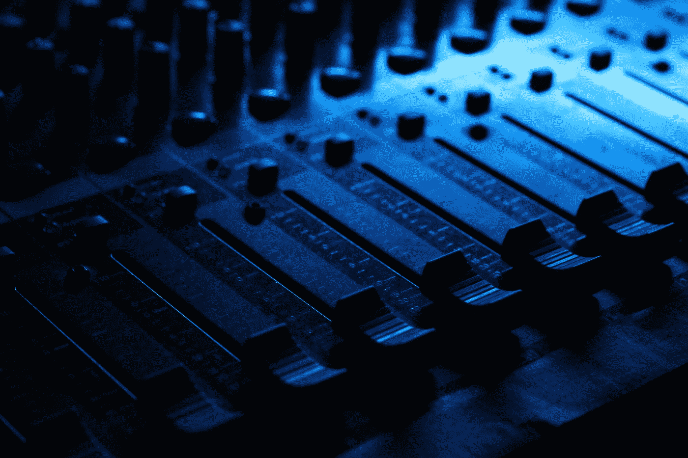
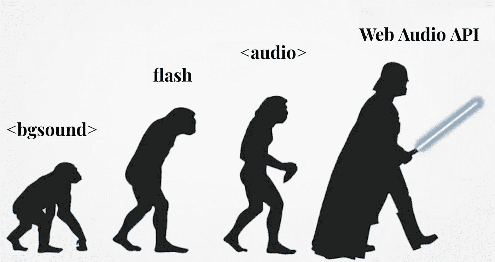
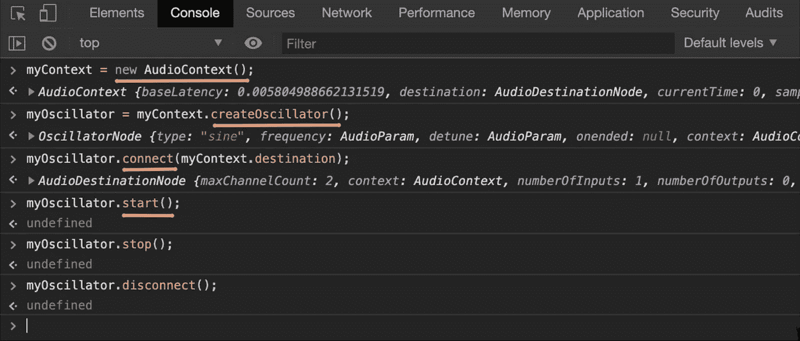

# 前端开发声音

> 原文：<https://betterprogramming.pub/frontend-development-sounds-9fe7e5839ab9>

## **网络音频 API、Tone.js 和 Angular trio**



[汉娜剧团](https://unsplash.com/@htroupe?utm_source=medium&utm_medium=referral)在 [Unsplash](https://unsplash.com?utm_source=medium&utm_medium=referral) 上的照片。

我们非常习惯于用代码生成视觉效果，但当听说我们可以用同样的方式创作音乐时，我们常常会感到惊讶。哦，你不知道吗？你并不孤单。尽管音乐编程的概念肯定比我们所有人都要古老，但这个概念对许多开发者来说仍然相当陌生。让我们来看看 web 应用程序中的音乐编码。

# **网络音频 API**



网络上音频可能性的演变(修改过的[开发者](https://devrant.com/rants/495927/web-sound-evolution)照片)。

如果我们看看网络上音频可能性的演变，它提醒我们在相当长的一段时间里我们有不同的处理音频的方式。如今，最复杂的方法是使用[网络音频 API](https://developer.mozilla.org/en-US/docs/Web/API/Web_Audio_API) 。

> “Web Audio API 有光剑，肯定是这个 API 有什么特别的地方，但是是什么呢？”

Web Audio API 不仅使我们能够播放、重放或停止音轨，还能创建、修改和分析我们自己的声音。简单来说，它使我们能够将浏览器用作合成器！

它是如何工作的？对于每个 web 应用程序，我们需要创建一个`AudioContext`来存储音频状态。使用`AudioContext`，我们可以创建一个声源(如音轨、生成的振荡器、麦克风)并将其连接到输出声音的目的地。

> 人们经常问我，“劳拉，我们怎么能仅仅从我们的浏览器控制台创造声音呢？”

好吧…从来没有人问过我这个问题，但我还是准备了一个答案:

1.  创造一个新的`AudioContext`。
2.  连接源和目标。
3.  让你的浏览器唱歌吧！



从浏览器控制台创建正弦振荡器声音。

播放哔哔声很容易，但使用普通 Web 音频 API 添加更多乐器和播放一些不同的旋律可能有点棘手。众所周知，前端开发人员喜欢库。因此，Web Audio API 有助手库也就不足为奇了。其中一个是 [Tone.js](https://tonejs.github.io/) ，推荐在 Web Audio API 的 MDN 文档中使用。

# Tone.js 带棱角

我们如何使用 Tone.js 在 web 上创建声音甚至复杂的音乐？我将使用 Angular 应用程序展示一个分步示例。今天我们要创造自己的乐器！

## 应用程序设置

使用 [Angular CLI](https://cli.angular.io/) 创建新的 Angular 应用程序:

```
npm install -g @angular/cli
ng new best-app-i-ever-created-in-my-life
```

安装 Tone.js:

```
cd best-app-i-ever-created-in-my-life
npm install tone
```

为您的乐器生成一个单独的组件:

```
ng generate component instrument
```

将乐器组件嵌入到应用程序组件模板:

您可以使用以下方式构建和服务您的应用程序:

```
ng serve
```

## **基础仪器**

让我们从创建一个使用默认合成器声音的基本乐器开始。首先，在组件初始化期间，使用 Tone.js 中的`Synth`元素创建一个合成器，并将其连接到主输出。然后添加您的乐器能够演奏的音符列表。我用字母符号来描述音符:

现在是时候创建我们的仪器 UI 了。在乐器模板中，通过硬编码的音符列表添加迭代。每个按钮代表一个不同的音高音符，点击事件会触发长度为 1/8 的合成器。

瞧啊。用这几行代码，我们创造了一种能够演奏全方位声音的乐器。但我们不会就此止步！目前，我们使用默认的合成器声音。我们给它加点独特的味道吧。

## **卡蒂亚诺仪器**

让我们使用 Tone.js 的另一个重要元素—采样器。它有助于创建基于音轨的乐器。对于采样器的初始化，我们需要提供一个音轨，并将其映射到正确的音高音符。经过一番彻底的研究，我发现了这个惊人的实验材料:

声音云上的猫样本[。](https://soundcloud.com/laura-silvanavi/cat-sample)

最难的部分来了。这只猫在唱(或说)什么音？我决定坚持 G2 的注意:

仅此而已！老实说，我感到惊讶的是，我不需要修改原始样本，也不需要为每个笔记手动创建额外的样本。Tone.js 根据我们在采样器初始化期间提供的映射调整了所有其他音符。我刚刚修改了我创建的采样器音量，因为原来的猫样本有点太大声了。现在我们可以把采样器和合成器结合起来。

你对“生日快乐”这首歌在卡蒂亚诺听起来如何感兴趣吗？如果没有，对不起，但我还是要给你看:

“[生日快乐](https://soundcloud.com/laura-silvanavi/happy-birthday-on-catiano-instrument)”卡蒂亚诺乐器上的歌声。

你们中的一些人可能会想，“一种猫的声音乐器。很有用……不是。”但是不要过早的评价我，因为我做了额外的努力，在下一部分创造了一些不同的东西！

## **多吉亚诺仪器**

准备好——这将会让你大吃一惊。我们也可以有一个使用狗样本的仪器！玩笑归玩笑，Tone.js 中还有许多其他元素可供我们使用，从带有附加参数的不同种类的合成器开始。这里，我使用基于`Square`振荡器的`Polysynth`元素:

`Part`元素在开始时可能看起来有点复杂，但简而言之，它有助于用创建的乐器演奏预定义的旋律。例如，注册演奏相同`Part`旋律的吉他和钢琴可以作为一个单元开始、停止或循环。我创建了 2 个`Parts`*——一个用于旋律，一个用于低音:*

*和弦音符从下面添加的`constants`文件导入。为了描述旋律，每个音符都应该与一个名为`Tone.Transport`的主计时器同步。它允许源、信号和事件沿着共享的时间线同步。时间可以用[数字、符号、传输时间、频率、现在相对或刻度形式](https://github.com/Tonejs/Tone.js/wiki/Time)编码。我用了最后一个选项。坦白地说，这很痛苦:*

*`Noise`！这是另一个可以用作工具的元素。带有自动滤镜的粉红色噪波创建了海浪效果:*

*回归基础。我们可以使用`Player` 元素来播放音轨。我准备了许多不同的随机播放的马里奥样本:*

*最后，可以用`[Transport](https://github.com/Tonejs/Tone.js/wiki/Transport)`属性修改所有预定的旋律。这就是每分钟心跳加速的方法:*

*Dogiano 乐器的外观和声音是什么样的？你可以在这里查看:*

*伦敦 NDC 展出的多吉亚诺乐器。*

# *结论*

*总而言之，Tone.js 中有很多不同的元素可以根据用户动作来使用。通常，当我们考虑前端开发时，我们的全部注意力都集中在可视化部分。有时，我们完全忘记了我们在网络上也有音频的可能性。请注意，正确的音频确实可以丰富我们的视觉效果，并有助于在网络上创造更高层次的用户体验。*