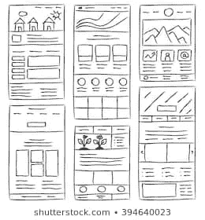
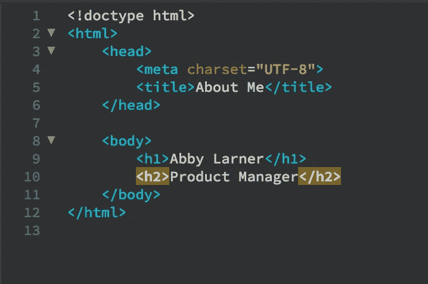
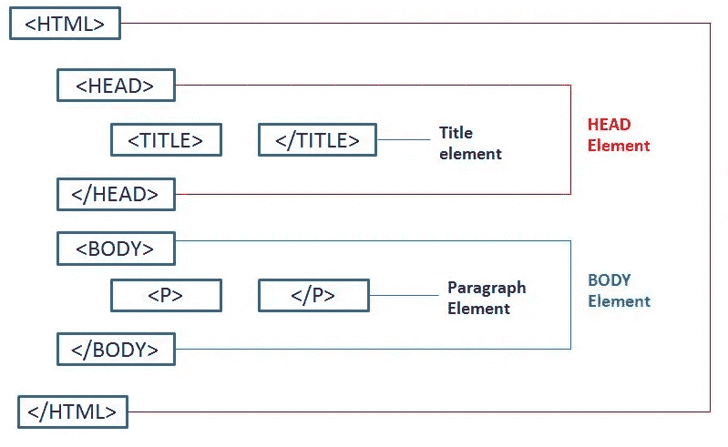
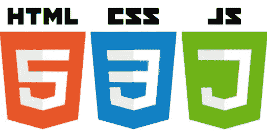
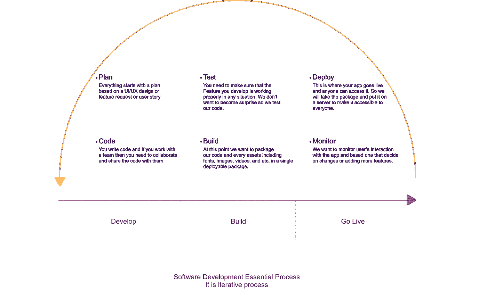
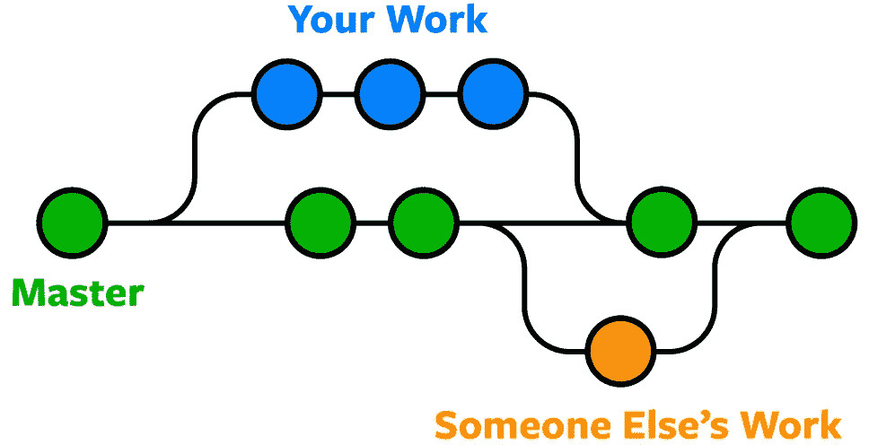
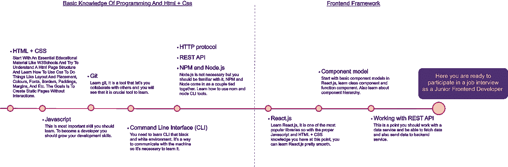

# 前端开发要点

> 原文：<https://betterprogramming.pub/frontend-development-the-essentials-1c1290b43590>

## 开始前端开发职业生涯之前应该知道的事情

[设拉子哈菲兹墓](https://en.wikipedia.org/wiki/Tomb_of_Hafez)

这是一篇适合任何没有编程背景想开始前端开发的人的文章。最终目标是帮助爱好者理解软件开发的松散世界，并使他们能够在这个拥挤的生态系统中找到自己的路。结果是开始学习过程的路线图。

# 目录

*   介绍
*   网络基础
*   Web 开发技术
*   编写代码使其具有生命力的过程
*   软件开发生态系统
*   前端开发技术
*   如何选择合适的工具
*   计划和路线图
*   学习材料
*   结论

# 介绍

前阵子有几个朋友问我如何成为一名前端开发人员。我给他们介绍了要走的路，还给了他们一些关键词，比如 *Git* 、 *HTML* 、 *CSS* 等等。但是后来我发现，对于没有任何编程背景的人来说，进入这个行业是有障碍的。他们应该首先熟悉生态系统。

他们很快就会被大量的教育材料淹没，对于每个关键词，谷歌都会返回大量的结果。这就像你想买你的第一辆车，而市场上有成吨的不同型号、不同选择、相同价格的车。如果你没有得到任何关于目标规格的建议，你很快就会感到困惑，要么选择不好的，要么离开商店。

在这篇文章中，我将试图给你一个软件开发生态系统的观点和概述。我还会给你一些有用的关键词，以及一些教育材料和博客文章的链接。最后，你会带着学习的路线图离开。

在我们开始之前，我想再次提到，前端开发是开发人员最拥挤的社区之一，所以不要害怕大量怪异的名称、库和技术。目标是让你免于被人群淹没，并让你掌握能帮你找到路的知识。

# 网络基础

让我们从网页由什么组成的问题开始。

把网站想象成一本有几页的书，一本高级的书，其中每一页都由图像、文本、视频、音频和一个名为*链接*的特殊元素组成。在一个网页上，我们可以把所有这些元素放在一起，用字体和颜色来设计它们，也可以把它们放在不同的布局中。

是链接让网页不同于书本。链接的作用是帮助你在无序的页面间导航。链接可以将访问者带到网站的任意页面。你可以根据每一页上的链接从一页跳到另一页，你甚至可以跳到其他书的页面。

## 网页元素

你在网页上看到的几乎所有东西都是这些基本元素的组合:

*   文本
*   图像
*   声音的
*   录像
*   链接(导航元素)

网站的目的是传递信息和特定业务的用户体验。

# Web 开发技术

支持 web 开发的主要技术有三种:

*   超文本标记语言
*   CSS(级联样式表)
*   JavaScript(浏览器理解的动态编程语言)

## 超文本标记语言

> “超文本标记语言(HTML)是设计用于在[网络浏览器](https://en.wikipedia.org/wiki/Web_browser)中显示的文档的标准[标记语言](https://en.wikipedia.org/wiki/Markup_language)。可以通过[级联样式表](https://en.wikipedia.org/wiki/Cascading_Style_Sheets) (CSS)和[脚本语言](https://en.wikipedia.org/wiki/Scripting_language)如 [JavaScript](https://en.wikipedia.org/wiki/JavaScript) 等技术辅助。”— [维基百科](https://en.wikipedia.org/wiki/HTML)

HTML 是一种标记语言。这意味着您通过 HTML 元素创建页面内容，这些元素被称为*标签*。每个标签都有自己特定的属性和行为。

这里有一个 [HTML 标签](https://www.w3schools.com/TAGS/default.ASP)的列表。

## 半铸钢ˌ钢性铸铁(Cast Semi-Steel)

HTML 是用来组织页面内容的。在 CSS 的帮助下，可以根据布局、颜色、字体和样式来设计页面的样式。有了 CSS，我们可以做出可维护的和可伸缩的样式。

## Java Script 语言

JavaScript 是一种浏览器能够理解的动态脚本语言。在 JavaScript 的帮助下，网页可以进行交互，比如当你点击一个按钮时，你可以向用户显示特定的数据。想想你以前见过的所有登录按钮。JavaScript 在背后支持它们的功能和交互。

图片来源: [CleanPng](https://www.cleanpng.com/png-responsive-web-design-web-development-html-javascr-1046856/preview.html)

所以现在我们知道在三种技术的帮助下，我们可以建立网页。我们将在接下来的步骤中研究如何做到这一点。

# 编写代码使其具有生命力的过程

在这一点上，我将给你一个广泛而简单的整个软件开发过程的视角，从你开始写第一行代码到你把你的 web 应用程序放到网上。这个过程在任何软件开发平台上都有些相同，包括 Android 和 iOS。

给你这个概述的目的是向你展示软件开发的过程不仅仅是写代码。在里面，你会听到很多与这个过程的其他部分相关的奇怪的新词。

软件开发过程在一个非常重要的方面

记住这个事实:整个过程是迭代的。每次您将应用程序上线时，您都应该监视用户或利益相关者的请求和反馈，然后计划更改。

## 源代码控制

如果你在团队工作，甚至是单独工作，你需要知道的一件事就是*源码控制*。软件开发发生在迭代中，在每一次迭代中，您添加一个新的特性或者修复一个 bug。为了跟踪源代码的变化，我们需要一种机制。源代码控制工具是跟踪代码库变更的方法，也允许团队中的代码库协作。

[**Git**](https://git-scm.com/) 是开发者使用最多的源码控制工具之一。正如在 [Web 开发词汇表](https://books.google.ca/books?id=nYjhDwAAQBAJ&pg=PT101&lpg=PT101&dq=s+goals+include+speed,+data+integrity,+and+support+for+distributed,+non-linear+workflows.&source=bl&ots=8iV6gquLBx&sig=ACfU3U2E-OmUydwQiMArK3yDjR7M8-Zj-w&hl=en&sa=X&ved=2ahUKEwib0JWuqM_pAhWRVN8KHYeYBoAQ6AEwAHoECAkQAQ#v=onepage&q=s%20goals%20include%20speed%2C%20data%20integrity%2C%20and%20support%20for%20distributed%2C%20non-linear%20workflows.&f=false)中提到的，“Git 是一个分布式版本控制系统，用于在开发过程中跟踪源代码的变化。它是为协调程序员之间的工作而设计的，但也可以用来跟踪任何一组文件中的变化。其目标包括速度、数据完整性和对分布式非线性工作流的支持。”

源控制机制

# 软件开发生态系统

这是一个有趣的话题。我们将了解一些帮助你交流、学习和与他人分享你的挑战的重要平台。在技术行业，尤其是软件行业，沟通对所有参与者都至关重要。科技行业发展非常快，原因之一是这个行业的沟通和知识共享精神。

在本主题中，我将为您提供一些技术领域知识中心的链接，尤其是那些面向前端开发的知识中心。

## [W3Schools](https://www.w3schools.com/)

W3Schools 是开始学习 JavaScript、HTML 和 CSS 的很好的参考资料之一。它还涵盖了一些其他主题，如 React 和 SQL。这是开始命名主题的好地方。

## [堆栈溢出](https://stackoverflow.com/)

如果您对某个特定案例有疑问，答案就在堆栈溢出中。在这个网站上，任何开发人员在开发过程中遇到不知道如何解决的问题时，都会首先寻找问题和答案。这是一个知识分享和交流的平台。我估计其他行业的人都羡慕我们有这个神奇的平台。

## [npmJS 组织](https://www.npmjs.com/)

如果您正在寻找任何 JavaScript 或 TypeScript 库或工具，这是存放它们的地方。将来，你会经常使用这个网站。这是一个参考和存储库，您可以用它来构建自己的解决方案，避免重复劳动。

软件开发是通过将大问题分解成小问题，使用小块解决方案(代码)，并组合这些解决方案来解决更大的问题。

## [GitHub](https://github.com/)

有几个来源于云的控制平台，但这个平台很特别，因为您可以找到大量流行的开源项目和库。此外，几乎所有的 npm 包源代码都托管在 GitHub 上。把 GitHub 当做一个共享代码的平台。

## [Udemy](https://www.udemy.com/)

Udemy 是科技行业的教育平台之一，帮助开发人员增长技能。这个平台上有大量与前端开发相关的不同课程，你可以浏览和挑选。
也有其他平台，像 [Coursera](https://www.coursera.org/) 、 [Edx](https://www.edx.org/) 、 [Lynda](https://www.lynda.com/) 等，在那里你可以找到前端开发相关的课程。

## [黑客排名](https://www.hackerrank.com/)

这个平台通过介绍您需要寻找答案的挑战来帮助您提高编程技能。这些挑战帮助你学习编程、算法和数据结构。这是一个非常有助于提升编程技能的平台。

# 前端开发技术

在这里，我们将看看前端开发的不同技术。其实最需要学习的是 JavaScript。其余的是将简化您的开发的库或框架，但最终，它们是基于浏览器理解的语言 JavaScript 的库和框架。

记住 JavaScript 是最重要的。学习 JavaScript 极大地帮助你更好地阅读和理解库和框架。

**你应该学习的 JavaScript 概念:**

*   词汇结构
*   公式
*   类型
*   变量
*   功能
*   `this`
*   箭头功能
*   环
*   领域
*   数组
*   模板文字
*   分号
*   严格模式
*   ECMAScript 6，2016，2017
*   [JSON](https://www.w3schools.com/js/js_json_intro.asp)
*   [Nodejs](https://nodejs.org/en/) 。在服务器或任何独立于浏览器的机器上运行 JavaScript 是一个[环境。](https://www.w3schools.com/nodejs/default.asp)
*   HTTP 请求和响应模型以及 REST API 概念。
*   使用 JavaScript 处理文件和机器资源
*   [异步/等待](https://developer.mozilla.org/en-US/docs/Learn/JavaScript/Asynchronous/Async_await)和[模块](https://developer.mozilla.org/en-US/docs/Web/JavaScript/Guide/Modules)
*   [国家预防机制](https://en.wikipedia.org/wiki/Npm_(software))

接下来要学习的是精通 [HTML](https://www.w3schools.com/html/) 和 [CSS3](https://css-tricks.com/) 。HTML 和 CSS 是你作品的视觉部分。试着理解它们的结构和要点。其余的是不同类型的实现，如果你知道 HTML 和 CSS，对你来说会很容易。

学习 [JQuery](https://jquery.com/) ，这是一个 JavaScript 库，旨在简化 HTML DOM 树遍历和操作，以及事件处理、CSS 动画和 Ajax。这是免费的开源软件。

## 现代前端库和框架

注意:下面的定义来自维基百科和其他在线资源。

*   ****“AngularJs 是一个基于 JavaScript 的、开源的前端 web 框架，主要由 Google 和一个个人社区维护。这是最受欢迎的前端开发框架之一。”——[维基百科](https://en.wikipedia.org/wiki/AngularJS)。****
*   ****[**React js**](https://reactjs.org/)**React 是一个用于构建用户界面的 JavaScript 库。它由脸书和一个由个人开发者组成的社区维护。”— [维基百科](https://en.wikipedia.org/wiki/React_(web_framework))。
    ReactJs 也是最受欢迎的一个，周围有一个很大的社区。******
*   ******[**Vue js**](https://vuejs.org/)“Vue 是一个开源的 Model-View-ViewModel JavaScript 框架，用于构建用户界面和单页面应用。它由尤雨溪创建，并由他和来自 Netlify 和 Netguru 等不同公司的其他活跃核心团队成员维护。”— [MarsMedia](https://www.marsmedia.info/en/service/vuejs)******

****首先，只关注一个。作为一名初级开发人员，你有很多工作机会——但我再次强调 JavaScript，因为它是你知识的核心结构。****

****要想找到一份初级网站开发人员的工作，首先，去 LinkedIn 这样的网站。搜索与前端开发相关的工作，看看哪些关键词和库是最需要的，然后去学习那些。****

# ****如何选择合适的工具****

****您需要一些工具来编写代码、执行代码以及调试代码。以下是我对基本工具的建议。(注意:下面的定义来自维基百科和其他在线资源。)****

## ****[VS 代码](https://code.visualstudio.com/)****

****“Visual Studio Code 是微软为 Windows、Linux 和 macOS 开发的源代码编辑器。它包括嵌入式 Git 和对调试、语法突出显示、智能代码完成、代码片段和代码重构的支持。”——[维基百科](https://en.wikipedia.org/wiki/Visual_Studio_Code)。****

## ****[ZSH](https://ohmyz.sh/)****

****Z [shell](https://en.wikipedia.org/wiki/Command-line_interface) 是一个 Unix shell 或 CLI，可以用作交互式登录 shell 和 shell 脚本的命令解释器。ZSH 支持插件，并为你提供了许多有助于轻松使用命令行界面的功能。****

## ****[邮递员](https://www.postman.com/)****

****“Postman 是一个流行的 API 客户端，它使开发人员可以轻松地创建、共享、测试和记录 API。这是通过允许用户创建和保存简单和复杂的 HTTP/s 请求，以及读取它们的响应来实现的。”— [DZone](https://dzone.com/articles/how-to-use-postman-to-manage-and-execute-your-apis) 。****

****这些是基本要素，但是肯定有大量的浏览器插件和 VS 代码可以减轻你的开发负担。****

# ****计划和路线图****

****要实现一个目标，你要有计划，要有路线图。在这一节中，我将尝试给你一个成为前端开发人员的基本路线图。你可以在两个月或一年内完成路线图，这完全取决于你。你在职业发展上投入的时间是一个关键因素。****

****你可以通过开始一个 Udemy ReactJs 的课程来学习前端开发，但是接下来在工作面试中，你会遇到很多新的未知的问题和关键词。我的目标是帮助你作为一个真正的开发者从根本上学习前端开发。还要记住，要学习一些东西，你需要做一些事情，所以你需要从零开始写代码。****

********

# ****学习材料****

****以下是每个主题的顶级课程和教程列表。有大量的内容，但这些是一个好的开始。每个题目随便挑一两个。****

## ****HTML + CSS****

*   ****[https://www.youtube.com/user/DesignCourse](https://www.youtube.com/user/DesignCourse)
    一个很棒的 youtube 频道，谈论和教授前端开发****
*   ****https://www . udemy . com/course/we B- design-for-初学者-real-world-coding-in-html-css/
    一个广受好评的 HTML 和 CSS 初学者课程****
*   ****[https://egghead.io/playlists/css-fundamentals-238ce697](https://egghead.io/playlists/css-fundamentals-238ce697)
    CSS 初学者****
*   ****[https://www.coursera.org/specializations/web-design](https://www.coursera.org/specializations/web-design)
    HTML 和 CSS 的又一门好课****

## ****Java Script 语言****

*   ****[https://www . udemy . com/course/JavaScript-basics-for-初学者/](https://www.udemy.com/course/javascript-basics-for-beginners/)****
*   ****[https://www . udemy . com/course/JavaScript-for-beginners-introduction-learn-fast-easy/](https://www.udemy.com/course/javascript-for-beginners-introduction-learn-fast-easy/)****
*   ****[https://www.udemy.com/course/modern-javascript/](https://www.udemy.com/course/modern-javascript/)****
*   ****[https://www.coursera.org/learn/javascript-jquery-json](https://www.coursera.org/learn/javascript-jquery-json)****
*   ****https://www.edx.org/course/javascript-introduction****
*   ****[https://www . EDX . org/course/programming-for-the-web-with-JavaScript](https://www.edx.org/course/programming-for-the-web-with-javascript)****

## ****VS 代码****

*   ****https://egghead.io/browse/tools/vscode
    这是一个学习 ide 和 VsCode 的好地方。****

## ****饭桶****

*   ****[https://www.udemy.com/course/git-going-fast/](https://www.udemy.com/course/git-going-fast/)****
*   ****[https://gist . github . com/Nico Williams/a6e5c 9131767364 ce 2 F4 b 3996549748d](https://gist.github.com/nicowilliams/a6e5c9131767364ce2f4b3996549748d)****
*   ****[https://egghead.io/browse/tools/git](https://egghead.io/browse/tools/git)****
*   ****[https://www.udemy.com/course/git-complete/](https://www.udemy.com/course/git-complete/)****

## ****NodeJS****

*   ****[https://www.w3schools.com/nodejs/default.asp](https://www.w3schools.com/nodejs/default.asp)****
*   ****[https://nodejs.dev/learn/introduction-to-nodejs](https://nodejs.dev/learn/introduction-to-nodejs)****
*   ****【https://www.youtube.com/watch?v=TlB_eWDSMt4】****
*   ****[https://www.youtube.com/user/programmingwithmosh](https://www.youtube.com/user/programmingwithmosh)****
*   ****[https://www . udemy . com/course/the-complete-nodejs-developer-course-2/](https://www.udemy.com/course/the-complete-nodejs-developer-course-2/)****

## ****npm****

*   ****[https://www.udemy.com/course/understanding-npm/](https://www.udemy.com/course/understanding-npm/)****
*   ****[https://www.tutorialspoint.com/nodejs/nodejs_npm.htm](https://www.tutorialspoint.com/nodejs/nodejs_npm.htm)****
*   ****[https://www.w3schools.com/nodejs/nodejs_npm.asp](https://www.w3schools.com/nodejs/nodejs_npm.asp)****

## ****HTTP 协议****

*   ****[https://egghead.io/courses/understand-the-basics-of-http](https://egghead.io/courses/understand-the-basics-of-http)****

## ****反应堆****

*   ****[https://reactjs.org/tutorial/tutorial.html](https://reactjs.org/tutorial/tutorial.html)
    这是最好的起点。React 网站有一个很棒的简单教程来教授基础知识。****
*   ****[https://reactjs.org/community/courses.html](https://reactjs.org/community/courses.html)
    然后看看这个。****
*   ****[https://www.w3schools.com/react/](https://www.w3schools.com/react/)****
*   ****[https://egghead.io/courses/the-beginner-s-guide-to-react](https://egghead.io/courses/the-beginner-s-guide-to-react)****

## ****Chrome 开发工具****

*   ****[https://egghead.io/browse/tools/chrome-devtools](https://egghead.io/browse/tools/chrome-devtools)****

## ****开源代码库****

*   ****[https://egghead.io/browse/platforms/github](https://egghead.io/browse/platforms/github)****

# ****结论****

****写这篇文章的动机是帮助没有编程背景的热心人学习软件开发，尤其是 web 前端开发。这里讨论的东西是你在学习任何库或框架之前应该学习的要领。在选择任何高级教育材料之前，你需要非常了解 JavaScript + HTML + CSS。然后一切都变得容易多了，你会很快学会任何前端框架。****

****感谢阅读！****