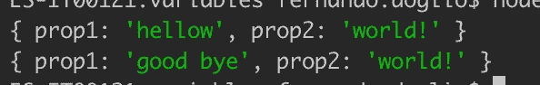

# 对 JavaScript 感到沮丧？你并不孤单——这是 4 个最令人困惑的特征

> 原文：<https://betterprogramming.pub/frustrated-with-javascript-youre-not-alone-these-are-the-4-most-confusing-features-1488ca5f0f38>

## 以及如何避免为它们疯狂

[斯蒂夫·约翰森](https://unsplash.com/@steve_j?utm_source=medium&utm_medium=referral)在 [Unsplash](https://unsplash.com?utm_source=medium&utm_medium=referral) 上拍照。

JavaScript 是一种非常灵活的语言，它允许您从非常不同的角度处理同一个问题。与此同时，其周围的庞大社区也在不断发布新的想法和工具供开发者使用。

这有助于 web 开发行业快速向前发展。这也是为什么在一个不断发展的行业中如此广泛使用的技术对新手以及更有经验的开发人员来说如此令人沮丧的原因。

抛开那些你可以通过阅读[规范](https://www.freecodecamp.org/news/js-type-coercion-explained-27ba3d9a2839/)发现的关于操作符优先或强制规则的奇怪现象(例如，执行`"2" + 2 = 22` vs. `"2" — 2 = 0`，然后抱怨它)，我想涵盖我见过的新开发人员在第一次接触该语言时遇到的四个棘手问题。

# 4 种声明函数的方法——它们都做同样的事情吗？

学习一门新语言时，首先要做的事情之一是理解如何声明将在代码中使用的最基本的构造。

然而，使用 JavaScript，当您开始摆弄函数时，您会发现所有这些选项都有相同的结果(至少乍一看是这样):

真的，JavaScript？我真的需要四种不同的方法来做同一件事吗？

当然，他们不会做同样的事情，但是如果没有人告诉你，你怎么能自己发现呢？

## 使用`function`关键字

这是定义函数的最基本的方法，它包含了上面代码片段中的前两个例子。就特性和功能而言，这两个功能完全相同。事实上，你可以用完全相同的方式引用它们。

将函数赋给一个变量(它必须是用`let`而不是`const`声明的变量)的唯一好处是，您有可能将它重新赋给别的变量。本质上，您可以重新定义函数，如果您使用普通的`function name()`语法，这是无法做到的。

## 使用函数构造函数

不是每个人都知道`Function`构造函数，它允许你用一串代码定义一个新函数。

结果呢？是的，它与前面的语法相同。然而，这个构造函数允许你在运行时用来自任何地方的代码定义一个函数。

这安全吗？见鬼不！作为`eval`函数的近亲，使用这个构造函数，你必须格外小心你要转换成函数的字符串的内容。它可能有潜在的恶意逻辑。然而，它在执行过程中也给了你很大的灵活性。

这是表演吗？不如在解析阶段解析函数的性能好。然而，如果您使用这个构造函数，您需要在运行时发生这种情况，所以让我们把它标记为“也许，取决于您使用它的次数。”

## 现在你也有了箭头函数(= >)

JavaScript 函数空间的最新成员是箭头函数。这些是一种特殊类型的函数。它们的工作方式与前面的不完全相同，您应该意识到这些差异，因为它们不仅仅是语法糖:

*   箭头函数没有自己的`this`绑定。通常，函数有办法访问执行上下文(比如全局范围、`window`对象等等)。然而，箭头函数不会。这意味着它们不能作为对象方法使用，当在其他函数中定义时(例如作为回调)，它们可以安全地使用指向父函数的`this`引用，不会有任何问题。
*   他们没有一个`arguments`对象。在普通函数中，您可以访问`arguments`对象，这允许您迭代参数。这对于创建参数数量可变的函数非常有用。箭头函数不是这样工作的。但是，您可以使用[剩余参数](https://developer.mozilla.org/en-US/docs/Web/JavaScript/Reference/Functions/rest_parameters)获得相同的结果。
*   不能和`bind`、`call`或`apply`一起使用。这也是由于缺少`this`绑定，这些方法要求您指定绑定。
*   它们不能用作发电机。是啊，发电机功能也是一个东西。但是，您不能将箭头函数用作生成器，因为`yield`关键字在它们内部不起作用。

箭头函数就像普通函数的轻量级版本，正因为如此，它们非常适合某些场景——特别是作为回调函数或快速的单行函数，它们可以被简化并有助于使代码更具可读性。

# 可供选择的方案太多了

就像函数一样，JavaScript 的生态系统有时会让人感到不知所措。你想进入前端开发领域吗？你打算选择哪个框架？它会是反应，Vue，还是有棱角的？

如果你在找一个捆绑者呢？Webpack？Rollup？Vite？

最好的包经理是什么样的？是 npm 还是纱？有什么区别？其他选择呢？

老实说，如果我今天必须开始学习 JavaScript，我不会只是不知所措。我也会非常疲惫。

关于 JavaScript 的一个笑话是，在你眨眼之间，已经发布了三个新框架。听着，我不是来说这不是真的。但是你也不需要担心他们。

即使在 JavaScript 的环境中，一个框架或工具要成为新的规范，也需要时间。当然，总有一些早期采用者会一看到新框架就跳起来，但你不必那样。你可以等一等，现在选择一个大玩家，关注一段时间，然后开始寻找。

了解替代品也能帮助你更好地使用你已经在使用的产品。我们这个行业的一切都是如此。随着时间的推移，您将开始看到框架、工具甚至语言之间的重复模式，从而更容易掌握新技术。

# 可变范围——尤其是 var——非常令人困惑

如果你正在使用`var`来声明你的变量，现在停止。别说了。`var`的工作方式太普通了，会导致混乱。

但是如果你一定要知道，`var`要么在函数的范围内工作，要么在全局范围内工作。这意味着如果你在函数中的任何地方声明了一个变量，那么这个变量在函数中的任何地方都是可访问的。如果你在外面声明它，它将是全局的。

有些人认为用`var`声明的变量总是全局的(我在多次采访中听说过这一点)。事实并非如此，这里有一个例子:

这是一段非常愚蠢的代码，但它证明了我的观点。注意如何访问在非常清晰的上下文中定义的两个变量(`gVar`是因为它是在`for`循环中声明的，`i`是因为它是该循环的索引)。理想情况下，您不应该能够访问这些变量。

## const 和 let 呢？

是啊，那些才是你想合作的。它们都帮助你定义你的变量，它们都使用块作用域。换句话说，只有在声明它们的最严格的块中，它们才是可见的和可访问的。

如果你在一个函数的`for`循环块内的`if`语句块内声明一个带有`let`的变量，你的变量将只存在于`if`内。

同样的道理也适用于`const`变量。这些变量和用`let`声明的变量之间唯一的区别是你不能重新分配这些变量。它们是常量。

然而，请注意我使用的语言:我没有说，“他们的价值观不能改变。”我说，“他们不能被重新分配。”这是一个重要的区别，因为虽然它们对于基本类型(如数字、字符串和布尔值)来说是一样的，但对于复杂类型(如对象)来说就不一样了。

如果您期望您的对象是不可变的，因为您将它们声明为*常量*，那么请三思。上面的代码片段表明您确实可以更改常量引用的*值*。这段代码的输出如下所示:

当然，您不能给`myConstant`赋值，但是您可以看到对`const`的误解可能导致的潜在问题。

# 混合异步代码的错误处理

一般来说，异步代码是一个刚接触 JavaScript 的人并不总是能理解的概念。我明白。当我开始处理 [AJAX](https://en.wikipedia.org/wiki/Ajax_(programming)) 时，我花了相当长的时间将我的 PHP 知识映射到 JavaScript(是的，我有那么老)。

捕获异步发生的错误并不总是简单的——尤其是当您考虑到至少有三种方法可以编写异步代码时:

*   使用回调函数。这是最古老的方法，也可能是最难发现的。内部进行异步调用的函数不能抛出错误作为异常，所以你的标准`try/catch`块不能工作。检查这些函数的返回值也是不可能的，因为它们不返回任何东西。你必须依靠回调和[错误优先模式](/javascript-tips-3-convert-error-first-callback-functions-to-promises-f2561d2aaefd)。这意味着确保回调函数的第一个参数总是异步调用的错误。如果参数为空，则没有错误。否则，请采取相应措施。这不是一个非常干净的模式，回调通常会导致代码非常难读——这没有帮助。
*   利用承诺。承诺要求你使用一种特定的与承诺相关的方法来捕捉错误:`catch`。同样，除非你来自一个类似的异步友好的技术栈，否则承诺需要你去适应和以不同的方式思考。然而，需要注意的是，承诺内部有一个隐式的`try/catch`块，所以在承诺体中抛出的任何异常都将触发拒绝。请看下面的例子:

*   使用`async/await`。现在，更重要的是，新的`async/await`语法将异步代码变成了看起来同步的代码，并允许使用`try/catch`块来捕获异步函数抛出的异常。多亏了这个新语法，我说的所有用回调和承诺不可能实现的事情现在都可以实现了。耶，一点也不困惑！

您可以看到`try/catch`块是如何捕获由`test`函数抛出的错误的。这种选择无疑是最容易解决的，最容易阅读的，也是新手开始使用的最佳选择。

# 结论

JavaScript 有时会令人沮丧，但这只是因为我们倾向于将它过于简化——尤其是当我们刚刚开始尝试的时候。关于这门语言有很多东西需要学习，虽然它提供了很大的灵活性，但也有很多规则需要记住。

但是不用担心。请记住，掌握一门语言需要时间，虽然你遇到的错误可能是由于不合逻辑的行为，但一切都有合理的解释。

你呢？你发现 JavaScript 最令人沮丧的是什么？