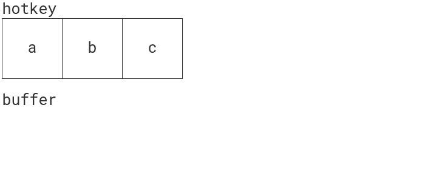

# 200 行 JavaScript 代码的全功能热键库

> 原文：<https://betterprogramming.pub/full-featured-hotkeys-library-in-200-lines-of-javascript-code-81a74e3138cc>

## 干净、可测试且无依赖性


照片由 [Sergi Kabrera](https://unsplash.com/@skabrera) 在 [Unsplash](https://unsplash.com) 上拍摄

我很乐意分享我的发现，如何用 200 行代码创建一个全功能、干净和可测试的热键库，没有依赖性。

虽然有一些类似的现有[项目](https://github.com/search?q=hotkeys+javascript)，如果你问我的话，这仍然是一个有趣的练习。

# 要求

该库应支持各种组合键:

*   像`a`、`b`、`c`这样的单键
*   带修饰键:`ctrl+c`、`ctrl+v`、`ctr+shift+v`
*   按键顺序:`h e l l o`、`ctrl+k`、`ctrl+t a`

它应该有以下选项:

*   注册和取消注册特定热键的回拨
*   创建热键上下文，以便可以单独打开/关闭侦听器组

# 履行

我使用的是 [ES6](https://www.tutorialspoint.com/es6/) 语法，所以请确保您至少熟悉块范围的变量、箭头函数、对象析构和模板字符串。

我将分别描述每一个功能，做一些重构，添加验证，然后在最后展示所有代码。

本文不包括如何在浏览器中运行 ES6 模块。如果你还不知道这一点，就从像 [Babel](https://babeljs.io/) 这样的 transpiler 开始吧。

## 注册热键

在第一阶段，我们需要创建一个为特定热键注册回调的函数。该函数获得一个热键(字符串)和一个回调函数，并存储起来以备将来重用。姑且称之为`register`:

```
const listeners = [];
const register = (hotkey, callback) => {
  listeners.push({ hotkey: normalizeHotkey(hotkey), callback });
}
```

有一个`listeners`数组:这是一个用于注册回调的包。我们稍后将处理数组，但是现在，请注意`normalizeHotkey`函数。

该函数将热键字符串转换为一个结构，该结构:

*   容易(有效)与他人进行比较，并且
*   很容易(有效)从键盘事件中创建

这样做的原因是不同的字符串可能对应同一个热键。比如`ctrl+shift+s`和`shift+ctrl+s`指的是同一个组合，可能很难和键盘事件直接匹配。

函数将字符串转换为字典数组。字典键保存一个实际的键，其值为`true`。

它是如何工作的一些例子:

*   `normalizeHotkey('a')`回报`[{ a: true }]`
*   `normalizeHotkey('ctrl+a')`回报`[{ ctrl: true, a: true }]`
*   `normalizeHotkey('meta+a shift+b')`返回
    `[{ meta: true, a: true }, { shift: true, b: true }]`

实施:

```
const arrayToObject = arr => arr.reduce(
  (obj, key) => ({ ...obj, [key]: true }),
  {},
);const normalizeHotkey = (hotkey) =>
  hotkey.split(' ').map((part) => arrayToObject(part.split('+')));
```

## 按键监听器

好了，我们注册完了。现在我们需要设置一个 keydown 监听器。

因为我们支持多个组合键，所以我们需要存储后续的 keydown 事件，以确定一系列事件是否与组合键匹配。

每次按下键时，事件描述都会添加到缓冲区数组中，并且只要 keydown 事件被触发，它就会继续增长。我们不希望在一段时间不活动后继续匹配热键，因此必须在 keydown 监听器停止触发一段时间后清除缓冲区。

这种方法称为去抖。如果你还不熟悉这个概念，我建议你看看类似于 [this](https://css-tricks.com/debouncing-throttling-explained-examples/#article-header-id-0) 的文章。

接受函数和去抖时间作为参数的`debounce`函数的最小实现。该函数返回“去抖”函数:

```
const debounce = (fn, time) => {
  let timeoutId = null; return () => {
    clearTimeout(timeoutId);
    timeoutId = setTimeout(fn, time);
  };
};
```

keydown 监听器实现:

```
let buffer = [];const clearBufferDebounced = debounce(
  () => { buffer = []; },
  debounceTime,
);const keyDownListener = (event) => {
  if (event.repeat) {
    return;
  } if (event.getModifierState(event.key)) {
    return;
  } clearBufferDebounced(); const description = {
    [getKey(event.key)]: true,
  }; allModifiers.forEach((m) => {
    if (event[`${m}Key`]) {
      description[m] = true;
    }
  }); buffer.push(description); listeners.forEach((listener) => {
    if (matchHotkey(buffer, listener.hotkey)) {
      listener.callback(event);
    }
  });
};
```

主逻辑检查每个侦听器，并在与缓冲区匹配时调用其回调。

```
listeners.forEach((listener) => {
  if (matchHotkey(buffer, listener.hotkey)) {
    listener.callback(event);
  }
});
```

但是，该事件必须满足以下条件才能到达。

如果您按住某个键一段时间，它可能会开始重复触发 keydown 事件。这种行为是不可取的，我们必须找到一种方法来忽略这种事件。

```
if (event.repeat) {
  return;
}
```

当您按下修饰键本身时，该事件也会被忽略:

```
if (event.getModifierState(event.key)) {
  return;
}
```

方法`[event.getModifierState](https://developer.mozilla.org/en-US/docs/Web/API/KeyboardEvent/getModifierState)`接受修饰键的字符串表示，如果当前键是修饰键，则返回 true。更多详情参见[文档](https://developer.mozilla.org/en-US/docs/Web/API/KeyboardEvent/getModifierState)。

为了解释我们为什么需要这个，让我们考虑一个热键序列`ctrl+c ctrl+k`。我们可以通过两种方式实现这一目标:

*   按住`control`并按下`c`然后按下`k`；或者
*   按住`control`并按下`c`，松开`control`然后再次按住并按下`k`

第一个将导致三个事件存储在缓冲区中— `ctrl ctrl+c ctrl+k`。由于`ctrl+c ctrl+k`与缓冲区匹配，所以会按预期工作。

后者导致四个事件— `ctrl ctrl+c ctrl ctrl+k`。由于在`ctrl+c`和`ctrl+k`之间有一个`ctrl`事件，所以序列不会匹配。

是的，你是对的，这是一个极限。因此，您不能只绑定到修饰键。像`shift`、`ctrl`或`alt`这样的热键不起作用。这种情况将在以后的验证中涉及。

`description`变量保持规范化的热键定义——与我们存储在`listeners`数组中的格式相同。

我决定使用`[ke](https://developer.mozilla.org/en-US/docs/Web/API/KeyboardEvent/key)y`属性，因为`[keyCode](https://developer.mozilla.org/en-US/docs/Web/API/KeyboardEvent/keyCode)`、`[charCode](https://developer.mozilla.org/en-US/docs/Web/API/KeyboardEvent/charCode)`、`[which](https://developer.mozilla.org/en-US/docs/Web/API/KeyboardEvent/which)`已经过时。

属性保存了键盘按键的打印表示，因此我们不必编写定制逻辑来找出当前按键是什么。

我们需要处理两个异常——空格键和加号。我们在传递给 register 和 unregister 函数的热键字符串中使用两者作为分隔符。

解决方法是将`' '`替换为`'space'`，将`'+'`替换为`'plus'`:

```
const getKey = (key) => {
  switch (key) {
    case '+': 
      return 'plus';
    case ' ':
      return 'space';
    default: 
      // may be an uppercased letter, in case the shift is active
      return key.toLowerCase(); 
  }
};
```

`allModifiers`数组包含一个修饰符列表，它用于填充描述图。引入它是为了避免冗余语法，如:

```
(...)
if (event.ctrlKey) {
  description.ctrl = true;
}if (event.shiftKey) {
  description.shift = true;
}
(...)
```

你可能认为我们可以直接设置所有的修饰符，比如:

```
const description = {
  (...)
  ctrl: event.ctrlKey,
  shift: event.shiftKey,
  alt: event.altKey,
  meta: event.metaKey
}
```

它看起来整洁干净，但与从`normalizeHotkey`函数返回的确切状态不匹配——后者只包括被按下的键。
当前的实现似乎有些粗糙，因为它假设事件对象中有`*Key`个属性(`ctrlKey`、`altKey`、`shiftKey`、`metaKey`):

```
allModifiers.forEach((m) => {
  if (event[`${m}Key`]) {
    description[m] = true;
  }
});
```

即使有效，我们也仅限于这四个修改器。另一个解决方案是像这样使用`event.getModifierState`:

```
allModifiers.forEach((m) => {
  if (event.getModifierState(m) {
    description[m.toLowerCase()] = true;
  }
});
```

看起来更好。然而:

*   它要求你操作常规和小写的名字
*   `ctrl`变成了`control`——如果你想保留`ctrl`，你需要将它映射到`normalizeHotkeyMethod`

我只是想让你知道一个可能的改进。

最后但同样重要的是，将`description`添加到`buffer`数组中，然后对照`listeners`进行检查。

```
buffer.push(description);
listeners.forEach((listener) => {
  if (matchHotkey(buffer, listener.hotkey)) {
    listener.callback(event);
  }
});
```

## 匹配算法

该算法检查缓冲区是否包含热键数组中的后续元素。

```
const isEqual = (a, b) => {
  const aKeys = Object.keys(a);
  if (aKeys.length !== Object.keys(b).length) {
    return false;
  } return aKeys.every(
    (k) => b.hasOwnProperty(k) && a[k] === b[k]
  );
}const matchHotkey = (buffer, hotkey) => {
  if (buffer.length < hotkey.length) {
    return false
  } const indexDiff = buffer.length - hotkey.length;
  for(let i = hotkey.length - 1; i >= 0; i--) {
    if(!isEqual(buffer[indexDiff + i], hotkey[i])) {
      return false;
    }
  }
  return true;
}
```

它得到一个`buffer`数组和`hotkey`序列。当`buffer`的元素比`hotkey`少时，返回`false`。否则，它以相反的顺序遍历`hotkey`数组，并检查`buffer`中的相应元素是否相等。

`isEqual`函数中的附加条件是避免可能的假阳性结果。如果`a[k]`存在，但值未定义，并且`b`对象不包含关键字`k`，条件`a[k] === b[k]`返回 true，因为两个值都是`undefined`——但这不应该。这就是检查`b`是否包含钥匙的原因。

```
b.hasOwnProperty(k) && a[k] === b[k]
```

比较`buffer`和`hotkey`时不会出现这种情况，因为`buffer`没有空值。考虑到它的一般用途，我将为将来保留这个条件。安全总比后悔好。

下面有一个可视化。动画展示了算法是如何工作的，从空缓冲区开始。考虑这里注册的热键是`a b c`，键盘接收的是`a b d c a b c`序列。



匹配算法—最佳

红色表示不匹配，黄色表示部分匹配，绿色表示完全匹配。

顺便说一句，有一个从头到尾迭代的选项，但是它更糟糕，因为它需要执行更多的冗余检查。参见下面的动画:


匹配算法—错误

## 注销热键

应该有一个选项来删除注册的热键。该函数接受与 register 函数相同的参数—作为字符串的热键序列和回调函数。该函数从`listeners`数组中删除匹配的元素。

```
const isArrayEqual = (a, b) => 
  a.length === b.length && a.every((v, i) => isEqual(v, b[i]));const unregister = (hotkeyString, callback) => {
  const normalized = normalizeHotkey(hotkeyString); const index = listeners.findIndex(
    (l) => l.callback === callback 
      && isArrayEqual(normalized, l.hotkey)
  ); if (index !== -1) {
    listeners.splice(index, 1);
  }
}
```

正如你所看到的，它不比较字符串，而是比较规范化的热键定义为两个不同的字符串，如`shift+ctr+c`和`ctrl+shift+c`。这些指的是同一个组合，必须视为相等。

`isArrayEqual`检查数组是否相等。换句话说:如果它们长度相同，并且每一项都相同。我们之前介绍过的`isEqual`函数被重用来比较数组项。

## 热键上下文

在这一部分中，我们将封装逻辑，这样我们就可以创建具有自己的`listeners`状态和自定义`debounceTime`值的独立上下文。

该函数将在公共 API 中对用户可用。

```
const registerListener = (listeners, hotkey, callback) => {
  listeners.push({ hotkey: normalizeHotkey(hotkey), callback });
};const unregisterListener = (listeners, hotkey, callback) => {
 ** // (...) the unregister logic**
};const createKeyDownListener = (listeners, debounceTime) => {
  let buffer = [];
  const clearBufferDebounced = debounce(
    () => { buffer = []; },
    debounceTime,
  );
  return (event) => {
 **// (...) contents of the former keyDownListener** 
  };
};export const createContext = (
  { debounceTime = 500, autoEnable = true } = {},
) => {
  const listeners = []; const register = (hotkey, callback) => {
    registerListener(listeners, hotkey, callback);
  }; const unregister = (hotkey, callback) => {
    unregisterListener(listeners, hotkey, callback);
  }; const keyDownListener = createKeyDownListener(
    listeners,
    debounceTime,
  ); const enable = () => document.addEventListener(
    'keydown',
    keyDownListener,
  ); const disable = () => document.removeEventListener(
    'keydown',
    keyDownListener,
  ); if (autoEnable) {
    enable();
  } return {
    register,
    unregister,
    enable,
    disable,
  };
};
```

register 和 unregister 逻辑被移到单独的函数中，这些函数将`listeners`数组作为参数，这样每个上下文都将重用现有的函数:

```
const register = (hotkey, callback) => {
  registerListener(listeners, hotkey, callback);
};const unregister = (hotkey, callback) => {
  unregisterListener(listeners, hotkey, callback);
};
```

类似的事情也适用于`keyDownListener`。它被提取到一个单独的工厂函数中。该函数基于对`listeners`数组和去抖时间参数的引用创建一个 keydown 监听器。

```
const keyDownListener = createKeyDownListener(
  listeners,
  debounceTime,
);
```

上下文本身返回一个带有`register`和`unregister`方法的对象，它们有自己的 listeners 数组。

此外，还有`enable`和`disable`方法分别添加和移除`keyDownListener`，因此您可以一次打开/关闭整个组。

默认情况下，在上下文创建期间调用`enable`，因为`autoEnable`参数设置为 true:

```
if (autoEnable) {
  enable();
}
```

如有必要，您可以通过为`autoEnable`参数提供自己的值来关闭它:

```
const context = createContext({ autoEnable = false });
```

您可能有一组热键组，当应用程序进入特定页面/功能/上下文(如编辑模式等)时，可以启用这些热键组。

例如，当与其他库如 [React](https://reactjs.org/) 或 [Angular](https://angularjs.org/) 集成时，这可能是有用的。您可以在组件初始化期间启用上下文，在组件销毁期间禁用上下文。

如果你用钩子使用 React 的单一功能组件，这里有一篇文章[描述了如何用钩子替换生命周期方法。](https://dev.to/trentyang/replace-lifecycle-with-hooks-in-react-3d4n)

# 确认

我们必须确保代码在收到意外的用户输入时不会中断。我不打算为它编写自己的验证库，不过，我将向您展示如何避免代码重复。

我们需要两个函数来验证。第一个验证给定条件是否为真，第二个检查给定值是否属于指定类型:

```
const validate = (value, message) => {
  if (!value) {
    throw new Error(message);
  }
};const validateType = (value, name, type) => {
  validate(
    typeof value === type,
    `The ${name} must be a ${type}; given ${typeof value}`,
  );
};
```

现在，多余的语法:

```
if (typeof value1 !== 'string') {
  throw new Error(
    `The value1 must be a string; given ${typeof value1}`
  );
}if (typeof value2 !== 'boolean') {
  throw new Error(
    `The value2 must be a boolean; given ${typeof value2}`
  );
}if (value3 > 3) {
  throw new Error('The value3 must be lower than 3');
}if (value4 < 4) {
  throw new Error('The value4 must be greater or equal to 4');
}
```

可以替换为:

```
validateType(value1, 'value1', 'string');
validateType(value2, 'value2', 'boolean');
validate(value3 > 3, 'The value3 must be lower than 3');
validate(value4 < 4, 'The value4 must be greater or equal to 4');
```

## **create context 验证**

我们需要验证函数参数中传递的`debounceTime`和`autoEnable`选项。

有一个函数可以验证`options`参数:

```
const validateContext = (options) => {
  const { debounceTime = 500, autoEnable = true } = (options || {}); validateType(debounceTime, 'debounceTime', 'number');
  validate(debounceTime > 0, 'debounceTime must be > 0');
  validateType(autoEnable, 'autoEnable', 'boolean'); return { debounceTime, autoEnable };
};export const createContext = (options) => {
  const { debounceTime, autoEnable } = validateContext(options);
  // (...)
}
```

不是直接析构函数参数，而是对`options || {}`语句的结果执行析构，所以当选项被求值为 false 时，它将对空对象进行操作。如果没有这个，当 null 作为参数传递时，函数抛出。

## **注册/注销验证**

在第一阶段，`register`和`unregister`方法应该只允许 string 类型的热键和 function 类型的回调。因为我们必须使用两次验证，所以应该有另一个只用于验证的函数:

```
const validateListenerArgs = (hotkey, callback) => {
  validateType(hotkey, 'hotkey', 'string');
  validateType(callback, 'callback', 'function');
};
```

是锻炼函数构图的绝佳案例。问题是，我们不需要在目标函数中使用`validateListenerArgs`。我们将创建一个包装目标函数的函数，并进行验证。检查一下`createListenersFn`:

```
const createListenersFn = (listeners, fn) => (hotkey, callback) => {
  validateListenerArgs(hotkey, callback);
  fn(listeners, hotkey, callback);
};const registerListener = (listeners, hotkey, callback) => {
  // (...)
};const unregisterListener = (listeners, hotkey, callback) => {
  // (...)
};export const createContext = ({ debounceTime = 500 } = {}) => {
  // (...)
  return {
    register: createListenersFn(listeners, registerListener),
    unregister: createListenersFn(listeners, unregisterListener), }
}
```

它获取必须包装的侦听器数组和目标函数。
它返回另一个验证`hotkey`和`callback`参数的函数，然后调用目标函数并传递 listeners 数组。

第二阶段是在规范化过程中验证热键结构。
有效的热键字符串是由空格分隔的组合序列。组合:

*   恰好包含一个非修饰键
*   包含零个或多个修饰键
*   由唯一的值组成。

`normalizeHotkey`功能更新如下:

```
const indexedModifiers = arrayToObject(allModifiers);const isHotkeyValid = (hotkey) => Object.keys(hotkey)
  .filter((k) => !indexedModifiers[k])
  .length === 1;const normalizeHotkey = (hotkey) => hotkey.split(/ +/g).map(
  (part) => {
    const arr = part.split('+').filter(Boolean);
    const result = arrayToObject(arr); validate(
      Object.keys(result).length >= arr.length,
      `Hotkey combination has duplicates "${hotkey}"`,
    );
    validate(
      isHotkeyValid(result),
      `Invalid hotkey combination: "${hotkey}"`,
    ); return result;
  },
);
```

`isHotkeyValid`函数过滤掉所有的修饰键，当只有一个非修饰键时返回 true。我使用`indexedModifiers`来避免在每次迭代中调用`allModifier.includes`。

此外，它还检查热键组合是否由唯一的值组成。仍然可以多次设置同一个修改器，就像`shift+shift+b`。

请注意新的`.filter(Boolean)`语句，它可以防止创建空键。例如，`normalizeHotkey('')`产生`[{ '': true }]`。

## 所有的代码

完整的实现可从以下要点获得:

# 使用

您可以从这个简单的例子开始:

# 测试

由于代码被分成许多更小的函数，测试起来相当容易。

在这一节中，我将展示我们已经创建的几个函数的一些测试示例( [jasmine](https://jasmine.github.io/) )。我假设你已经知道了基本知识。

`normalizeHotkey`:

```
// (...)
it('should throw when the hotkey is empty ', () => {
  expect(() => normalizeHotkey('')).toThrow();
});it('should return an array', () => {
  expect(normalizeHotkey('a')).toEqual(jasmine.any(Array));
});it('should convert single key to a one element array', () => {
  expect(normalizeHotkey('a')).toEqual([{ a: true }]);
});it('should convert multiple keys to a dictionary', () => {
  expect(normalizeHotkey('ctrl+alt+a')).toEqual(
    [{ ctrl: true, a: true, alt: true }],
  );
});it(
  'should convert multiple combinations to multiple dictionaries',
  () => {
    expect(normalizeHotkey('shift+c ctrl+alt+[')).toEqual(
      [
        {
          shift: true,
          c: true,
        },
        {
          ctrl: true,
          alt: true,
          '[': true,
        },
      ],
    );
  },
);
// (...)
```

`matchHotkey`:

```
// (...)
it(
  'should return false when some key is checked with empty buffer', 
  () => {
    expect(matchHotkey([], [{ a: true }])).toBe(false);
  }
);it('should return true when buffer matches the hotkey', () => {
  expect(matchHotkey([{ a: true }], [{ a: true }])).toBe(true);
});it('should return true when buffer matches the hotkey #2', () => {
  expect(
    matchHotkey(
      [
        { a: true, alt: true },
        { b: true, ctrl: true, shift: true },
      ],
      [
        { a: true, alt: true },
        { b: true, ctrl: true, shift: true },
      ],
    )
  ).toBe(true);
});it(
  'should return false when there is some other key in-between',
  () => {
    expect(
      matchHotkey(
        [
          { a: true, alt: true },
          { v: true },
          { b: true, ctrl: true, shift: true },
        ],
        [
          { a: true, alt: true },
          { b: true, ctrl: true, shift: true },
        ],
    )
  ).toBe(false);
});
// (...)
```

热键上下文:

```
// (...)
it('should call callback when event matches the hotkey', () => {
  const spy = jasmine.createSpy('callback');
  context.register('ctrl+a shift+b', spy);
  document.dispatchEvent(
    new KeyboardEvent('keydown', { key: 'a', ctrlKey: true })
  );

  const event2 = new KeyboardEvent(
    'keydown',
    { key: 'b', shiftKey: true }
  );

  document.dispatchEvent(event2);

  expect(spy).toHaveBeenCalledWith(event2);
});it(
  'should call the callback when there is delay between the events',
  () => {
    jasmine.clock().install(); const spy = jasmine.createSpy('callback');
    context.register('a b c', spy); document.dispatchEvent(
      new KeyboardEvent('keydown', { key: 'a' }),
    );
    jasmine.clock().tick(200); document.dispatchEvent(
      new KeyboardEvent('keydown', { key: 'b' }),
    );
    jasmine.clock().tick(200); document.dispatchEvent(
      new KeyboardEvent('keydown', { key: 'c' })
    ); expect(spy).toHaveBeenCalled();
    jasmine.clock().uninstall();
  }
);it(
  'do nothing when keys where pressed after the time window',
  () => {
    jasmine.clock().install();
    const spy = jasmine.createSpy('callback');
    context.register('a b c', spy);
    document.dispatchEvent(
      new KeyboardEvent('keydown', { key: 'a' })
    );

    document.dispatchEvent(
      new KeyboardEvent('keydown', { key: 'b' })
    );
    jasmine.clock().tick(550); document.dispatchEvent(
      new KeyboardEvent('keydown', { key: 'c' })
    );

    expect(spy).not.toHaveBeenCalled();
    jasmine.clock().uninstall();
  }
);
// (...)
```

# 关于 event.code 属性的补充说明

`event.code`物业可视为`event.key`的替代物。我不想使用它，因为它返回的键码名称太笼统了。这里有一个例子显示了不同之处:

```
{key: "a", code: "KeyA"}, 
{key: "A", code: "KeyA"},           // shift is on
{key: "1", code: "Digit1"}, 
{key: "!", code: "Digit1"},         // shift is on
{key: "Shift", code: "ShiftRight"}, // wow, it holds the location
{key: "End", code: "Numpad1"},      // numlock is on
{key: "1", code: "Numpad1"},        // numlock is on
{key: "Tab", code: "Tab"},
{key: " ", code: "Space"}
```

您可以查看 MDN 文档中的`[key](https://developer.mozilla.org/en-US/docs/Web/API/KeyboardEvent/key#Result)`和`[code](https://developer.mozilla.org/en-US/docs/Web/API/KeyboardEvent/code)`来玩“试用”演示，或者只需将以下代码片段粘贴到浏览器的控制台中:

```
document.addEventListener(
  'keydown', 
  (e) => { 
    e.preventDefault();
    console.log({ key: e.key, code: e.code })
  }
);
```

我们可以使用`[event.location](https://developer.mozilla.org/en-US/docs/Web/API/KeyboardEvent/location)`属性获得键盘位置(数字小键盘、左键盘、右键盘、标准键盘),所以我们不仅限于使用`key`属性。

# 更多注释

*   用`event.code`代替`event.key`不安全——正如[文档](https://developer.mozilla.org/en-US/docs/Web/API/KeyboardEvent)中强调的:

> 这忽略了用户的键盘布局，因此如果用户在 QWERTY 键盘布局中的“Y”位置(靠近 home 行上方的行的中间)按下按键，这将总是返回“KeyY”，即使用户具有 QWERTZ 键盘(这意味着用户期望“Z”，所有其他属性将指示“Z”)或 Dvorak 键盘布局(其中用户期望“F”)。

*   似乎微软的 Edge 浏览器不支持`event.code`属性(截至 2019 年 8 月:参见[can use](https://caniuse.com/#search=event.code)和 [MDN docs](https://developer.mozilla.org/en-US/docs/Web/API/KeyboardEvent) )。