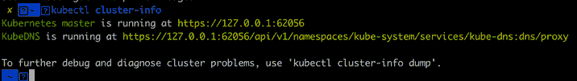
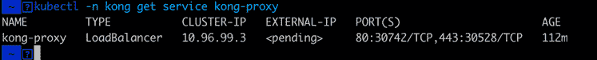
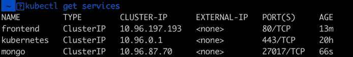
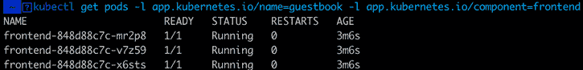
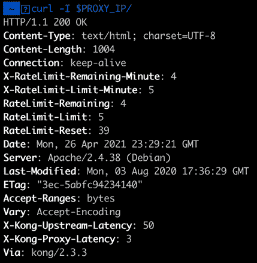
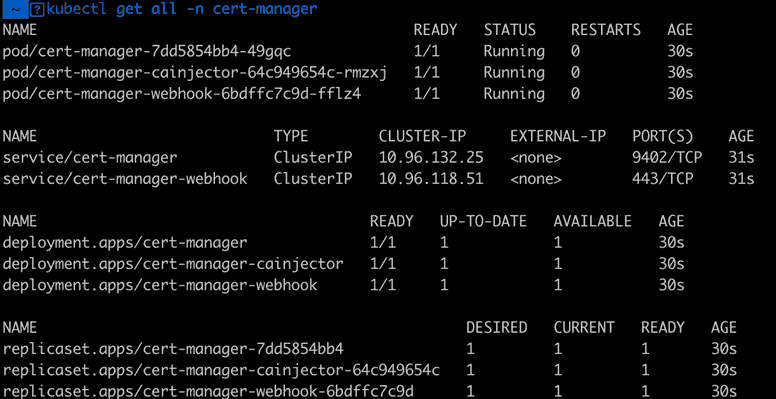

# 带 Kong 入口控制器的全栈 Kubernetes

> 原文：<https://betterprogramming.pub/full-stack-kubernetes-with-kong-ingress-controller-5e9cfca75a65>

## 使用 Kong 进行 web 应用程序部署


由[伊娃·拉乔维奇](https://unsplash.com/@eklektikum?utm_source=medium&utm_medium=referral)在 [Unsplash](https://unsplash.com?utm_source=medium&utm_medium=referral) 拍摄的照片。

谈到容器编排，Kubernetes 已经成为游戏的名字。它允许团队部署和扩展应用程序，以满足需求的变化，同时提供出色的开发人员体验。

在 Kubernetes 中处理现代、动态和可扩展工作负载的关键是一个能够提供 API 管理、服务网格和入口控制器的网络堆栈。 [Kong Ingress Controller](https://github.com/Kong/kubernetes-ingress-controller) 允许用户管理路由规则，这些规则控制外部用户从同一平台访问 Kubernetes 集群中的服务。

本文将介绍如何使用 Kubernetes 将 [Kong](https://konghq.com/?utm_source=guest&utm_medium=devspotlight&utm_campaign=community) 用于全栈应用程序部署。“全栈”是指孔可以处理:

*   容器
*   集装箱联网
*   Pod 网络
*   服务网络
*   主机联网
*   [负载均衡](https://dzone.com/articles/load-balancing-minecraft-servers-with-kong-gateway)
*   [速率限制](https://konghq.com/blog/kong-gateway-rate-limiting/?utm_source=guest&utm_medium=devspotlight&utm_campaign=community)
*   HTTPS 重定向

让我们从创建集群开始。

# 安装 Kubernetes

使用[种类](https://kind.sigs.k8s.io/)，您可以使用 Docker 运行本地 Kubernetes 集群。它是为测试 Kubernetes 而设计的，但非常适合本地 K8 开发，就像我们在这个例子中要做的那样。安装 kind 的方法有很多种，具体取决于你的操作系统。如果你有一台 Mac，你可以用 Homebrew 快速安装它:

```
brew install kind
```

如果您使用的是 Windows 机器，并且安装了 Chocolatey，这个命令也很简单:

```
choco install kind
```

如果您安装了 Go 和 Docker，您可以运行以下命令来安装 kind:

```
GO111MODULE="on" go get sigs.k8s.io/kind@v0.10.0
```

有关更多安装选项，请参见[种类快速入门](https://kind.sigs.k8s.io/docs/user/quick-start/)。

安装 kind 后，您需要创建一个集群:

```
kind create cluster
```

在创建集群之后，您可以使用 kubectl 与它进行交互。要列出集群，请运行:

```
kind get clusters
```

它应该返回默认的集群上下文名称`kind`。

现在运行以下命令将 kubectl 指向`kind`集群:

```
kind export kubeconfig
```

如果正确设置了 kind，运行以下命令将为您提供有关集群的详细信息:

```
kubectl cluster-info
```



# 安装 Kong 入口控制器

现在我们已经有了一个正在运行的集群，我们可以通过直接使用以下命令应用清单来快速安装 Kong:

```
kubectl create -f https://bit.ly/k4k8s
```

现在运行以下命令来获取关于`kong-proxy`的详细信息:

```
kubectl -n kong get service kong-proxy
```

您会注意到外部 IP 仍处于待定状态。Kind 只公开 Kubernetes API 端点，因此在集群外部无法访问该服务。



因为我们使用 kind，我们将不得不运行一个端口转发来做到这一点。此命令不会被后台化，因此您必须打开另一个控制台窗口来运行其他命令。

```
kubectl -n kong port-forward --address localhost,0.0.0.0 svc/kong-proxy 8080:80
```

接下来，我们需要用我们想要访问 Kong 的 IP 地址设置一个环境变量。这将是`localhost`,因为我们正在使用端口转发。

```
export PROXY_IP=localhost:8080
```

你可以现在卷曲 IP 或在浏览器中访问。您应该看到:

```
{"message":"no Route matched with those values"}
```

# 部署示例应用程序

现在让我们部署一些将返回一些结果的东西。Kubernetes 在一个 [GitHub repo](https://github.com/kubernetes/examples) 中提供了多个示例应用。我们将使用以下命令部署[留言簿应用程序](https://kubernetes.io/docs/tutorials/stateless-application/guestbook/):

```
kubectl apply -f https://k8s.io/examples/application/guestbook/mongo-deployment.yaml
kubectl apply -f https://k8s.io/examples/application/guestbook/mongo-service.yaml
kubectl apply -f https://k8s.io/examples/application/guestbook/frontend-deployment.yaml
kubectl apply -f https://k8s.io/examples/application/guestbook/frontend-service.yaml
```

现在，如果我们运行`kubectl get services`，我们将看到两个新服务:



我们还可以查询 pod 以确保它们的状态是“正在运行”:

```
kubectl get pods -l app.kubernetes.io/name=guestbook -l app.kubernetes.io/component=frontend
```



为了测试它，您可以使用以下命令快速向前运行另一个端口:

```
kubectl port-forward svc/frontend 8000:80
```

你会发现留言簿运行在 [http://localhost:8000/](http://localhost:8000/) 。我们现在将设置 Kong 入口控制器。

# 将应用程序公开到互联网

现在我们可以使用 Kong 入口控制器，所以我们需要设置一个资源来服务流量。我们可以使用以下命令为我们的应用程序创建一个代理:

```
echo '
apiVersion: networking.k8s.io/v1
kind: Ingress
metadata:
  name: guestbook
  annotations:
    konghq.com/strip-path: "true"
    kubernetes.io/ingress.class: kong
spec:
  rules:
  - http:
   paths:
   - path: /
        pathType: Prefix
        backend:
          service:
            name: frontend
            port:
              number: 80
' | kubectl apply -f -
```

现在你会在 [http://localhost:8080/](http://localhost:8080/) 看到留言簿 app。

# 在香港使用插件作为服务

有了 Kong Ingress，我们可以在服务级别上执行插件。这样，无论请求来自哪个入口路径，只要请求被发送到特定的服务，Kong 就会执行一个插件。如果我们想给我们的应用程序添加速率限制，我们可以用下面的命令给我们的 Kubernetes 安装添加速率限制插件:

```
echo "
apiVersion: configuration.konghq.com/v1
kind: KongPlugin
metadata:
  name: rl-by-ip
config:
  minute: 5
  limit_by: ip
  policy: local
plugin: rate-limiting
" | kubectl apply -f -
kongplugin.configuration.konghq.com/rl-by-ip created
```

一旦你安装了插件，你可以用下面的命令在我们的留言簿上应用`konghq.com/plugins`注释:

```
kubectl patch svc frontend \
  -p '{"metadata":{"annotations":{"konghq.com/plugins": "rl-by-ip\n"}}}'
```

如果你卷起留言簿应用程序，你会看到已经设置了速率限制。



如果您计划在此示例中频繁测试留言簿，您可能希望将限制设置得更高。否则，您将会遇到一个 Kong 错误，表示已经超过了速率限制。

# 配置 HTTPS 重定向

到目前为止，该应用程序运行在 HTTP 上，我们希望它能在 HTTPS 上运行。如果我们想让 Kong 重定向所有的 HTTP 请求，我们可以将它的注释更新为 HTTPS，并使用以下命令发出 301 redirect 来修补入口条目:

```
kubectl patch ingress guestbook -p '{"metadata":{"annotations":{"konghq.com/protocols":"https","konghq.com/https-redirect-status-code":"301"}}}'
```

要使用 kind 进行测试，请使用以下命令设置另一个端口转发:

```
kubectl -n kong port-forward --address localhost,0.0.0.0 svc/kong-proxy 8443:443
```

你现在可以在 [https://localhost:8443](https://localhost:8443/) 访问留言簿的“安全”版本。它没有证书，所以您会在浏览器中遇到警告。让我们看看如何添加证书。

# 添加证书管理器

您可以使用以下命令安装证书管理器:

```
kubectl apply -f https://github.com/jetstack/cert-manager/releases/download/v1.3.1/cert-manager.yaml
```

图像下拉后，您可以使用以下命令验证它是否正在运行:

```
kubectl get all -n cert-manager
```

您应该会看到类似这样的内容:



因为我们在本地运行 Kubernetes，并带有一个端口转发，所以 Kong 代理的 IP 地址是 127.0.0.1。如果没有使用端口转发，可以运行以下命令来查找 IP 地址:

```
kubectl get -o jsonpath="{.status.loadBalancer.ingress[0].ip}" service -n kong kong-proxy
```

但是因为我们使用的是端口转发，所以这个命令不会返回任何内容。如果这是在生产中，那么您将设置 DNS 记录来将您的域解析为您刚刚检索到的 IP 地址。完成后，您可以通过运行以下命令向 Let's Encrypt 请求证书，并确保更改电子邮件:

```
echo "apiVersion: cert-manager.io/v1alpha2
kind: ClusterIssuer
metadata:
  name: letsencrypt-prod
  namespace: cert-manager
spec:
  acme:
    email: user@example.com #change this email
    privateKeySecretRef:
      name: letsencrypt-prod
    server: https://acme-v02.api.letsencrypt.org/directory
    solvers:
    - http01:
      ingress:
        class: kong" | kubectl apply -f -
```

接下来，您必须使用以下命令更新您的入口资源以提供证书，将域更改为您自己的域:

```
echo '
apiVersion: networking.k8s.io/v1
kind: Ingress
metadata:
  name: guestbook-example-com
  annotations:
    kubernetes.io/tls-acme: "true"
    cert-manager.io/cluster-issuer: letsencrypt-prod
    kubernetes.io/ingress.class: kong
spec:
  tls:
  - secretName: guestbook-example-com
    hosts:
    - demo.example.com #change this domain/subdomain
  rules:
  - host: demo.example.com #change this domain/subdomain
    http:
      paths:
      - path: /
        pathType: Prefix
        backend:
          service:
            name: guestbook
            port:
              number: 80
' | kubectl apply -f -
```

一旦更新，证书管理器将开始提供证书，很快就会准备好。

# 您的 K8s 堆栈中缺少一个工具？

孔可能是你在 Kubernetes 堆栈中丢失的工具。 [Kong Ingress Controller](https://konghq.com/solutions/kubernetes-ingress/?utm_source=guest&utm_medium=devspotlight&utm_campaign=community) 可以在您所有的 Kubernetes 集群上实现身份验证、HTTPS 重定向、安全证书等等。使用 Kong，您可以从一个平台控制您的容器、网络、负载平衡、速率限制等等。它确实是全栈入口部署的选择。