# 用 React、GraphQL、MongoDB 和 Apollo 构建一个全栈应用

> 原文：<https://betterprogramming.pub/full-stack-react-graphql-mongodb-apollo-building-an-app-cb1eb647c73a>

## 自上而下创建全新应用的指南

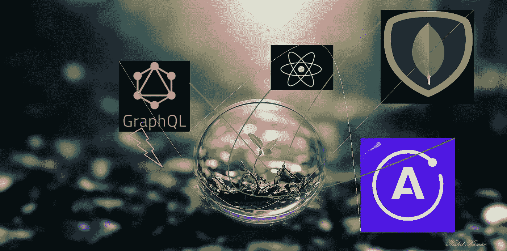

照片由 Nikhil Kumar 拍摄。

我决定利用我的隔离时间写一篇关于用 React、GraphQL、Apollo 和 MongoDB 构建一个小而中肯的应用程序的文章。当我学习这个堆栈时，我必须从多个来源阅读，所以我将尝试将所有信息放在一个地方。

在我们开始之前，我建议检查一下 GraphQL 和 Apollo 的用途，因为我们将直接使用它们。

**但是为什么 GraphQL 会超过 REST 呢？好了，我们来谈谈 GraphQL，因为这是我们故事中的主角。
所以，脸书在 2012 年创建的 GraphQL，在 2015 年开源。它是你的 API 的一种查询语言。与其他的不同，GraphQL 使用单个端点负责接受查询。GraphQL 有一些优点和缺点。**

一个主要的好处是，客户端能够从服务器上查询他们想要的确切数据，而不像 REST 那样，我们获得全部数据并对其进行提炼，只显示我们需要的数据。我们将在下面的例子中看到，我们只查询我们需要的东西。即只获取名而不获取姓。

另一个好处是能够在一个请求中查询其他来源。例如，我们可以查询 *contacts* 模式来获取联系人的姓名& phone，以及 *country* 模式来获取该联系人的国家名称。你可能会相信，这很神奇。

**等等！GraphQL 还有哪些更好的地方？** GraphQL 为它的所有查询返回 200 个 HTTP 状态代码，不管那个查询是否成功。尽管如果查询不成功，JSON 将会有错误键和错误消息。有时执行错误处理变得很困难。
另一个缺点是 GraphQL 的本地缓存不同于 REST，在 REST 中，ewe 有多个端点，它们可以利用本地 HTTP 缓存来避免预取资源。但是我们有阿波罗储藏室来帮忙。
您一定会喜欢 GraphQL 的性能和优势，让我们一起探索吧。

我们将在这个应用程序中建立两个部分:服务器和客户端。

在服务器端，我们将构建一个具有三个查询和一个 GraphQL 变体的 GraphQL API，它将与我们托管的 MongoDB 数据库进行交互以实现持久性。在客户端，我们将利用 React 和 Apollo 与我们的 GraphQL API 和 GraphQL 查询进行交互。

开始开发吧。

我已经创建了一个文件夹(`full-stack-react-apollo-graphql-mongodb`)，并在其中创建了另外两个文件夹(`client`和`server`)。让我们先构建我们的后端。

进入`server`的目录并运行:

```
npm init -y
```

随着这个命令，你的`package.json`准备好了。再创建一个名为`app.js` *的文件。*

假设您已经在您的系统中设置了 Node.js 和 MongoDB(我们使用托管的 MongoDB mlab，但是您可以使用您的本地 MongoDB ),让我们下载一些基本的包:

```
npm install express express-graphql mongoose
```

不要忘记在您的开发依赖项中安装 nodemon，并在您的`package.json`中添加一个启动脚本:

```
“scripts”: { 
 “test”: “echo \”Error: no test specified\” && exit 1",
 “start”: “nodemon app.js”
}
```

现在让我们来设置您的 MongoDB。我利用了 mlab。以下是我的配置快照:

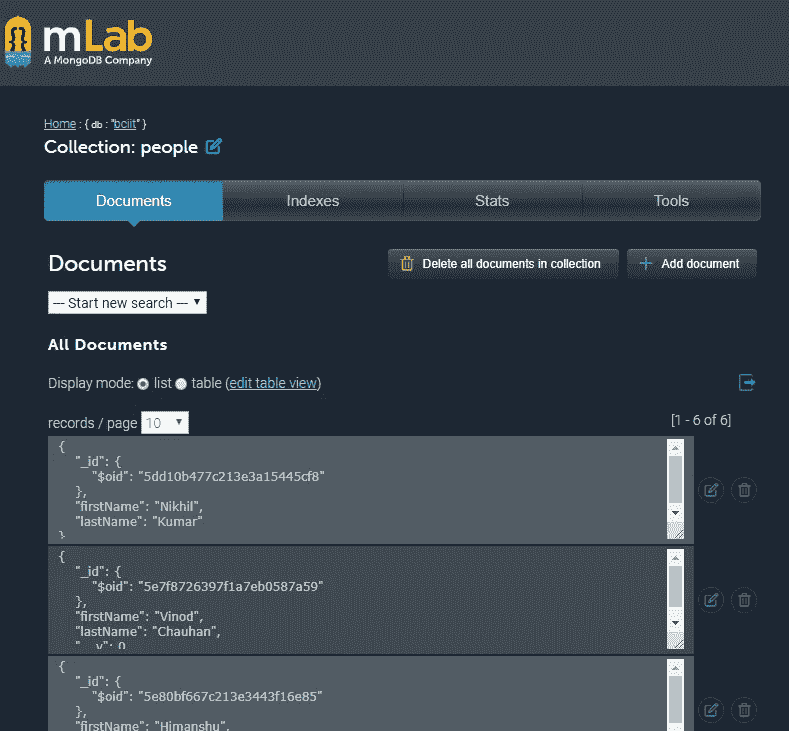

打开`app.js`(我用的是 VS 代码)，写下面的代码:

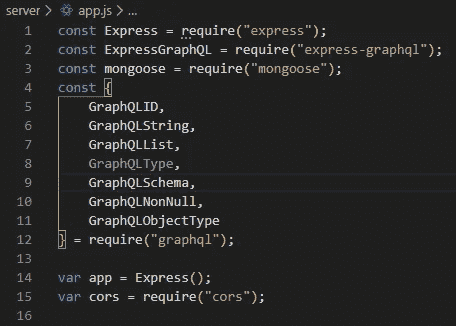

必需的进口。

对于连接 MongoDB 的连接字符串，我使用的是 mlab。

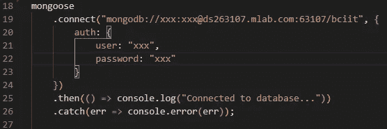

用你在 mlab 的信用代替 xxx。

创造`Model`。`app.js`中的这个模型应该符合你的 MongoDB 结构。在我的例子中，我创建了一个简单的`PersonModel`，它有两个字段:`firstName`和`lastName`。

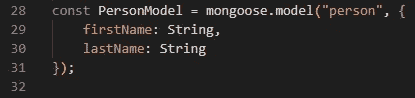

人物模型

对于这些模型对象字段，我们必须以 GraphQL 的方式定义它们的属性类型。还记得我们之前做的导入(`GraphQLObjectType`)吗？我们正在利用这一点。

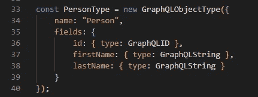

人员类型

到目前为止，没有什么是关键的——只有一些映射。现在我们将创建 GraphQL 查询和变异，它们只不过是 GraphQL 模式。

让我们解码一个 GraphQL 查询:

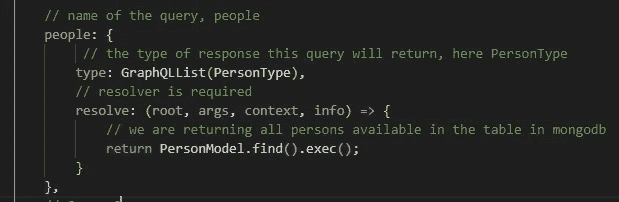

同样，我还创建了两个查询。`people`查询将从 MongoDB 表中返回所有人，另一个将按 id 返回人，第三个将按名字返回人:

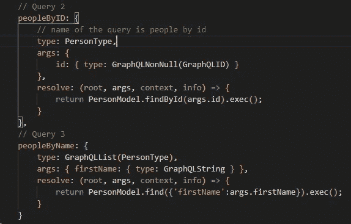

现在是时候创建一个变异来在数据库中添加一个新记录了:

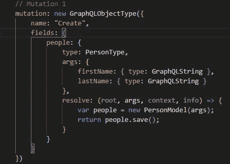

突变。

最后，端口细节(我们的应用程序将在那里运行):

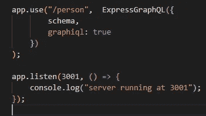

转到终端并运行:

```
npm start
```

打开 Chrome，输入“[http://localhost:3001/person](http://localhost:3001/person)”

您将会看到 GraphQL 接口可以处理您的查询和变化。

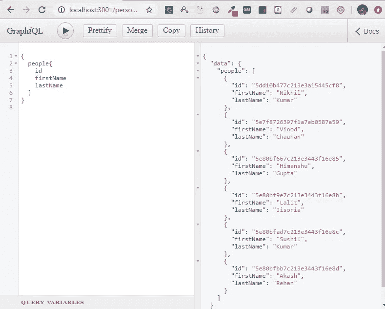

左侧面板显示查询，右侧面板显示输出。使用播放按钮播放您写的内容。

酷，让我们试试我们写的另一个查询:`findById`。


findByID。

你可以自己试试第三个。

现在让我们来测试我们的突变:

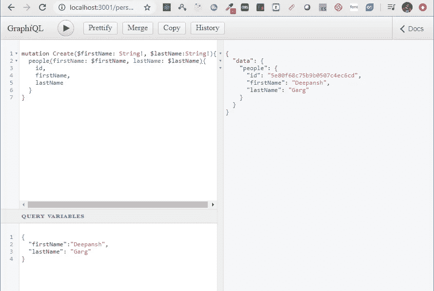

变化

请注意查询变量。

恭喜你！我们已经建立了我们的后端 GraphQL API。

对于客户端开发，创建新的 React 应用程序:

```
npx create-react-app client
```

是时候安装所需的软件包了:

```
npm install apollo-boost react-apollo
```

打开您的客户端 React 项目并在您的`index.js`文件中编写以下代码:

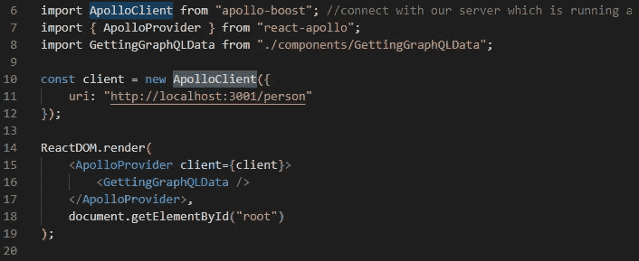

index.js。

如果您已经熟悉 React 中的上下文 API，您就会理解这个`ApolloProvider`在做什么——就像 Redux store 一样包装您的组件。所以所有的子组件现在都可以访问数据了。在我的例子中，子组件很奇怪，但是你可以使用你的`App.js/ts`组件。

所以基本上，我没有把我的父组件放在中间(`App.js`)。我是直接掉子组件，`GettingGraphQLData`。在上面的代码中，你可以看到我已经创建了一个对象`ApolloClient`，它只有一个 Uri。后来，`ApolloProvider`正在包装 app 组件。

让我们看看组件里面有什么。你可能不相信这有多简单:

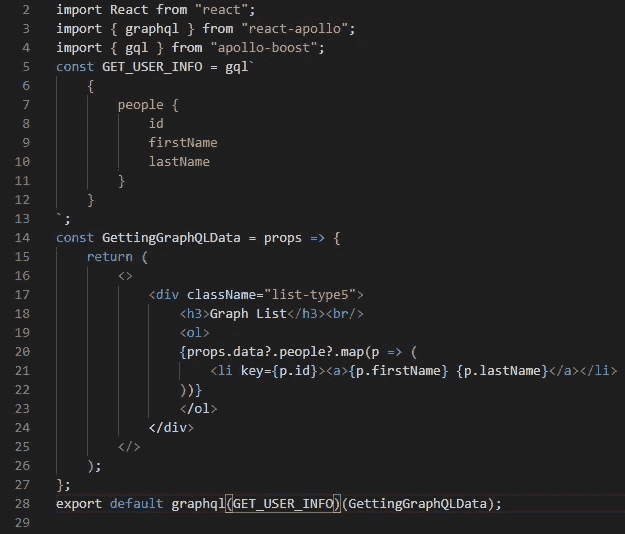

这是这个应用程序的输出:

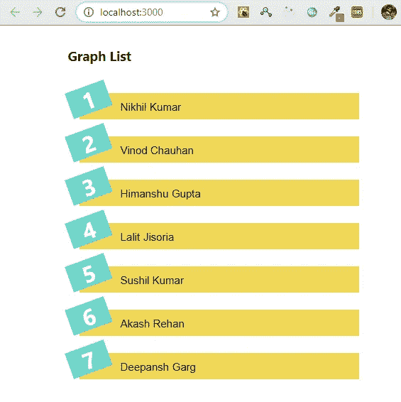

应用程序的输出。

# 结论

概括来说，我们有:

*   开发了一个能够查询数据库并在数据库中添加记录的 GraphQL API。
*   利用了 express-graphql 软件包。
*   利用 Apollo 客户端连接我们的前端应用程序，与我们的后端 API 进行交互。
*   还有更多。

您应该:

*   使用我们创建的其他查询在 UI 上显示数据。
*   尝试建立一个页面，利用突变来添加新记录。

下面是 [GitHub](https://github.com/nikhilknoldus/fullstack-react-apollo-graphql-mongodb) 回购供参考。

如果这是你的第一次，我会说 3-4 天后再看一遍文章，然后练习。

呆在里面，注意安全。