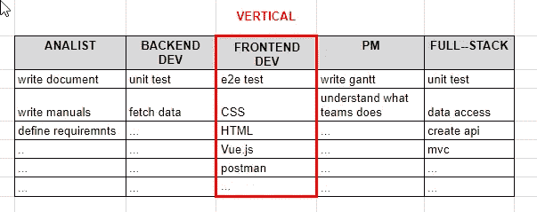
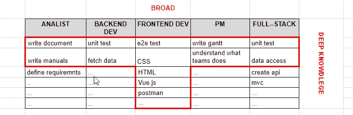
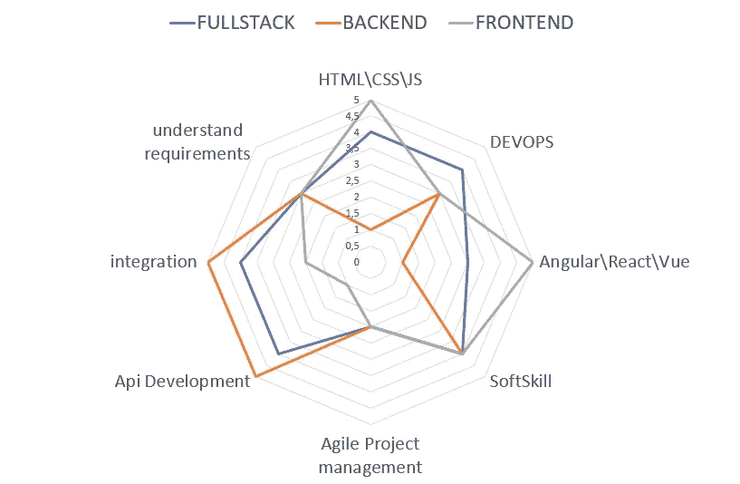

# 开发者的所有形状

> 原文：<https://betterprogramming.pub/fullstack-backend-frontend-tshape-differences-eb8a56543017>

## 了解为什么前端、后端和 t 型开发人员是无意义的术语

照片由 [Unsplash](https://unsplash.com?utm_source=medium&utm_medium=referral) 上的 [Delila Ziebart](https://unsplash.com/@delilaziebart?utm_source=medium&utm_medium=referral) 拍摄

我不喜欢对开发者的歧视。太多次了，我听说过“前端”和“后端”，因为它们是不同的工作。当我们必须完成一个项目时，我们都是一个团队，所以我们为什么要相互竞争呢？

在本文中，我试图通过解释这些标签的含义来满足这一愿景的倡导者——但只是为了揭穿他们的神话。最后，回到我反对标签和歧视的问题上来，我试图给出一个关于开发人员的专业化和职业生涯的更全面的观点。

如果你刚刚找到自己的路，正在寻找一个更好的愿景，或者如果你是一个已经找到自己位置的开发者，但现在正在质疑自己的确定性…那么，你应该把这篇文章读完！

# 全栈 Web 开发人员

全栈式 web 开发人员是指既能开发软件的**客户端**又能开发服务器端的人。

全栈开发者用图表解释。作者用❤️制作的图像。

换句话说，他们知道如何创建**前端** (HTML，CSS)和**后端**(数据库，API，或者 MVC 开发)。他们知道如何实现浏览器端脚本(使用 JavaScript、jQuery、Angular 或 Vue)和服务器端技术，如 PHP、ASP、Python 或 Node。一个完整的全栈开发人员也在数据库端使用 MSSQL、Oracle 或 MongoDB。

全栈开发人员的主要优势是他们已经掌握了流程。他们是自主的并且能够**独立完成一个项目**。这通常更有效，因为它减少了团队沟通所用的时间。

此外，对于雇用多学科团队超出预算的小项目或小公司来说，这是唯一可持续的方法。

## 成为一名全栈开发者很棒，但闪光的不一定都是金子…

随着技术的发展，越来越难跟上所有需要的主题。如今，技术发展迅速，成为全栈开发者变得越来越复杂。

最后，试着戴一会儿你老板的帽子。一个项目只雇佣一个人可能很吸引人，但在很多情况下这是有风险的。

# 垂直显影剂

由于工作的复杂性增加了，许多开发人员更喜欢专业化。学习和维护太多的技术是困难的。平庸地做很多事情，在市场上是没有回报的。相反，为什么不仅仅做一件事，而是做得更好呢？

作者是❤️from

这就是为什么这么多开发者开始走上垂直化的道路。

## 垂直开发人员是将所有赌注都押在单一技术上的专家

你可以有前端或后端开发者，也可以有 Magento 或 WordPress 开发者。换句话说，你可以专攻一项技术或一种产品。

## 优势

*   只关注一件事
*   更容易保持最新状态
*   专业开发人员的报酬更高

## 不足之处

*   您的职业生涯与您选择的技术/产品的成功息息相关。所以，如果失败了，你会发现自己在做重复的工作，每天做同样的事情。
*   过度专业化的风险。你可能在单个任务上表现最好，但却无法完成整个工作(例如，最好的 CSS 专家却无法完成一个完整的网站)。

# T 形显影剂

为了更好地理解什么是 t 形开发人员，请将其与垂直开发人员进行比较。

垂直开发者的能力范围。作者是❤️from

在这个矩阵中，横向是能力，纵向是知识水平。正如您在上面的矩阵中看到的，一个垂直开发人员只拥有一列。相反，T 形开发人员看起来更像这样:

t 型开发人员具有混合的能力范围。作者是❤️from

一个 T 型的开发人员在一个单一的技术上有很深的知识，但是可以使用一组广泛的技术，当然，生产力和结果的水平是不同的。

T 形显影剂比垂直显影剂更圆。需要时，他们可以在任何地方提供帮助。这使得你的团队更加灵活，它可以吸收一些工作高峰，而不需要向团队外寻求帮助。

无论如何，T 型开发人员的最佳品质是他们更好地理解他们在做什么，因为他们的知识有助于给他们一个完整的愿景。此外，学习大量的技术通常会让他们思想开放，并找到解决方案，即使问题与他们的技术无关。

## 成为一名 T 型开发人员并不容易

即使你满足于技术知识贫乏，你也需要努力达到最低要求的水平。此外，你需要深入你的专业领域，所以你需要时间学习广泛的技术，并专攻其中一项。

## 优势

*   所有技术的一点点，但只集中在一小部分。
*   可以与其他开发人员交流，了解他们的需求。

## 不足之处

*   在市场上很难找到。
*   在你的舒适区之外积累知识并不容易。

# 结论

我不想在开发者的分类上花更多的时间——事实上，我觉得这相当愚蠢！

在我看来，我对开发人员的职业有一个更全面的看法。在这个愿景中，关键词是“战略”。你必须停止将你的技能与一些预定义的模式相比较，开始用你的头脑思考。

开发者能力的整体视野。作者用❤️做的。

你必须牢记的最重要的标准是专业化。

## 做的东西越多，越难深入，越难专业化

第一句话告诉我们，解决方案是专注于单一技术。这是真的，并带来许多好处，但也有一些限制。例如:

*   你可能无法独自交付一个完整的项目。例如，如果你只是一个后端开发人员，你可能无法完成一个门户网站
*   如果你的职业与某项技术紧密相连，那么如果它过时了呢？
*   如果你的专业化如此专注，以至于你不再能理解发生在你身边的事情，你如何在不成为一个简单的工人的情况下为整个过程带来价值？

## 你越专业化，你的灵活性就越小

这是一个平衡专业化和广泛知识的问题，以提高效率和灵活性。没错，但是还有第三个因素:文化。

在团队中工作，你需要正确的情绪。这不仅有技术工具的支持，还有通常更难学习的软技能。你需要学会倾听的态度，懂得如何解释事情，变得自信和积极主动。

我写了一篇关于开发人员所需的软技能的文章——这是改进这个主题的一个很好的起点。

用几句话来总结这篇文章，我建议忘记先入为主的观念，开始思考你想成为的专业人士。

要成为一个全新的人，一个更好的自己，你需要关注哪里需要改进，需要学习什么技术。这需要一个策略。

如果你想成为一名 CTO，你将需要建立一个广泛的知识；如果你想成为某项技术的超级专家，你需要有巨大的专注度。

你的未来掌握在你手中。一旦你意识到所有解决方案的风险和好处，你就可以抛开枯燥的定义，找到自己的方式。