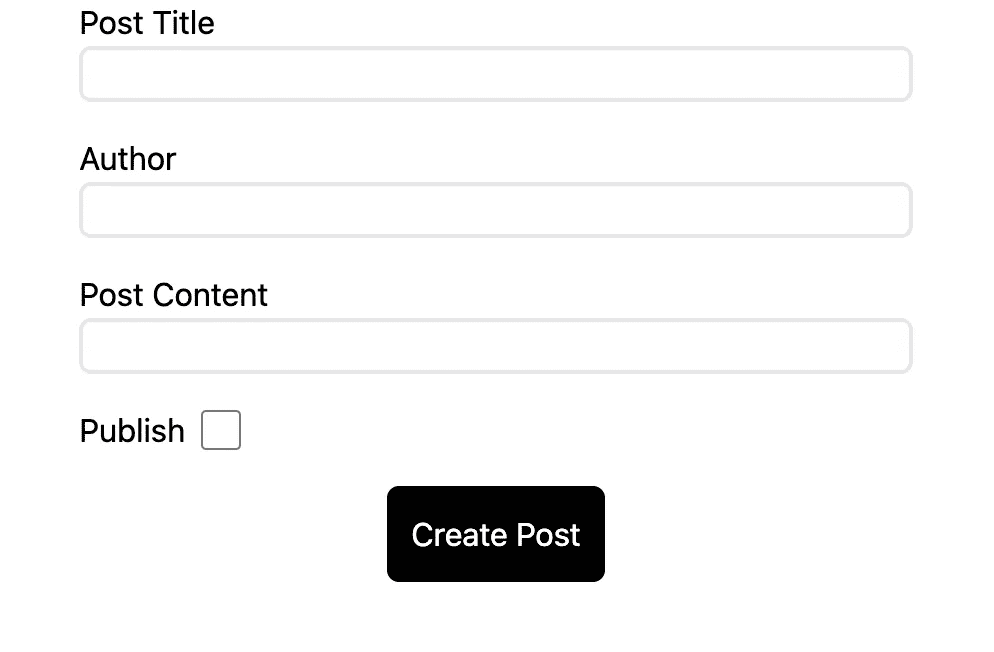
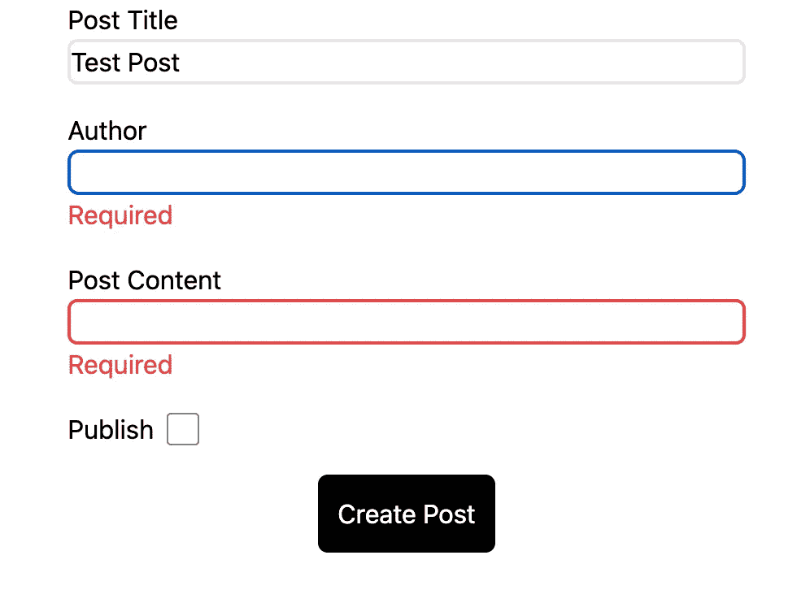
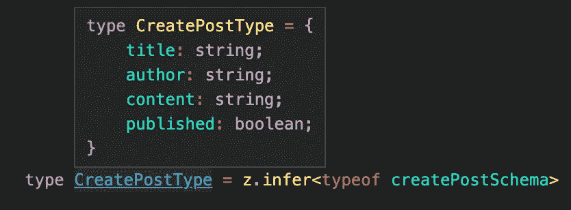

# React、Remix、Remix 验证表单和 Zod:类型安全表单的终极堆栈

> 原文：<https://betterprogramming.pub/fullstack-type-safe-forms-with-react-remix-remix-validated-form-and-zod-6a0e30d2dd2f>

## 使用 Remix、Remix Validated Form、Zod 和 Zod 表单数据，开发人员可以验证表单，轻松处理和显示错误状态，防止错误提交，改善开发人员体验，并提高开发速度。


顶部带有 react 徽标的整叠表单

Remix 利用了 web 平台 API，这使得创建向动作提交数据的表单变得容易，动作将表单数据传递给服务器。

Zod 提供了一种在客户端和服务器端验证数据的方法，确保了处理用户数据时的准确性和安全性。Zod 表单数据通过提供一种方便的方法将数据从表单映射到 Zod 类型，进一步简化了这个过程。

你可以在文章的底部找到源代码和所有包的链接。这种组合的另一个令人惊叹的地方是，即使禁用 JavaScript，许多功能仍然可以工作，因为验证是在客户端和服务器端处理的。

Zod 是一个 JavaScript 库，它提供了一种强大的、类型安全的方法来定义、验证和操作数据。它使用类似于 TypeScript 的声明性语法，使得用 React 创建类型安全的表单变得容易。

该库提供了一种在客户端和服务器端验证数据的方法，确保了处理用户数据时的准确性和安全性。Zod 表单数据通过提供一种方便的方法将数据从表单映射到 Zod 类型，进一步简化了这个过程。

创建类型安全窗体的第一步是创建一个提交按钮组件。该提交按钮可以使用`remix-validated-form`中的`useIsSubmittingHook`自动处理。这个钩子将允许表单自动处理表单提交的状态，以防止重复提交。

```
import { useIsSubmitting } from "remix-validated-form";

export const SubmitButton = ({
    submitText = "Submit",
  }: {
    submitText?: string;
  }) => {
    const isSubmitting = useIsSubmitting();

    return (
      <button
        type="submit"
        disabled={isSubmitting}
        className="bg-black text-white p-3 rounded-md"
      >
        {isSubmitting ? "Submitting..." : submitText}
      </button>
    );
  };
```

接下来，我们需要创建一个输入字段，它使用来自`remix-validated-form`的`useField`钩子。这个钩子有一些有用的特性，比如错误反馈。我们可以使用它来显示哪些字段给我们带来了错误的视觉反馈，并向用户显示该错误。此外，当输入被点击时，我们使用`clearError`函数来清除错误。

```
import classNames from "classnames";
import { useField } from "remix-validated-form";

export const Input = ({
  name,
  title,
  id,
}: {
  name: string;
  title?: string;
  id?: string;
}) => {
  const field = useField(name);
  return (
    <div className={"flex flex-col w-full"}>
      <label htmlFor={name}>{title}</label>
      <input
        {...field.getInputProps()}
        className={classNames("border-2 rounded-md", {
          "border-2 !border-red-500": field.error,
        })}
        name={name}
        id={id ? id : name}
        onClick={() => {
          field.clearError();
        }}
        onChange={() => {
          if (field.error) field.clearError();
        }}
      />
      <div className="text-red-500">{field.error}</div>
    </div>
  );
};
```

在下面的代码中，我们创建了一个模式，我们基于该模式创建了一个验证器，然后我们创建了一个客户端表单，我们在其中传递该模式，然后表单将根据该验证器在客户端和服务器上验证表单。

然后，一旦我们将表单数据提交给服务器，它将根据验证器验证该数据，然后我们可以提取经过验证的数据。

```
import { ActionArgs } from "@remix-run/node";
import { withZod } from "@remix-validated-form/with-zod";
import { ValidatedForm, validationError } from "remix-validated-form";
import { z } from "zod";
import { zfd } from "zod-form-data";
import { Input } from "~/components/input";
import { SubmitButton } from "~/components/submit-button";

const createPostSchema = zfd.formData({
  //  zfd(zod form data) is a helper that helps to parse the form data to an object
  // using the zod schema, if there are multiple values with the same name an array will be returned.
  // it can handle URLSearchParams, FormData, and plain objects
  title: zfd.text(z.string().min(1).max(100)),
  author: zfd.text(z.string().min(1).max(50)),
  content: zfd.text(z.string().min(1).max(1000)),
  published: zfd.checkbox(),
});
export type CreatePostType = z.infer<typeof createPostSchema>;
// remix-validated-form with-zod is a helper that helps to validate form data
// remix-validated-form supported custom validation and other libraries like yup
const createPostValidator = withZod(createPostSchema);
export async function action({ request }: ActionArgs) {
  const formData = await request.formData();
  const validation = await createPostValidator.validate(formData);
  // if there are any errors, return validationError, this is also handled
  // by remix-validated-form
  if (validation.error) {
    return validationError(validation.error);
  }
  // if we make it here, we know that there are no errors so we can
  // get the data from the validation object
  const { title, content, author, published } = validation.data;
  console.log("Creating Post...", { title, content, author, published });
}
export default function () {
  return (
    <div className="flex items-center justify-center">
      {/* Validated form will validate form on both the server side and client side 
      form will not submit to server if there are any errors.*/}
      <ValidatedForm
        validator={createPostValidator}
        className="flex flex-col space-y-4 w-10/12 lg:w-1/2"
        method="post"
      >
        <Input name="title" title="Post Title" />
        <Input name="author" title="Author" />
        <Input name="content" title="Post Content" />
        <div className="flex flex-row items-center">
          <label htmlFor="publish">Publish</label>
          <input
            type="checkbox"
            id="publish"
            name="publish"
            className="ml-2 h-5 w-5"
          />
        </div>
        <div className="w-full flex justify-center items-center">
          <SubmitButton submitText="Create Post" />
        </div>
      </ValidatedForm>
    </div>
  );
}
```

下面是我们的表单的样子:



提交前的表格

在下面的截图中，我已经提交了没有填写一些字段的表格。你会注意到 author 字段有焦点样式，关于`remix-validated-form`的好处是它会自动聚焦在第一个出错的字段上。当你点击一个字段或开始输入时，你会发现错误被清除了。



表单提交后

# 分解它

让我们从上面的文件中分解每一部分，我们可以按照事情发生的顺序把它分解成 3 部分:

*   表单/zod 验证程序
*   将提交给服务器的表单
*   然后是处理表单数据的服务器端操作

`zod-form-data`库为 Zod 提供了专门解析`FormData`或`URLSearchParams`的验证助手，这在使用`remix`和`remix-validated-form`时特别有用。它允许用户按照自己的意愿编写类型，从而简化了验证表单数据的过程。

```
const createPostSchema = zfd.formData({
  title: zfd.text(z.string().min(1).max(100)),
  author: zfd.text(z.string().min(1).max(50)),
  content: zfd.text(z.string().min(1).max(1000)),
  published: zfd.checkbox(),
});

const createPostValidator = withZod(createPostSchema);
```

我们需要做的就是使用`remix-validated-form`库中的`ValidatedForm`。从功能上来说，它非常类似于 Remix `Form`组件，只是增加了验证器，当然，在引擎盖下有神奇的事情发生，我鼓励你阅读他们的文档。

我们还使用了几个包含错误处理的`Input`组件，以及一个复选框和一个`SubmitButton`组件。当用户填写表单时，首先在提交时，表单将在客户端进行验证，如果失败，我们将在输入中看到错误状态，但是，如果成功，表单数据将被传递到服务器，服务器将使用相同的验证模式验证表单数据。

当然，在客户端和服务器上进行验证是有用的，因为有人试图恶意地向服务器提交虚假的表单数据，而您没有在服务器上进行适当的验证，那么您可能会遇到一些问题，您会在数据库中获得您不想要的数据。

使用 Remix 最好的一点是，它使用服务器端和 Remix Validated 表单进行客户端和服务器端验证，即使您禁用了 JavaScript，我们仍然会在提交时看到字段错误，因为操作会返回错误并使用操作数据重新混合页面！当然，当启用 JavaScript 时，Remix 不需要重新加载整个页面来获得相同的结果。

```
export default function () {
  return (
    <div className="flex items-center justify-center
      <ValidatedForm
        validator={createPostValidator}
        className="flex flex-col space-y-4 w-10/12 lg:w-1/2"
        method="post"
      >
        <Input name="title" title="Post Title" />

        <Input name="author" title="Author" />

        <Input name="content" title="Post Content" />

        <div className="flex flex-row items-center">
          <label htmlFor="publish">Publish</label>
          <input
            type="checkbox"
            id="publish"
            name="publish"
            className="ml-2 h-5 w-5"
          />
        </div>

        <div className="w-full flex justify-center items-center">
          <SubmitButton submitText="Create Post" />
        </div>
      </ValidatedForm>
    </div>
  );
}
```

当提交表单时，动作在服务器端运行，这里我们从请求中获取表单数据。我们将表单数据传递给验证器，验证器将根据我们定义的每个字段的验证来检查每个字段。如果有一个错误，那么我们用 validationError 来响应，这将在客户端处理。如果我们通过了错误步骤，我们可以确定我们有有效的数据。在这里，我只是析构数据，以证明我们确实拥有没有类型错误的有效数据，并在控制台记录这些数据。一般来说，从这里开始，您会想要将该数据插入到您的数据库或您可能有的任何用例中。

```
export async function action({ request }: ActionArgs) {
  const formData = await request.formData();

  const validation = await createPostValidator.validate(formData);

  if (validation.error) {
    return validationError(validation.error);
  }

  const { title, content, author, published } = validation.data;

  console.log("Creating Post...", { title, content, author, published });
}
```

下面我们使用 Zod 的`infer`函数，这是一个非常有用的工具，例如，如果你想创建一个函数，将数据插入到数据库中，你可以从表单模式中推断出函数的输入类型。下面是一个`CreatePostType`的例子

```
const createPostSchema = zfd.formData({
  title: zfd.text(z.string().min(1).max(100)),
  author: zfd.text(z.string().min(1).max(50)),
  content: zfd.text(z.string().min(1).max(1000)),
  published: zfd.checkbox(),
});
```

结果类型:



z .推断魔法！

获得正确的表单并提供积极的用户体验总是一个挑战，我已经使用 Zod 和这些库几个月了，我还没有找到比这些库更简单的类型、验证和健壮的解决方案。我也确信我只是刚刚接触到你可以用这些库做什么的皮毛。

对我使用的软件包大喊大叫，请检查它们并阅读它们的文档:

*   [佐德](https://www.npmjs.com/package/zod https://zod.dev/)
*   [混音验证表](https://www.remix-validated-form.io/)

## **源代码**

[](https://github.com/brandon-schabel/remix-typesafe-forms) [## GitHub-Brandon-schabel/remix-typesafe-forms

### 这是一个演示项目，演示了完整的端到端类型安全与混合形式。混合验证表单，zod…

github.com](https://github.com/brandon-schabel/remix-typesafe-forms)