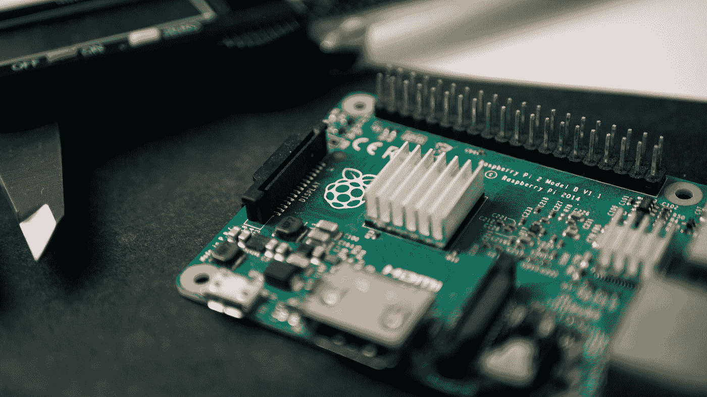

# 你今天可以建立的有趣的附带项目

> 原文：<https://betterprogramming.pub/fun-side-projects-that-you-can-build-today-553158597363>

## 从构建 3D 东西到比特币追踪器等等

克里斯多夫·高尔在 [Unsplash](https://unsplash.com?utm_source=medium&utm_medium=referral) 上拍摄的照片。

作为一名开发人员，从事副业项目可以极大地扩展你的技能，并为你迎接更复杂的挑战做好准备。这可能是最快的提高方法，因为你可以选择你想从事的项目——与你的日常工作相反。

要成为更好的开发人员，没有捷径可走。花时间在键盘后面是必须的。那么，为什么不在做一个有趣的副业的时候做呢？

然而，大多数开发人员都在纠结他们应该构建什么。他们倾向于过度思考，这导致了零。我会帮你省去想出下一个伟大的杀手级应用的麻烦。从小而简单开始。

这就是为什么我在这篇文章中列出了七个既有挑战性又有趣的项目。

# 项目 1:个人知识库

我可以向任何开发人员推荐的一个很好的辅助项目是个人知识库。如果你是一个相对缺乏经验的开发人员，这个项目特别好。这个副业的伟大之处在于它的特点和难度会有所不同。

首先，您可以实现在 markdown 中存储笔记的功能。如果您想让它稍微复杂一点，您可以添加一个特性，允许您添加教程和博客帖子的链接。如果这对您来说太容易了，您甚至可以尝试创建一个基本的文本摘要 API。

您可能还希望能够将 pdf 存储在您的知识库中，因为它们是有价值的信息来源。如果你真的想更进一步，你可以实现一个像 Elasticsearch 或者 Algolia 这样的搜索引擎来索引 pdf。您可以索引标题和作者，并实现搜索功能。或者，您可以添加标签，以便搜索变得更容易。

同样，这个附带项目的可能性是无穷的，这使得它适合每个开发人员。最显而易见的方法可能是让它成为一个 web 应用程序。

您将学到的内容:

*   Web 开发基础，比如 HTML5 和 CSS。
*   与数据库交互。
*   存储 pdf 等文件。
*   与搜索引擎交互并实现在索引数据中搜索的方法。

# **项目 2:制作 3D 的东西**

图片由 [Babylon.js](https://www.babylonjs-playground.com/#AXRELP) 提供。

有什么比摆弄 3D 更酷的呢？如果你从来没有用 3D 编程过，我可以强烈推荐它，因为它非常有趣。最棒的是，你不必从头开始。

看看 D3 或者巴比伦，都是 WebGL 项目。就我个人而言，正如有人向我建议的那样，我对巴比伦进行了一些调整。巴比伦有一个游乐场，你可以在那里摆弄 API，边玩边学。你不需要做任何事情来让它运行，因为 IDE 是在线的，就像 CodePen 一样。

您将学到的内容:

*   你会对 3D 的工作原理有所了解。
*   了解向量、相机和场景。
*   许多你可以制作的很酷的东西。

# **项目 3:树莓 Pi 比特币追踪器**

照片由[哈里森·布罗德本特](https://unsplash.com/@hbtography?utm_source=medium&utm_medium=referral)在 [Unsplash](https://unsplash.com?utm_source=medium&utm_medium=referral) 上拍摄。

树莓皮可以用来做很多有趣的事情。你可以用它做的一件事是建立一个比特币追踪器。我真的很喜欢在兼职项目中使用 Raspberry Pi，因为它将软件和硬件结合在一起。

这个项目的目标是获得当前的比特币价格，这可以通过 API 来完成，并在 LED 矩阵显示器上显示出来。除了树莓派，你还需要一些东西来完成这个项目。您还需要一个 LED 矩阵显示器、一些 LED 和一个电源适配器。

你可以通过改变价格的颜色来更进一步。例如，如果价格上涨，你可以把它变成绿色；如果价格下跌，你可以把它变成红色。

您将学到的内容:

*   树莓派的基本用法。
*   与 API 交互。
*   软件和硬件之间的相互作用。

# **项目 4: Pong**

构建游戏 *Pong* 是从基础角度感受游戏如何开发的好方法。如果你没有任何开发游戏的经验，这是一个非常简单的游戏。您将了解像实体移动和碰撞检测这样的概念。最棒的是，你可以让它既是单人游戏又是多人游戏。

如果你想做一个应用程序，你可以在这个项目中使用 Swift。如果你想用 HTML5 来实现这一点，你可以使用像 React 或 Vue 这样的 JavaScript 框架。

您将学到的内容:

*   在画布上画画。
*   实体的移动和碰撞检测。
*   按键的检测。
*   你可以通过实现一台计算机来进行游戏。

# **项目 5: WebSockets**

我自己的聊天框在两个浏览器标签中活动。

如今作为开发者，实时沟通越来越重要。它的使用和需求都在增长。有一些这方面的经验只会让你受益。

有几十个完全依赖于 WebSocket 通信的辅助项目可供您使用。我自己做了一个聊天框来了解更多关于套接字的知识。

构建一个聊天框是开始使用 WebSockets 的最佳方式。在选择技术组合时，您有很多不同的选择。Node.js 可能是一种方法。

你将学到什么:从这个项目中最大的收获是你将学会套接字是如何工作的。

# **项目 6:解决迷宫**

解决迷宫是学习构建算法的好方法。目标是建立一个迷宫，并让一个机器人通过迷宫从起点位置导航到终点位置。

迷宫中的位置要么是开放的，要么被障碍物挡住。你可以通过生成随机迷宫来增加这个项目的难度。另一个很酷的功能是基于图像生成一个迷宫。例如，这可以是一个简单的位图，有白色或黑色像素，其中黑色像素代表墙壁。

由[研究之门](https://www.researchgate.net/figure/Sample-maze-used-in-computer-simulations_fig6_315969093)拍摄的照片。

您将学到的内容:

*   学习和实施迷宫解决策略。
*   与 API 交互。
*   你可以通过实现多种算法来解决一个迷宫。

# **项目 7:** 波斯顿住房数据集

在 [Unsplash](https://unsplash.com?utm_source=medium&utm_medium=referral) 上由 [Tierra Mallorca](https://unsplash.com/@tierramallorca?utm_source=medium&utm_medium=referral) 拍摄。

波士顿住房数据集是开始机器学习的一个很好的方式。这是模式识别文献中常用的数据集。该数据集来自波士顿的房地产行业，创建于 1993 年。

这是一个回归问题。这是一个相当小的数据集，有 506 行和 14 列。这对初学者来说很棒，因为你可以尝试任何技术，而不必担心电脑崩溃。

这个项目的目标？预测自有住房的中值。

你将学到什么:你将掌握机器学习。

# 是时候把手弄脏了！

既然我们已经看了这个有趣的兼职项目列表，是时候做一些真正的工作了。从选择一个项目开始，并坚持下去。跳到键盘后面，不要忘记在构建和学习新事物的时候享受乐趣。

在这个过程中，你可能会遇到一些问题。我很乐意帮助你，给你对你的项目的反馈，所以不要犹豫问！我真的很期待看到一些结果。

> *“如果你不开心，那就是你做错了。”——*[*格劳乔·马克斯*](https://www.goodreads.com/quotes/136001-if-you-re-not-having-fun-you-re-doing-something-wrong)

编码快乐！