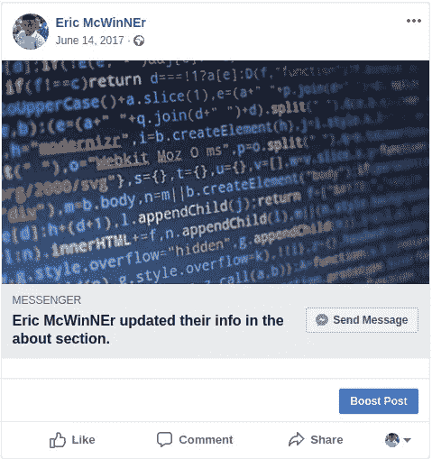
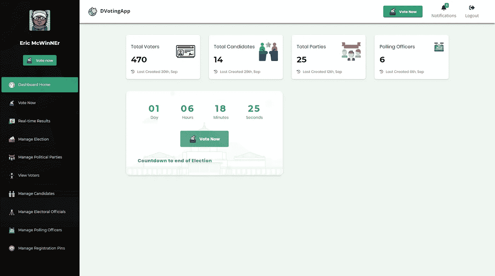
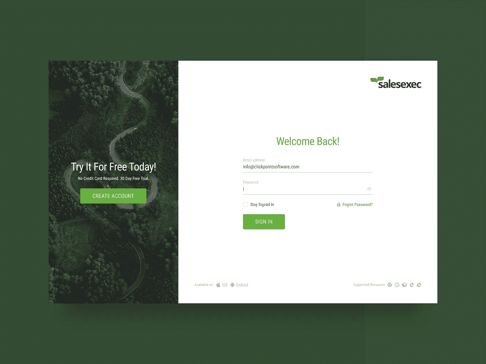
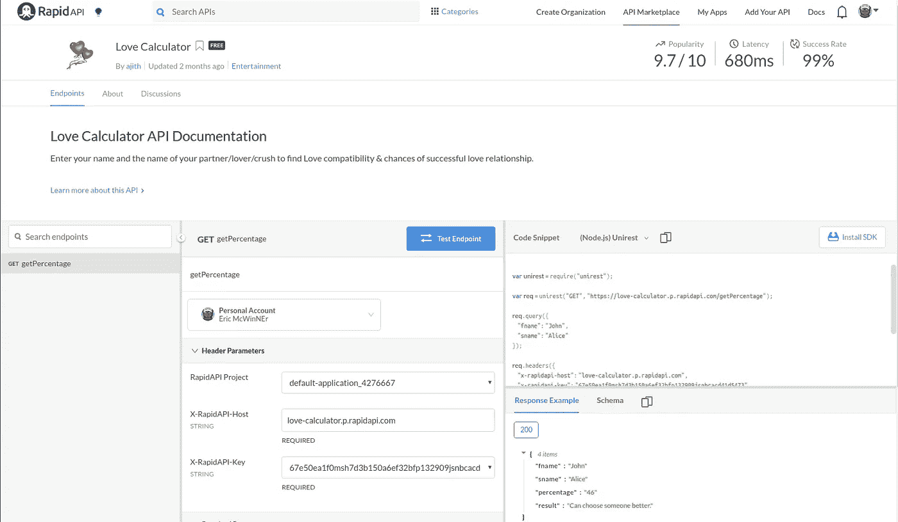
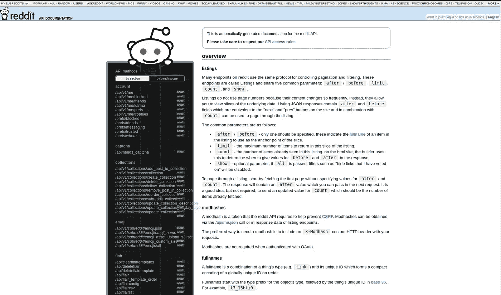
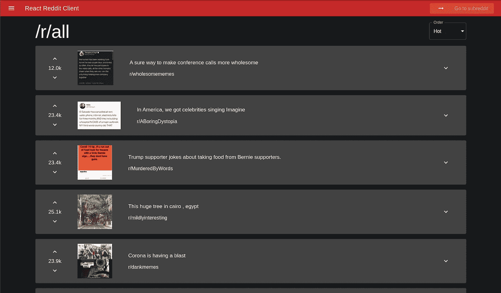
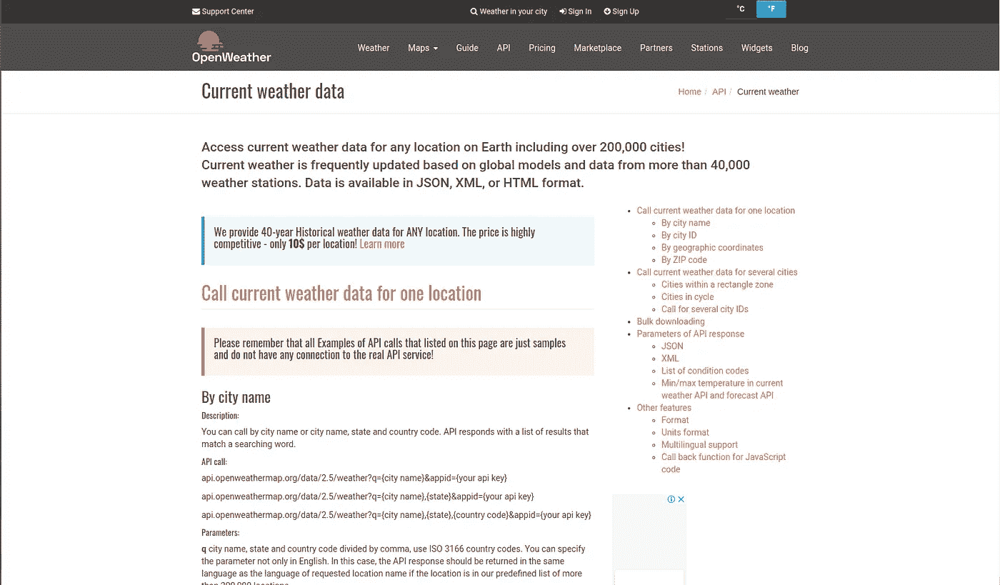
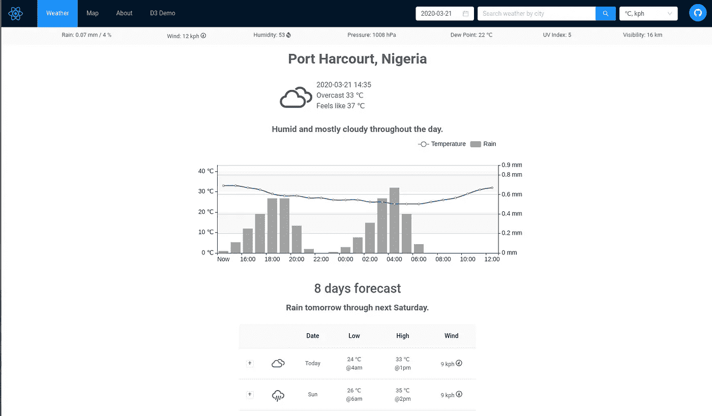

# 你可以构建有趣的东西来学习你的下一个框架

> 原文：<https://betterprogramming.pub/fun-things-you-could-build-while-learning-your-next-framework-97ecbd97a42d>

## 我也厌倦了建立待办事项清单

所以你想掌握一个新的 JavaScript 框架？也许，你会选择 React 或 Angular 或 Vue。酷毙了。所以你开始了教程，你建立了一个循序渐进的待办事项列表，然后你记住了代码，建立了 290 亿个待办事项列表。现在，你觉得你可以征服世界，但不确定从哪里开始。

我为你准备了一样东西。在本文中，我将概述一些你可以构建的很酷的东西，以帮助巩固你对首选框架的了解。

# **克隆随机 UI**

学习的最好方法之一是通过复制、克隆或偷窃。世界级艺术家毕加索说过一句名言:“好的艺术家临摹，伟大的艺术家偷窃。”

嗯，底线是:找到一个看起来很酷的 UI，并尝试使用您喜欢的框架和最佳实践从头开始重新创建它。例如，如果您正在使用 React，请尝试将元素划分为可重用的组件。如果你缺少可以复制的用户界面，我可以提供一些来做。

从小处着手是关键。您可以从在您想要的 JS 框架中克隆脸书的明信片开始。

我用 React 为一个[远程投票应用](https://github.com/ericmcwinner/dvotingfrontend)开发的用户界面。所有图标都可以在[平板图标](https://flaticon.com)上找到。

从[dribble](https://dribbble.com/shots/5189936-SalesExec-Login-Page)获取登录用户界面

记住，你不能使用 UI 中的图片——你总是可以使用来自 [Unsplash](https://unsplash.com) 、 [Pexels](https://pexels.com) 或 [Freepik](https://freepik.com) 的占位符图像。你可以在 [Dribbble](https://dribbble.com) 上找到许多其他干净的用户界面。所以继续克隆，再创造，再复制，你很快就会变得很棒。随着时间的推移，小水滴充满了海洋。

# **2。构建 API 客户端**

在您构建了 290 亿个用户界面并理解了您的框架如何处理用户界面之后，是时候掌握它如何处理逻辑、操纵数据和处理用户交互了。

您可以通过构建一个成熟的应用程序来掌握这一点，但是如果您不是全栈开发人员，并且不喜欢后端，那么您可以使用许多免费的 API 来提供要管理的应用程序数据。我将在这里列出其中一些，以及您可以用它们来构建什么:

## **2.1 爱情计算器**

为什么不做一些有趣又酷的东西来炫耀呢——比如爱情计算器？使用这个 [API](https://rapidapi.com/ajith/api/love-calculator) ，你可以很容易地得到输入的两个名字的百分比，来计算他们爱的百分比。我将让您发挥自己的想象力，创建一个简单漂亮的用户界面来实现这个 API。

## **2.2 Reddit API 客户端**

[Reddit API](https://www.reddit.com/dev/api/) 非常酷，允许你构建由 Reddit 支持的应用程序。例如，您可以创建一个应用程序来呈现特定子编辑中的所有帖子。Orel Kanditan 做了一个用 React 构建的 Reddit 客户端的很酷的例子。

## **2.3 天气预报应用**

另一个很酷的应用程序是天气预报客户端。

JSON 中有很多提供免费天气预报的 API。您可以尝试创建一个不错的应用程序，使用该 API 显示特定城市的天气预报，允许用户搜索一个城市并查看天气预报。你可以为每种天气提供图标——比如雨天、晴天等等。你可以使用的一个很酷的 API 是这个[一个](https://openweathermap.org/api)

下面是一些由劳伦斯·何开发的天气预报应用程序的灵感。

完整的应用程序可以在[这里](https://reactjs-weather.web.app/)找到

# **结论**

因此，我可以继续列举可以用来构建应用程序的 API，但是您会遇到麻烦。如果你能发展其中的一个，你就不再是一个学习者了。你可以在这里找到一些其他有用的 API。只要继续克隆、编码和构建你的方式，你就会变得很棒。感谢阅读。

另外，你还可以开发一个使用设备功能的应用程序，比如节拍器、虚拟键盘(钢琴)、基于网络的录音机、闹钟或井字游戏。可能性是巨大的。继续努力，让自己变得了不起！