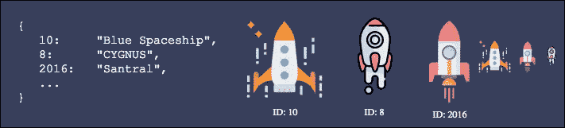

# 数据结构的乐趣:随机传送问题

> 原文：<https://betterprogramming.pub/fun-with-data-structures-random-teleport-problem-5499c3a7387d>

## 用众所周知的数据结构解决现实世界的问题


[谢尔顿·库珀拿旗子开玩笑](https://www.youtube.com/watch?v=LeyofQK6tRw)

这是新系列的第一部分:数据结构的乐趣。

在本文中，我们将使用一种众所周知的数据结构——字典(或[哈希表](https://en.wikipedia.org/wiki/Hash_table))来解决一个现实世界中的问题。

## 工作

我们有一个多人太空生存游戏。有玩家，宇宙飞船，星系，行星…还有很多。


[图像来源](https://wallhere.com/en/wallpaper/138811)

一天，我们决定引入一项新功能:

游戏每秒钟都会从游戏中的所有飞船中随机选择一艘飞船，将其传送到另一个星系。只是为了好玩。

为了简单起见，假设每艘飞船都有一个唯一的整数`id`和`name`。它们存储在字典中；`id`为键，`name`为值。



一本宇宙飞船词典样本

游戏里有几百万艘飞船。玩家不断地创造、破坏和更新宇宙飞船。

我们的任务是实现一个算法，从这个字典中随机挑选一艘飞船(*从字典中随机返回一个项目*)。

时间复杂性假设:

*   生成随机数:O(1)次
*   在字典中搜索/插入/删除:O(1)时间
*   从列表中删除一个项目，O(n)时间
*   将一个项目添加到列表中，O(1)时间

`spaceships`的样本字典输入:

```
spaceships = {
  5:   "Ghost",
  40:  "Death Star",
  16:  "B-wing",
  ...
}
```

样本输出:`Death Star`(随机抽取)

在继续阅读之前，我强烈建议你尝试自己解决这个问题。

## 第一次尝试:生成一个随机 int 作为密钥

这看起来很简单，对吗？只需创建一个随机数，并使用它作为从字典中选择一个项目的关键。我们假设每艘飞船在`0`和`100000000`之间都有一个`id`。在这个区间内很容易产生一个随机数:

让我们分析一下这个算法。


[来源](https://www.flaticon.com/free-icon/project_1055646)

时间复杂度:O(1)

额外空间复杂度:O(1)

哇哦。这已经是最好的了。但是这个算法真的管用吗？

**号**

只有当我们确定字典中正好有 100000001 个条目，并且它们的 id 从 0 开始是连续的时，这种方法才有效。但是请记住，玩家可以随时创造或摧毁飞船。一次可能只有 11 艘宇宙飞船，而另一次可能有 300 万艘宇宙飞船。它们有唯一的 id，这些 id 之间可能会有间隔。

## 第二次尝试:将键移动到列表中

好吧，从字典中随机选择一个元素并不那么简单。列表怎么样？它们有一定的顺序和长度。我们可以很容易地从列表中选择一个随机元素。

让我们将`spaceships`字典中的所有键放在一个列表中，并从这个列表中选择一个随机元素:

绝对管用。(数据赛跑怎么样？)


[来源](https://www.flaticon.com/free-icon/spaceship_139714)

时间复杂度:O(n) 将字典键复制到一个列表中。

额外的空间复杂度:O(n) 保持列表中的键。

嗯，没那么糟。我们买得起内存。

但是记住，我们每秒都会调用这个函数。这意味着每秒要花费 O(n)时间。如果有几百万艘飞船，那真的会很慢。

我们真的需要在每次调用`get_random_ship`时重新创建`key_list`吗？我们能做得更好吗？

## 第三次尝试:映射器字典

我们可以一次创建一个新的键列表，并在每次调用时使用它，而不是每次都创建新的键列表。

为了正确地做到这一点，我们需要保持`key_list`和`spaceships`同步:

*   每当从`spaceships`上取下一个键时，从`key_list`上取下该键
*   每当一个新项目被添加到`spaceships`时，将其关键字附加到`key_list`

我们可以在O(1)时间里给`key_list`追加新的键，但是移除呢？我们需要在列表中找到密钥，这将花费 O(n)时间。我们还需要删除它，这将需要另一个 O(n)时间。

如果我们知道这个键在链表中的位置，我们可以在 O(1) 时间内找到它，并且，通过一个聪明的技巧，我们可以在 O(1)时间内删除它。

如果我们想在 O(1)时间内访问一些东西，字典是我们最好的选择。是时候引入映射器字典了，`key_mappings`，它保存了`key_list`中每个键的位置。

下面是我们使用的三种数据结构的快照:

```
spaceships = {
  5:   "Ghost",
  40:  "Death Star",
  16:  "B-wing",
}key_list = [5, 40, 16]key_mappings = {
  5:  0,  # Key 5  is at position 0 in `key_list`
  40: 1,  # Key 40 is at position 1 in `key_list`
  16: 2,  # Key 16 is at position 2 in `key_list`
}
```

通过查看`key_mappings`我们知道键`5`在`key_list`数组中的位置`0`，键`16`在位置`2`，以此类推……现在我们可以在 O(1)时间内更新`key_list`，代价是额外的 O(n)空间`key_mappings`。

让我们看一个例子，并添加一个新的宇宙飞船，`4: "Starfighter"`

1.  给飞船增加新价值:`spaceships[4] = "Starfighter"`
2.  将`4`追加到 key_list: `key_list.append(4)`
3.  将新键的索引添加到映射:`key_mappings[4] = len(key_list)`

```
spaceships = {
  5:   "Ghost",
  40:  "Death Star",
  16:  "B-wing",
  4:   "Starfighter",
}key_list = [5, 40, 16, 4]key_mappings = {
  5:  0,
  40: 1,
  16: 2,
  4:  3,
}
```

让我们从宇宙飞船上取下钥匙`40`。我们知道`40`在`key_list`的`1`位置。诀窍是，我们可以在 O(1)时间内将最后一个元素放入这个位置，而不是直接从`key_list`中移除`40`。

1.  从飞船上移除物品:`del spaceships[40]`
2.  在 key_list 中查找键的索引:`index = key_mappings[40]`
3.  用最后一个键替换:`key_list[index] = key_list.pop()`

```
spaceships = {
  5:   "Ghost",
  16:  "B-wing",
  4:   "Starfighter",
}# Notice that how we moved last element into position 1
key_list = [5, 4, 16]# Notice that we set the value of `4` to 1 and removed key `40`.
# Although we can keep key 40 there instead of removing.
key_mappings = {
  5:  0,  
  16: 2,
  4:  1,
}
```

时间复杂度:

*   一次 O(n)创建`key_list`
*   O(1)每次我们更新`spaceships`字典。
*   O(1)得到一艘随机的宇宙飞船。

空间复杂性:

*   `key_list`的 O(n)和`key_mappings`的 O(n)

## 后续任务

尝试在关系数据库中实现相同的逻辑，在关系数据库中，飞船存储在一个表中。