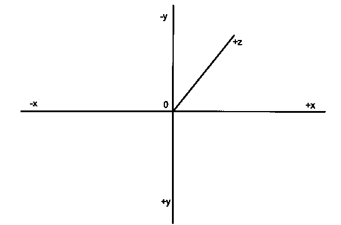
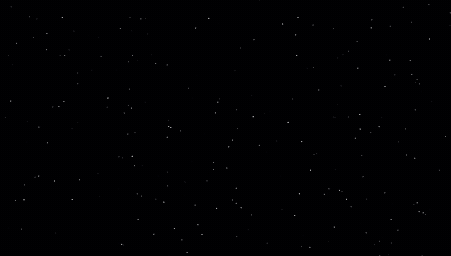
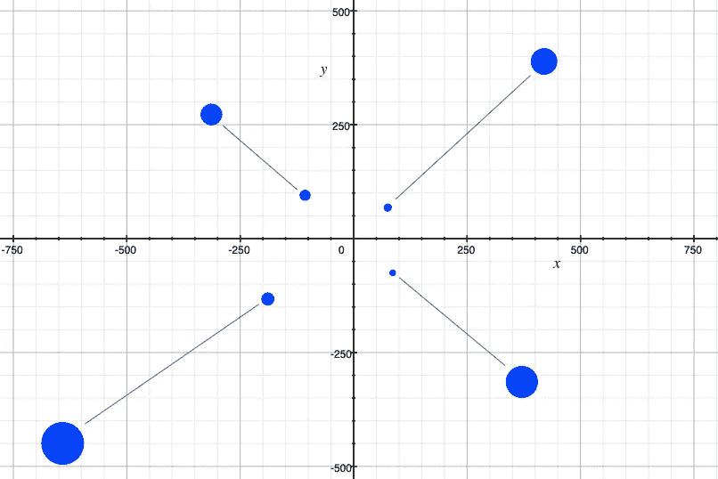
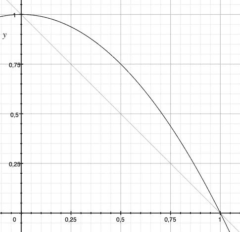

# HTML 画布的乐趣:让我们创建一个星域

> 原文：<https://betterprogramming.pub/fun-with-html-canvas-lets-create-a-star-field-a46b0fed5002>

## HTML 画布上效果的分步指南

一个简单而有效的星域效应

在这一部分，你将学习如何创建上面嵌入的星域效果。是的，它正在运行——它不是 GIF 或视频。

我只用了一个 HTML 画布。不需要第三方库或高等数学。我使用直观的技术使效果更容易理解和适应。

# 代码

该效果的完整源代码可在[这里](https://codesandbox.io/s/lucid-fast-0v7ch)获得。我建议你在另一个窗口打开它，然后跟着走。

这个例子的标记是基本的。HTML 主体和画布被定义和样式化为在整个浏览器窗口上伸展。

```
<!DOCTYPE html>
<meta charset="utf-8" />
<body
  style="position: fixed; left: 0px; right: 0px; top: 0px; bottom: 0px; overflow: hidden; margin: 0; padding: 0;"
>
  <canvas
    id="canvas"
    style="width: 100%; height: 100%; padding: 0;margin: 0;"
  ></canvas>
  <script>
     ...
   </script>
</body>
```

# 处理事情

如果我们想在画布上绘制任何东西，我们需要获取它的 DOM 元素并对其调用`getContext("2d")`。这使我们能够访问[画布 API](https://developer.mozilla.org/en-US/docs/Web/API/Canvas_API) 。

```
const canvas = document.getElementById("canvas");
const c = canvas.getContext("2d");
```

# 跟踪窗口大小

HTML 画布有自己的内部分辨率，您可以通过给上下文的`width`和`height`属性赋值来设置。

我们希望画布总是匹配窗口大小，所以我们设置画布宽度和高度来匹配。画布的大小在以后的计算中很有用，所以我们将它保存在`w`和`h`变量中。

```
let w;
let h;

const setCanvasExtents = () => {
  w = document.body.clientWidth;
  h = document.body.clientHeight;
  canvas.width = w;
  canvas.height = h;
};

setCanvasExtents();

window.onresize = () => {
  setCanvasExtents();
};
```

在此过程中，我们对窗口大小调整事件做出反应，确保画布的分辨率始终与窗口的大小相匹配。

# 星星

每颗星星都由一个拥有`x`、`y`和`z`坐标的物体代表。我们创建 10k 个并把它们放在一个数组中。

我们的恒星生活在一个虚拟坐标系中，看起来像这样:



坐标系的中心点将被绘制到画布的中心。我们用 z 值来表示恒星离 x，y 平面的距离。

我在坐标系中选择了如下的恒星分布:

*   `x`数值范围从`-800`到`+800`
*   `y`数值范围从`-450`到`+450`
*   `z`数值范围从`0`到`1000`

这些范围并不完全是任意的。我希望星星生成在一个 16/9 的矩形中，接近普通显示器的大小——这样当全屏观看时，它们就会落入可见空间。

我选择了 1000 单位的最大距离，因为为什么不呢？就宽度和高度而言，感觉还不错。随意摆弄数字，观察变化。

```
const makeStars = (count) => {
  const out = [];
    for (let i=0;i<count;i++){
      const s = {
        x: Math.random()*1600-800,
        y: Math.random()*900-450,
        z: Math.random()*1000
      };
    out.push(s);
  }
  return out;
}

let stars = makeStars(10000);
```

> [Math.random()](https://developer.mozilla.org/en-US/docs/Web/JavaScript/Reference/Global_Objects/Math/random) 生成一个介于`0`(含)和`1`(不含)之间的随机数。
> 
> 所以`Math.random() * 1600`会生成一个介于`0`(含)和`1600`(不含)之间的数字。
> 
> 通过抵消它，我们可以改变有效范围。
> 
> 因此`Math.random()*1600–800`在`-800` (含)和`+800`(不含)之间产生一个随机数。

# 绘制背景

我们需要一种方法在画布上画出我们的星星。我们想要一个黑色的背景，我们可以把我们的星星放在上面。

```
const clear = () => {
  c.fillStyle = "black";
  c.fillRect(0, 0, canvas.width, canvas.height);
};
```

`clear`函数只是用我们的背景色填充整个画布。

# 画一颗星星

我们还需要一种绘制单星的方法。我们将给一个亮度在`0`和`1`之间的像素着色。该值越高，像素越亮。

```
const putPixel = (x, y, brightness) => {
  const intensity = brightness * 255;
  const rgb = "rgb(" + intensity + "," + intensity + "," + intensity + ")";
  c.fillStyle = rgb;
  c.fillRect(x, y, 1, 1);
};
```

`putPixel`函数确定我们想要的亮度的`rgb`颜色，并用该值填充一个一像素的矩形。

> RGB 颜色的范围从`0–255`到红色、绿色和蓝色的每个分量。
> 
> 当所有三个分量相等时，我们生成一个灰色。
> 
> 通过用一个在`0.0`和`1.0`之间的值缩放所有组件的`255`，我们有效地生成了一个介于黑色和白色之间的灰度颜色。

# 移动星星

每画一帧，我们都想把自己星域里的星星移向我们。为此，我们需要降低恒星的`z`坐标。

一旦它们接近屏幕平面，我们就把它们送回去，这样它们就可以继续攻击我们。

```
const moveStars = (distance) => {
  const count = stars.length;
  for (var i = 0; i < count; i++) {
    const s = stars[i];
    s.z -= distance;
    while (s.z <= 1){
      s.z += 1000;
    }
  }
}
```

# 让它滴答作响

控制动画播放的速度很重要。我们可以使用`setTimeout`或`setInterval`，但是绘制下一帧最方便的方式是让浏览器在下一次屏幕刷新时调用我们，同时给我们一个高分辨率的时钟值。

时钟告诉我们从上一帧开始过了多长时间，从而告诉我们动画进展了多长时间。

`[requestAnimationFrame](https://developer.mozilla.org/en-US/docs/Web/API/window/requestAnimationFrame)`函数正是我们所需要的。首先，我要求浏览器调用`init`并传递高分辨率时钟值。

```
let prevTime;
const init = time => {
  prevTime = time;
  requestAnimationFrame(tick);
};

...

requestAnimationFrame(init);
```

在`init`内部，我将时钟值存储在`prevTime`中，并请求接下来调用我们的`tick`函数。

`tick`函数确定自上次刷新以来经过了多长时间，向前移动我们的动画，在画布上绘制我们的星星的当前状态，然后请求在下一次屏幕刷新时再次被调用。

```
const tick = time => {
  let elapsed = time - prevTime;
  prevTime = time;

  moveStars(elapsed*0.1);

  clear();

  const cx = w/2;
  const cy = h/2;

  const count = stars.length;
  for (var i = 0; i < count; i++) {
    const star = stars[i];

    const x = cx + star.x/(star.z * 0.001);
    const y = cy + star.y/(star.z * 0.001);

    if (x < 0 || x >= w || y < 0 || y >= h){
      continue;
    }

    const d = (star.z/1000.0)
    const b = 1-d*d

    putPixel(x, y, b);
  }

  requestAnimationFrame(tick);
};
```

# 及时移动

tick 函数确定自上次调用以来已经过去了多长时间。

经过的时间告诉我们要移动多少星星。在一个 60 fps 的环境中，我们将以`1000/60 ~ 16.6`毫秒的增量被调用，给或拿。

```
moveStars(elapsed*0.1);
```

我取这个数字，将其缩放到 10%，所以它在`1.6`左右，并且将所有的星星向前移动这个值。如果你想要更快或更慢的恒星，相应地缩放。



更快的恒星缩放时间由 0.1 改为 1.9

# 用透视画法画星星

接下来，画布被清空，所有的星星被绘制成一个循环。画布上的`x`和`y`坐标来自星星的`x`、`y`和`z`坐标。

# 协调

我们需要做两件事来将星形坐标转换成画布坐标。

首先，我们需要引入透视，所以更远的恒星更接近消失点。

其次，我们需要将虚拟坐标转换成画布坐标。画布坐标的原点在左上角，而不是画布的中心，所以我们需要考虑这一点。

我们的视角以我们的消失点为中心。在`-200, -100, 100`离我们相对较近的一颗恒星应该出现在中心的左上方。在`-200, -100, 900`更远处的一颗星也应该出现在左上角，但是更靠近消失点。所有其他象限也是如此:如果一颗恒星更近，它应该转换到更靠近`0`的可见坐标。



您可以通过 1/z *阻尼缩放来实现透视

为了达到这个效果，我们可以简单地将`x`和`y`除以`z`。`z`越高，我们越接近零。然而，除以`z`直接导致了一个相当严重的下降。我们需要让它看起来更有说服力。所以我们缩放除以的值。我用了`0.001`。玩一玩，挑一个你喜欢的值。

完成后，我们将坐标偏移画布尺寸的一半，有效地将从零开始的坐标推到画布的中心。

```
const x = cx + star.x/(star.z * 0.001);
const y = cy + star.y/(star.z * 0.001);

if (x < 0 || x >= w || y < 0 || y >= h){
  continue;
}
```

如果恒星落在可见区域之外，我们就继续下一个，有效地跳过对不可见恒星的绘制调用。

# 明亮的星星

我们希望离我们较近的星星看起来更亮，而较远的星星看起来更暗。我们知道离我们最远的星星在`z = 1000`，所以用`z`除以`1000`可以得到一个线性的亮度标度。我把这个值叫做`d`。

恒星离得越远，`d`离`1.`越近，恒星离我们越近，`d`离`0`越近。因为我们希望它离我们近的时候亮度更亮。我们通过计算`1-d`来反演该值。

这给了我们一个亮度的线性梯度。

我稍微调整了一下计算方法，这样恒星看起来会比线性提前一点。我不是减去`d`，而是减去`d²`



一维整体上比线性渐变稍亮

```
const d = (star.z/1000.0)
const b = 1-d*d

putPixel(x, y, b);
```

剩下的就是调用`putPixel`绘图函数，将像素星放到画布上。

# 结论

这就是了。一个基本的 3d 效果，不需要 3d 数学。体验愉快！

**PS:** 如果你准备好更上一层楼，为什么不在你的星域顶部放置一个标志性的星球大战标题爬行呢？

[](https://medium.com/better-programming/create-a-star-wars-title-crawl-in-html-c25a76fea401) [## 创建一个 HTML 格式的星球大战标题抓取

### 很久很久以前，在一个遥远的浏览器里

medium.com](https://medium.com/better-programming/create-a-star-wars-title-crawl-in-html-c25a76fea401)