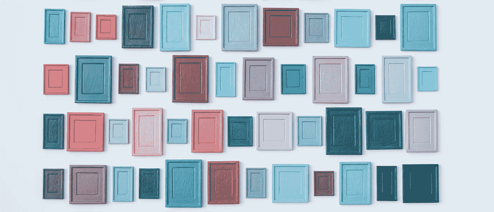
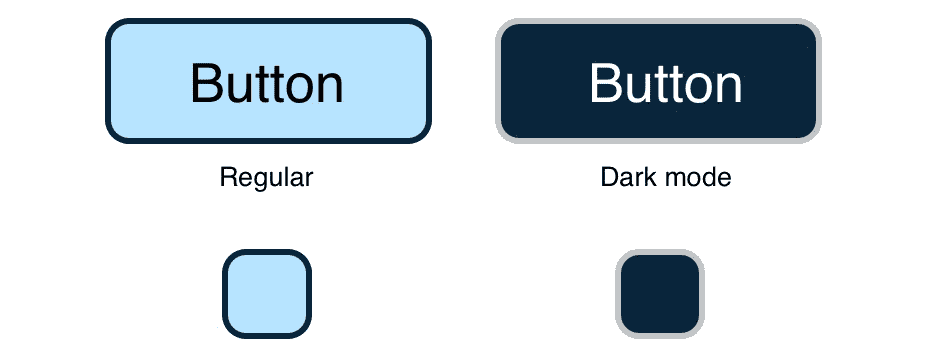

# 在 iOS 中体验图像、颜色和黑暗模式的乐趣

> 原文：<https://betterprogramming.pub/fun-with-images-colours-and-dark-mode-in-ios-62d17e6a7097>

## 仅使用预定义的颜色在代码中设计您的应用，同时保持适当的特征支持

马库斯·斯皮斯克在 [Unsplash](https://unsplash.com/s/photos/colourful-design?utm_source=unsplash&utm_medium=referral&utm_content=creditCopyText) 上的照片

充分利用 XCAssets 已经帮助我们组织和维护我们的颜色和图像，并帮助我们自动[响应不断变化的界面特征，如黑暗模式](https://medium.com/@krmblr/ios-make-styling-your-buttons-easier-36106931689c)，或状态，如组件被禁用或高亮显示。

但是后来组件的数量增加了，或者德国本地化出于某种原因需要一些其他的色调(设计师们，我说的对吗？)，对于视力较弱的用户，您希望提供对比度更高的颜色。这相当于很多组合都需要不同的图像。但是这些图像中使用的颜色应该已经在同一个资产目录中定义了，对吗？如果只定义颜色，让应用程序来完成剩下的工作，而不是提供所有这些图像，岂不是很酷？

让我们看看如何通过编程创建一个`UIButton`来使用图像进行造型，并适当地适应不断变化的特征，如黑暗模式，所有这些都没有任何预定义的图像。

# 设置

为了便于解释，让我们假设你正在全力以赴，想要用代码来做这件事，甚至定义颜色。这也将有助于解释这是如何工作的。

假设我们想要实现的结果是这个按钮样式:

按钮设计:示例在顶部，所需的参考图像在底部，我们通常会将它放在我们的[资产目录](https://medium.com/better-programming/ios-make-styling-your-buttons-easier-36106931689c)中。

因此背景由纯色、边框和圆角组成。

对于背景和边框，我们要定义一种颜色，这种颜色实际上不止一种。在资产目录中，我们可以将 *Appearances* 选项改为 *Any，Dark* 并添加一个额外的资源。

我们需要确定环境属性的信息可以作为`[TraitCollection](https://developer.apple.com/documentation/uikit/uitraitcollection)`的一部分获得。该类包含理解设备及其配置所需的所有信息。您可以从任何`UIView`或`UIViewController`实例中获取该信息作为属性，还可以使用它来指定颜色和图像，使其更加动态。这就是我们要做的。

在我们的例子中，我们需要首先定义我们的颜色。有一个初始化器可以创建一个动态的颜色；它采用闭合设计，让您可以根据具体情况选择合适的颜色:

注意 UserInterfaceStyle 枚举有三种情况。通常，当没有设置样式时，您会希望默认使用`*light*`。

作为`UITraitCollection`的一部分，还有更多属性可用，如[大小类](https://developer.apple.com/documentation/uikit/uiuserinterfacesizeclass)、[显示色域](https://developer.apple.com/documentation/uikit/uidisplaygamut)、[内容大小](https://developer.apple.com/documentation/uikit/uicontentsizecategory)用于字体缩放等。你可以随意组合。

接下来，我们需要为特定的州创建图像。让我们创建一些辅助函数来为符合我们要求的特定状态构建一个映像:

这些功能走了一些捷径，但它们很好地满足了我们的需求。简而言之，它:

*   根据拐角半径，检查图像应该有多大
*   生成该大小的图像，用背景色填充
*   将拐角切割成正确的半径，并为其添加边框。

要为我们的按钮生成一个图像，我们可以通过使用:

图像看起来很好，但还不是很动态:它不适应任何特征。为了改变这一点，我们可以使用一个`UIImageAsset`来注册我们拥有的图像的不同版本。在我们的例子中，我们有两个图像——一个用于亮模式，一个用于暗模式。让我们创建一项资产并注册不同的版本:

有些事情你可能已经注意到了:

首先，`displayScale`是专门为每组特征设置的。如果不这样做，似乎会使用默认的`1`，这会导致图像在`@2x`和`@3x`设备上无法正确渲染。

接下来，我们要求场景中出现一张`.current`特征的图片，这看起来不是很动态。但是[代码文档](https://github.com/theos/sdks/blob/master/iPhoneOS11.2.sdk/System/Library/Frameworks/UIKit.framework/Headers/UIImageAsset.h)告诉我们为什么这样做:

> 返回的图像包含创建它们的资产的强引用

这意味着生成的图像有一个名为`imageAsset`的属性，可以查询该属性来获取同一图像的另一个版本。您还可以使用它来再次检查其他图像版本是否真的存在:

就是这样！为了一起检查所有的部分，[你可以查看这个要点](https://gist.github.com/kevinrmblr/8ba52d10093252c66a75360f68d61068)。你可以简单地把它放在操场上检查结果。

# 下一步是什么？

虽然这个理论非常有趣，并且可以用于一个简单的应用程序，但我不建议像这样直接使用它。该设置仅渲染单一图像比例。此外，随着图像(和/或图像组合)数量的增长，您要么每次都必须生成图像，要么将它们保存在内存中，这将成为问题。

如果您继续使用它，解决这个问题的一个方法是将它转移到构建阶段。这样，生成的图像在编译时就可以像“普通”图像一样被引用。

感谢阅读！