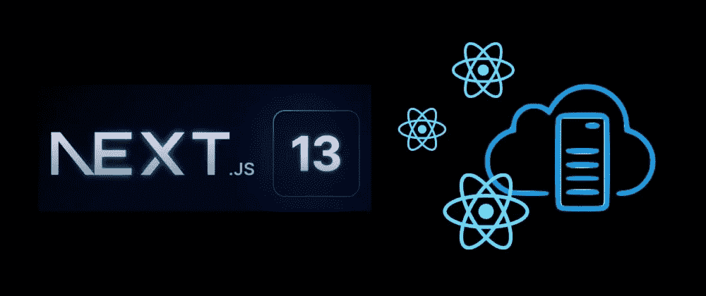
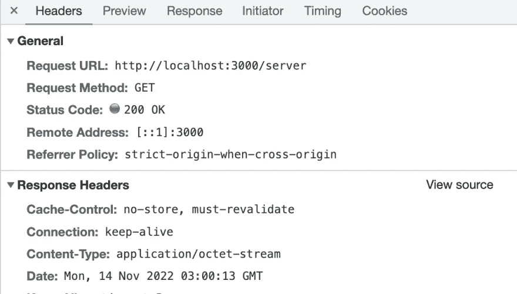
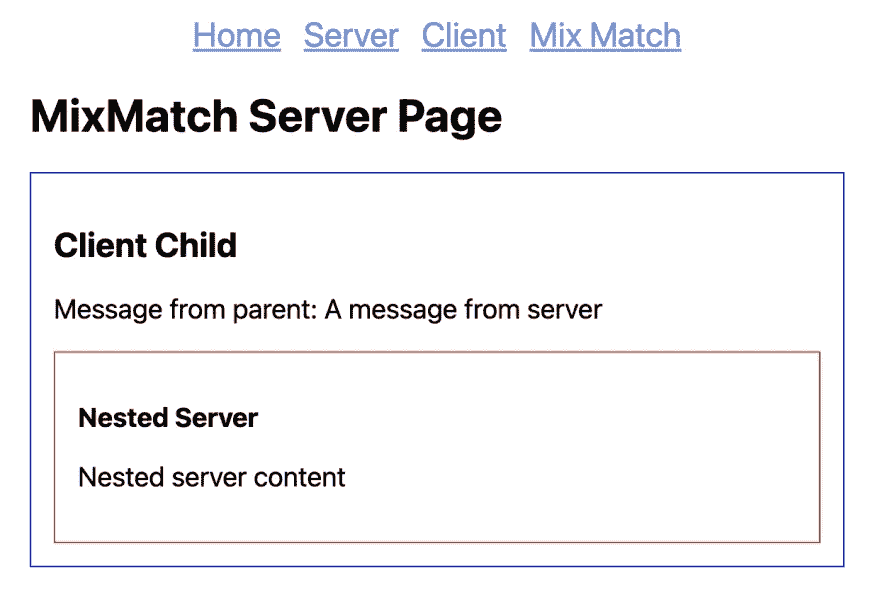

# 探索 Next.js 13 服务器组件

> 原文：<https://betterprogramming.pub/fun-with-next-js-13-server-components-fd5f886c31f3>

## Next.js 13 测试版特性的快速概述



Next.js 13 以一种有些令人困惑的方式登陆。增加了许多显著的东西；不过，好的部分还是 Beta。尽管如此，Beta 特性给了我们关于 Next.js 的未来将如何形成的重要信号，所以有很好的理由密切关注它们，即使你打算等待采用它们。

本文是关于 Beta 特性的系列体验的一部分。今天我们来玩一下服务器组件。

将服务器组件作为默认选项可以说是 Next.js 13 中最大胆的改变。服务器组件的目标是通过只在服务器端保存组件代码来减少发送到客户机的 JS 的大小。即，呈现发生并且仅发生在服务器端，即使组件的加载是在客户端触发的(通过客户端路由)。这是一个相当大的范式转变。

我第一次知道 React 服务器组件是在一年多以前，通过这个视频(以后再看，它很长):

那时候感觉相当“研究性”，所以当我看到 Next.js 现在已经把自己的未来押在它身上时，我感到震惊。时光飞逝，React 的工程师们一定做了一些非常棒的工作，所以我创建了一个闪亮的新 Next.js 13 项目来玩它。

```
npx create-next-app@latest --experimental-app --ts --eslint next13-server-components
```

让我们玩这个项目玩得开心点。你可以在这里找到完整的项目代码。

# 服务器组件

注意到的第一个不同是一个新的`app`文件夹现在和我们的老朋友`page`放在一起。我将把路由更改保存到另一篇文章中，但现在值得一提的是，默认情况下，`app`文件夹下的每个组件都是服务器组件，这意味着它呈现在服务器端，其代码保留在服务器端。

现在让我们创建我们的第一个服务器组件:

```
// app/server/page.tsx

export default function Server() {
    console.log('Server page rendering: this should only be printed on the server');
    return (
        <div>
            <h1>Server Page</h1>
            <p>My secret key: {process.env.MY_SECRET_ENV}</p>
        </div>
    );
}
```

如果您访问`/server`路由，无论是通过新的浏览器加载还是客户端路由，您都只能在服务器控制台中看到该行日志，而不能在浏览器控制台中看到。环境变量值也是从服务器端获取的。

在浏览器中查看网络流量，您会看到服务器组件的内容是通过远程调用加载的，该调用返回渲染结果的 JSON 数据的八位字节流:



服务器组件网络流量

```
{
    ...
    "childProp": {
        "current": [
            [
                "$",
                "div",
                null,
                {
                    "children": [
                        ["$", "h1", null, { "children": "Server Page" }],
                        [
                            "$",
                            "p",
                            null,
                            {
                                "children": ["My secret key: ", "abc123"]
                            }
                        ]
                    ]
                }
            ]
        ]
    }
}
```

呈现服务器组件实际上是一个 API 调用，用于获取序列化的虚拟 DOM，然后在浏览器中将其具体化。

要记住的最重要的事情是，服务器组件是用来呈现非交互式内容的，所以没有事件处理程序、没有 React 挂钩，也没有浏览器专用的 API。

最大的好处是你可以自由地访问服务器组件中的任何后端资源和秘密。更安全(数据不泄露)，更快(代码不泄露)。

# 客户端组件

要创建一个客户端组件，您需要用`use client`明确地标记它:

```
// app/client/page.tsx

'use client';

import { useEffect } from 'react';

export default function Client() {
    console.log(
        'Client page rendering: this should only be printed on the server during ssr, and client when routing'
    );

    useEffect(() => {
        console.log('Client component rendered');
    });

    return (
        <div>
            <h1>Client Page</h1>
            {/* Uncommenting this will result in an error complaining about inconsistent
            rendering between client and server, which is very true */}
            {/* <p>My secret env: {process.env.MY_SECRET_ENV}</p> */}
        </div>
    );
}
```

正如您可能已经预料到的，这为您提供了与以前的 Next.js 版本类似的行为。

当页面第一次加载时，它是由 SSR 呈现的，所以您应该在服务器控制台中看到第一个日志；在客户端路由期间，两个日志消息都将出现在浏览器控制台中。

# 混合搭配

服务器组件和 SSR 最大的区别之一就是 SSR 是页面级的，而服务器组件顾名思义是组件级的。这意味着你可以在一个渲染树中随意混合和匹配服务器和客户端组件。

```
// A server page containing client component and nested server component

// app/mixmatch/page.tsx
import Client from './client';
import NestedServer from './nested-server';

export default function MixMatchPage() {
    console.log('MixMatchPage rendering');
    return (
        <div>
            <h1>Server Page</h1>
            <div className="box">
                <Client message="A message from server">
                    <NestedServer />
                </Client>
            </div>
        </div>
    );
}
```

```
// app/mixmatch/client.tsx
'use client';

import { useEffect } from 'react';

export default function Client({
    message,
    children,
}: {
    message: string;
    children: React.ReactNode;
}) {
    console.log('Client component rendering');

    return (
        <div>
            <h2>Client Child</h2>
            <p>Message from parent: {message}</p>
            <div className="box-red">{children}</div>
        </div>
    );
}
```

```
// app/mixmatch/nested-server.tsx

export default function NestedServer() {
    console.log('Nested server component rendering');
    return (
        <div>
            <h3>Nested Server</h3>
            <p>Nested server content</p>
        </div>
    );
}
```



在页面中混合服务器和客户端组件

在这样的混合场景中，服务器和客户端组件独立呈现，结果由 React 运行时组装。从服务器组件传递到客户机组件的属性在网络上是序列化的(并且需要是可序列化的)。

# 服务器组件可能会退化

您需要注意的一点是，如果一个服务器组件被直接导入到客户机组件中，它会悄悄地退化为客户机组件。

让我们稍微修改一下前面的例子来观察它:

```
// app/degenerate/page.tsx

import Client from './client';

export default function DegeneratePage() {
    console.log('Degenerated page rendering');
    return (
        <div>
            <h1>Degenerated Page</h1>
            <div className="box-blue">
                <Client message="A message from server" />
            </div>
        </div>
    );
}
```

```
// app/degenerate/client.tsx

'use client';

import NestedServer from './nested-server';

export default function Client({ message }: { message: string }) {
    console.log('Client component rendering');

    return (
        <div>
            <h2>Client Child</h2>
            <p>Message from parent: {message}</p>
            <div className="box-blue">
                <NestedServer />
            </div>
        </div>
    );
}
```

```
// app/degenerated/nested-server.tsx

export default function NestedServer() {
    console.log('Nested server component rendering');
    return (
        <div>
            <h3>Degenerated Server</h3>
            <p>Degenerated server content</p>
        </div>
    );
}
```

如果你查看日志，你会看到`NestedServer`已经“退化”,现在由浏览器渲染。

# 是更好的未来吗？

Next.js 正在尽一切努力将东西转移到服务器端，这正是二十年前人们进行 web 开发的方式。所以现在我们完成了一个完整的循环，但大大改善了开发体验和最终用户体验。

对于最终用户来说，这是一个明显的胜利，因为服务器端的计算更快、更可靠。结果将是更快速的第一内容绘制。

对于开发人员来说，范式转换将是精神上的挑战，混合着困惑、错误和反模式。这将是一次地狱般的旅行。

感谢阅读。

```
Want to Connect?

I'm the creator of [ZenStack](https://zenstack.dev/?utm_campaign=medium&utm_medium=organic&utm_content=nextjs_server_components), a toolkit that supercharges
Prisma ORM with a powerful access control layer and 
unleashes its full potential for full-stack development.
Our goal is to let you save time writing boilerplate code 
and focus on building what matters - the user experience.
```