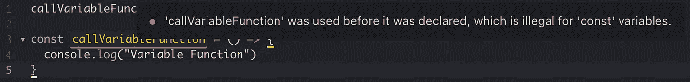

# JavaScript 中的函数提升

> 原文：<https://betterprogramming.pub/function-hoisting-in-javascript-c27231cb3a63>

## 在声明函数之前调用它背后的有趣历史

宾斯基

提升是 JavaScript 中少数几个没有上下文就没有意义的特性之一。理解它是如何工作的很重要，因为它经常在面试中出现。在学习提升的过程中，您学习了 JavaScript 如何执行代码、分配内存以及函数创建方式的差异。

根据 MDN:

> 提升指的是在执行代码之前，解释器将函数、变量或类的*声明*移动到其作用域顶部的过程

吊装就是允许这种情况发生的原因:

能够在声明函数之前调用它们，乍一看似乎有些奇怪。关于你为什么可以的解释非常有趣。这与 JavaScript 代码的执行方式有关。

本文将主要关注函数提升，但是我应该指出 JavaScript 可以对变量和类进行提升。以我的经验来看，功能提升比较常见。

## 背景

从吊装开始的一个好地方是回答这个问题:“重点是什么？”这是 JavaScript 可以做到的一个巧妙的技巧，但是为什么它首先是可能的呢？提升是不可用的，因为社区需要它作为一个特性。这是可能的，因为 JavaScript 是如何执行代码的。让我们再来看看这个例子:

当我执行这段代码时，JavaScript 将创建一个所谓的“全局执行上下文”全局执行上下文是所有不在函数内部的代码被执行的地方。创建全局执行上下文的第一步是所谓的“内存分配阶段”

在内存分配阶段，JavaScript 将扫描您的代码，并将内存分配给所有变量和函数。用`var`关键字声明的变量以未定义的值存储，函数以执行所需的所有代码存储。

下一步是“代码执行阶段”顾名思义，这是您的 JavaScript 代码逐行执行的地方。因此，当执行上面的代码示例时，将读取第 1 行，并引用一个已经存储在内存中的函数以及执行该函数所需的代码。

这就是我们谈论吊装时的真实情况。我们可以在声明函数之前调用它，因为在执行之前它会出现在变量环境中。

## 实际使用

当我想把函数和变量组合在一起时，我发现提升很有用。当我编写 React 组件时，我喜欢在顶部声明变量，在下面声明函数。对我来说，它只是看起来更好。

没有提升，我将不得不在顶部声明我的函数，或者把函数和变量混合在一起。我还可以在外部文件中定义所有函数，并将它们导入到我的组件中。有些函数非常特殊，在组件内部定义它们是有意义的，因为它们不会在其他任何地方使用。

首先是函数:

混合:

两个选项都可以，但我更喜欢悬挂选项的外观。

## 例外

提升的一个显著例外是函数表达式。如果我要将前面的函数更新为表达式或箭头函数，它将如下所示:

对于这种结构，我的 IDE 将向我显示一个错误。

不能提前调用函数表达式的原因可以追溯到我们的执行上下文的内存分配阶段。内存分配阶段为所有变量分配内存空间，但是变量的值不同。

带有`var`关键字的变量以未定义的值存储，而带有`let`和`const`的变量存储但不初始化。`let`或`const`变量在它们的值被设置之前被调用，存在于所谓的“时间死区”在分配函数逻辑之前，用函数的期望调用其中的任何一个都将导致错误。

# 包扎

我希望这篇文章对你理解吊装有所帮助。一旦你知道 JavaScript 是如何执行的，理解提升就变得容易多了。这是一个需要学习的重要概念，因为有太多的其他概念与之相关联。