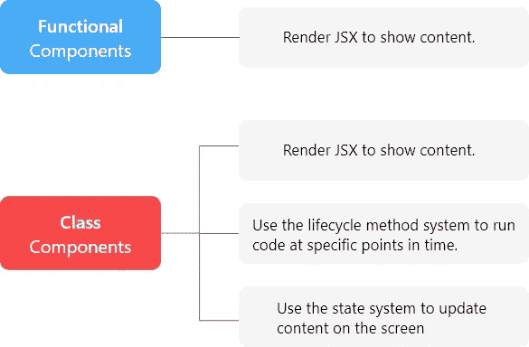
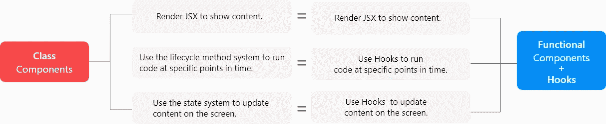

# React 中的功能组件与类组件

> 原文：<https://betterprogramming.pub/functional-components-vs-class-components-in-react-2f28adccc993>

## 主要区别，何时选择一个而不是另一个，以及为什么你应该知道两者

来自[壁纸洞](https://wallpapercave.com/w/wp4923981)的照片。

React 是由脸书创建的 JavaScript 库。它使用声明式方法，简化了用户界面的创建。React 中构建的 web 应用程序由几个称为 React 组件的小而独立的代码组成。有两种主要类型的组件:

*   功能组件
*   类别组件

这篇文章将帮助你理解其中的区别，什么时候选择一个而不是另一个，以及为什么你应该知道这两个。

# A L **eap 进入过去**

为了理解这些差异，了解 React 生态系统以前是什么样子是很重要的。几年前，功能组件仅用于渲染 JSX 以向用户显示内容。另一方面，类组件也能够利用生命周期方法系统或状态系统。

生态系统过去是怎样反应的。

2019 年 2 月，React 团队引入了 Hooks 作为 React v16.8.0 的新功能。React Hooks 赋予了功能组件与类组件相同的功能，可以使用状态系统并实现与类组件生命周期方法相同的结果。

今天的 React 生态系统。

现在我们来分析一下主要的区别。

# 1.渲染 JSX 以显示内容

[JSX](https://www.w3schools.com/react/react_jsx.asp) 代表 JavaScript XML。正如 [W3Schools](https://www.w3schools.com/react/react_jsx.asp) 所解释的，它“允许我们用 JavaScript 编写 HTML 元素并将它们放在 DOM 中，而无需使用任何`createElement()`和/或`appendChild()`方法。”

## **渲染类组件中的 JSX**

类组件是扩展了`React.Component`渲染方法的 ES6 类:

使用析构也可以达到同样的效果:

## 在功能组件中呈现 JSX

功能组件是返回 JSX 的 JavaScript 函数:

# 2.处理状态

使用状态系统，我们创建一个 JavaScript 对象，其中包含一些与我们正在处理的组件严格相关的数据。在 Hooks 出现之前，状态系统只能用于类组件。但是有了这个新的补充，现在可以用功能组件获得相同的结果。

为了更好地了解这两个组件之间的区别，让我们制作一个简单的计数器，通过单击+按钮从零开始递增。

## 处理类组件中的状态

在一个类组件中，我们在顶部初始化包含一个名为`count`的属性的状态对象，并将其设置为`0`。我们用`this.state.count`来引用 render 方法中的状态。最后，我们调用一个箭头函数，每当用户点击+时，它用`this.setState`改变`count`的状态。

## 处理功能组件中的状态

在一个功能组件中，首先，我们必须从 React 库中获取`useState`函数。然后，我们利用数组析构到初始化一个新的状态。数组中的第一个变量是我们试图跟踪的状态，而第二个元素(`setCount`)是一个函数，我们调用它来更新我们的状态。`useState`接受一个参数，这是我们的状态块的默认值。最后，我们调用一个 arrow 函数，每当用户点击+时，它使用`setCount`改变`count`的状态。

# 3.传递道具

为了将数据作为参数从一个 React 组件传递到另一个组件，我们使用 React 的 props。

## 在类组件中传递属性

在类组件中，通过使用`this`接收道具。

## 在功能组件中传递属性

在函数组件中，我们将 props 作为函数的参数传递。

# 4.生命周期方法体系

React 中的每个组件都经历一个事件生命周期。生命周期在呈现时间上有着重要的作用。生命周期方法的一个例子是与功能组件中的`useEffect()`方法相对应的`componentDidMount()`。

## **componentidmount()中的一个类组件**

`componentDidMount`是一个生命周期方法，在组件挂载到 DOM 上之后调用。

## **功能组件**中的 useEffect()

为了在功能组件中获得相同的结果，我们使用带有第二个参数`[]`的`useEffect`钩子。

# 功能组件还是类组件？

在本文中，我们注意到今天的类组件和功能组件具有相同的功能。这就引出了一个重要的问题:“我们应该学习和使用哪一个？”

答案很简单:都有！

假设您正在与一家已经使用 React 一段时间的公司合作。他们很可能在利用基于类的组件，因为这曾经是我们使用状态系统和生命周期方法的唯一方式。

另一方面，任何从事新项目的公司都可能使用类组件或功能组件。

理解这两种方法将有助于我们确定在任何给定的情况下使用哪一种。