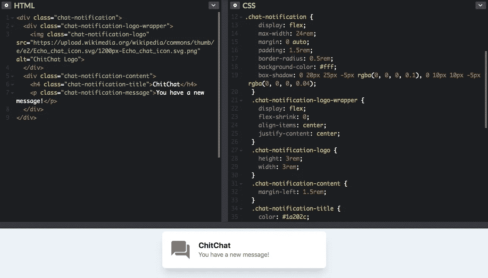
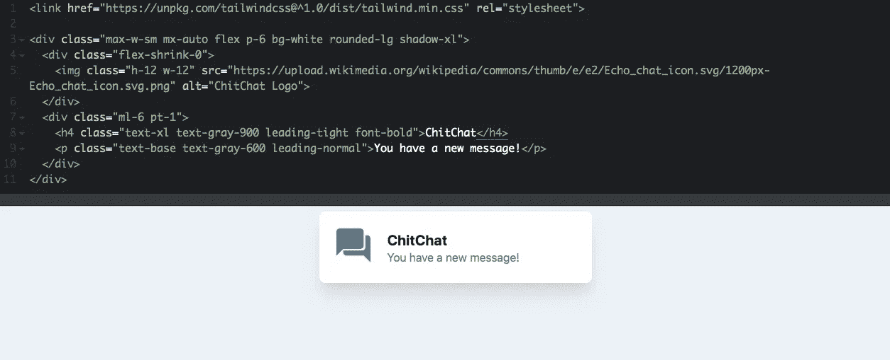

# 功能 CSS:满足顺风 CSS

> 原文：<https://betterprogramming.pub/functional-css-meet-tailwind-css-3897da4b63a2>

## 一个实用优先的 CSS 框架，用于快速构建定制设计


# 什么是函数式 CSS？

函数式 CSS(有时也称为原子 CSS)是使用小型的、不可变的、显式命名的实用程序类来构造组件的实践。各种现成的类库，如[超光速粒子](https://tachyons.io/docs/layout/grid/)和越来越受欢迎的[顺风 CSS](https://tailwindcss.com/docs/what-is-tailwind/) ，如雨后春笋般涌现，使得从功能 CSS 开始变得尽可能容易。

# 简单的例子

## 不带顺风 CSS

您将定义一个组件，添加类，并将它们嵌套在一起，设计每个元素的样式或覆盖样式。CodePen [这里](https://codepen.io/Giorat/pen/BaaVKKB?editors=1100) **。**

对于一个简单的元素，我们定义了多个类和 40 多行 CSS 代码，这些代码可能只用于这些元素。



[https://codepen.io/Giorat/pen/BaaVKKB?editors=1100](https://codepen.io/Giorat/pen/BaaVKKB?editors=1100)

## 带顺风 CSS

您可以通过实用程序类的组合在标记中构造组件的样式规则。此处代码笔[。](https://codepen.io/Giorat/pen/BaaVKKB?editors=1100)



[https://codepen.io/Giorat/pen/gOOKrLN](https://codepen.io/Giorat/pen/gOOKrLN)

正如函数式编程鼓励纯粹性和可预测性一样，函数式 CSS 提倡使用单一用途和“纯粹”的类，这些类无论上下文(或传统编程中的“范围”)如何，都具有一致的行为。

# 但是为什么我不能照常使用 CSS 呢？

*   你必须为每个新元素编写自己的 CSS。
*   你必须考虑命名事物，添加类，拆分类。
*   你不能仅仅通过阅读它的标记来判断它看起来像什么。
*   你必须担心风格的任何变化可能会破坏你目前没有看到的其他东西。
*   您处理的一个实例需要与其他实例稍有不同的风格，这破坏了您的可重用类。
*   你的 CSS 在几周、几个月甚至几年内每天都在增长。
*   要取消一个样式，你必须覆盖所有的东西，添加更多的 CSS！

有了顺风，你就不会有这些老问题了。

# 好吧，但是大教堂看起来还是像垃圾箱着火了

再说一次，这很难克服，但是一旦你习惯了，你就有可能会爱上它。垃圾箱里的火告诉你某样东西会是什么样子，但不会给你任何你不需要的信息。

无论如何，它看起来比在 JS 解决方案中使用许多常见的 CSS 更好，这些 CSS 提供了大量随机生成的类名。

# 入门指南

在使用 CDN 构建之前，请注意，如果不将 Tailwind 整合到您的构建过程中，许多使 Tailwind CSS 变得很棒的功能都是不可用的。

```
<link href=”https://unpkg.com/tailwindcss@^1.0/dist/tailwind.min.css" rel=”stylesheet”>
```

最好的解决方案是通过首先安装 tailwind 来将其集成到您的构建系统中…

使用 npm:

```
npm install tailwindcss
```

使用纱线:

```
yarn add tailwindcss
```

之后，你可以很容易地按照官方教程[在这里](https://tailwindcss.com/docs/installation/)让它与网络包或类似的捆扎机配置

# 非常感谢顺风社的创始人

我已经使用[超光速粒子](https://tachyons.io/) CSS 很长时间了。看着 Tailwind 带来的所有改进令人耳目一新，我迫不及待地想看到未来的更新。

如果你愿意，你可以亲自感谢它的创始人:[亚当·沃森](https://medium.com/u/2bdb4734b294?source=post_page-----3897da4b63a2--------------------------------)、[乔纳森·雷宁克](https://medium.com/u/d288b9293102?source=post_page-----3897da4b63a2--------------------------------)、[大卫·亨菲尔](https://medium.com/u/a639a4d29283?source=post_page-----3897da4b63a2--------------------------------)和[史蒂夫·肖格](https://medium.com/u/582a92a6b0b9?source=post_page-----3897da4b63a2--------------------------------)

# 资源

*   [顺风工具箱](https://www.tailwindtoolbox.com/)
*   [顺风组件](https://tailwindcomponents.com/)
*   [备忘单](https://nerdcave.com/tailwind-cheat-sheet)
*   [顺风模板](https://tailwindtemplates.io/)
*   [https://github.com/tailwindcss/tailwindcss](https://github.com/tailwindcss/tailwindcss)
*   [https://codepen.io/Giorat/pen/gOOKrLN](https://codepen.io/Giorat/pen/gOOKrLN)