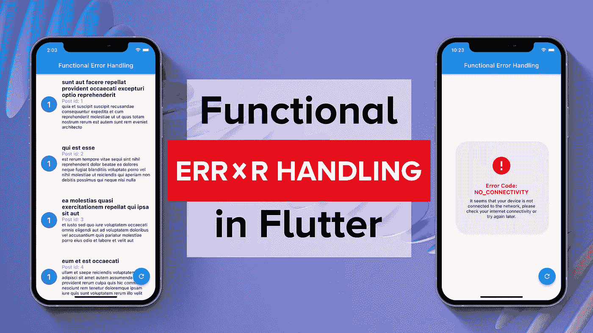
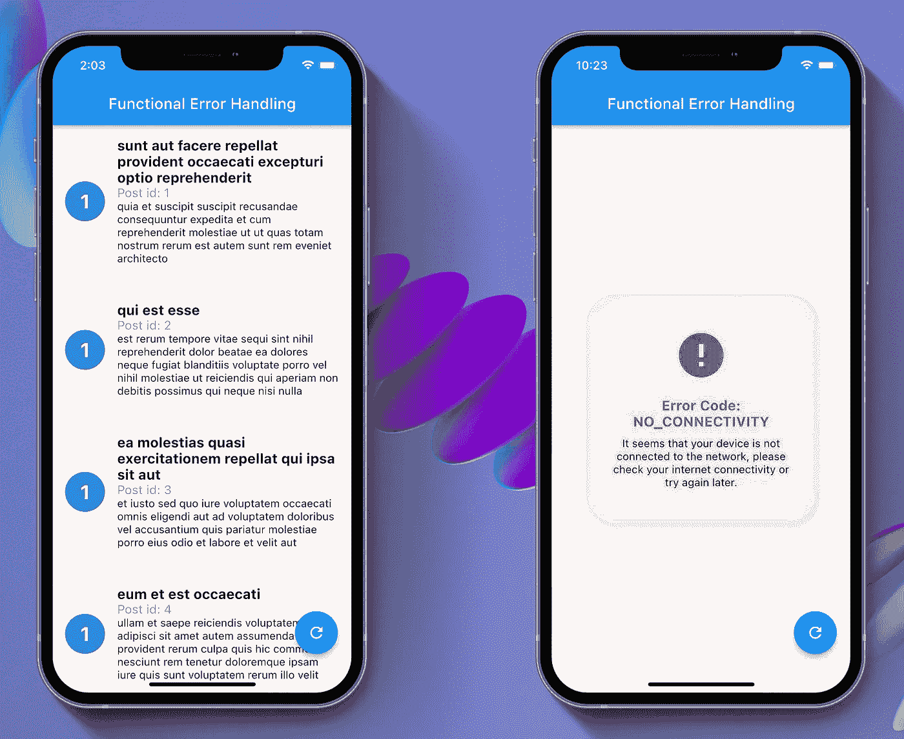

# 颤振中的功能误差处理

> 原文：<https://betterprogramming.pub/functional-error-handling-in-flutter-ac6fcf8ae22b>

## 更好、更安全的错误处理



虽然函数式编程(FP)是一种在特定软件领域(编译器、涉及并行性、并发性、分布式计算等的程序)带来许多优势的编程范式，但我认为 FP 的一些元素在状态密集型应用程序中也非常有益。

在我的第一篇博文中，我将重点介绍错误处理，并向您展示我如何使用 FP 错误处理来更干净、更安全地处理我的软件中的错误流。

# 项目概述



为了这篇文章，我创建了一个简单的应用程序([这里](https://github.com/mariopepe/medium_articles/tree/master/functional_error_handling)是 GitHub 的链接)。这个应用程序从一个远程 API `[https://jsonplaceholder.typicode.com/posts](https://jsonplaceholder.typicode.com/posts)`(对这个伟大的实用程序来说是巨大的大喊@typicode)获取一个帖子列表，并在一个列表中显示它们。如果出现任何错误，应用程序会在 UI 中正确地反映出来。

示例应用程序的架构受到了干净架构(+存储库模式)原则的启发，并且为了目标的简单性，它确实被过度设计了，但是由于本文想要展示一种处理软件错误的高级方法，我认为拥有一个架构良好的示例应用程序更有意义(另外，我打算在以后的文章中重用它的一部分)。

示例应用程序的某些方面，如状态管理技术、密封类的使用、存储库模式等。超出了本文的范围，我现在也不会关注它们，但是我欢迎对所展示的软件的任何方面提出问题。

# 使用的库

我将在这篇文章中使用的库是`[dartz](https://pub.dev/packages/dartz)`，它是 [pub.dev](http://pub.dev) 上最受欢迎的 FP 包，有 579 个赞。

值得一提的是，在撰写本文时，在 flutter 生态系统中还存在另一个 FP 库，名为 [fpdart](https://pub.dev/packages/fpdart) ，有 143 个赞。

# 类型和折叠方法

对于 FP 风格的错误处理，我发现使用定制类型`Either<Left, Right>`和它包含的`.fold()`方法特别有用。

`Either<L, R>`是一个特殊的数据类型，它可以包含两个不同的对象(**而不是**当代)，在我们的示例应用程序中，我们将有`Either<Failure, List<Posts>>`，所以它要么包含失败细节(在左侧，这里通常存储错误)，要么包含一个帖子列表，在右侧。为了非常清楚，我重复一遍，自然地，不可能同时有左右两个对象，要么你发现你自己有你正在寻找的数据，要么有一个错误状态，而不是两者都有。

我们稍后将使用`fold`函数根据变量中包含的值是`Left`还是`Right`来执行不同的动作，例如，我们将有:

```
// We connect with the API trying to get some value
final Either<Failure, List<Post>> postsEither = await postsRepository.fetchPosts();postsEither.fold(
  // If any error happened, we will emit a Failure state
  (failure) => emit(PostsListState.loadFailure(failure)),
 // If we managed to retrieve the data from the API, the bloc will emit a success state
  (postsList) => emit(PostsListState.loadSuccess(postsList)),
);
```

# 项目文件夹结构

```
.
├── lib/
│   ├── core/
│   │   ├── error_handling/
│   │   │   ├── error_object.dart
│   │   │   ├── exceptions.dart
│   │   │   └── failures.dart
│   │   └── presentation/text_styles.dart
│   └── features/
│       └── post/
│           ├── data/
│           │   ├── datasource/json_placholder_v1.dart
│           │   ├── models/post_model.dart
│           │   └── repositories_impl/posts_repository_impl.dart
│           ├── domain/
│           │   ├── entities/post_entity.dart
│           │   └── repositories/post_repository.dart
│           └── presentation/
│               ├── bloc/posts_list_bloc.dart
│               ├── widgets/
│               │   ├── custom_list_tile.dart
│               │   └── error_dialog.dart
│               └── posts_list_page.dart
└── main.dart
```

与功能性错误处理主题最相关的文件是:

*   (folder) `"error_handling"`，这里我定义了定制的异常和失败对象，以及一个名为 ErrorObject 的类，我将在 UI 中使用它将失败转换成对用户有意义的消息。
*   (file) `“json_placholder_v1.dart”`，是 JSON 占位符 API 连接的实际实现，这个应用程序的最外层。我们只在这一层接受`Exceptions`。从这一层到存储库实现层，异常(不纯的应用程序状态)被转换为失败(纯状态)。
*   【文件】(T8)，这里发生了异常→转换失败
*   (file) `“posts_list_bloc.dart”`，最后但同样重要的是，这是借助于`fold()`方法，我们根据 API 交互的结果是成功还是错误发出不同状态的地方。

# 履行

## 1-例外

我们在`lib/core/error_handling/exceptions.dart`中定义了我们的自定义异常。

## 2 —失败

我们定义了与之前在`‘lib/core/error_handling/failures.dart’`中创建的 3 个异常相关的 3 个故障实体。故障实体包括:

*   `ServerFailure`
*   `DataParsingFailure`
*   `NoConnectionFailure`

当然，这是所有可能错误的简单表示，但它是呈现本文核心概念的合理代理。

*(我使用* `*freezed*` *，但为了这个练习，这肯定是不需要的)*

## 3-错误对象

我们在`‘lib/core/error_handling/error_object.dart’`中定义了一个`ErrorObject`。`ErrorObject`是一个实用程序类，用于将失败转换成可由用户界面表示的对象(例如，它包含用户可读的错误标题和错误消息)。

## 4 — API 集成

我们在`‘lib/features/post/data/datasources/json_placholder_v1.dart’`中创建了与 JSON 占位符 API 的连接，并基于不同的可能错误抛出了之前定义的适当的定制异常。

## 5 —异常→故障

在`‘lib/features/post/data/repositories_impl/posts_repository_impl.dart’` 中，我们将异常(不纯状态)转换为失败对象(纯状态)，我们要么在任一对象的右侧返回一个帖子列表，要么如我们所说，在左侧返回一个失败。

## 6 —任一种的折叠

最后，我们在`‘lib/features/post/presentation/bloc/posts_list.dart’`解包块中的任一对象，并根据需要发出不同的状态。

## 7-用户界面表示

所有这一切的 UI 结果在`‘lib/features/post/presentation/posts_list_page.dart’`中可以观察到，通过使用冻结的密封类，块产生的每个可能的状态都被映射到不同的 UI 表示中。

密封类非常强大，有许多应用，我打算在以后的文章中详细介绍。

# 结论

在进行错误处理时，我们有两个主要的目标:

*   确保每一个错误状态都在用户界面中被恰当地呈现出来，以告知用户正在发生的事情(也就是说，我们必须向用户呈现真正有意义的对话框)。事实上，最糟糕的用户体验莫过于那些对用户不清晰、不透明的内容。
*   确保每个异常都被正确捕获和处理。生产代码中自由流动的异常意味着应用程序崩溃，这反过来是可怕的 UX，这反过来对业务非常不利。

我希望在本文中，我成功地展示了函数式编程如何极大地帮助我们实现这些目标，因为它迫使我们思考可能的应用程序状态，并主动管理它们。

为了让事情变得更清楚，考虑一下这个:当我们想要访问文章列表时，我们必须调用`fold()`方法，我们必须为左右两种情况都提供适当的动作，否则代码将无法编译，我认为这是一种非常安全的处理错误的方法！

非常感谢你阅读到这里，如果你有任何问题，建议或者你会做任何不同的事情，请告诉我！

[](https://github.com/mariopepe/medium_articles/tree/master/functional_error_handling) [## medium _ articles/functional _ error _ master Mario pee/medium _ articles 的处理

### 一个新的颤振项目。这个项目是颤振应用的起点。一些帮助您入门的资源…

github.com](https://github.com/mariopepe/medium_articles/tree/master/functional_error_handling)