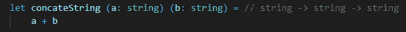

# 功能基础:Currying

> 原文：<https://betterprogramming.pub/functional-fundamentals-currying-576b8cd3080d>

## 冷静看待函数式编程中最令人困惑的概念之一

这是本博客讨论函数式编程概念的第二篇文章。下面是第一个链接， [*纯函数与不纯函数*](https://thesharperdev.com/pure-v-impure-functions/) 。

前一段时间，我看了 Scott Wlaschin 在一个关于函数式编程的会议上的演讲。他说，不懂函数式编程的人经常会被术语 T7 和 T8 吓跑。诸如 currying、部分应用、函子、单子等术语。

人们很容易认为这些是超级复杂的概念，但实际上，这些术语并不熟悉。

面向对象编程有类似的术语、封装、多态、继承等。我们刚刚接触到这些术语，所以它们已经不再可怕。

今天，我们就来切入正题，逢迎。

# 面向对象领域的方法参数

在大多数 OO 风格的编程语言中， [C#](https://docs.microsoft.com/en-us/dotnet/csharp/) ，Java，Python，C/C++等。一个方法有一定数量的参数。

以这个连接字符串的 C#方法为例。

它接受两个字符串作为输入，并返回一个字符串。

每次调用此方法时，都必须提供两个参数。如果不这样做，C#编译器会报错。

# 功能用地中的功能参数

另一方面，在大多数函数式编程语言中， [F#](https://fsharp.org/) 、 [Elm](https://elm-lang.org/) 、 [Haskell](https://www.haskell.org/) 等。，函数参数被不同地定义和利用。

下面是我们如何在 Elm 中定义一个函数，该函数在返回输出字符串之前需要两个字符串作为输入。

请注意，在 Elm 中，函数的定义与实现在不同的行上。很多函数式语言都是这样。

还要注意定义的格式是不同的，`“string -> string -> string”`。如果你以前从未接触过函数式语言，那可能有点奇怪。

在 F#中定义一个类似的函数有点不同。

但是签名是一样的，下面是这个函数在 VS 代码中使用 [Ionide](http://ionide.io/) 插件的截图。

Ionide 自动添加了`(// string -> string -> string)`函数定义，您会注意到它与 Elm 的相同。

尽管这需要两个字符串作为输入，但我只能给它一个，编译器对此没有任何问题。

`concateWordWith`的签名现在是`“string -> string”`。

或者，我可以给它两个参数，但是在两组括号里。

这是为什么呢？

原因是因为阿谀奉承。

# 柯林解释道

Currying 是一种完全不同的处理函数参数的方式。在面向对象语言中，要么全有，要么全无。如果一个方法有三个输入，给我三个输入或者嘣！编译错误。

Curried 函数提供了更多的灵活性。他们让你随着时间的推移建立输入参数。你现在可以给出一个输入。然后，稍后，给它另一个输入。最后，也是使用前的最后一个。

换个方式说:如果一个函数有三个输入，你只给它一个，它会返回一个有两个输入的函数。然后，你可以给这个双输入函数一个输入，它将返回一个接受一个输入的函数。

然后你可以给这个输入函数一个输入，它最终会返回输出。

所以，如果你看到一个函数有一个`“string -> string -> string”`的签名，一个面向对象的方法来描述它应该是“一个函数接受两个字符串作为输入，返回一个字符串作为输出”。

一种更实用的描述方式是“一个接受字符串的函数，返回一个接受字符串的中间函数，返回一个字符串。

因为 currying，在大多数函数式编程语言中没有多参数函数这种东西。如果您传递多个参数，它们实际上是一次一个地应用于一系列中间函数。编译器会自动为您完成这项工作。

事实上，[维基百科](https://en.wikipedia.org/wiki/Currying)对阿谀奉承的定义是:

> “……将带有多个参数的函数的计算转化为带有单个参数的函数序列的计算的技术。”

所以，把每个论点分解成独立的函数。

# 为什么阿谀奉承有用？

所以，现在你知道了什么是 currying，下一个合乎逻辑的问题就是:“它有用吗？”这仅仅是那些“功能性”的东西中的一种，它们的存在只是为了让生活变得更加复杂吗？

在支持 currying 的语言中，currying 为调用函数提供了很大的灵活性。

以下面这个 C#中的例子为例，它给列表中的每个数字加 2。

相当简单的代码。下面是如何在 F#中不利用 currying*就能做到这一点。

相当简单。但是由于 F# curries 函数，这里有一个更函数化的方法。

`add`函数有两个输入，但是在这个例子中我们给了它一个输入(2)。然后，让`List.map`提供第二个输入，列表的每个元素一个输入。

诚然，这并不是改变世界的差异。在我的日常工作中，我写 C#，所以我一直在处理非 curried 函数。但是如果你花足够的时间在一门课程语言上，你就会开始错过那些小捷径和小细节。

*是的，每个函数都是自动生成的，所以从技术上讲，这不是一个正确的说法。但与下一个例子不同。

# 包扎

使用函数式语言时，Currying 是一个需要了解的重要概念。这是一个很棒的语言特性，在任何地方都很方便。

Currying 只是我在 OO 世界中从未接触过的许多概念之一。我希望你花一些时间来学习函数式编程和它所提供的所有独特的特性。

# 来源

*   [维基百科:阿谀奉承](https://en.wikipedia.org/wiki/Currying)
*   [拍马屁有什么好处？](https://softwareengineering.stackexchange.com/questions/185585/what-is-the-advantage-of-currying) —堆叠交换
*   函数式编程中 curry 有什么优势 — Quora