# Java 中的函数模式

> 原文：<https://betterprogramming.pub/functional-patterns-in-java-b2b781f84124>

## 如何在 Java 函数式编程中使用不同的设计模式


阿德里安·斯旺卡在 [Unsplash](https://unsplash.com/?utm_source=unsplash&utm_medium=referral&utm_content=creditCopyText) 上拍摄的照片

最近，我们通过我的文章“[一种新的函数式 Java 风格](https://medium.com/swlh/a-new-java-functional-style-f522dad40d32)”和“[掌握新的函数式 Java](https://codeburst.io/mastering-the-new-functional-java-2eb2f7472079) ”开始了 Java 函数式编程之旅

既然我们对函数式编程和 Java 带给我们的东西有了基本的了解，我想是时候看看我们如何应用它来改进我们现有的代码了。

Java 中函数式编程的引入为我们编写代码的方式带来了新的可能性。我们现在有了更大的灵活性。我们将浏览不同的常见设计模式，并展示函数式编程如何帮助改进它们——使它们更简洁、更易读、更易维护。

那我们开始吧！

# 介绍

一个 [*设计模式*](https://en.wikipedia.org/wiki/Software_design_pattern) 是我们通常用来解决一个常见问题的解决方案，遵循一些最佳实践指南。

它们的主要目的通常是提高代码的可维护性和可读性，保证如果我们遵循给定的模式，一些已知的问题将被避免。

有多种设计模式，通常它们被分成不同的组:

## **行为模式**

这些标识了对象之间的通用通信模式。一些最流行的行为模式是*策略、访问者、责任链、模板方法、观察者、迭代器、*等等。

## **创作模式**

这些涉及不同的对象创建机制。最流行的有*工厂、建造者、原型、工厂方法、*等。

## **结构模式**

这些方法确定了组合对象的方式，以使增强的对象服务于某个目的。其中一些是*适配器、桥、代理、装饰器、*等。

我们不打算详细讨论所有的问题，因为这需要很长时间；相反，我们将挑选一些最重要的模式，看看我们过去实现它们的方式，以及我们现在如何通过使用函数式编程来改进它们。

# 工厂方法模式

在 [*工厂方法模式*](https://en.wikipedia.org/wiki/Factory_method_pattern#:~:text=In%20class%2Dbased%20programming%2C%20the,object%20that%20will%20be%20created.) 中，我们为客户端提供了一个创建对象实例的接口，隐藏了如何创建对象的实现细节。

在 Java 引入函数式编程之前，这种模式可以通过使用`if`条件、`switch`用例甚至`.`来实现(顺便说一下，请避免使用`switch`语句)。我最喜欢的实现是使用 Java 的`[enum](https://docs.oracle.com/javase/8/docs/api/java/lang/Enum.html)`；然而，如果我们需要将一个依赖注入到我们正在创建的组件中，这并不总是可能的。

让我们以一种非功能的方式来看看这种模式的实现:

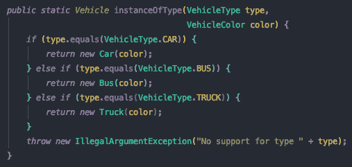

正如我们所看到的，我们的工厂方法接受了我们想要实例化的类型和一个`VehicleColor`，它将被用来实例化一辆颜色的汽车。
我们将如何从一个假设的客户端使用我们的实现？

```
Vehicle redCar = VehicleFactory.instanceOfType(VehicleType.CAR, VehicleColor.RED);
```

看起来没那么糟糕，但是这个实现有什么问题呢？

*   使用`if`条件检查类型通常会导致代码重复
*   添加新类型意味着必须记住我们必须添加一个新的`if`条件
*   我们必须抛出`IllegalArgumentException`，因为我们可能会忘记处理一个新类型
*   它比函数方法更难理解，我们很快就会看到
*   它比函数式方法略显冗长

那么，我们如何利用 Java 函数，以更简洁的方式实现这一点呢？让我们来看看这个:

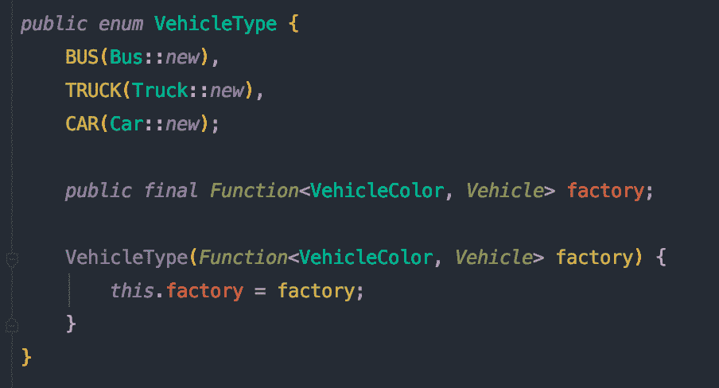

您会注意到，我们重用了现有的`VehicleType`枚举，并为其添加了一个`factory`函数；在我们的例子中。我们为实现的每个构造函数传递方法引用。乍一看，我们可以很快注意到这个类更干净、更易读，减少了创建给定类型的实例所需的混乱。

此外，enum 中的每个元素都被强制实现其工厂方法，所以我们不可能忘记为最近添加的类型添加工厂！Java 编译器在这里帮助我们，指导我们在添加新类型时编写所需的更改；我们这边不需要做额外的脑力劳动。

现在让我们看看如何从客户端使用这个实现:

```
Vehicle redCar = VehicleType.CAR.factory.apply(VehicleColor.RED);
```

很简单，对吧？正如我们所看到的，这种实现比非功能方法有一些优势。我真的希望你喜欢它，并开始经常使用它。

# 模板方法模式

*模板方法*是一种模式，它允许我们为算法定义一些公共步骤。然后，子类用特定步骤的特定行为覆盖其中的一些步骤。

那么我们之前是如何用 Java 编写这个模式的呢？嗯，大多数时候，我们不得不使用一个[抽象](https://docs.oracle.com/javase/tutorial/java/IandI/abstract.html)类，并且不得不为每个可能被覆盖的子步骤定义抽象方法。我不得不承认，我过去常常这样做，可能是因为这是唯一的办法，但现在我认为这是一种非常糟糕的做法。

让我们来看一个过去的例子:

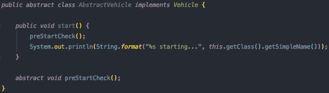

这是一个非常简单的例子，但基本上每辆车都会打印出在启动前需要做的初始检查；为了做到这一点，每个子类都必须覆盖`preStartCheck`抽象方法。例如，如果我修改类来扩展`AbstractVehicle`，它将迫使我覆盖`preStartCheck`方法。

例如，总线的这些步骤可以是:

```
@Override 
void preStartCheck() { 
  System.out.println("Check if every new passenger has paid for their tickets"); 
  System.out.println("Check if every passenger is seated"); 
}
```

这种方式并不理想，因为我们必须创建一个抽象类，并且我们的每个子类都必须扩展这个抽象类。它很乱，很难理解，并且添加了大量与它实际做的不相称的混乱。根据经验，我建议避免在 Java 中扩展类——从长远来看，这会让你的生活更轻松。

那么还有什么选择呢？让我们将我们的`start`方法移动到接口，我们将利用`default`修饰符在接口中提供我们方法的默认实现。


如你所见，我们现在接受一个`[Consumer](https://docs.oracle.com/javase/8/docs/api/java/util/function/Consumer.html)`来为我们的类提供`preStartChecks`。这是一个很傻的例子，所以有些东西看起来会有点奇怪，比如`[Void](https://docs.oracle.com/javase/8/docs/api/java/lang/Void.html)`的一个`Consumer`的使用。现在不要太担心它——这只是举例说明如何使用 Java 函数注入行为。

那么一旦我们有了这些，我们如何注入我们的逻辑呢？让我们来看看:

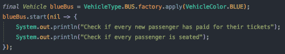

如果我们运行我们的代码，它会打印出我们期望的结果:

```
Check if every new passenger has paid for their tickets 
Check if every passenger is seated 
Bus starting...
```

基本上就是这样，我们已经通过在我们的接口中写两行代码实现了完全相同的行为。以前，我们需要一个抽象类和一个抽象方法，我们的每个类都被迫实现抽象方法。这个解决方案更简单、更干净、更易读——你同意吗？我希望你能！

# 构建器模式

[*构建器模式*](https://en.wikipedia.org/wiki/Builder_pattern#:~:text=The%20builder%20pattern%20is%20a,Gang%20of%20Four%20design%20patterns.) 的主要目的是提供一种分步构建对象的方法，将构建逻辑与其表示分离开来。

创建构建器的非功能性方法——虽然非常健壮并且非常容易被客户端使用——有一个问题:它非常冗长。

那么在这种情况下，函数式方法如何帮助我们呢？通过使用函数式方法，我们将看到如何大幅减少实现构建器所需的代码量。

让我们首先来看看它以前是什么样子的；从客户的角度来看，你可能会喜欢它的表现力，但你不会喜欢它的冗长。我们要恢复我的文章“[请停止 Java 可选乱七八糟的例子！](https://medium.com/dev-genius/please-stop-the-java-optional-mess-2889dc4f5f27)“看看我们如何将它转变成实用的风格。

如果您还记得那篇文章，从客户端使用那个类是非常容易的；例如，我们可以这样做:

那很好，不是吗？因此，在这种情况下，我们唯一的问题是类的冗长——让我们看看函数式 Java 能有什么帮助。

首先，嵌入在我们的`Customer`类中的构建器将被转换成这样:

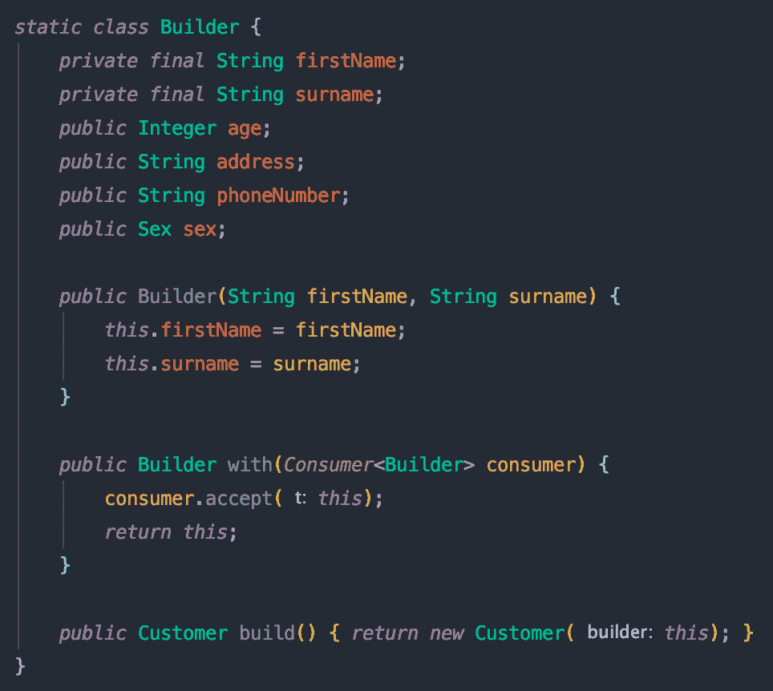

如您所见，现在我们接受了一个`Consumer`——并且我们只提供了一个方法，而不是多个方法！如果我们的对象有许多字段，这是非常有益的。

现在让我们从客户的角度来看一下如何使用这种实现:


太棒了，对吧？相反，我们可以在一个`Consumer`中指定我们所有的字段，使我们的代码更加简洁。

现在让我们来看一个不同的模式:策略！

# 战略模式

[*策略模式*](https://en.wikipedia.org/wiki/Strategy_pattern) 可能是应用最广泛的设计模式之一；它通常用在我们必须根据一些属性或输入选择不同行为的每种情况下。

用老方法编写策略模式的唯一问题是，在许多情况下，我们必须创建大量的类和样板代码；当这些类包含复杂的逻辑时，这可能是有意义的，但是在许多情况下，它们太简单了，甚至不能成为一个类！


由[万花筒](https://unsplash.com/@kaleidico?utm_source=unsplash&utm_medium=referral&utm_content=creditCopyText)在 [Unsplash](https://unsplash.com/s/photos/whiteboard?utm_source=unsplash&utm_medium=referral&utm_content=creditCopyText) 上拍摄的照片

通过一个例子可以更容易地理解这一点；在这个例子中，我们将构建一个`DeliveryPriceCalculator`，它将取决于客户已经支付的计划。

首先，这些是现有的计划:

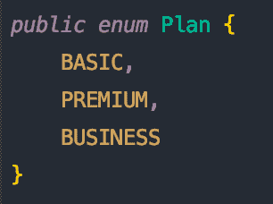

基于现有的计划，我们必须为每个计划创建一个实现；所以我们需要一个`DeliveryPriceCalculator`接口和这个接口的三个实现:

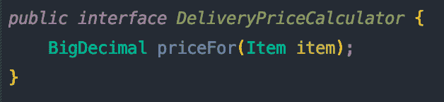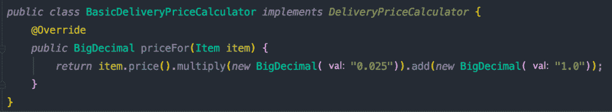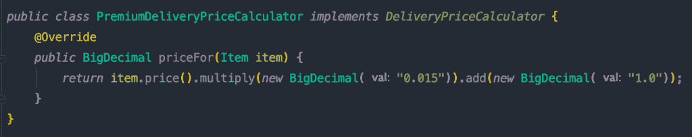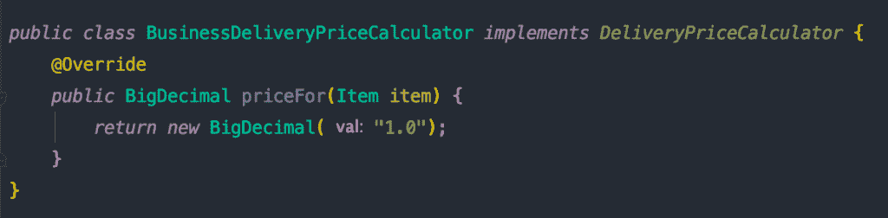

实现非常简单。在某些情况下，顾客将被收取商品价格的一小部分，外加一美元；对于那些为商业计划付费的客户，交付价格仅为 1 美元。

那么我们需要什么来实例化我们需要的类呢？我们需要一个工厂，它已经以我们之前在查看构建器模式时展示的相同的旧式方式实现了；因此，我们将省略它的实现。这个例子的代码可以在我的 GitHub 账户中找到[这里](https://github.com/theboreddev/functional-patterns)，如果你需要的话。

让我们看看客户将如何使用它:

所以我们可以再次看到，这种模式的主要问题是它的冗长——我们为如此简单的东西制造了不必要的混乱。我们真的需要那些课程吗？我们不能把这个说得更简单、更简洁吗？
让我们看看函数式编程是如何拯救我们的！

我们将使用 Java 函数嵌入所有这些逻辑，而不是为每个实现创建一个新的类。

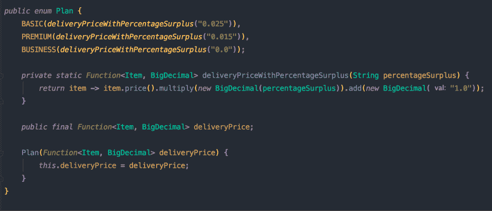

请注意，在这种情况下，我们只需要一个 enum 来实现整个策略模式。通过提供一个函数，每个计划都必须实现自己的交货价格计算器。这在我看来非常简单明了，你不同意吗？

此外，客户端使用这种模式的方式变得更加简单:

只有一句台词——现在它真的很有表现力！真的希望你喜欢这个图案；在我看来，这显然有助于减少 Java 代码中的混乱和样板代码。

现在让我们看看最后一个例子:责任链模式！

# 责任链模式

当我们必须按照给定的顺序对一个对象进行不同的操作时，这种模式非常有用，就像我们在连锁工厂中所做的一样。

实现这种模式的非功能性方法需要创建不同的类，与策略模式类似。这曾经有点冗长，并且给我们的代码增加了不必要的复杂性。

使用非功能性编程看起来怎么样？

我必须事先声明，使用非功能方法很难获得正确的责任链模式；我们的例子非常非常简单，但仍然很容易出错，很难做对。为了实现这个模式，我们需要什么？

我们将实现我认为是这种模式的一个好例子:一台洗车机。首先，我们需要一个抽象类。是的，对不起…我们需要一个抽象类，所有的子类都需要扩展它。记得以后在 Java 里要避免这种情况——没带来什么好处！

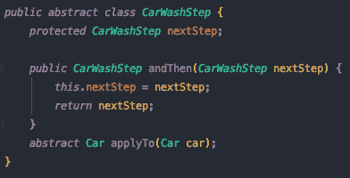

现在，为了简洁起见，我将只包括其中的一个实现来展示它们的样子:

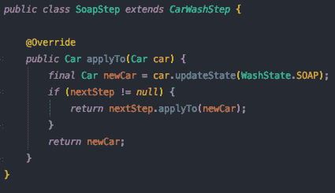

如你所见，在我们链条的每一步，如果有下一步，我们会打电话；当它到达链条的末端时，它会停在那里。我们将如何从我们的客户那里使用它？

如果我们执行这段代码，我们将看到正在执行的每个步骤:

```
Car state transitioned to INITIAL 
Car state transitioned to INITIAL_WASH 
Car state transitioned to SOAP 
Car state transitioned to RINSED 
Car state transitioned to POLISHED 
Car state transitioned to DRIED 
Final car state is DRIED
```

所以这个实现是可行的，但是它非常复杂和冗长。让我们看看函数式编程在这里能有什么帮助！

使用这种方法我们可以节省多少代码，您会对此印象深刻。

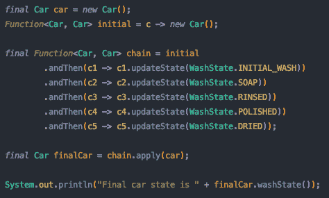

就是这样！印象深刻吧。在这个例子中，我们可以利用 Java `[Function](https://docs.oracle.com/javase/8/docs/api/java/util/function/Function.html)`中的`[andThen](https://docs.oracle.com/javase/8/docs/api/java/util/function/Function.html#andThen-java.util.function.Function-)`方法，只使用 Java 内置函数创建一个函数链。实际上，不需要任何定制类。我们已经将我们的模式减少到几行，现在也更难出错了。

我们应该做的一个改进是将这些函数提取到一个方法中——这样，您就可以表达该函数负责什么。例如，我们可以用一个`soapStep`方法来创建这个函数。

因此，在应用了重构之后，我们的函数链将如下所示:

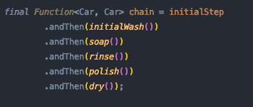

这样好多了吧？现在，我们的函数链更容易阅读，更有意义，并且在那些函数具有复杂逻辑的情况下，它们可以很容易地进行单元测试。

原来如此！我希望您喜欢我们的例子，并且喜欢应用函数式编程来获得更简洁、可读性更好的代码。

如果你仍然难以理解 Java Lambdas 和函数式编程，我建议你阅读“***Java 中的函数式编程:利用 Java 8 Lambda 表达式的力量***”；可以在下面的[链接](https://geni.us/Bdoyif8)在亚马逊上购买。

另外，请记住你可以在 GitHub [这里](https://github.com/theboreddev/functional-patterns)找到所有这些例子。

# 结论

函数式编程是命令式方法的一大飞跃。我以前也去过那里，我知道吸收概念并使我们的编码技能适应这种新方法需要时间；然而，一旦你很好地掌握了它，你就会看到它能给你的代码带来的所有好处，以及它是如何提高你的生产率的。

Java 过去的许多批评者指出了该语言的冗长和所有需要生成的样板代码和混乱；事实上，我认为他们在很多方面都是对的，但我也认为 Java 最近的变化正在缩小这个差距，正如我们在这些例子中所看到的。

就我个人而言，如果 Java 继续带来这些变化，让我们的代码适应这些新时代，我认为 Java 的前景是光明的。


由[格雷格·拉科齐](https://unsplash.com/@grakozy?utm_source=unsplash&utm_medium=referral&utm_content=creditCopyText)在 [Unsplash](https://unsplash.com/s/photos/hope?utm_source=unsplash&utm_medium=referral&utm_content=creditCopyText) 上拍摄的照片

所以这些都是我写的！我真的希望你喜欢读这篇文章。我希望很快能再见到你。

[](https://medium.com/swlh/grouping-elements-with-java-streams-32c967309d94) [## 用 Java 流对元素进行分组

### Java Streams 引入的最有趣的特性之一是能够通过……

medium.com](https://medium.com/swlh/grouping-elements-with-java-streams-32c967309d94) [](https://medium.com/swlh/a-new-java-functional-style-f522dad40d32) [## 一种新的 Java 函数风格

### JDK 8 发布已经有一段时间了，它为 Java 语言带来了许多新特性；其中最…

medium.com](https://medium.com/swlh/a-new-java-functional-style-f522dad40d32) [](https://codeburst.io/mastering-the-new-functional-java-2eb2f7472079) [## 掌握新的函数式 Java

### 介绍

codeburst.io](https://codeburst.io/mastering-the-new-functional-java-2eb2f7472079) 

非常感谢您的阅读！