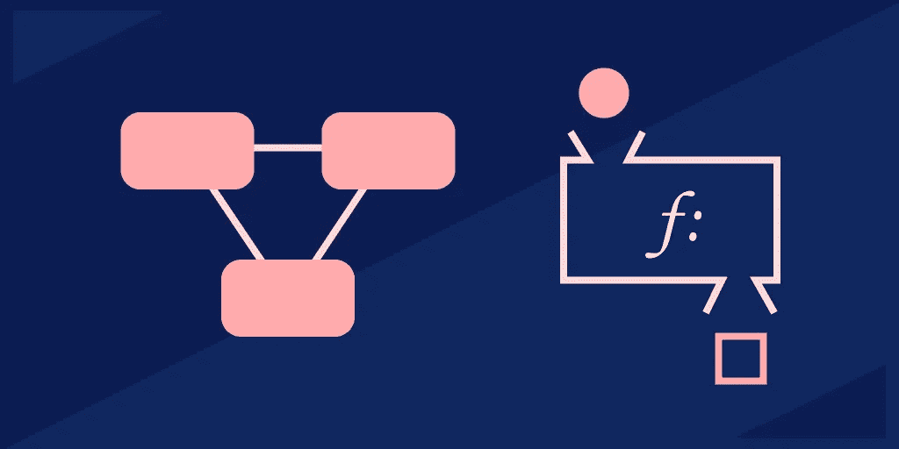
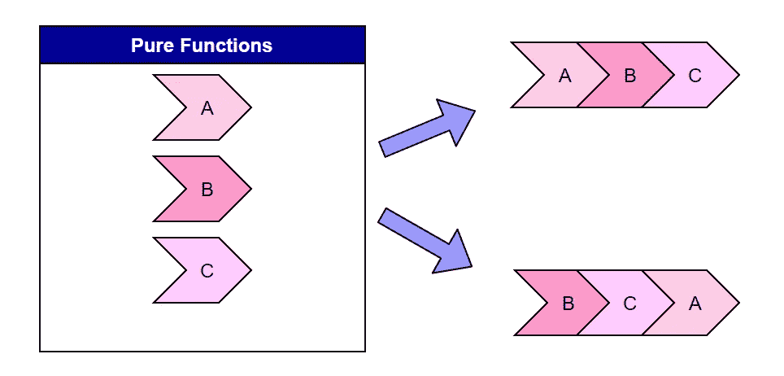

# 用 Python、JavaScript 和 Java 解释函数式编程

> 原文：<https://betterprogramming.pub/functional-programming-explained-in-python-javascript-and-java-2dbf875046a9>

## 学习函数式编程，不管你的语言背景如何



图片来源:作者

函数式编程(FP)是通过组合纯函数来构建软件的过程。如今，雇主正在寻找能够利用多种范例来解决问题的程序员。函数式编程由于其解决现代问题的效率和可伸缩性而特别受欢迎。

但是你如何从 OOP 跳到 FP 呢？

今天，我们将探索函数式编程的核心概念，并向您展示如何用 Python、JavaScript 和 Java 实现它们。

下面是我们今天要讲的内容:

*   什么是函数式编程？
*   函数式编程语言
*   函数式编程的概念
*   用 Python 进行函数式编程
*   JavaScript 函数式编程
*   用 Java 进行函数式编程
*   接下来学什么

# 什么是函数式编程？

*函数式编程*是一种声明式编程范式，通过应用顺序函数而不是语句来创建程序。

每个函数接受一个输入值，并返回一致的输出值，而不会改变程序状态，也不受程序状态的影响。

这些函数完成单个操作，并且可以按顺序组合来完成复杂的操作。函数范式导致高度模块化的代码，因为函数可以在程序中重用，可以被调用、作为参数传递或返回。

*纯函数*不会产生副作用，也不依赖于全局变量或状态。



可视化 FP 函数

当解决方案很容易用函数来表达并且没有什么物理意义时，就使用函数式编程。虽然面向对象的程序模仿真实世界的对象来建模代码，但是函数式编程擅长于中间值或最终值没有物理相关性的数学函数。

函数式编程的一些常见用途是人工智能设计、最大似然分类算法、金融程序或高级数学函数模型。

**简化:**函数式程序依次执行许多纯的、单一用途的函数，以解决复杂的数学或非物理问题。

# 函数式编程的优势

*   **易调试**:纯函数和不可变数据，很容易找到变量值设置在哪里。纯函数受影响的因素较少，因此能让你更容易找到有问题的部分。
*   **懒惰评估**:函数式程序只在需要的时候评估计算。这允许程序重用以前计算的结果并节省运行时间。
*   模块化:纯函数不依赖于外部变量或状态来运行，这意味着它们很容易在程序中重用。此外，函数将只完成一个操作或计算，以确保您可以重用该函数，而不会意外地导入额外的代码。
*   **增强的可读性**:函数式程序易于阅读，因为每个函数的行为都是不可变的，并且与程序的状态相隔离。因此，您通常只需通过名称就可以预测每个函数将做什么。
*   **并行编程**:用函数式编程方法更容易创建并行程序，因为不可变的变量减少了程序中的变化量。每个函数只需要处理用户输入，并且可以相信程序状态将保持不变。

# 函数式编程语言

并非所有的编程语言都支持函数式编程。有些语言，如 Haskell，被设计成函数式编程语言。，其他语言像 JavaScript 有函数能力和 OOP 能力，还有的根本不支持函数编程。

## 函数式编程语言

*   [**Haskell**](https://www.haskell.org/) :这显然是函数式编程最喜欢的语言。它是内存安全的，具有出色的垃圾收集能力，并且由于早期的机器码编译而很快。Haskell 丰富的静态类型系统让您可以访问独特的代数和多态类型，这使得函数式编程更高效、更易读。
*   [**Erlang**](https://www.erlang.org/) :这种语言及其派生语言 Elixir 已经成为并发系统的最佳函数式语言。虽然不如 Haskell 流行或广泛使用，但它通常用于后端编程。Erlang 最近获得了 WhatsApp 和 Discord 等可扩展消息应用的支持。
*   [**Clojure**](https://clojure.org/) :这种语言是在 Java 虚拟机(JVM)上使用的 Lisp 的功能优先方言。它是一种占主导地位的函数式语言，支持可变和不可变的数据结构，但不如这里的其他语言那么严格。如果你喜欢 Lisp，你会喜欢 Clojure。
*   [**F#**](https://fsharp.org/) : F#类似于 Haskell(他们在同一个语言群中)，但是没有那么高级的特性。它也很少支持面向对象的结构。

## 功能语言

*   [**Scala**](https://www.scala-lang.org/)**:**Scala 同时支持 OOP 和函数式编程。它最有趣的特性是类似 Haskell 的强大的静态类型系统，有助于创建强大的函数式程序。Scala 是为解决 Java 批评而设计的，因此对于想要尝试函数式编程的 Java 开发人员来说，它是一种很好的语言。
*   JavaScript :虽然不是函数优先，但 JS 因其异步特性而在函数编程中脱颖而出。JavaScript 还支持基本的函数式编程特性，如 lambda 表达式和析构。这些属性共同标志着 JS 是其他多范例语言中函数式编程的顶级语言。
*   **Python、PHP、C++** :这些多范式语言支持函数式编程，但相对于 Scala 和 JavaScript 来说支持不完全。
*   Java : Java 是一种通用语言，但它领先于基于类的 OOP。lambda 表达式的添加允许您以有限的方式追求更具功能性的风格。Java 最终是一种 OOP 语言，它可以实现函数式编程，但是缺少一些关键的特性，所以这种转变是值得的。

# 函数式编程的概念

函数式程序是根据一些核心概念设计的。

## 变量和函数

函数式程序的核心构件是变量和函数，而不是对象和方法。你应该避免全局变量，因为易变的全局变量会使程序难以理解并导致不纯的函数。

## 纯函数

纯函数有两个属性:

*   它们不会产生副作用。
*   如果给定相同的输入，它们总是产生相同的输出。

如果一个函数改变了程序状态，覆盖了一个输入变量，或者在生成输出的同时做了一些改变，就会产生副作用。纯函数问题较少，因为副作用会使程序状态复杂化。

引用透明意味着任何函数输出都可以用它的值替换，而不会改变程序的结果。这个概念确保您创建的函数只完成单个操作并获得一致的输出。

只有当函数不影响程序状态或者通常试图完成多个操作时，引用透明才是可能的。

## 不变性和状态

不可变的数据或状态一旦被设置就不能被改变，并且允许函数输出的稳定环境是恒定的。不管程序状态如何，对每个函数进行编程以产生相同的结果是最佳实践。如果它依赖于一个状态，这个状态必须是不可变的，以确保函数输出保持不变。

函数式编程方法通常避免共享状态函数(多个函数依赖于同一个状态)和可变状态函数(函数依赖于可变函数)，因为它们会降低程序的模块化程度。如果您必须使用共享状态函数，请将其设为不可变状态。

## 递归

面向对象编程和函数式编程的一个主要区别是，函数式程序避免了像 if-else 语句或循环这样的结构，这些结构会在每次执行时产生不同的输出。

函数式程序使用递归来代替所有迭代任务的循环。

## 一流的功能

函数式编程中的函数被视为一种数据类型，可以像任何其他值一样使用。例如，我们用函数填充数组，将它们作为参数传递，或者将它们存储在变量中。

## 高阶函数

高阶函数可以接受其他函数作为参数或返回函数作为输出。高阶函数允许我们更灵活地调用函数和抽象动作。

## 操作组合

可以顺序执行函数来完成复杂的操作。每个函数的结果作为参数传递给下一个函数。这允许你用一个函数调用来调用一系列的函数。

# 用 Python 进行函数式编程

Python 作为一种多范式语言，部分支持函数式编程。数学程序的一些 Python 解决方案可以用函数方法更容易地实现。

当你开始使用函数式方法时，最困难的转变是减少你使用的类的数量。Python 中的类具有可变属性，这使得创建纯粹的、不可变的函数变得困难。

相反，尽量将大部分代码放在模块级别，只有在需要时才切换到类。

我们来看看如何在 Python 中实现纯的、不可变的函数和一级函数。然后，我们将学习构造函数的语法。

## 纯函数和不可变函数

默认情况下，Python 的许多内置数据结构是不可变的:

*   整数
*   漂浮物
*   布尔型
*   线
*   统一码
*   元组

元组作为数组的不可变形式特别有用。

```
# Python code to test that  
# tuples are immutable tuple1 = (0, 1, 2, 3)  
tuple1[0] = 4
print(tuple1)
```

这段代码导致了一个错误，因为它试图重新分配一个不可变的元组对象。函数式 Python 程序应该经常使用这些不可变的数据结构来实现纯函数。

以下是一个纯函数，因为它没有副作用，并且将始终返回相同的输出:

```
def add_1(x):
    return x + 1
```

## 一流的功能

在 Python 中，函数被视为对象。以下是我们关于如何在 Python 中使用函数的快速指南:

**作为对象的功能**

```
def shout(text): 
    return text.upper()
```

**将函数作为参数传递**

```
def shout(text): 
    return text.upper() def greet(func): 
    # storing the function in a variable 
    greeting = func("Hi, I am created by a function passed as an argument.") 
    print greeting greet(shout)
```

**从另一个函数返回函数**

```
def create_adder(x): 
    def adder(y): 
        return x+y     return adder
```

## 操作组合

为了用 Python 编写函数，我们将使用一个`lambda function`调用。这允许我们在一次调用中调用任意数量的参数。

```
import functoolsdef compose(*functions):
    def compose2(f, g):
        return lambda x: f(g(x))
    return functools.reduce(compose2, functions, lambda x: x)
```

在**第 4 行**，我们将定义一个函数`compose2`，它将两个函数作为参数`f`和`g`。
在**第 5 行**，我们返回一个新函数，表示`f`和`g`的组合。

最后，在**第 6 行**，我们返回复合函数的结果。

# JavaScript 中的函数式编程

由于支持一级函数，JavaScript 长期以来一直提供函数功能。函数式编程最近在 JavaScript 中变得更加流行，因为它在 Angular 和 React 这样的框架中使用时可以提高性能。

让我们来看看如何使用 JavaScript 实现不同的功能概念。我们将关注如何创建核心概念；纯函数，一级函数，函数合成。

## 纯函数和不可变函数

为了开始在 JavaScript 中创建纯函数，我们必须使用普通行为的替代函数，比如`const`、`concat`和`filter()`。

关键字`let`设置一个可变变量。相反，用`const`声明保证了变量是不可变的，因为它防止了重新赋值。

```
const heightRequirement = 46;function canRide (height){
    return height >= heightRequirement;
}
```

我们还需要使用替代函数来操作数组。`push()`方法是将元素追加到数组中的常用方法。不幸的是，`push()`修改了原始数组，因此是不纯的。

相反，我们将使用功能对等物`concat()`。该方法返回一个包含所有原始元素和新添加元素的新数组，使用`concat()`时原始数组不被修改。

```
const a = [1, 2]
const b = [1, 2].concat(3)
```

要从数组中移除一个项目，我们通常使用`pop()`和`slice()`方法。但是，这些功能不起作用，因为它们会修改原始数组。相反，我们将使用`filter()`来创建一个新数组，其中包含所有通过条件测试的元素。

```
const words = ['spray', 'limit', 'elite', 'exuberant', 'destruction', 'present'];const result = words.filter(word => word.length > 6);
```

## 一流的功能

JavaScript 默认支持一级函数。这里有一个在 JavaScript 中我们可以做什么的快速指南。

**将函数分配给变量**

```
const f = (m) => console.log(m)
f('Test')
```

**向数组添加函数**

```
const a = [
  m => console.log(m)
]
a[0]('Test')
```

**将函数作为参数传递**

```
const f = (m) => () => console.log(m)
const f2 = (f3) => f3()
f2(f('Test'))
```

**从另一个函数返回函数**

```
const createF = () => {
  return (m) => console.log(m)
}
const f = createF()
f('Test')
```

## 操作组合

在 JavaScript 中，我们可以用链式函数调用来组合函数:

```
obj.doSomething()
   .doSomethingElse()
```

或者，我们可以将一个函数的执行传递给下一个函数:

```
obj.doSomething(doThis())
```

如果我们想组合更多的函数，我们可以使用`lodash`来简化组合。具体来说，我们将使用`compose`特性，它先给出一个参数，然后给出一个函数列表。

列表中的第一个函数使用原始参数作为其输入。后面的函数从它前面的函数的返回值继承输入参数。

```
import { compose } from 'lodash/fp'const slugify = compose(
  encodeURIComponent,
  join('-'),
  map(toLowerCase),
  split(' ')
)slufigy('Hello World') // hello-world
```

# Java 中的函数式编程

Java 并不像 Python 或 JavaScript 那样真正支持函数式编程。然而，我们可以通过使用 lambda 函数、流和匿名类来模仿 Java 中的函数式编程行为。

最终，Java 编译器没有考虑到函数式编程，因此不能获得函数式编程的许多好处。

## 纯函数和不可变函数

Java 的几个内置数据结构是不可变的:

*   整数
*   布尔型
*   字节
*   短的
*   线

你也可以用`final`关键字创建你自己的不可变类。

```
// An immutable class 
public final class Student 
{ 
    final String name; 
    final int regNo;     public Student(String name, int regNo) 
    { 
        this.name = name; 
        this.regNo = regNo; 
    } 
    public String getName() 
    { 
        return name; 
    } 
    public int getRegNo() 
    { 
        return regNo; 
    } 
}
```

类上的关键字`final`阻止了子类的构造。`name`和`regNo`上的`final`使得对象构建后无法更改值。

这个类也有一个参数化的构造函数，所有变量的 getter 方法，没有 setter 方法，这都有助于使这个类成为一个不可变的类。

## 一流的功能

Java 可以用 lambda 函数实现一级函数。Lambda 像方法一样接受表达式列表，但不需要名称或预定义。

我们可以使用 lambda 表达式来代替函数，因为它们被视为可以传递或返回的标准类对象。

```
// FIRST-CLASS
Supplier<String> lambda = myObject::toString;
// HIGHER-ORDER
Supplier<String> higherOrder(Supplier<String> fn) {
    String result = fn.get();
    return () -> result;
}
```

## 操作组合

Java 包含一个接口`java.util.function.Function`，它给出了函数组合的方法。`compose`方法首先执行传递的函数(`multiplyByTen`)，然后将返回传递给外部函数(`square`)。
`andThen`方法首先执行外部函数*，然后执行其参数内的函数*。

```
Function<Integer, Integer> square = (input) -> input * input;
Function<Integer, Integer> multiplyByTen = (input) -> input * 10;// COMPOSE: argument will be run first
Function<Integer, Integer> multiplyByTenAndSquare = square.compose(multiplyByTen);// ANDTHEN: argument will run last
Function<Integer, Integer> squareAndMultiplyByTen = square.andThen(multiplyByTen);
```

在**第 1 行和第 2 行**，我们首先创建两个函数`square`和`multiplyByTen`。
接下来在**第 5 行和第 8 行**，我们创建两个复合函数`multiplyByTenAndSquare`和`squareAndMultiplyByTen`，每个函数都有两个参数(以满足`square`)。

这些复合函数各自完成两个原始函数，但顺序不同。现在，您可以调用复合函数在同一个输入上执行两个原始函数。

# 接下来学什么

今天，我们回顾了一些通用的函数式编程概念，并探索了这些核心概念是如何出现在 Python、JavaScript 和 Java 中的。

Scala 是复兴的顶级函数式编程语言之一。Twitter 和脸书等许多科技巨头已经采用了 Scala，并在他们的应用程序中寻找它。你的下一步是学习 Scala 的基础知识，作为函数式语言的入门。

*快乐学习！*