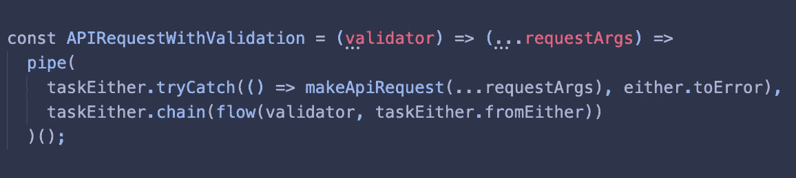

# 函数式编程:如何在 TypeScript 中发送和验证 API 请求

> 原文：<https://betterprogramming.pub/functional-programming-how-to-send-and-validate-api-requests-in-typescript-5954e99f9418>

## 以函数式编程风格发送和验证请求

在 [Unsplash](https://unsplash.com/s/photos/programming?utm_source=unsplash&utm_medium=referral&utm_content=creditCopyText) 上由 [Mazhar Zandsalimi](https://unsplash.com/@m47h4r?utm_source=unsplash&utm_medium=referral&utm_content=creditCopyText) 拍摄的照片

最近，我开始深入研究函数式编程。我开始学习 [Haskell](https://www.haskell.org/) ，但是过了一段时间，我就被那些新概念和抽象概念淹没了。所以我决定先用一种我非常熟悉的编程语言来熟悉这些概念:JavaScript。

这就是为什么我在 GitHub 上启动了一个 [functional-js](https://github.com/Cedomic/functional-js) repo。你也可以在本教程的中找到[代码。](https://github.com/Cedomic/functional-js/blob/master/src/real-life-example.ts)

# 我们将做什么

我们将采用一个基本函数，它向 https://api.exchangeratesapi.io/latest?base={CountryCode}.发送一个 GET 请求

代码如下:

通常我们可以使用这个函数，并对它感到满意。也许如果我们是有远见的开发者，我们会发现可能的错误。

但是我们将以一种更实用的方式重新编写，这种方式还可以验证响应并处理可能发生的所有错误。所有这些都可以通过几行代码实现:

如果你还不知道上面发生了什么，不要担心！让我试着给你解释一下。

# 让我们发挥作用，发挥作用！

我们将使用一个名为 [fp-ts](https://github.com/gcanti/fp-ts) 的出色的函数式编程库。引用 GitHub 上的自述文件:

> “fp-ts 旨在允许开发者使用大多数函数式语言中都有的流行模式和抽象。为此，它包括最流行的数据类型、类型类和抽象，如 Option、要么、IO、Task、Functor、Applicative、Monad，以使用户能够编写基于更高阶抽象的纯 FP 应用和库。”

我们不会真正涵盖这些抽象是什么，但你会发现函子，应用函子，单子等大量的教程。，在线。

# 函子、适用函子和单子

注意:如果你对函子和单子有一点了解，你可以跳过这一节，继续下一节。否则，你可以阅读这一部分来了解我们正在谈论的内容。或者你可以在网上阅读其他教程，然后再回到这个话题。

为了这个教程，我会给你一个什么是函子，适用函子，单子的简单解释。

下面的解释在技术上并不正确，但它让你知道它们是什么和它们做什么，所以你可以理解发生了什么，即使你从未听说过它们。

对于本教程，您可以将它们视为存储值的对象。该值可以是任何值(数组、对象、字符串、数字、函数等。).它们还定义了一些方法，因此您可以使用存储的值。

为了让某个东西成为函子，它必须实现一个`.map()`方法。这种`.map()`方法的工作原理类似于`Array.prototype.map()`。它采用一元函数(接受单个参数的函数)并将它应用于存储在对象内部的值。

适用函子是普通函子的扩展，所以它也有`.map()`方法。除此之外，它还定义了一个`.of()`方法，该方法只获取一个值并将其存储在对象中。

除了`.of()`，它还有一个`.ap()`的方法。`.ap()`取另一个函子(或一个适用的函子或单子；它只需要定义一个`.map()`方法)作为参数，并将其中的内容(通常是一个函数)应用到我们传递给`.ap()`的仿函数中。

当我们在一个仿函数中有一个函数，并且想要用一个也在仿函数中的值来调用这个函数时，我们使用`.ap()`。

单子是普通函子和适用函子的另一种扩展，所以它也有`.map()`、`.of()`、&、**、`.ap()`、**、**的方法。它还有两个附加方法:`.join()` & `.chain()`。**

`.join()`用于函子内部有函子的情况。它展平了函子，所以我们只有函子内部的值，而没有函子内部的值。

`.chain()` 是对`.map(x => Functor(x)).join()`的抽象。它结合了以下操作:将返回另一个仿函数的函数映射到一个仿函数上，然后连接或展平该仿函数以仅包含该值，而不包含另一个包含该值的仿函数。

这不是一个正确的定义，但它给你一个概念，什么函子，适用函子，单子等。，是。对于本教程，您可以简单地将它们视为必须定义了某些方法的对象。可以说，他们必须遵守一些规则或法律。(顺便说一句，它们确实必须遵守一些定律，才能被称为函子、适用函子或单子)。如果你对这些和更多代数结构的确切定义感兴趣，你可以查阅[幻想世界规范](https://github.com/fantasyland/fantasy-land)。你也可以阅读大量的单子教程。

# 现在说点好的

我们已经定义了从 API 获取数据的函数；在这种情况下，我们希望获得所选基础货币的汇率。

让我们定义一个函数来验证我们的响应:

该函数接收一个国家代码，然后检查基础货币是否与该国家代码匹配。

你可能已经看到这是一个 curried 函数。我们传入一个国家代码，并返回一个将响应作为参数的函数(国家代码在函数的闭包中仍然可用)。

这个函数返回一个类型为`either.Either<Error, ExchangeRates>`的东西。

都是可以存储两个值的单子，一个在左边，一个在右边。在左边，你通常存储任何可能发生的错误信息。在右边，您存储了一次成功操作的值。
`Either`单子对于错误处理非常有用。

正如你在上面的函数中看到的，当验证成功时我们执行`either.right`，当验证失败时执行`either.left`。

现在让我们将我们的功能付诸行动吧！

我们将通过管道把我们的函数和 fp-ts 的`pipe()`函数连接在一起。

首先，我们将传入我们的`fetchExchangeRatesForCountry()`函数，它返回一个承诺。

为了让我们的普通函数与`pipe()`函数一起工作，我们必须将它包装在`taskEither.tryCatch()`中，它接受一个返回类型`Lazy<Promise<any>>`的函数和一个处理任何潜在错误的函数。

在我们的例子中，我们将任何潜在的错误包装在一个`Either`单子中。
`taskEither.tryCatch()` 返回一个`TaskEither`单子，这个单子可以处理承诺之类的事情。名字中的“要么”意味着我们也有左侧和右侧来存储我们的值和可能的错误消息。

在我们的`pipe()`函数的下一步中，我们使用`.chain()`方法，这听起来应该很熟悉。

`.chain()`接受一个返回另一个仿函数的函数，将其应用于该仿函数内部的值，然后展平该仿函数。这里我们使用 fp-ts 中的`flow()`函数。`flow()`是从左到右进行函数合成的函数。这里我们编写`validateExchangeRates(countryCode)`，它返回`either.Either<Error, ExchangeRates>`和`taskEither.fromEither()`。

也可以这样写:`taskEither.fromEither(validateExchangeRates(countryCode))`。

我们的`.chain()` 然后返回另一个`TaskEither`单子。这一次，它或者包含响应，或者包含来自验证的错误，分别位于右侧或左侧。

现在我们可以调用我们的`getExchangeRatesForCountry()`函数:

如您所见，它以一个`TaskEither`单子的形式返回 API 的响应。我们的结果在单子的右边。

失败的响应如下所示:

这里我们将错误很好地包装在我们的`TaskEither`单子中，但是现在它在左边。

以下是教程中的完整代码:

对于一个简单的 API 请求来说，我们今天所做的似乎有点太复杂了，我不得不同意。如果您只想发送一个请求并返回任何返回的内容，而不太关心数据或错误，那么保持简单可能更好。但是，如果您想验证数据、处理错误，并可能将它与其他函数和操作结合起来，函数式方法使这变得更容易和更可测试。

我喜欢函数式方法的一点是，我们将传递的数据包装在单子中。通过这种方式，我们可以完全专注于数据流，而不必编写大量 if-else 语句来处理任何丢失的数据，如果处理不当，这些语句可能会引发错误。

通过将我们的值包装在单子中，我们还可以确保在抛出错误时不会继续我们的管道。我们继续管道，但是我们不映射左边的任何值——记住，我们想要的值总是在右边；左边是错误。

# 看得更远

我才刚刚开始真正进入函数式编程，当然甚至还没有触及表面，但我很兴奋地看到函数式编程还能做些什么。

您可以将我们今天所做的做得更进一步，构建一个接受验证器函数和所有请求参数的函数。现在您有了一个函数，它可以向您想要的任何 URL 发送请求，验证返回的任何内容，还可以处理任何错误。

所有这些都在短短的五行中。

漂亮！

非常感谢您的阅读！

# 参考

*   功能性 JS—[https://github.com/Cedomic/functional-js](https://github.com/Cedomic/functional-js)
*   code—[https://github . com/Cedomic/functional-js/blob/master/src/real-life-example . ts](https://github.com/Cedomic/functional-js/blob/master/src/real-life-example.ts)
*   幻想世界规格—【https://github.com/fantasyland/fantasy-land 
*   FP-ts—[https://github.com/gcanti/fp-ts](https://github.com/gcanti/fp-ts)