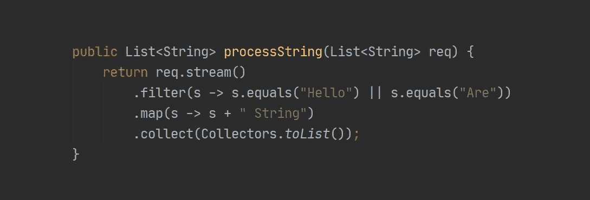

# Java 中的函数式编程，解释

> 原文：<https://betterprogramming.pub/functional-programming-in-java-explained-ae396e9e516f>

## Java 中的函数式编程，带示例

如果您是一名 Java 开发人员，我敢肯定您至少见过一次类似于上面代码片段的代码。上面片段中的代码是 Java 中函数式编程范例实现的一个例子，它将过滤请求中的`List<String>`并将其转换为另一个`List<String>`。

在本文中，我将讲述如何使用 Java 的 API 编写函数式编程代码。最后，我们将编写自己的流 API，这样我们就可以理解如何用 Java 实现函数式编程风格。

# Java 中的函数式编程

Java 中的函数式编程已经存在很长时间了。当甲骨文在 2014 年发布 Java 8 时，他们引入了 [lambda 表达式](https://docs.oracle.com/javase/tutorial/java/javaOO/lambdaexpressions.html)，这是 Java 中函数式编程的核心特性。

让我们看一个例子，说明在 Java 中使用命令式语句序列和使用函数式风格之间的区别。

命令式声明代码示例

函数式代码示例

正如我们所看到的，尽管两段代码实现了相同的结果，但差异是显著的。与函数式代码相比，命令式声明代码有很多花括号，而且更长，这使得它更难阅读。

# 功能接口注释

为了理解函数式编程在 Java 中是如何工作的，首先我们需要看看 Java 8 SDK 中的注释，`@FunctionalInterface`。我们可以在 [Java API 文档网站](https://docs.oracle.com/javase/8/docs/api/java/lang/FunctionalInterface.html)上看看。

从 API 文档中，我们可以看到 Java 中函数接口注释的行为有:

*   它只有一个抽象方法。
*   它可以有多个方法，只要只有一个抽象方法。
*   我们只能加到`Interface`型。
*   我们可以用 lambda 表达式、方法引用或构造函数引用来创建函数接口。
*   我们不需要定义`@FunctionalInterface`，因为编译器会把任何符合函数接口定义的接口都当作函数接口。

# 创建功能接口类

现在我们知道了什么是功能界面，我们可以自己创建它了。

我们先来创建一个名为`Person`的模型。

对于函数接口，我们将创建`PersonFunctionalInterface` 类。

注意，接口中有两个方法，但是由于只有一个抽象方法，`PersonFunctionalInterface` class 作为函数接口是有效的。

但是假设我们定义了不止一个抽象方法，就像这样:

它将产生一个错误:

# 使用功能界面

## 匿名类

我们先来了解一下匿名类。Java [文档](https://docs.oracle.com/javase/tutorial/java/javaOO/anonymousclasses.html#:~:text=Anonymous%20classes%20enable%20you%20to,do%20not%20have%20a%20name)说:

> 匿名类使您的代码更加简洁。它们使您能够同时声明和实例化一个类。除了没有名字之外，它们类似于本地类。如果只需要使用一次局部类，请使用它们。

基本上，有了匿名类，我们就不必定义一个实现我们制作的接口的类。我们可以创建一个没有名字的类，并将它存储在一个变量中。

让我们以声明一个匿名类为例。

我们在这里所做的是创建了一个匿名类，类型为`PersonFunctionalInterface`，名字为`anonClassExample`。

我们覆盖了`createPerson`抽象方法，因此当我们调用该方法时，它将返回一个带有名称的新的 Person 对象。

当我们调用`anonClassExample.createPerson(“Hello, World”)`时，我们基本上只是创建了一个名为“你好，世界”的新人物对象。

# 创建带有函数接口的匿名类

我们可以开始为我们制作的函数接口创建匿名类`PersonFunctionalinterface`。

我们刚刚实现了功能接口！

在上面的代码中，我们以不同的方式创建了三个匿名类。请记住，匿名类的行为是，我们可以用 lambda 表达式、方法引用或构造函数引用来创建函数接口。

为了确保我们创建了行为相同的匿名类，我们断言接口中的每个方法。

# Java 8 中的内置函数接口

Java 8 在`java.util.function`包中有很多内置的函数接口类，我们可以在[它的文档](https://docs.oracle.com/javase/8/docs/api/java/util/function/package-summary.html)中看到。

在本文中，我将只解释四个最常用的函数接口，但是如果您对更多感兴趣，可以在上面提到的 Java API 文档中阅读。

*   `Consumer<T>`:接受对象不返回任何东西的函数接口。
*   `Producer<T>`:不接受任何东西，返回一个对象的函数接口。
*   `Predicate<T>`:接受对象并返回布尔值的函数接口。
*   `Function<T, R>`:接受一个对象，返回另一个对象的函数接口。

# 常见用法

如果你已经用 Java 开发了很多，那么你可能已经了解了函数接口的概念。

## 流和可选 API

Java 的流 API 大量使用函数接口，我们可以在下面的代码中看到。

`filter`方法有一个参数`Predicate<T>`功能接口。正如我们所见，该方法接受了一个`String`，并产生了一个`boolean`。

`map` 方法使用`Function<T, R>`作为其参数。它接受一个`String`并返回`String`。

Stream 中的`forEach`方法和可选的`ifPresent`方法接受`Consumer<T>`，接受一个`String`，不返回任何东西。

## 反应库

两个最流行的 Java 反应库， [RxJava](https://github.com/ReactiveX/RxJava/wiki#:~:text=RxJava%20is%20a%20Java%20VM,programs%20by%20using%20observable%20sequences.) 和 [Reactor](https://projectreactor.io/) ，都基于 Java 8 Streams API，这意味着它们也在代码中使用函数接口。

如果我们看一下 [Reactor 的 Flux API 文档](https://projectreactor.io/docs/core/release/api/)和 [RxJava 的 Observable API 文档](http://reactivex.io/RxJava/javadoc/)，我们可以看到他们的许多方法都接受了函数接口。

# 创建我们自己的流 API

现在我们知道了如何创建和使用功能接口，让我们尝试创建我们自己的流 API，这样我们就可以了解如何实现功能接口。

当然，我们的流式 API 比 Java 的简单得多。

和一个测试类:

好了，我们一个一个来讨论方法。

## 构造器

我们做了两个构造函数，一个构造函数模仿了`Stream.of()` API，另一个构造函数将`List<T>`转换为`SimpleStream<T>`。

## 过滤器

在这个方法中，我们接受`Predicate<T>`作为参数，因为`Predicate<T>` 有一个名为`test`的抽象参数，它接受一个对象并产生一个布尔值。

让我们来看看测试类，我们写道:

这意味着我们编写了一个实现`Predicate<T>`的匿名类:

所以在`SimpleStream<T>`类中，我们可以看到过滤方法为:

## 地图

在 map 方法中，我们接受`Function<T, R>`作为它的参数，这意味着 map 方法将接受一个函数接口，该接口接受一个对象，也产生一个对象。

我们在测试类中编写了以下内容:

这与创建实现`Function<T, R>`的匿名类是一样的:

而在`SimpleStream<T>`类中，我们可以这样来看:

## 为每一个

`forEach`方法接受`Consumer<T>`作为它的参数，这意味着它将接受一个对象并且不返回任何东西。

我们在测试类中编写了以下内容:

这转化为创建一个实现`Consumer<T>`的匿名类:

在`SimpleStream<T>`中，我们可以看到`forEach`的方法，如下:

# 结论

随着 2014 年 Java 8 的发布，我们可以在 Java 中使用函数式编程风格。在 Java 中使用函数式编程风格有很多好处，其中之一就是使您的代码更短，可读性更好。考虑到它所提供的好处，如果您是一名 Java 开发人员，了解 Java 中函数式编程的实现是必不可少的！

感谢阅读这篇文章！

您可以在这里找到本文使用的 GitHub 存储库:

 [## brilianfird/Java-函数式编程

### Java 函数式编程演示。为 brilianfird/java 函数式编程开发作出贡献

github.com](https://github.com/brilianfird/java-functional-programming) 

# 资源

1.  [https://docs . Oracle . com/javase/8/docs/API/Java/lang/functional interface . html](https://docs.oracle.com/javase/8/docs/api/java/lang/FunctionalInterface.html)
2.  [https://docs . Oracle . com/javase/tutorial/Java/javaOO/anonymous classes . html](https://docs.oracle.com/javase/tutorial/java/javaOO/anonymousclasses.html)
3.  [https://www . Amit ph . com/Java-method-and-Constructor-reference/#:~:text = Constructor % 20 reference % 20 is % 20 used % 20 to，assign % 20 to % 20a % 20 target % 20 type](https://www.amitph.com/java-method-and-constructor-reference/#:~:text=Constructor%20Reference%20is%20used%20to,assign%20to%20a%20target%20type)。
4.  [https://docs . Oracle . com/javase/8/docs/API/Java/util/function/package-summary . html](https://docs.oracle.com/javase/8/docs/api/java/util/function/package-summary.html)
5.  [https://docs . Oracle . com/Java se/tutorial/Java/javaOO/lambda expressions . html](https://docs.oracle.com/javase/tutorial/java/javaOO/lambdaexpressions.html)
6.  【http://reactivex.io/RxJava/javadoc/ 
7.  [https://projectreactor.io/docs/core/release/api/](https://projectreactor.io/docs/core/release/api/)