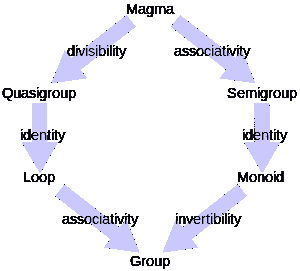

# 函数式编程系列(二):什么是幺半群？

> 原文：<https://betterprogramming.pub/functional-programming-series-2-what-is-a-monoid-75fb23af4319>

## 幺半群是函数编程世界的基础


照片由 [Esther Jiao](https://unsplash.com/@estherrj?utm_source=medium&utm_medium=referral) 在 [Unsplash](https://unsplash.com?utm_source=medium&utm_medium=referral) 上拍摄

对于那些对函数式编程感兴趣的人，我将谈谈*幺半群*以及为什么提前理解它们非常重要。

不要混淆:这不是*单子*——这是*单子。我很肯定你已经知道幺半群，并且你几乎每天都在使用它们——你只是不知道它们的术语。*

# 阅读前

这是一个关于函数式编程的系列，所以如果你没有看过前面的帖子，你可能不明白这篇文章要讲什么。

## 你可以看看与这个话题相关的其他帖子

*   [《函数编程系列(一):什么是半群？](https://medium.com/better-programming/functional-programming-series-what-is-a-semigroup-c1ff987db8c)

# 身份功能

让我们假设有一个名为`identity`的函数，它接受`A`并返回`A`。

```
const identity: <A>(a: A): A => a;interface Student {
  name: string;
  age: number;
}identity<number>(3) // 3
identity<string>('hello') // hello
identity<Student>({ 
  name: 'Bincent',
  age: 5
}); // { name: 'Bincent', age: 5 }
```

在函数式编程中，这个无用的函数(看起来是无用的)是我们将要讨论的许多其他概念(比如幺半群)的重要因素。



图片由[鲁珀特·米勒德](https://commons.wikimedia.org/wiki/User:RupertMillard)在[维基媒体](https://en.wikipedia.org/wiki/Magma_%28algebra%29#/media/File:Magma_to_group2.svg)上提供

基本上，幺半群是保持半群的[规则和单位元规则的元素集合。](https://medium.com/better-programming/functional-programming-series-what-is-a-semigroup-c1ff987db8c)

如果`S`是元素的集合，`a`是`S`的成员，`·`是真二元运算，`a·e = e·a ∈ S`必须满足是幺半群。

```
Identity: a ∈ S, a·e = e·a = a ∈ S
```

一些文档使用数字 1 和下标中的任何字母来调用它——例如， *1x* 引用变量 *x* 上的标识。或者有些文档只使用一个字母，如 *i* 或 *e.*

这就是关于幺半群的所有知识，让我们用一些简单的例子来练习。

# 幺半群例子

这里有一个类`Monoid`可以帮助你理解它的概念。

这个类有三个方法:

*   `concat`:接受两个参数并返回参数之和
*   `identity`:接受一个参数，不做任何事情就返回该参数
*   `pick`:接受一个参数，该参数表示要从集合中选取的元素数量的计数值——这只是为了选取随机元素

和两个断言函数:

*   `assertNumber`:检查参数是否为数字类型。否则，它会抛出一个错误。
*   `assertTrue`:检查参数是否为`boolean`类型和`true`。否则，它会抛出一个错误。

```
const set = new Monoid([1, 2, 3, 4, 5]);
```

我定义了一个只由数字组成的集合，所以集合`set`是一个数字的集合(即使我只放了五个数字，就假设它有无数个数字)。

## 问题 1:这是否满足了岩浆加法运算的规则？

```
const [a, b] = set.pick(2);
assertNumber(a);
assertNumber(b);
assertNumber(a + b);
```

是的。用集合中的两个随机数，每个元素都是一个数类型，把它们相加也是一个数类型。

## 问题 2:这满足半群的加法运算规则吗？

```
const [x, y, z] = set.pick(3);
assertNumber(set.concat(set.concat(x, y), z));
assertNumber(set.concat(x, set.concat(y, z)));
assertTrue(
  set.concat(set.concat(x, y), z) === 
  set.concat(x, set.concat(y, z))
);
```

还有，是的。对于集合中的三个随机数，`(x+y)+z`和`x+(y+z)`是一个数字类型，它们给出相同的结果——运算的顺序无关紧要(结合性)。

## 问题 3:这满足加法运算的幺半群规则吗？

```
const [r] = set.pick(1);
assertNumber(r);
assertNumber(set.identity(r));
assertTrue(set.identity(r) === r);
```

是啊！无论`r`选择一个随机数是什么，`identity`都返回参数，什么都不做。好吧，它给论点加了零，但它根本没有改变论点。

## 结果是…

集合`set`是幺半群。

# 下一步是什么？

理解什么是 magmas、半群和幺半群并不是函数式编程中最重要的学习内容，但是如果你提前知道这些概念，它也会帮助你理解其他理论，比如范畴理论。

本系列的下一个主题可能是范畴理论和函子。

# 资源

*   维基百科上的[幺半群](https://en.wikipedia.org/wiki/Monoid)