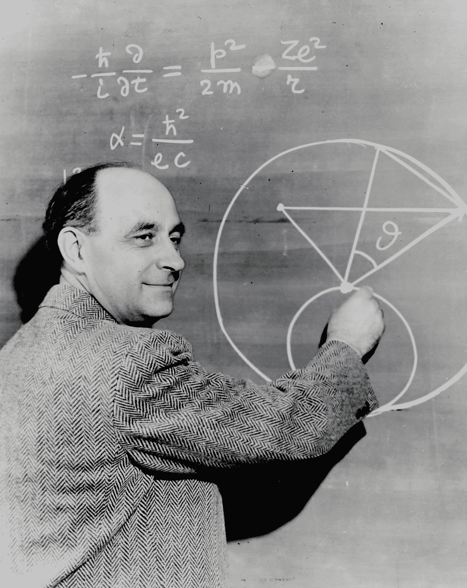
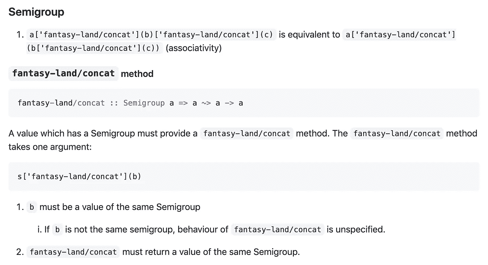

# 函数编程系列(1):什么是半群？

> 原文：<https://betterprogramming.pub/functional-programming-series-what-is-a-semigroup-c1ff987db8c>

## 在函数式编程世界中，这意味着什么？



在 [Unsplash](https://unsplash.com?utm_source=medium&utm_medium=referral) 上[科普高清](https://unsplash.com/@scienceinhd?utm_source=medium&utm_medium=referral)照片

欢迎来到函数式编程系列。在这篇文章中，我将尽可能用最简单的方式来解释 FP 的概念。

我还在学习函数式编程。但是你知道，理解 FP 的每一个概念都是很混乱的。

# 在进入正题之前先说岩浆

为什么我突然想说岩浆？因为 FP 里几乎每一个概念都不是孤立存在的。它们大多来自于类似父母的概念。就像你应该知道什么是运动，才能理解什么是足球。半群来源于岩浆，岩浆是 FP 中许多已有概念的根概念。

假设我们有一个由数字组成的数组，`[1, 2, 3]`，我有一些函数执行如下。

```
const magmas = {
  add: (x: number, y: number): number => x + y,
  sub: (x: number, y: number): number => x - y,
  mul: (x: number, y: number): number => x * y,
  div: (x: number, y: number): number => x / y,
};
```

`magmas`中的所有函数都是两个 arity 函数，接受两个数字并返回一个数字。例如，`magmas.sub(5, 3)`等于 2，一个数字。

假设有一组元素， *S* ，它们都是 *T* 类型(在这个例子中是数字类型)。并且你从 *S* 、 *a* 和*b*中挑选任意两个元素，如果 *a* *b* 的结果也是一个 *T* 类型元素，它是 *S、*的成员，并且如果这对 *S* 中的任意两个元素都有效， *S* 被认为是岩浆。(本例中的符号表示任何使用两个元素的操作)。

```
Magma: a ∈ S, b ∈ S --> a·b ∈ S
```

例如，如果只包含四个二元运算，+，-，*和/，那么`magmas`中的所有函数在运算后总是返回一个数字类型的元素。

# 什么是半群？


图片来自[维基](https://en.wikipedia.org/wiki/Magma_(algebra))

好吧，我在这篇文章的前面说过半群来自岩浆。Magma 是一组元素，它总是确保其中的每一个元素在运算后仍然是同一类型的元素，例如加减。

基本上，如果一个元素的集合 *S* 是半群，那么它的每个元素都必须满足 Magma 的条件。另外，他们还必须遵守以下规则。

如果 *a* 、 *b* 和 *c* 是集合 *S* 的成员，并且其中是二元运算，(*a*bc 必须等于*a*(*b*c)。他们两个的结果一定是 *S* 的成员。

```
Semigroup: a ∈ S, b ∈ S, c ∈ S --> (a·b)·c = a·(b·c) ∈ S
```

而这个特性在 FP 界被称为“结合性”。

让我们扩展我们之前在岩浆章节中使用的例子。我要做的是让这些方法多带一个参数。

```
const semigroups = {
  mul: (x: number, y: number, z: number): number => x * y * z,
};
```

现在它们是三个 arity 函数，接受三个参数并返回一个 Number 类型的元素。

```
semigroups.mul(5, 3, 2) = 10
```

当这三个数相乘时，相乘的顺序并不重要。(5*3)*2 = 5*(3*2).左手边给你的结果是 30，右手边也是。

```
(5 / 3) / 2 = 0.8333...34
5 / (3 / 2) = 3.3333...35
```

但是在这个例子中，每个结果给你一个不同的值。所以(5 / 3) / 2 不等于 5/(3/2)；这不可能是半群算子。

但是我们已经证实乘法可以是半群算子。那么我们可以说(数，*)是一个半**群**。(从“群”这个词可以看出，半群是指一对某类的集合和一个二元算子)

现在轮到你思考加号(+)、减号(-)和除法(/)是否可以是半群算符了。

# 其他函数式编程库是如何使用这个的？

有一些 FP 库。再来看最著名的一个， [*幻境*](https://github.com/fantasyland/fantasy-land) 。

[*幻境*](https://github.com/fantasyland/fantasy-land) 更像是一个关于函数式编程的规范。所以现代函数式编程库通常遵循 [*幻想世界*](https://github.com/fantasyland/fantasy-land) 的指南。



图片是*幻境半群*的截图

在 [*幻境*](https://github.com/fantasyland/fantasy-land#semigroup) 中，半群略有不同。他们的半群必须包含名为`concat`的方法，`concat`在结合律方面必须是无辜的。

```
const concat = (x: string, y: string, z: string): string => {
  return x + y + z;
};
```

让我们检查一下这个`concat`是否真的满足半群需要的所有条件。

1.  这种方法总是能保证是岩浆吗？

是的。如果`x`是“I”，`y`是“like”，`z`是“FP”，`x`、`y`、`z`是 String 的成员，`x+y+z` (IlikeFP)也是 String 的成员。

2.这种方法总是保证它是半群吗？

是的。如果`x`是“I”，`y`是“like”，而`z`是“FP”，`x`、`y`、`z`是字符串的成员，`(x+y)+z` (IlikeFP)等于`x+(y+z)` (IlikeFP)。

# 结论

我们讲过岩浆和半群；两者都是 FP 中的重要概念。他们不太可怕。你需要做的就是努力做出自己的榜样。

推荐你看一下 [*幻境*](https://github.com/fantasyland/fantasy-land) 说明书。

## 资源

*   [https://en . Wikipedia . org/wiki/Magma _(代数)](https://en.wikipedia.org/wiki/Magma_(algebra))
*   【https://en.wikipedia.org/wiki/Semigroup】
*   [https://github.com/fantasyland/fantasy-land](https://github.com/fantasyland/fantasy-land)