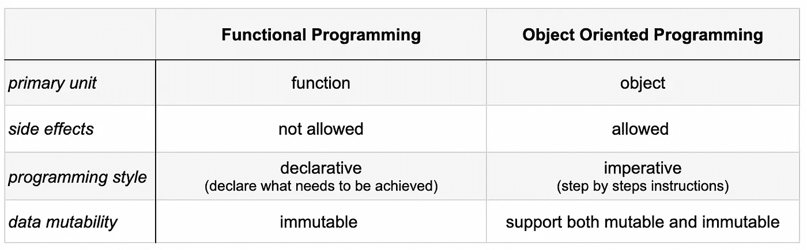

# 函数式编程与面向对象编程——为什么不再需要选择？

> 原文：<https://betterprogramming.pub/functional-programming-vs-object-oriented-programming-why-you-dont-need-to-choose-29820f89f348>

## 对两者中的基本概念以及如何有效地将它们结合起来的高度概述


照片由[布伦丹·丘奇](https://unsplash.com/@bdchu614?utm_source=medium&utm_medium=referral)在 [Unsplash](https://unsplash.com?utm_source=medium&utm_medium=referral) 上拍摄

如果你接受过传统的计算机科学教育，你很可能已经开始学习使用命令式风格编程，即“告诉”计算机确切地做什么以及以什么顺序做。

无论选择哪种语言，这通常都是一个起点，因为它很直观，在学习大量其他概念和理论的同时，可以让您轻松地编写代码。相比之下，函数式编程就不那么容易了，尤其是如果你已经开始使用 OOP(面向对象编程)。

在网上浏览时，你会发现这两种方法是相互对立的，就好像你需要做出一次选择并永远坚持下去。

软件工程师倾向于大胆的陈述，比如“要么全有，要么全无”，“要么站在我这边，要么站在错误的一边”。你会发现任何一方的人都非常坚定地追随被选中者的“纯粹版本”,他们会有很好的论据。

这一次，我没有那么极端。我喜欢以最有效和最干净的方式解决问题，这意味着你要睁大眼睛寻找工具、框架、语言，在这种情况下，你可以混合概念来完成手头的任务。

比起简洁，我更喜欢可维护性和可读性。在大多数情况下，让人们沉迷于代码的简洁会失去对主要目标的跟踪。如果你整个公司或至少整个团队都决心转向纯函数式编程，这没什么，但是如果只有几个开发人员在这里或那里，那么就会产生知识差距，使代码易受攻击——如果团队中的任何其他人需要进行更改，那么引入 bug(如果没有正确测试)的可能性就会增加一倍，或者至少会花费两倍的时间。那些人离开公司会怎么样……大概是花在重写上的时间和金钱。

我想说的是，在决定选择哪一个的时候，需要考虑更多的因素，你不一定非要这样做。我认为有一个非常健康和行为良好的中间阶层。

在我们能够把事情拉到中间之前，我们需要确保我们知道每一个中最基本的概念是什么。

# 面向对象编程

## 1.抽象

抽象是指隐藏具体实现的细节，只通过类中的方法公开一个干净易用的接口。良好抽象的类的主要好处是对代码的修改对调用者来说是透明的。

## 2.遗产

可以将类组织成层次结构，其中子类自动从父类获得许多相同的功能和属性，并且可以覆盖或扩展该功能和数据。它允许直接通过层次结构或者通过定义使用它的函数来重用代码。

## 3.多态性

多态允许定义同名函数的不同实现。这可以通过重载(具有相同名称但不同参数的方法)或重写(提供父类中同名方法的特定于类的实现)来实现。

## 4.包装

在面向对象程序设计中，数据和在其上操作的函数应该被绑定到一个单元，一个类中。这允许一些细节保持私密，并且只暴露对与之交互重要的功能。封装良好的类不允许直接访问其私有数据。

# 函数式编程(FP)概念

## 1.高阶函数

在 FP 中，函数是一等公民，它们可以被赋给变量，作为参数传递，并被存储。接受其他函数作为参数的函数称为 HOF。通常，特别是在编写 Hof 时，我们可能想让代码更通用——允许它接受任何类型。这些被称为多态函数。

## 2.纯函数

函数式程序处理不可变的数据，也就是说，它们不更新变量或修改可变的数据结构。它们用纯功能操作，这是一种不执行任何副作用的功能。

那么，到底什么算是副作用呢？

*   修改超出当前范围的变量
*   就地修改数据结构
*   在对象上设置字段
*   引发异常
*   IO 操作

## 3.递归

在 FP 中，循环被表示为递归函数。

这里有一个特殊的子类——尾部递归，这是指函数进行的递归调用位于尾部。

在 Kotlin 中，如果是这种情况，并且函数被定义为`tailrec`，那么递归被编译成迭代循环，每次迭代都不会消耗调用堆栈帧，这样你就可以得到编译时检查。

为了使函数成为`tailrec`，调用方的递归调用除了返回递归调用的值之外，不应该做任何事情。例如，在这个斐波那契实现中，函数只返回自身。

```
tailrec **fun** fibonacci(n: **Int**, a: **Int** = 0, b: **Int** = 1): **Int** = 
   **when** (n) {
      0 -> a
      1 -> b
      **else** -> fibonacci(n — 1, b, a + b)
   }
```

如果我们用一个调用来生成其他一些奇怪的序列

```
**fun** myRandomSequence(n: **Int**, a: **Int** = 0, b: **Int** = 1): **Int** = 
   **when** (n) {
      0 -> a
      1 -> b
      **else** -> myRandomSequence(n — 1, b, a + b) + 9299
   }
```

编译器将不能把它转换成一个迭代循环，因为我们需要在堆栈中一路向下得到底部的值，并把`9299`加进去，然后一路返回。

## 4.严格和非严格评估

大多数现代编程语言默认使用严格求值。也就是说，表达式在被绑定到变量时就被求值。

这包括何时将它们作为参数传递给函数。相反，作为函数的一个属性，非严格性意味着它可能不会计算一个或多个参数。

这乍听起来可能有些奇怪，但是我们已经熟悉了不评估部分代码的概念。

```
**if (x == true || y == false)  {
  // doA()
} else if (w == true && z == true) {
  // doB()
} else {
  // doC()
}**
```

在上面的例子中，有 3 种语言结构阻止了代码的求值。布尔运算符仅评估第一位——如果满足条件，则评估第一位`or`,否则评估第一位`and`。类似地，如果 if 部分中的条件被评估为真，doA 将被执行，第二个条件以及其他`doX`动作将被跳过。

Kotlin 没有提供一种方法来将函数标记为非严格的，或者将参数标记为非求值的，但是有一种方法可以更明确地表达这个概念。

```
fun nonStrictIf(condition: Boolean, onTrue: () -> Unit, onFalse: () -> Unit) = if (cond) onTrue() else onFalse()val y = nonStrictIf(x==true, { println(“x is true”) }, { println(“x is false”) } )
```

## 5.参照透明度

如果一个表达式的所有出现都可以被它的求值结果替换，而不影响程序的结果，那么它就是引用透明的。回到纯函数的定义，它也必须满足这个定义，并且对于所有引用透明的参数都是引用透明的。

# **对比**总结

从广义上讲，这是两种方法之间的区别:



然而，对我来说，它们不应该是相互排斥的选择，而应该是正交的、互补的意识形态。OOP 是关于建模世界的，而 FP 是关于处理数据的，它们可以自然地结合在一起。

# 两全其美

FP 拒绝状态的概念，尽管它在现实世界中是不可避免的，复杂的应用程序可以从使用这两种方法中获益。最直观、最常见的方法是*“小的时候用功能，大的时候用面向对象”。*本质上，这意味着使用面向对象的概念来设计应用程序并对您的实体进行建模，但是在使用 FP 范例的方法中实现逻辑。

除了可变性和副作用之外，FP 中没有一个来自 OOP 的想法是有争议的或者疯狂的。更重要的是，除了有意识地尝试实现特定的混合模型之外，我认为以不变性为目标，只在绝对必要和不可避免的情况下使用可变对象和变量总是一个好主意。

无论如何，避免副作用也是一个好的实践，为了更好的可测试性和避免 bug。你在 OOP 中的方法也应该只做名字所暗示的事情，这不是核心概念之一，但无论如何这是一个好的设计实践。

还有呢？许多通常被贴上 OOP 标签的语言不仅仅是纯粹的 OOP——Kotlin、Scala，甚至 Java 现在也慢慢地加入了 FP 的一些部分。所以，现在不是关于 OOP 和 FP 的问题，而是关于结合使用它们来实现最高效、最健壮、最干净的应用。

感谢阅读！