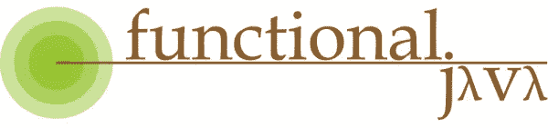

# Java 函数式编程:异常处理

> 原文：<https://betterprogramming.pub/functional-programming-with-java-exception-handling-67f40b1f0330>

## 处理功能代码中破坏性情况的更好方法


照片由[兰迪·法特](https://unsplash.com/@randyfath?utm_source=unsplash&utm_medium=referral&utm_content=creditCopyText)在 [Unsplash](https://unsplash.com/s/photos/different?utm_source=unsplash&utm_medium=referral&utm_content=creditCopyText) 上拍摄

在我之前关于 [函数式](https://medium.com/better-programming/functional-programming-with-java-streams-f930e0e4d184) [编程](https://medium.com/better-programming/functional-programming-with-java-immutability-8dc748e85f9e)的[文章中，我已经展示了如何将一种更函数式的风格融入到我们的 Java 代码中。但是我忽略了一个至关重要的话题:如何处理异常。](https://medium.com/better-programming/functional-programming-with-java-an-introduction-daa783355731)

关于 [Java 异常](https://medium.com/swlh/all-you-ever-wanted-to-know-about-java-exceptions-cfae1dff8504)的文章没有谈到如何在 lambdas 和 streams 中处理它们，因为它值得自己写一篇文章。

```
1\. [Exceptions in Lambdas](#4dc0) 
2\. [Dealing With Exceptions the Java Way](#8a32)
3\. [A More Functional Approach](#060f)
4\. [Third-Party Libraries](#3776)
5\. [Conclusion](#88a2)
6\. [Resources](#3505)
```

# Lambdas 中的异常

> "异常处理是一种机制，用于处理程序控制流中的破坏性异常情况."

Java 异常处理随着时间的推移不断发展，增加了像 [multi-catch](https://medium.com/swlh/all-you-ever-wanted-to-know-about-java-exceptions-cfae1dff8504#7fd0) 或 [try-with-resources](https://medium.com/swlh/all-you-ever-wanted-to-know-about-java-exceptions-cfae1dff8504#3eed) 这样的功能，但遗憾的是，目前还没有针对 lambdas 的任何考虑。我们仍然必须遵守检查异常的 [catch-or-specify 要求](https://medium.com/swlh/all-you-ever-wanted-to-know-about-java-exceptions-cfae1dff8504#338b):

所以我们需要依靠`try` - `catch`来让编译器开心:

我想我们都同意，在 lambda 中直接引入`try` - `catch`是处理 Java 非功能性异常处理的一种糟糕方式。

异常的抛出和处理与我们用功能性更强的编码风格努力实现的目标相反。这相当冗长，并且会导致 [*杂质*](/functional-programming-with-java-an-introduction-daa783355731#c7cd) ，使函数不再具有确定性(相同的输入生成相同的输出)。但是有一些方法可以处理异常，而不会失去函数式编程的简单性和清晰性。

# 用 Java 方式处理异常

例外是一个基本特性，并且会一直存在。尽管我们可能希望有一种替代方案，但我们需要找到一种方法在我们的功能代码中处理它们。

在我们的功能代码中，有几种方法可以使用正常的方法，并取得不同程度的成功。

## 取消检查例外

第一种方法是取消检查我们的异常，从而消除 catch-or-specify 需求。我们可以通过为我们的调用创建一个包装器来做到这一点:

现在，我们可以包装一个现有的函数，正在发生的异常仍然会被抛出——但是作为未检查的`RuntimeException`:

编译器现在可能很高兴，但是我们没有修复可能的控制流中断的一般问题。而且我们根本没有机会在本地处理。

实际上，我们没有处理任何异常——我们只是对编译器隐藏了异常。我们用流操作构建的任何复杂的多步管道，如果其中任何一个抛出异常，都会完全崩溃。

未检查的异常应该是未预料到的，并且通常是不可恢复的。这就是为什么他们一开始就不符合“捕捉或指定”的要求！因此，仅仅为了编译我们的代码而滥用这个概念可能不是我们希望的最佳实践。

即使这种处理方式我们可以接受，那`BiFunction<T,U,R>`、`Consumer<T>`、`Supplier<T>`等呢？？我们需要为任何抛出异常的函数接口创建一个包装器。

## 通过提取处理异常

我们不应该只是通过编写包装来隐藏异常，而是应该实际处理任何异常，以便控制流可以有序地恢复。

方法引用提高了流的可读性，即使没有可视化移除异常处理的优势:

我们可以在`read(File)`中直接处理任何`IOException`，或者，如果不是我们的代码需要更改，我们可以用一个处理方法来包装这个调用:

管道仍然很容易理解，并且`safeRead`给了我们处理异常的可能性。或者，如果不能，我们仍然可以将它作为未检查的异常重新抛出。

## 根本不抛出异常

包装异常和将代码提取到方法只是对现有代码的抽象，因此我们可以控制破坏性的情况。

如果我们控制了 API，我们就可以以一种不需要异常的方式来设计契约。或者至少更容易管理。

Java 为我们提供了`[java.util.Optional](https://medium.com/better-programming/better-null-handling-with-java-optionals-4793a8566710)`来表示一个不存在的值，可以用更函数化的方式来处理。我们应该尽可能避免返回`null`(希望)一劳永逸地消灭可怕的`NullPointerException`。返回空集合[而不是`null`也会有所帮助。](https://medium.com/better-programming/utility-classes-of-the-jdk-collections-and-arrays-cc07dbcb8586#b51a)

请记住，`null`并不总是等同于*没有找到值*。返回`null`可能意味着与返回`Optional<T>.empty()`或空集合完全不同的东西。这很大程度上取决于我们的需求以及我们如何设计 API 契约。

异常应该是关于我们的控制流的附加信号。但是在一个更实用的环境中，我们应该试着放弃其中的一些，尤其是那些不太明显的。这将使我们的代码更容易理解和推理。

# 更实用的方法

我们必须记住，Java 是一种通用语言，其核心是基于类的面向对象。即使添加了 lambdas、方法引用、流等。，它没有成为一种成熟的函数式语言。但是我们可以看看其他功能更强的语言，看看如何更好地处理异常情况。

Scala 也是一种运行在 JVM 上的通用语言。它解决了 Java 的许多缺点，并作为一等公民支持函数式编程。

## 选项'，'一些'，'无'

`[Option[+A]](https://www.scala-lang.org/api/current/scala/Option.html)`类型是 Scala 处理可空值的方式，就像`[java.util.Optional<T>](https://docs.oracle.com/en/java/javase/11/docs/api/java.base/java/util/Optional.html)`一样。但是它不仅仅是另一个对象的(智能)通用包装器，而是为您提供了对结果的更细粒度的控制，直接内置于语言本身:

它没有抛出一个可能的异常，而是被直接处理并替换为一个`[Option[Int]](https://www.scala-lang.org/api/current/scala/Option.html)`。现在可以通过模式匹配或提供的任何方法来处理它。

`[Option[+A]](https://www.scala-lang.org/api/current/scala/Option.html)`比`[java.util.Optional<T>](https://docs.oracle.com/en/java/javase/11/docs/api/java.base/java/util/Optional.html)`更强大，但是它缺少由异常提供的额外信息:哪里出错了。

## 尝试'，'成功'，'失败'和'任一'

Scala 提供了额外的类型来缩小这个差距:

`[Try[+T]](https://www.scala-lang.org/api/current/scala/util/Try.html)`和`Option[+A]`一样，返回两个可能的值:

*   `[Success[+T]](https://www.scala-lang.org/api/current/scala/util/Success.html)`
*   `[Failure[+T]](https://www.scala-lang.org/api/current/scala/util/Failure.html)`

让我们改变之前的示例，使用这些类型，这样它们可以提供更多信息:

除了`[Try[+T]](https://www.scala-lang.org/api/current/scala/util/Try.html)`，还有一个更通用的`[Either[+A, +B]](https://www.scala-lang.org/api/current/scala/util/Either.html)`，不绑定`[Throwable](https://www.scala-lang.org/api/current/scala/index.html#Throwable=Throwable)`。

这是一个很棒的 Scala 特性，但是这对我们的 Java 代码意味着什么呢？

## 用 Java 尝试'和'任一'

`[Try[+T]](https://www.scala-lang.org/api/current/scala/util/Try.html)`和`[Either[+A, +B]](https://www.scala-lang.org/api/current/scala/util/Either.html)`背后的一般概念也可以在 Java 中应用，尽管不如 Scala 中做得好。

`[Try[+T]](https://www.scala-lang.org/api/current/scala/util/Try.html)`最基本的功能可以用大约 120 行代码复制:

我们之前的 Scala 示例现在可以在 Java 中复制:

仍然有很多需要改进的地方，特别是处理和从失败中恢复的方法。但是你应该知道这里应该完成什么的大概意思。

通过使用[不相交并集](https://en.wikipedia.org/wiki/Disjoint_union)类型，我们获得了在单个对象中表示多个状态的可能性。其他语言使用基于元组的模式，比如 [Golang 错误处理](https://blog.golang.org/error-handling-and-go)，来实现同样的目的。但是一个专用类型可以用方法扩展，比如`[map](https://www.scala-lang.org/api/current/scala/util/Try.html#map%5BU%5D(f:T=%3EU):scala.util.Try%5BU%5D)`、`[flatMap](https://www.scala-lang.org/api/current/scala/util/Try.html#flatMap%5BU%5D(f:T=%3Escala.util.Try%5BU%5D):scala.util.Try%5BU%5D)`、`[fold](https://www.scala-lang.org/api/current/scala/util/Try.html#fold%5BU%5D(fa:Throwable=%3EU,fb:T=%3EU):U)`等。，以更好地适应函数式编码风格。

# 第三方库

我们不需要自己实现所有的类型和功能，而是可以依赖一个久经考验的库。像`Either`这样的联合类型或者像`Try`这样改进的异常处理有多种选择。

## Vavr


[https://www.vavr.io/](https://www.vavr.io/)

Vavr 项目的目标是提供使 Java 更具功能性所需的所有工具，比如不变性和所有缺失的功能控制结构。

还支持模式匹配:

## 函数式 Java



【https://www.functionaljava.org/ 

另一个选择是[函数式 Java](http://www.functionaljava.org/) 库。它没有提供显式的`Try`类型，但是使用它的不相交联合类型`Either<A,B>`，可以获得相同的结果。

## jOOλ


[https://github.com/jOOQ/jOOL](https://github.com/jOOQ/jOOL)

一个伟大的 SQL 库 [jOOQ](https://www.jooq.org/) 的创建者也创建了 [jOOλ](https://github.com/jOOQ/jOOL) ，它提供了 Java 的 lambdas 的一些缺失部分。

它并不意味着像前两个框架一样是一个完整的功能解决方案。最好的部分是它的`Seq<T>`型，就像是类固醇上的`Stream<T>`。为了处理异常，它提供了包装器来轻松取消选中的异常:

# 结论

在我们的函数式 Java 代码中，处理异常的最好方法是什么？我不能给你一个确定的答案，但希望这篇文章能给你一些可能性。

选择哪种样式或库很大程度上取决于我们打算如何使用它并将其合并到我们的项目中。

全功能方法可能意味着彻底改变我们设计和编码 API 的方式。仅仅取消对异常的检查可能还不够。

在提交样式或库之前，确保它是一个很好的选择。在选定一种特定的风格或库之前，最好的办法是用小型概念验证项目尝试多种方法。

如果你决定包含一个第三方库，这不是一个容易的决定，不应该轻易做出。每个依赖都有一个学习曲线、隐藏成本和未来技术债务的可能性。

# 资源

*   [“处理 Java 流中被检查的异常](https://www.oreilly.com/content/handling-checked-exceptions-in-java-streams/)”(O ' Reilly)
*   [“使用 Vavr 在 Java 8 流中实现更好的异常处理](https://www.freecodecamp.org/news/better-exception-handling-in-java-8-streams-using-vavr-6eda31285ce9/)”(freeCodeCamp)
*   [《Scala 函数错误处理](https://docs.scala-lang.org/overviews/scala-book/functional-error-handling.html)》(Scala 书籍)
*   [《Vavr 简介](https://www.baeldung.com/vavr)》(bael dung)
*   [《函数式 Java 简介](https://www.baeldung.com/java-functional-library)》(bael dung)
*   [《jOOL 入门](https://www.baeldung.com/jool)(拜尔东)》

## 我的相关文章

[](https://medium.com/swlh/all-you-ever-wanted-to-know-about-java-exceptions-cfae1dff8504) [## 你想知道的关于 Java 异常的一切

### 为什么，怎么做，该做什么和不该做什么

medium.com](https://medium.com/swlh/all-you-ever-wanted-to-know-about-java-exceptions-cfae1dff8504) [](https://medium.com/better-programming/functional-programming-with-java-immutability-8dc748e85f9e) [## Java 函数式编程:不变性

### 具有不可变状态的更好的数据结构

medium.com](https://medium.com/better-programming/functional-programming-with-java-immutability-8dc748e85f9e) [](https://medium.com/better-programming/functional-programming-with-java-streams-f930e0e4d184) [## Java 函数式编程:流

### 最佳实践概述

medium.com](https://medium.com/better-programming/functional-programming-with-java-streams-f930e0e4d184) [](https://medium.com/better-programming/functional-programming-with-java-whats-in-the-box-4c0ee20035af) [## Java 函数式编程:盒子里是什么

### JDK 中可用的不同种类的功能接口

medium.com](https://medium.com/better-programming/functional-programming-with-java-whats-in-the-box-4c0ee20035af) [](https://medium.com/better-programming/functional-programming-with-java-an-introduction-daa783355731) [## Java 函数式编程:简介

### Java 从来就不是函数式语言，但这并不意味着我们不能尝试

medium.com](https://medium.com/better-programming/functional-programming-with-java-an-introduction-daa783355731) [](https://medium.com/better-programming/better-null-handling-with-java-optionals-4793a8566710) [## 使用 Java 选项更好地处理空值

### 可怕的 NullPointerException 是许多 Java 开发人员的祸根

medium.com](https://medium.com/better-programming/better-null-handling-with-java-optionals-4793a8566710)