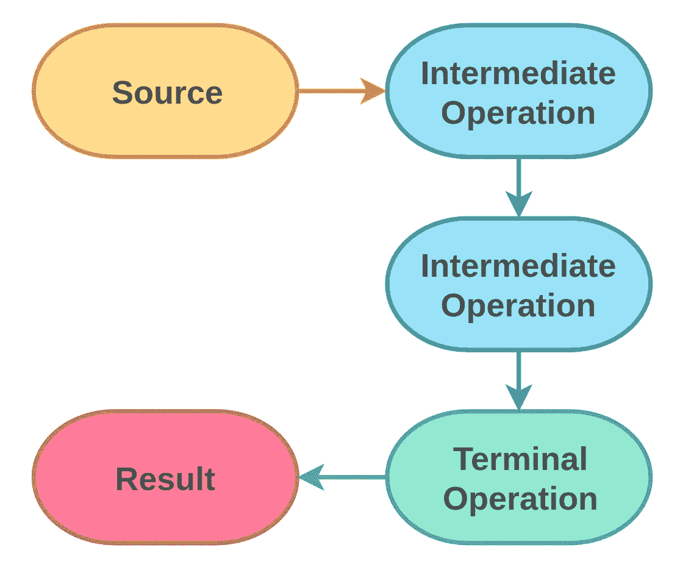

# Java 函数式编程:流

> 原文：<https://betterprogramming.pub/functional-programming-with-java-streams-f930e0e4d184>

## 最佳实践概述

西蒙·博克斯在 [Unsplash](https://unsplash.com/@simonlerouge?utm_source=unsplash&utm_medium=referral&utm_content=creditCopyText) 上拍摄的照片

Java 8 给了我们[流 API](https://docs.oracle.com/javase/8/docs/api/java/util/stream/package-summary.html) ，一个功能块的惰性顺序数据管道。它不是作为数据结构来实现的，也不是通过直接改变其元素来实现的。它只是一个*哑*管道，提供了操作的脚手架，使它真正成为一个*智能*管道。

# 基本概念

streams 背后的基本概念很简单:我们得到一个数据源，执行零个或多个中间操作，然后得到一个结果。

流量

流的各个部分可以分为三组:

*   获取流(源)
*   工作(中间操作)
*   获得结果(终端操作)

## 获取流

第一步是获取流。JDK 的许多数据结构已经支持提供流:

*   `[java.util.Collection#stream()](https://docs.oracle.com/javase/8/docs/api/java/util/Collection.html#stream--)`
*   `[java.util.Arrays#stream(T[] array)](https://docs.oracle.com/javase/8/docs/api/java/util/Arrays.html#stream-T:A-)`
*   `[java.nio.file.Files#list(Path dir)](https://docs.oracle.com/javase/8/docs/api/java/nio/file/Files.html#list-java.nio.file.Path-)`
*   `[java.nio.file.Files#lines(Path path)](https://docs.oracle.com/javase/8/docs/api/java/nio/file/Files.html#lines-java.nio.file.Path-)`

或者我们可以通过使用`[java.util.stream.Stream#of(T... values)](https://docs.oracle.com/javase/8/docs/api/java/util/stream/Stream.html#of-T...-)`和我们的价值观来创造一个。类`[java.util.StreamSupport](https://docs.oracle.com/javase/8/docs/api/java/util/stream/StreamSupport.html)`也提供了大量的`static`方法来创建流。

## 做工作

`[java.util.Stream](https://docs.oracle.com/javase/8/docs/api/java/util/stream/Stream.html)`接口提供了许多不同的操作。

**过滤**

*   `[filter(Predicate<? super T> predicate)](https://docs.oracle.com/javase/8/docs/api/java/util/stream/Stream.html#filter-java.util.function.Predicate-)`
*   `[distinct()](https://docs.oracle.com/javase/8/docs/api/java/util/stream/Stream.html#distinct--)`

**映射**

*   `[map(Function<? super T, ? extends R> mapper)](https://docs.oracle.com/javase/8/docs/api/java/util/stream/Stream.html#map-java.util.function.Function-)`
*   `[mapToInt(ToIntFunction<? super T> mapper)](https://docs.oracle.com/javase/8/docs/api/java/util/stream/Stream.html#mapToInt-java.util.function.ToIntFunction-)`
*   `[mapToLong(ToLongFunction<? super T> mapper)](https://docs.oracle.com/javase/8/docs/api/java/util/stream/Stream.html#mapToLong-java.util.function.ToLongFunction-)`
*   `[mapToDouble(ToDoubleFunction<? super T> mapper)](https://docs.oracle.com/javase/8/docs/api/java/util/stream/Stream.html#mapToDouble-java.util.function.ToDoubleFunction-)`
*   `[flatMap(Function<? super T, ? extends Stream<? extends R>> mapper)](https://docs.oracle.com/javase/8/docs/api/java/util/stream/Stream.html#flatMap-java.util.function.Function-)`
*   `[flatMapToInt(Function<? super T, ? extends IntStream> mapper)](https://docs.oracle.com/javase/8/docs/api/java/util/stream/Stream.html#flatMapToInt-java.util.function.Function-)`
*   `[flatMapToLong(Function<? super T, ? extends LongStream> mapper)](https://docs.oracle.com/javase/8/docs/api/java/util/stream/Stream.html#flatMapToLong-java.util.function.Function-)`
*   `[flatMapToDouble(Function<? super T, ? extends DOubleStream> mapper)](https://docs.oracle.com/javase/8/docs/api/java/util/stream/Stream.html#flatMapToDouble-java.util.function.Function-)`

**尺寸/分类**

*   `[skip(long n)](https://docs.oracle.com/javase/8/docs/api/java/util/stream/Stream.html#skip-long-)`
*   `[limit(long maxSize)](https://docs.oracle.com/javase/8/docs/api/java/util/stream/Stream.html#limit-long-)`
*   `[sorted()](https://docs.oracle.com/javase/8/docs/api/java/util/stream/Stream.html#sorted--)`
*   `[sorted(Comparator<? super T> comparator)](https://docs.oracle.com/javase/8/docs/api/java/util/stream/Stream.html#sorted-java.util.Comparator-)`

**调试**

*   `[peek(Consumer<? super T> action)](https://docs.oracle.com/javase/8/docs/api/java/util/stream/Stream.html#peek-java.util.function.Consumer-)`

## 得到结果

在流元素上执行操作非常棒。但是在某些时候，我们希望从我们的数据管道中得到一个结果。

终端操作启动惰性管道来完成实际工作，并且不返回新的流。

**聚合到新的集合/数组**

*   `[R collect(Collector<? super T, A, R> collector)](https://docs.oracle.com/javase/8/docs/api/java/util/stream/Stream.html#collect-java.util.stream.Collector-)`
*   `[R collect(Supplier<R> supplier, BiConsumer<R, ? super T> accumulator, BiConsumer<R, R> combiner)](https://docs.oracle.com/javase/8/docs/api/java/util/stream/Stream.html#collect-java.util.function.Supplier-java.util.function.BiConsumer-java.util.function.BiConsumer-)`
*   `[Object[] toArray()](https://docs.oracle.com/javase/8/docs/api/java/util/stream/Stream.html#toArray--)`
*   `[A[] toArray(IntFunction<A[]> generator)](https://docs.oracle.com/javase/8/docs/api/java/util/stream/Stream.html#toArray-java.util.function.IntFunction-)`

**减少到单一值**

*   `[T reduce(T identity, BinaryOperator<T> accumulator)](https://docs.oracle.com/javase/8/docs/api/java/util/stream/Stream.html#reduce-java.util.function.BinaryOperator-)`
*   `[Optional<T> reduce(BinaryOperator<T> accumulator)](https://docs.oracle.com/javase/8/docs/api/java/util/stream/Stream.html#reduce-U-java.util.function.BiFunction-java.util.function.BinaryOperator-)`
*   `[U reduce(U identity, BiFunction<U, ? super T, U> accumulator, BinaryOperator<U> combiner)](https://docs.oracle.com/javase/8/docs/api/java/util/stream/Stream.html#reduce-U-java.util.function.BiFunction-java.util.function.BinaryOperator-)`

**计算**

*   `[Optional<T> min(Comparator<? super T> comparator)](https://docs.oracle.com/javase/8/docs/api/java/util/stream/Stream.html#min-java.util.Comparator-)`
*   `[Optional<T> max(Comparator<? super T> comparator)](https://docs.oracle.com/javase/8/docs/api/java/util/stream/Stream.html#max-java.util.Comparator-)`
*   `[long count()](https://docs.oracle.com/javase/8/docs/api/java/util/stream/Stream.html#count--)`

**匹配**

*   `[boolean allMatch(Predicate<? super T> predicate)](https://docs.oracle.com/javase/8/docs/api/java/util/stream/Stream.html#allMatch-java.util.function.Predicate-)`
*   `[boolean anyMatch(Predicate<? super T> predicate)](https://docs.oracle.com/javase/8/docs/api/java/util/stream/Stream.html#anyMatch-java.util.function.Predicate-)`
*   `[boolean noneMatch(Predicate<? super T> predicate)](https://docs.oracle.com/javase/8/docs/api/java/util/stream/Stream.html#noneMatch-java.util.function.Predicate-)`

**发现**

*   `[Optional<T> findAny()](https://docs.oracle.com/javase/8/docs/api/java/util/stream/Stream.html#findAny--)`
*   `[Optional<T> findFirst()](https://docs.oracle.com/javase/8/docs/api/java/util/stream/Stream.html#findFirst--)`

**消费**

*   `[void forEach(Consumer<? super T> action)](https://docs.oracle.com/javase/8/docs/api/java/util/stream/Stream.html#forEach-java.util.function.Consumer-)`
*   `[void forEachOrdered(Consumer<? super T> action)](https://docs.oracle.com/javase/8/docs/api/java/util/stream/Stream.html#forEachOrdered-java.util.function.Consumer-)`

# 河流特征

流不仅仅是美化了的循环。当然，我们可以用循环来表达任何流——也可以用流来表达大多数循环。但这并不意味着它们是平等的，或者一个总是比另一个好。

## 怠惰

流相对于循环的最大优势是懒惰。直到我们在一个流上调用一个终端操作，才完成任何工作。我们可以随着时间的推移建立我们的处理管道，并且只在我们希望的确切时间运行它。

不仅仅是管道的建设是懒惰的。大多数中间操作也很懒。元素只有在需要的时候才会被消耗。

## (大部分)无国籍

函数式编程的主要支柱之一是不可变的状态。大多数中间操作都是无状态的，除了`[distinct()](https://docs.oracle.com/javase/8/docs/api/java/util/stream/Stream.html#distinct--)`、`[sorted(...)](https://docs.oracle.com/javase/8/docs/api/java/util/stream/Stream.html#sorted--)`、`[limit(...)](https://docs.oracle.com/javase/8/docs/api/java/util/stream/Stream.html#limit-long-)`和`[skip(...)](https://docs.oracle.com/javase/8/docs/api/java/util/stream/Stream.html#skip-long-)`。

即使 Java 允许构建有状态的 lambdas，我们也应该努力将它们设计成无状态的。任何状态都可能对安全性和性能产生严重影响，并可能带来意想不到的副作用。

## 包括优化

由于(大部分)无状态，流可以非常有效地优化自己。无状态的中间操作可以[融合](https://stackoverflow.com/a/35070889/12367039)在一起成为一个组合消费者。多余的操作可能会被删除。并且一些管道路径可能短路。

JVM 也将优化传统的[循环](https://blogs.oracle.com/javamagazine/loop-unrolling)。但是由于流的多操作设计，流更容易成为目标，并且大多数情况下是无状态的。

## 不可重复使用

由于只是一个哑管道，流不能被重用。但是它们不会改变原始数据源——我们总是可以从数据源创建另一个流。

## 较少样板文件

流通常更容易阅读和理解。

这是一个带有`for`循环的简单数据处理示例:

此代码相当于:

我们有一个更短的代码块，更清晰的操作，没有循环样板文件，也没有额外的临时变量。全部打包在一个流畅的 API 中。这样，我们的代码反映了*什么，*什么，我们不再需要关心实际的迭代过程，*如何。*

## 易于并行化

并发很难做对，也很容易做错。流支持并行执行(`forkJoin`)，如果我们自己来做，可以减少很多开销。

可以通过调用中间操作`[parallel()](https://docs.oracle.com/javase/8/docs/api/java/util/stream/BaseStream.html#parallel--)`将流并行化，并通过调用`[sequential()](https://docs.oracle.com/javase/8/docs/api/java/util/stream/BaseStream.html#sequential--)`将其转换回顺序。但并不是每个流管道都适合并行处理。

源代码必须足够大，操作成本必须足够高，以证明多线程的开销是合理的。上下文切换是昂贵的。我们不应该仅仅因为可以就并行化一个流。

## 原始处理

就像[函数接口](https://medium.com/better-programming/functional-programming-with-java-whats-in-the-box-4c0ee20035af#839b)一样，流有专门的类来处理原语，以避免自动装箱/取消装箱:

*   `[java.util.stream.IntStream](https://docs.oracle.com/javase/8/docs/api/java/util/stream/IntStream.html)`
*   `[java.util.stream.LongStream](https://docs.oracle.com/javase/8/docs/api/java/util/stream/LongStream.html)`
*   `[java.util.stream.DoubleStream](https://docs.oracle.com/javase/8/docs/api/java/util/stream/DoubleStream.html)`

# 最佳实践和注意事项

## 较小的操作

如果用花括号括起来，Lambdas 可以是简单的一行代码，也可以是巨大的代码块。为了保持简单和简洁，我们应该将自己限制在操作的这两个用例上:

*   单行表达式—例如`.filter(album -> album.getYear() > 4)`
*   方法引用—例如`filter(this::myFilterCriteria)`

通过使用方法引用，我们可以进行更复杂的操作，重用操作逻辑，甚至更容易进行单元测试。

## 方法引用

使用方法引用不仅会影响简单性和简洁性。字节码级别上也有暗示。

lambda 和方法引用[之间的字节码略有不同](https://medium.com/better-programming/functional-programming-with-java-an-introduction-daa783355731#7ffc)——方法引用生成的代码更少。lambda 可能会被翻译成调用主体的匿名类，从而创建比所需更多的代码。

此外，通过使用方法引用，我们失去了 lambda 的视觉噪声:

## 造型和类型检查

不要忘记`[Class<T>](https://docs.oracle.com/javase/8/docs/api/java/lang/Class.html)`也是一个对象，提供了许多有用的方法:

## 返回值或检查是否为空

中间操作要么返回值，要么在下一个操作中处理`null`。

添加一个简单的`.filter([Objects::nonNull](https://docs.oracle.com/javase/8/docs/api/java/util/Objects.html#nonNull-java.lang.Object-))`可能足以确保没有 npe。

## 代码格式

通过将每个管道步骤放入一个新行，我们可以提高可读性:

它还允许我们在正确的流水线步骤设置断点。

## 不是每个迭代都是一个流

如前所述，我们不应该替换每个循环。仅仅因为它迭代，并不使它成为基于流的处理的有效目标。通常，传统的循环可能比在流中使用`[forEach(...)](https://docs.oracle.com/javase/8/docs/api/java/util/stream/Stream.html#forEach-java.util.function.Consumer-)`更好。

## 有效最终

我们可以访问中间操作之外的变量，只要它们在作用域内并且是有效的 final。这意味着初始化后不允许改变，但不需要显式的`final`修饰符。

有时这种限制看起来很麻烦，我们可以有效地改变 final 对象的状态，只要变量是 final。但是这样做破坏了不变性的概念，并引入了意想不到的副作用。

## 检查异常

流和异常是一个主题，应该有它们自己的文章，但是我将尝试对其进行总结。

这段代码无法编译:

方法`[Class.forName(String className)](https://docs.oracle.com/javase/8/docs/api/java/lang/Class.html#forName-java.lang.String-)`抛出一个检查过的异常`[ClassNotFoundException](https://docs.oracle.com/javase/8/docs/api/java/lang/ClassNotFoundException.html)` 并需要一个`try-catch`，使得代码难以阅读:

通过将`className`转换重构为一个专用的方法，我们可以零售流的简单性:

我们仍然需要处理可能的`null`值，但是被检查的异常在流代码中是不可见的。

处理检查异常的另一个解决方案是将中间操作包装在消费者/函数等中。捕捉已检查的异常并将其作为未检查的异常重新抛出。但是，在我看来，这更像是一个丑陋的黑客，而不是一个有效的解决方案。

如果一个操作抛出了一个检查过的异常，我们应该把它重构为一个方法，并相应地处理它的异常。

## 未检查的异常

即使我们处理了所有检查过的异常，我们的流仍然会由于未检查的异常而爆炸。

没有一个放之四海而皆准的解决方案来防止异常，就像没有任何其他代码一样。开发人员纪律可以大大降低风险。使用定义明确的小型操作，并进行足够的检查和验证。这样至少可以把风险降到最低。

## 排除故障

流可以像任何其他流畅的调用一样进行调试。如果我们在一行中有一个单独的操作，断点将相应地停止。但是为 lambdas 创建匿名类会导致非常混乱的堆栈跟踪。

在开发过程中，我们也可以利用中间操作`[peek(Consumer<? super T> action)](https://docs.oracle.com/javase/8/docs/api/java/util/stream/Stream.html#peek-java.util.function.Consumer-)`来截取一个元素。该操作主要用于调试目的，不应在流的最终形式中使用。

IntelliJ 提供了一个[可视化调试器](https://plugins.jetbrains.com/plugin/9696-java-stream-debugger)。

## 操作顺序

想象一个简单的流:

这段代码将运行`map`五次，`sorted`八次，`filter`五次，`forEach`两次。这意味着总共 20 次运算来输出两个值。

如果我们对管道零件进行重新排序，我们可以显著减少总操作数，而不会改变实际结果:

通过首先过滤，我们将把其他操作限制到最少:`filter`五次，`map`两次，`sort`一次，`forEach`两次，这样总共节省了 10 次操作。

# Java 9 增强

Java 9 给 streams 带来了四个新特性:

*   `[dropWhile​(Predicate<? super T> predicate)](https://docs.oracle.com/javase/9/docs/api/java/util/stream/Stream.html#dropWhile-java.util.function.Predicate-)`
    删除元素，直到遇到第一个`false`谓词。
*   `[takeWhile​(Predicate<? super T> predicate)](https://docs.oracle.com/javase/9/docs/api/java/util/stream/Stream.html#takeWhile-java.util.function.Predicate-)`
    接受元素，直到遇到第一个`false`谓词。
*   `[Stream<T> ofNullable​(T t)](https://docs.oracle.com/javase/9/docs/api/java/util/stream/Stream.html#ofNullable-T-)`
    如果 nullable 不为空，则返回单元素流，否则返回空流。
*   `[iterate​(T seed, Predicate<? super T> hasNext, UnaryOperator<T> next)](https://docs.oracle.com/javase/9/docs/api/java/util/stream/Stream.html#iterate-T-java.util.function.Predicate-java.util.function.UnaryOperator-)`
    生成一个有限流，相当于一个`for` 循环，像`Stream.iterate(0, i -> i < 10, i -> i + 1)`一样。

# 资源

*   [Java SE 8 的流包文档](https://docs.oracle.com/javase/8/docs/api/java/util/stream/package-summary.html) (Oracle)
*   [《Java 8 流 API 教程](https://www.baeldung.com/java-8-streams)》(bael dung)

## 相关文章

 [## Java 函数式编程:不变性

### 具有不可变状态的更好的数据结构

medium.com](https://medium.com/better-programming/functional-programming-with-java-immutability-8dc748e85f9e)  [## Java 函数式编程:盒子里是什么

### JDK 中可用的不同种类的功能接口

medium.com](https://medium.com/better-programming/functional-programming-with-java-whats-in-the-box-4c0ee20035af)  [## Java 函数式编程:简介

### Java 从来就不是函数式语言，但这并不意味着我们不能尝试

medium.com](https://medium.com/better-programming/functional-programming-with-java-an-introduction-daa783355731)  [## Java 流收集器解释

### 收集器是如何工作的——我们如何建立自己的收集器？

medium.com](https://medium.com/better-programming/java-stream-collectors-explained-6209a67a4c29)  [## 使用 Java 选项更好地处理空值

### 可怕的 NullPointerException 是许多 Java 开发人员的祸根

medium.com](https://medium.com/better-programming/better-null-handling-with-java-optionals-4793a8566710) 

## 书

*   [“Java 8 Lambdas:实用函数式编程](https://www.goodreads.com/book/show/18669408-java-8-lambdas)”
*   [“现代 Java 在行动](https://www.goodreads.com/book/show/46213396-modern-java-in-action?from_search=true&qid=aKiCVlpqZW&rank=1)”
*   [“函数式 Java:Java 8 中的 Lambdas 和函数式编程指南](https://www.goodreads.com/book/show/23711021-functional-java)”