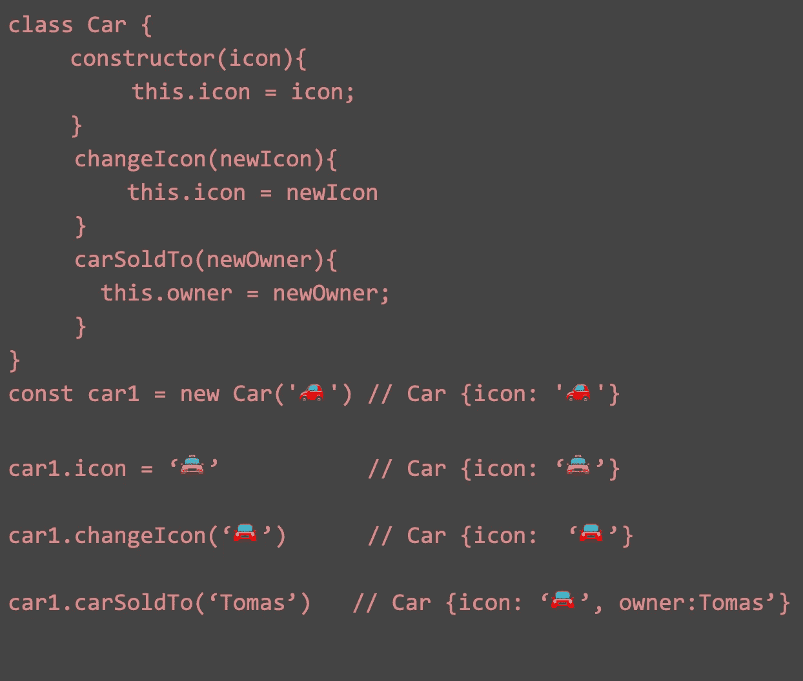
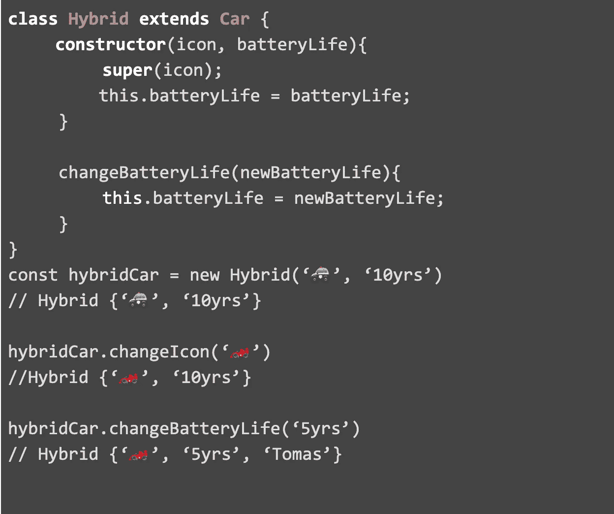
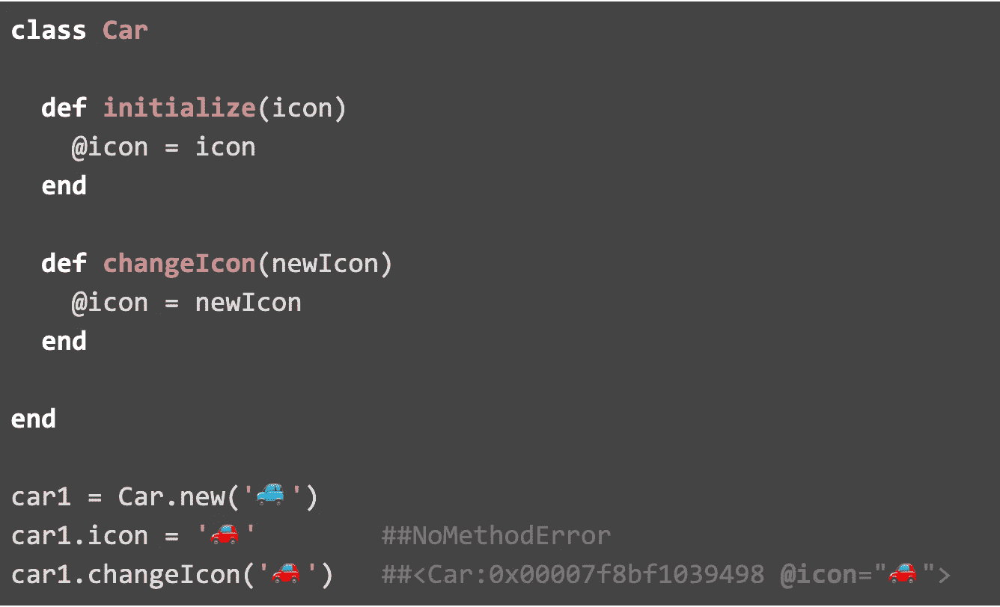
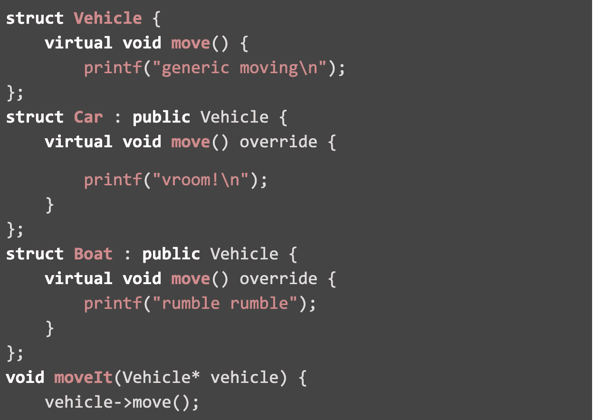

# 函数式编程与面向对象编程

> 原文：<https://betterprogramming.pub/functional-vs-object-oriented-programming-e5939c8105ff>

## 如何确定何时何地使用每种方法

关于首选语言的争论(C++对 Java，JavaScript 对 Ruby，等等。)在编程社区中一直很流行，然而，程序员们不仅仅在语言上有分歧。关于哪种编写代码的风格更优有很多争论:面向对象还是函数式编程。虽然 OOP 是目前最流行的编程设计，但许多人甚至没有听说过函数式编程。我们将解释面向对象和函数式编程之间的根本区别，并描述每种风格的优缺点。

# **什么是面向对象编程？**

OOP 是过程化编程，它使用类将代码和数据组合在一起，以实现可重用性和简单性。通过将程序分成几个类，可以更容易地单独修改程序的各个部分。每个类都是一种对象类型的模板或该类的一个实例。当将方法放入不同的类中时，每个类的实例可以很容易地被修改、替换和重用。然而，对于较大的数据集，变更类实例会变得复杂，因为很难跟踪每个实例在哪里被更改。

*通过在类中实现方法，很容易改变类的实例。(JavaScript)*

## **OOP 的优势**

自从 20 世纪 80 年代开始流行以来，面向对象已经成为软件工程的主要设计概念。Java、C++、Python 和 Ruby 是最常用的 OOP 语言，但是还有 100 多种其他编程语言支持 OOP。这些语言已经被用来开发一些历史上最广泛使用的程序。Gmail 和《我的世界》是用 Java 写的，Instagram 和 Spotify 是用 Python 写的，Windows 和 OSX 是用 C & C++写的。我们将讨论使 OOP 成为流行设计策略的四个重要概念:直觉问题解决、封装、继承和多态。

**直觉解决问题**

程序员喜欢 OOP，因为它易于学习和概念化。OOP 将类放在父类及其子类的层次结构中。人类以类似的等级方式组织事物。例如，车辆是移动东西的东西。汽车是在道路上行驶的交通工具。混合动力车是一种除了使用汽油还使用电力的汽车。普锐斯是丰田生产的五座混合动力车。请注意，在每个句子中，我们使用先前定义的对象来帮助概念化新的、更具体的对象。简而言之，OOP 对我们来说是有意义的。

**继承**

大概使用 OOP 最大的好处就是继承，或者说重用代码。回到普锐斯的例子，假设你是一家汽车制造商。如果你想从生产普锐斯转向本田 Insight，你不必研究如何制造汽车、轿车或混合动力车。为什么？你可以带着你的制作和工作蓝图，而不是从零开始。在 OOP 中，类相当于蓝图。你可以继承一个包含你需要的任何方法或属性的类(或者一个混合体)，然后在它上面添加新的特性(Prius，Insight)，而不是从头开始每一个程序。继承类使你的代码保持干爽(不要重复)并节省你大量的时间。

*混合类继承了所有的汽车类方法，同时保持对自己的类方法的访问。(JavaScript)*

**封装**

OOP 允许我们创建某个类的对象。许多 OOP 编程语言都有一种防止外部访问变量的方法，迫使程序员只能通过特定的方法与类进行交互。这允许我们将我们的实现隐藏在一个接口后面(保护对象免受程序员的错误),并通过这些行为良好的接口与程序的其他部分进行交互。除了提供这种安全性之外，封装还有助于我们编写易于更改和维护的灵活代码。

*封装防止对象属性被直接修改。(红宝石)*

**多态性**

多态性的字面定义是以几种不同形式出现的情况。在面向对象程序设计中，多态性是指一个变量、函数或对象具有多种形式和多种行为的能力。这允许我们以类似于继承的方式重用代码。回到我们之前的例子，假设我们有一个带有方法`move`的 vehicle 类。vehicle 的所有子类都可以重用这个方法`move` 但是行为不同。汽车子类将开始旋转它的轮子，船子类将开始旋转它的螺旋桨，飞机子类将开始旋转它的涡轮。这减少了开发人员的工作，因为他们现在可以创建一个具有特定行为的通用类，并在需要更具体的东西时对子类进行小的修改。

多态性允许我们在不同的功能(C++)中重用 move()

在我们用于网络的动态语言中，这种行为是某种内置的。接受“类似车辆”的物体的功能已经表现出多形态，旋转汽车的轮子和船的螺旋桨。在其他语言中，多态性同样重要，但需要显式实现。

如果没有 OOP，实现这种多态性会变得非常难看。模拟它的“简单”方法通常包括跟踪类型，并在需要多态的地方编写 if 语句*。随着多态性“级别”的增加，其他不使用 OOP 实现多态性的常见方法变得越来越复杂。*

## 面向对象的缺点

虽然 OOP 是最流行的程序设计，但是开发人员确实遇到了一些问题。在许多情况下，OOP 的优势伴随着副作用和额外的负担。在这一节中，我们将讨论这些负担以及它们如何影响程序。

**猴子香蕉问题**

继承是 OOP 中最重要的概念之一。它通过将对象或类基于其他对象并实现父类中定义的方法，允许代码的重用。通过继承来重用代码减少了冗余代码，并使 OOP 编程看起来很容易，这应该是每种编程语言的一部分。但是就像生活中的所有事情一样，继承也会带来权衡。ERLANG 语言的创造者乔·阿姆斯特朗对这个主要问题提出了著名的观点。

> 你想要一根香蕉，但你得到的是一只大猩猩拿着香蕉和整个丛林。

OOP 中的类可能是深度嵌套的，这意味着它们有一长串依赖的父类。当继承一个深度嵌套的类时，还必须继承它的父类、该父类的父类以及该父类的父类，依此类推。只有继承了所有必需的父类，程序才能编译。对此的一个解决方案是避免编写深度嵌套的类，但是这会降低继承带来的可重用性。

**封装问题**

继承在父类和子类之间创建了一些依赖关系。如果不打开父类，就很难理解子类中发生了什么。此外，子类可以访问父类方法，并可能覆盖这些方法。封装是为了防止对象变量被子类修改。Javascript 中的父类构造函数制作对象的深层副本，然后通过引用传递它。制作每个父类的副本会降低程序的效率。

# 什么是函数式编程？

函数式编程类似于“纯”数学函数。函数式程序不是指定一个过程来解决一个问题，而是在不使用“状态”的情况下组合函数来产生期望的结果。对这些功能及其关系的评估比对象和关系重要得多。函数式编程也很少使用变量。变量依赖于状态，状态根据程序过去的路径而改变。一旦涉及到状态，函数就不能被孤立地评估——使得它不再是纯粹的*。*

## 函数式编程的优势

令人惊讶的是，函数式编程也有许多与 OOP 相同的好处。许多这些优势都没有 OOP 带来的负担。

**消除种族制约**

当两个不同的功能依赖于一个公共资源时，就存在竞争情况。当事件的发生顺序与程序员的预期不同时，就会出现故障。从 API 获取数据时可能会出现这种情况。例如，假设你有一个方法`displayData(data)`使用来自 API 的`data`和另一个方法`retrieveData()` 获取它。如果您运行`displayData(retrieveData())` *，*获取可能无法及时完成，并且`displayData`将尝试在`retrieveData` 完成之前运行，从而导致错误。函数式程序不会以这种方式共享资源和创建依赖关系，从而完全避免了竞争条件。

**多态性**

等等，多态性不是应该是 OOP 的一个优势吗？是的，它仍然是，但事实是你不需要使用 OOP 来实现多态性。接口会给你这些，而不需要所有的猴子、香蕉和面向对象的丛林。

**简单调试**

函数式编程中的函数是*‘纯’*，即给定相同的输入，你期望相同的输出。功能方法强调提供一项功能的简单功能。更大的任务被模块化成多个更简单的功能。理论上，缺少状态使得调试这些程序容易得多。

**可重用性**

用乔·阿姆斯特朗的话说:

> “如果你有引用透明的代码，如果你有纯函数——所有的数据都以输入参数的形式出现，所有的数据都被输出，没有留下任何状态——这是难以置信的可重用性。”

因为每个函数都是纯函数，所以可以重用它们而不必担心状态。在面向对象程序设计中，类的状态可能会改变，不管是有意的还是无意的，并影响实例或类方法的结果。

## **功能编程的缺点**

你不能把函数式编程的缺点分成不同的类别。函数式编程的一个主要问题很简单:很难。因为我们没有 OOP 自带的结构和组织，编写和阅读复杂的函数式程序相当困难。当函数式编程的爱好者声称它比面向对象编程更容易调试，更可重用时，你必须半信半疑。虽然纯函数不依赖于状态，但它们仍然会变得复杂、难以理解和调试。

# 结论

显然，在 OOP 和函数式编程之间选择一方并不容易。好消息是，你不必这样做。您唯一需要确定的是在哪里使用每种方法。一些程序用面向对象的设计可能更好，而另一些程序用功能设计可能更好。有些程序结合使用两者可能会更好。作为一名程序员，做出这些选择是你的工作。希望你现在能做出明智的选择。

作者:托马斯·恩奎斯特、哈珀·哥特拉和亚历山大·里奇奥