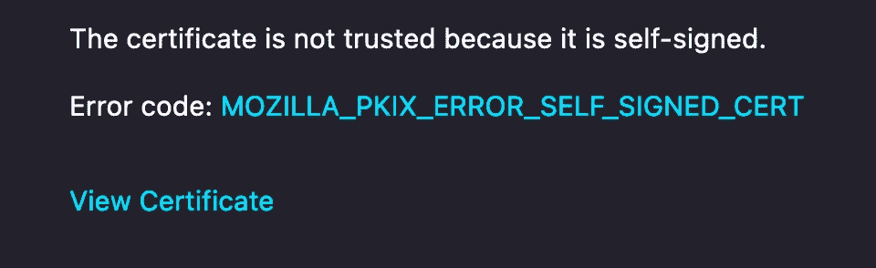

# 您应该知道的基本 TLS 证书命令

> 原文：<https://betterprogramming.pub/fundamental-tls-certificate-commands-you-should-know-88ac321f5274>

## 使用这些简单的命令学习一些 PKI 基础知识


照片由[杰森·登特](https://unsplash.com/@jdent?utm_source=unsplash&utm_medium=referral&utm_content=creditCopyText)在 [Unsplash](https://unsplash.com/s/photos/password?utm_source=unsplash&utm_medium=referral&utm_content=creditCopyText) 拍摄

围绕公钥基础设施 [(PKI](https://en.wikipedia.org/wiki/Public_key_infrastructure) )展开讨论可能是软件开发中最具挑战性的方面之一。在保护通信安全之前，构建应用程序是一件有趣的事情。如果您创建在网络上相互连接的分布式系统，您将在某个时候遇到 TLS 证书。

在本文中，我们将直面管理证书的挑战。学习一些生成和检查证书的基本命令可以使管理和保护应用程序变得更加容易。我们将探索如何建立一个可用于测试的私有证书链，并检查每个组件如何作为一个整体组合在一起。

# 生成自签名证书

这是证书领域中最常见的任务之一。如果你正在建立一个加密网络或者测试一个 HTTPS 网络服务器，你需要获得某种形式的证书。

最快和最简单的方法是生成一个“自签名”证书。这是一个独立的证书，本质上声明:*“我是唯一的权威，我确认我自己的身份。”*

这应该是显而易见的，但这实际上不是一个安全或可信的证书。这是因为它验证了自己。是“自签”。没有可靠的上游认证机构对其进行验证以证明其身份。

如果你想获得一个有效的、可信的证书，你需要使用像 [Let's Encrypt](https://letsencrypt.org/) 这样的免费服务，或者从像 [DigiCert](https://www.digicert.com/) 这样的公司购买证书。

出于测试目的，或者对于内部专用的开发网络，自签名证书通常是可以接受的。让我们看看如何使用`openssl`实用程序生成自签名证书:

```
openssl req -new \
    -newkey rsa:4096 -nodes \
    -x509 \
    -days 3650 \
    -keyout self_signed.key \
    -out self_signed.pem \
    -subj '/CN=TestCertificate/C=US/ST=CA/L=SF/O=Test'
```

让我们从头开始分解这个命令在每一步的作用:

*   以 [PKCS10](https://en.wikipedia.org/wiki/PKCS) 格式创建新的证书请求。
*   为这个请求生成一个 4096 字节长的新私钥。
*   不要用密码加密私钥。
*   输出自签名证书(这是`-x509`标志)。
*   使证书在 10 年后过期(对于脱机根 ca，更长的过期时间是正常的)。
*   将私钥写入`self_signed.key`文件。
*   将证书写入`self_signed.pem`文件。
*   将指定的[主题信息](https://en.wikipedia.org/wiki/Public_key_certificate#Common_fields)附加到证书上——这些是像国家、州和组织这样的数据。

一旦我们运行这个命令，我们将留下两个重要的文件:

*   第一个文件以`.key`结尾，是我们用来形成证书的私钥。这类似于您用来生成 SSH 密钥对的内容。
*   第二个以`.pem`结尾的文件是证书。一旦你有了证书和密钥，你就可以把它安装到任何需要加密的服务中。



Firefox 中的自签名证书错误。

连接到该服务的客户端将看到这是一个自签名证书，并可能产生某种警告。尽管这不是一个可信的证书，但是从技术上讲，服务之间的流量将在这一点上被加密。

接下来，让我们看看如何使用新的自签名证书来签署其他类型的证书。

# 生成 CSR

现在我们有了一个新的自签名证书，我们实际上可以将该证书用作 CA，并开始用它来签署其他证书。这在证书之间创建了一个信任链(尽管是一个脆弱的信任链),并形成了分布式 PKI 的基础。

让我们假设您有一个新主机，您想为其颁发证书。该主机和同一域中的其他主机应该相互信任，并有一个中心参考点。这是认证机构的概念，或称 [CA](https://en.wikipedia.org/wiki/Certificate_authority) 。我们可以为所有主机生成唯一的证书，并使用单个 CA 对它们进行签名。

为了签署主机证书，我们必须首先创建一个称为证书签署请求的东西( [CSR](https://en.wikipedia.org/wiki/Certificate_signing_request) )。这是由主机创建的特殊请求，发送到 CA 进行签名，然后返回。

现在让我们为我们的`TestHost`制作一个新的 CSR:

```
openssl req -new \
    -newkey rsa:4096 -nodes \
    -keyout host.key \
    -out host.csr \
    -subj '/CN=TestHost/C=US/ST=CA/L=SF/O=Test'
```

同样，让我们一行一行地分析:

*   以 [PKCS10](https://en.wikipedia.org/wiki/PKCS) 格式创建新的证书请求。
*   为这个请求生成一个 4096 字节长的新私钥(同样，这个密钥是未加密的，没有密码)。
*   将私钥输出到`host.key`文件。
*   将 CSR 输出到`host.csr`文件。
*   追加主持人[主题信息](https://en.wikipedia.org/wiki/Public_key_certificate#Common_fields)。

一旦我们运行这个命令，我们将有一个新的 CSR 文件，并使用我们的 CA 进行签名。接下来让我们看看如何做到这一点。

# 签署 CSR

拼图的最后一块是让我们的企业社会责任得到签署。为此，我们将把之前创建的`host.csr`文件带到 CA。这可以在中央服务器、门户等上。在本例中，它位于我们一直在测试的同一台主机上，因此我们现在只需对它进行签名:

```
openssl x509 -req \
    -in host.csr \
    -CA self_signed.pem \
    -CAkey self_signed.key \
    -CAcreateserial \
    -out host.pem \
    -days 30 -sha256
```

请系好安全带，再一次一行一行地分析正在发生的事情:

*   这次我们执行一个`x509`请求，这意味着我们将签署一个证书，而不是创建一个新的请求。
*   提供之前创建的主机 CSR 文件作为输入。
*   提供自签名 CA 证书文件。
*   提供自签名的 CA 私钥文件。
*   创建序列号文件—这将防止在签名过程中产生错误。
*   将签名证书输出为`host.pem`
*   该证书的有效期为 30 天，并使用 SHA256 摘要进行签名。

一旦我们完成了这个命令，我们就剩下最终的、已签名的主机证书了。然后，我们可以使用这个证书和这个 CA 签署的任何其他证书在域中构建一个可信主机系统。

这里需要注意的一点是主机的到期时间更短。对于主机证书，大多数建议是 30 天左右。这迫使每个月更新一次，并确保主机证书(因为主机通常更短暂)不能一次停留数年。

# 检查证书

由于我们的环境中有许多证书，所以学习如何检查它们是一个好主意。有些证书比其他证书更快过期。虽然脱机根 CA 的有效期可能为 10 年，但客户端证书的有效期可能只有 24 小时。

让我们看看如何使用最后一个`openssl`命令来检查现有证书:

```
openssl x509 -text -noout < cert.pem
```

这是一个简单的命令，让我们马上看到相当多的信息。我们可以立即了解关于证书的以下内容:

*   发行人
*   截止日期
*   主题信息
*   加密信息

结果中包含更多的信息，比如加密的密钥和密码信息，但是这在诊断问题时通常没有什么帮助。

如果您想确定证书何时过期或者是谁颁发的，这是一个很好的起点。

让我们从一开始就看看我们的自签名证书是什么样子的:

```
Certificate:
    Data:
        Version: 1 (0x0)
        Serial Number: 15449774297344832821 (0xd6689fddf532f535)
    Signature Algorithm: sha256WithRSAEncryption
        Issuer: CN=TestCertificate, C=US, ST=CA, L=SF, O=Test
        Validity
            Not Before: Sep 21 01:48:35 2022 GMT
            Not After : Sep 18 01:48:35 2032 GMT
        Subject: CN=TestCertificate, C=US, ST=CA, L=SF, O=Test
```

在我看来相当不错。我们可以很快知道证书的有效期有多长，它来自哪里，是给谁的。

感谢阅读！如果你喜欢这篇文章，请[关注](https://tateg.medium.com/follow)和[订阅](https://tateg.medium.com/subscribe)获取最新更新。想要更多吗？看看下面的一些其他帖子:

*   [*用 Python 制作 RPC 的简单方法*](/a-simple-way-to-make-rpcs-with-python-52ad8e9286c1)
*   [*让处理 JSON 更快的 Python 模块*](/python-modules-that-make-handling-json-even-faster-f577d8948a5)