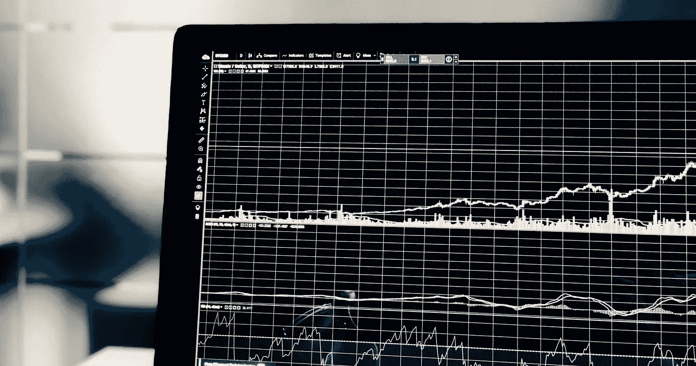
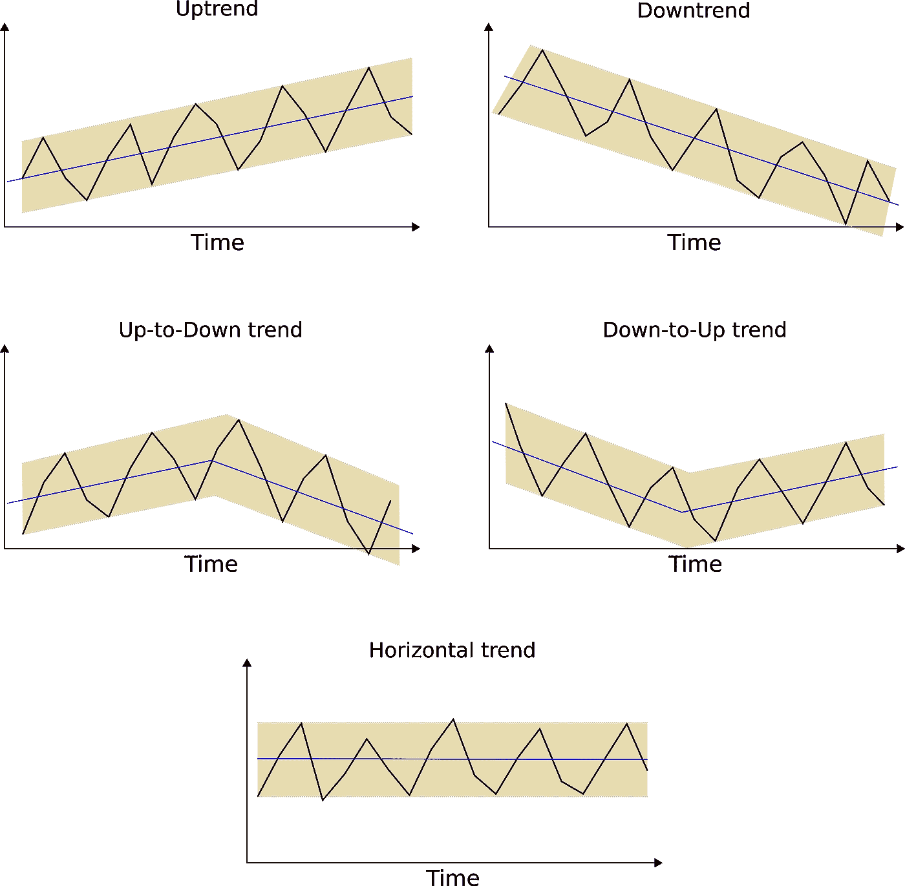
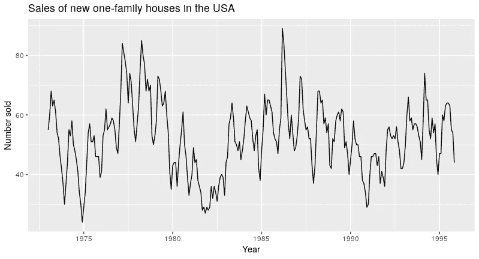

# 时间序列数据和预测基础

> 原文：<https://betterprogramming.pub/fundamentals-of-time-series-data-and-forecasting-15e9490b2618>

## 几分钟后的趋势、季节性和周期

克里斯·利维拉尼在 [Unsplash](https://unsplash.com?utm_source=medium&utm_medium=referral) 上的照片

时间序列预测是利用统计方法，根据历史数据预测未来行为。

这类似于其他统计学习方法，如监督或无监督学习。然而，时间序列预测有许多细微差别，使其不同于常规的机器学习。从数据处理一直到模型验证，时间序列预测是一个不同的领域。

许多公司都在探索时间序列预测，作为做出更好的商业决策的一种方式。以某酒店为例。如果经理对明年夏天预计会有多少主机有一个很好的想法，他们可以使用这些见解来规划员工管理、预算，甚至是设施扩展。同样，对未来事件的自信洞察可以惠及广泛的行业和问题，从传统农业到按需交通等等。

在本文中，我们探索时间序列数据的基础。我们讨论非常简单的预测方法是如何工作的。另外，我们描述了时间序列数据中最常见的模式。

# 时序数据

时间序列是随时间记录的一系列数据点。

因此，在处理时间序列数据时，顺序很重要。具体来说，时间序列中的值表示对时间的依赖性。因此，如果我们改变时间序列的顺序，我们可能会改变数据的意义。

通常，时间序列数据有两个重要的属性。

*   数据是按时间顺序等间隔测量的。
*   每个时间单位最多有一个数据测量。

另外，在做时间序列预测时，我们通常有两个目标。

*   首先，我们想要确定解释时间序列行为的模式。
*   其次，我们希望使用这些模式来预测新的值。

# 简单的预测方法

时间序列预测有丰富的算法家族。一些最基本的包括:

*   平均法
*   移动平均法
*   朴素方法

这些算法很容易理解。每一种都采用不同的假设来预测新的值。

平均法假设所有过去事件的平均值能最好地描述未来事件。

移动平均法建立在简单平均法的基础上。它不是使用所有过去事件的平均值，而是预测一个新事件，作为预定义数量的最近值的平均值。

最后，朴素方法假设下一个事件将等于最近的事件。

然而，用这样简单的方法，你肯定不会得到好的预测。因此，你的商业决策可能比你预期的更频繁地变坏。

这些方法没有考虑到时间序列数据中通常存在的许多波动。那么，真正的问题是，我们如何做得更好？要回答这个问题，我们需要首先了解我们通常在时间序列中发现的主要模式。

# 时间序列模式

大多数时间序列数据通常至少具有以下三种模式之一:趋势、季节性和/或周期。我们来简单描述一下每一个。

## 趋势

趋势描述了时间序列的一般行为。如果一个时间序列随着时间的推移表现出一个正的长期斜率，那么它有一个*向上的*趋势。相反，如果它描述了一个总的负斜率，它有一个*下降趋势*。

整体趋势也可能改变方向。可能会有一个*上升到下降*的趋势或者一个*下降到上升*的趋势。最后，一个*平稳*或*水平*趋势定义了一个既没有正面也没有负面长期模式的时间序列。

## 季节性

季节模式是时间序列中由日历相关事件引起的任何波动(变化)。

这些事件可以是一年中的某个时间(如冬天或夏天)，也可以是一天中的某个时间或一周中的某个时间。季节性总是有固定的频率。也就是说，一个季节模式总是在一周、一年等的同一时段开始和结束。

以一个数据中心为例。如果我们将冷却系统视为能源消耗的主要来源，那么很容易想象，在夏季，能源成本可能会上升，而在冬季，能源消耗可能会下降。

此外，销售厚外套的服装店可能会在冬季看到较高的销售率，而不是在夏季。

## 循环

最后，时间序列中的周期模式是一种与季节因素无关的变化。这些涨跌幅度不固定，可能会持续一年以上。循环模式不是重复的。通常，它们是由外部因素造成的，这些因素使它们更难预测。

预测方法通常利用这些模式来产生可靠的预测。

下面，你可以看到美国新独栋房屋**销售的时间序列数据**。注意强烈的季节性。房屋销售通常在年初比较缓慢。高峰出现在六月和七月。

此外，有可能从 6 年到 10 年不等的强周期。记住，周期没有固定的周期。

值得注意的是，并非所有的时间序列都是可预测的。更具体地说，从长期来看，其中一些没有可预测的模式。这种时间序列很难预测，如果不是不可能的话，因为未来的运动同样可能上升或下降。

为了预测这类数据，我们通常使用随机游走模型。这个模型假设下一个事件与前一个事件完全不相关。因此，来自随机游走模型的预测等于最后的观察加上一些噪声。随机游走模型通常用于金融和经济数据。

# 结论

趋势、季节性和周期是时间序列数据中最常见的模式。了解它们是什么以及它们的特征是任何分析师工具箱的基本工具。

一旦面对一个时间序列分析任务，下一步就是识别这些模式的行为。事实上，大多数经典的预测方法都要求分析人员指定如何应用趋势和季节性。要回答这个问题，通常需要进行时间序列分解分析。在我们的下一篇文章中，我们将一步一步地讨论不同种类的分解是如何工作的。

由 Thalles Silva 撰写，作为 Daitan 对人工智能多方面研究的一部分&。感谢致力于时间序列预测概念验证和演示的团队:布鲁诺·希奥纳托、迭戈·多明戈斯、费尔南多·莫赖斯、古斯塔沃·罗萨托、伊萨克·索萨、马塞洛·梅尔古尔霍和马西亚诺·纳尔迪。