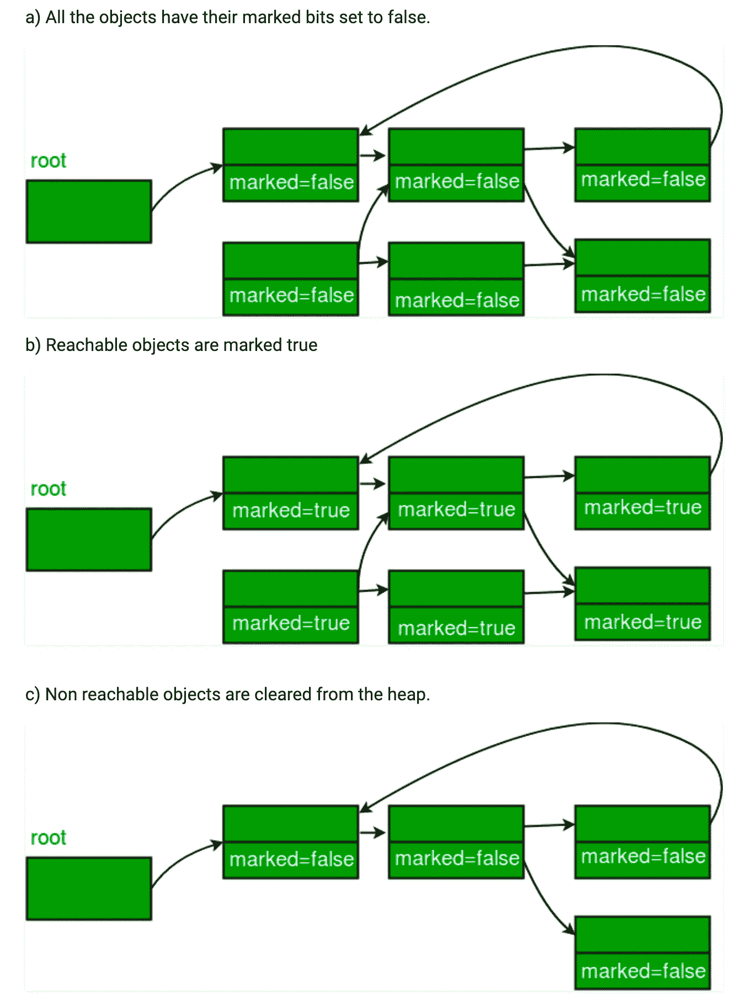

# 垃圾收集和浏览器

> 原文：<https://betterprogramming.pub/garbage-collection-and-the-browser-43bb60a2553c>

## 如何在 Chrome、Safari 等后台存储和移除数据

照片由[在](https://unsplash.com/@creativeexchange?utm_source=unsplash&utm_medium=referral&utm_content=creditCopyText) [Unsplash](https://unsplash.com/s/photos/cleaning?utm_source=unsplash&utm_medium=referral&utm_content=creditCopyText) 上的创意交流

当某样东西出现在你的网页上时，它被储存在哪里？在现代浏览器中，内存分配的过程是自动的，但这并不意味着开发人员应该想当然地认为这个过程是理所当然的，并期望它每次都能完美地工作。理解 JavaScript 和浏览器如何处理内存对于解决臃肿的应用程序和创建快速动态的内容至关重要。

JavaScript 分两个阶段在浏览器中呈现内容:编译阶段，然后是执行阶段。在编译阶段，JS 引擎遍历代码，找到每个变量或函数标识表达式，在内存中为它们分配一个位置，并建立从标识符到内存位置的引用。这些是空白引用，本质上是实际对象的占位符。

在执行阶段，引擎再次一行一行地遍历代码，给每个变量赋值并调用函数。标识符相对于它们在作用域链中的位置被解析[，从局部作用域开始，向上通过父作用域，直到到达第一个可访问的标识符，或者直到到达可能的最高作用域(其中父作用域为空)。)](http://davidshariff.com/blog/javascript-scope-chain-and-closures/)

这对于在小规模应用程序中启动和运行代码来说很好，但是当应用程序开始变大并且内存中存储了更多的对象时会发生什么呢？计算机内存是有限的，需要有一种方法来清理没有使用的内存，以便为更多的数据腾出空间，并且不限制同一台机器上运行的其他应用程序的内存。

在低级语言中，这种内存管理是由开发人员手动完成的，这是一个相当复杂的过程，会导致应用程序具有非常明确和微调的内存使用。对于更高级的语言，比如 JavaScript，这种内存管理是由一种叫做*垃圾收集器*的结构自动执行的[。](https://en.wikipedia.org/wiki/Garbage_collection_(computer_science))

由[极客为极客](https://www.geeksforgeeks.org/mark-and-sweep-garbage-collection-algorithm/)进行标记和扫描的可视化

浏览器使用了许多技术来判断内存中哪些对象是需要的，现代浏览器使用的[技术被称为标记和清除算法。](https://www.geeksforgeeks.org/mark-and-sweep-garbage-collection-algorithm/)浏览器引擎周期性地从根对象(全局范围)开始，找到从根引用的每个对象，然后检查从这些对象引用的所有对象，等等。，向下移动作用域链并记下哪些对象是可达的或不可达的。[使用深度优先的搜索方法，所有可到达的对象被标记为*真*，所有不可到达的被标记为*假*。这就是所谓的标记阶段。](https://www.geeksforgeeks.org/depth-first-search-or-dfs-for-a-graph/)

然后，引擎在内存堆中移动，清除所有不可到达的对象，释放它们的内存位置供将来使用。这是扫描阶段。

希望这有助于您理解浏览器在运行应用程序时是如何分配和清除内存的。

# 资源

 [## 理解 JavaScript 中的提升

### 在本教程中，我们将研究 JavaScript 中著名的提升机制是如何发生的。在我们开始之前，让我们…

scotch.io](https://scotch.io/tutorials/understanding-hoisting-in-javascript)  [## 内存管理

### 像 C 这样的低级语言有手工内存管理原语，比如 malloc()和 free()。相比之下…

developer.mozilla.org](https://developer.mozilla.org/en-US/docs/Web/JavaScript/Memory_Management)  [## 内存使用背景介绍 Chromium 项目

### Chromium 内存使用如果您在 Chromium 中测量内存，这里是一些背景信息。多流程模型…

www.chromium.org](https://www.chromium.org/developers/memory-usage-backgrounder)  [## ECMAScript 2015 语言规范- ECMA-262 第 6 版

### 编辑描述

www.ecma-international.org](http://www.ecma-international.org/ecma-262/6.0/index.html)