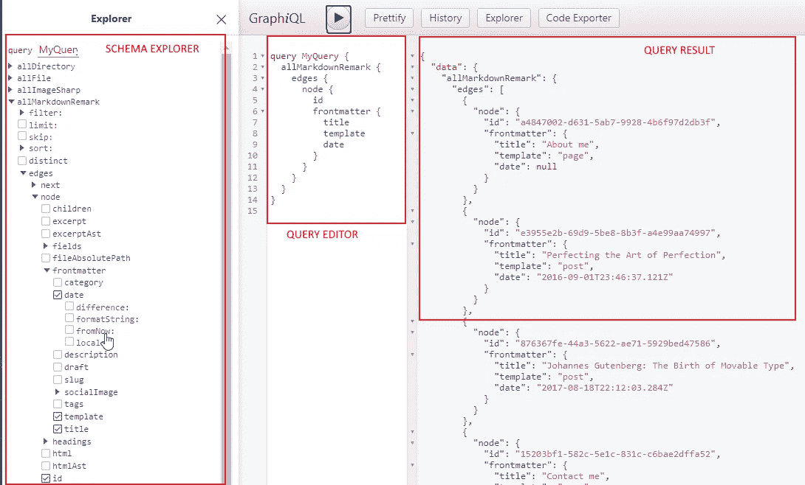

# 如何用盖茨比创建博客

> 原文：<https://betterprogramming.pub/gatsby-blog-react-d5b0d3a5d83c>

## 使用盖茨比在几分钟内建立一个博客


由[思想目录](https://unsplash.com/@thoughtcatalog?utm_source=medium&utm_medium=referral)在 [Unsplash](https://unsplash.com?utm_source=medium&utm_medium=referral) 上拍摄的照片。

无头 CMS 是一种新兴的网站实现解决方案。也就是说，有一个点是你必须放置“头部”(即开始渲染数据并显示给用户)。在大多数应用程序环境中，拥有传统的单页面应用程序就足够了。所以你可以实现你的 Angular 或者 React app，就这样。

在公共网站或电子商务中，您还需要有用于 SEO 和索引目的的网页。为了满足这种需求，像 [Gatsby](https://www.gatsbyjs.com/) 这样的工具通过服务器端渲染(SSR)来帮助我们。这种方法克服了基于按需输出计算的经典网站的所有问题。此外，他们使用静态生成的文件，这是非常 SEO 友好的。基本上，您可以编写一个 SPA 并生成所有 web 页面作为静态文件使用。这种方法提供了最佳的性能，需要较少的资源，并提供了很好的用户体验。

在本文中，我们将通过实现一个简单的博客来介绍 headless 的最重要的原则。这个例子很有教育意义，因为它涵盖了最重要的主题，并让您开始自己开发一个无头解决方案。这是我们进入无头世界的路线图:

1.  无头 CMS 简介
2.  创造环境
3.  从模板安装博客
4.  发现博客是如何运作的

所以，我们开始吧！

# 创造环境

如果你在安装了 Node 的 PC 上工作，你只需要运行`npm install gatsby-cli`来安装 Gatsby。您可以跳过教程的下一部分。对于那些只使用 dockerized 环境工作的人，您应该遵循下面的步骤，并获得拥有完全 dockerized 开发环境的收据。

## 1.Dockerfile 文件

第一步是创建一个 docker 文件，在我们的容器上安装所有的依赖项。我们将需要`git`、`node`、`npm`和`gatsby`。就我而言，我是从 Nginx 开始的。这是一个精简的图像，我们大多数人在本地已经有了，但是你也可以使用一些实用的图像，比如`busybox`。

生成的 docker 文件应该如下所示:

从上面的代码片段中可以看出，除了一些用于控制发生了什么的输出，安装步骤由一些`apt-get`指令组成。

## 2.docker-compose 文件

理论上，您现在应该有了可以运行的映像，但是我觉得需要记住哪些参数用于启动`docker-run`命令很不舒服，所以我更喜欢创建一个预配置的`docker-compose`文件。此外，在这个设置中，我将使用这个文件来激活更多的容器，所以让我们开始添加下一段代码:

```
version: '3'
   services:
    dev:
      image: node:7.7.2-alpine
      build: ./docker/dev
      volumes:
      - .:/usr/app/
```

上面的脚本假设您已经将 dockerfile 保存在`docker/dev`文件夹下，如示例所示。

现在，我们可以通过键入`docker-compose exec dev bash`进入我们的环境，并在这里工作，因为这是我们的工作站！

在下一节，我们将开始一个真正的博客项目！

# 从模板安装博客

## 1.创建项目

我们可以从头开始，但是对于这个例子，我选择了一个现成的模板(Alexander Shelepenok 的 Lumen Gatsby starter)。要启动新项目，只需键入:

```
gatsby new my-gatsby-project [https://github.com/alxshelepenok/gatsby-starter-lumen](https://github.com/alxshelepenok/gatsby-starter-lumen)
mv my-gatsby-project/** /usr/app
rm my-gatsby-project
```

## 2.构建项目

要构建项目，只需键入`gatsby build`，这将在`public`文件夹中创建所有静态资产。该文件夹由 Nginx 提供服务，因此您可以在浏览器中输入`http://localhost`直接导航到该文件夹。或者，您可以使用`gatsby develop --host=0.0.0.0`命令。对于开发来说，这是最好的选择，因为它会监视文件的变化，并自动重建输出。使用这种配置，您可以:

1.  使用带`[http://localhost](http://localhost)`的编译版本。
2.  用`[http://localhost](http://localhost):8000`使用与文件系统自动同步的开发版本。
3.  通过导航到`[http://localhost](http://localhost):8000/__graphql`来导航到 Gatsby GraphQL 数据库。

在这几个步骤之后，我们在本地运行了博客，所以是时候深入剖析这个项目了。

## 文件夹结构

文件夹结构非常庞大，因为它增加了 Node 和 Gatsby 框架的复杂性和约定。为了简单起见(假设阅读本文的每个人对前端项目都没有多少经验)，我将只关注特定于项目的文件。

在下面的代码块中，我恢复了第一级文件夹结构:

```
**+ content/:** here there are yml file that represent the data
**+ src/:** here there is a js/html web app
**+ static/:** here there are all the assets and media for letting your app running
**+ content/:** here there are the files for gatsby hook, like page definitions **config.js:** here there is the configuration of this project (application settings)
**gatsby-conifg.js:** here there is all the gatsby related settings, like the plugin configuration
```

这个简单的文件夹地图可以帮助你从一个主题转移到另一个主题。现在我们来详细看看最重要的发现点。

# 发现博客是如何运作的

为了进入 Gatsby 逻辑，我们将关注如何呈现 CMS 页面和博客文章。

这将需要以下步骤:

1.  写数据，用一些数据模型。
2.  定义页面传送，创建页面目录。
3.  渲染数据。

经过这些简单的步骤，盖茨比将有机会知道哪些页面必须创建，哪些内容必须使用！

## **数据建模**

在这个简单的网站上，我们有两种不同的内容:页面和博客文章。要管理它们，第一步是映射数据所在的文件夹，因此您必须通过添加以下内容来编辑您的`gatsby-config.js`文件:

现在，您可以在这里添加任意数量的文件。为了简单起见，在这个例子中，我们有两个子文件夹:一个用于博客文章，一个用于页面。每个元素都是一个简单的文件，在页面的开头有特定的字段。

下一段代码显示了一个`page` 项:

```
---
title: "About me"
**template:** "page"
socialImage: "/media/image-2.jpg"
---Pellentesque habitant morbi
```

下一段代码显示了一个`post` 项:

```
---
title: Perfecting the Art of Perfection
date: "2016-09-01T23:46:37.121Z"
**template:** "post"
draft: false
slug: "perfecting-the-art-of-perfection"
category: "Design Inspiration"
tags:
  - "Handwriting"
  - "Learning to write"
description: "my SEO desc here"
socialImage: "/media/image-2.jpg"
---Quisque cursus, metus vitae p
```

所有的图像路径都被解析到`static/media`文件夹中。正如您在前面两个代码块的突出显示中看到的，您可以指定对该类型使用哪个模板。只需在正确的文件夹中添加一个文件，就可以通过浏览`http://localhost:8000/pages/<filename>`看到它的实况。

此外，所有加载的数据都可以作为 GraphQL 数据获得，因此您可以转到 GraphQL 控制台并探索它。为此，只需在浏览器中键入`http://localhost:8000/__graphQL`。将显示 GraphQL UI，您将能够测试查询。在下图中，您可以看到对 CMS 数据的查询:



GraphQL 查询编辑器

注意，routing 中定义的所有页面都聚集在`allSitePages`对象中，这对于创建网站的全局索引或简单的站点地图非常有用。

但是系统如何呈现页面呢？在接下来的部分中，我们将学习如何管理组件之间的路由以及如何实现它们。

## 路线

根据[Gatsby 官方文档](https://www.gatsbyjs.com/docs/reference/routing/creating-routes/)，我们可以使用三种不同的方法来处理路由:

*   通过在`src/pages`中创建 React 组件。
*   通过使用[文件系统路由 API](https://www.gatsbyjs.com/docs/reference/routing/file-system-route-api/) 以编程方式从 GraphQL 创建页面并创建客户端专用的路由。
*   通过在你的站点的`gatsby-node.js`中实现 API `[createPages](https://www.gatsbyjs.com/docs/reference/config-files/gatsby-node/#createPages)`。

在此示例中，为了更详细地控制所有路径和设置，项目模板使用了第三种方法。在`gatsby-node.js`中，您将拥有下面的代码来配置系统使用您的实现。

```
exports.createPages = require('./gatsby/create-pages');
exports.onCreateNode = require('./gatsby/on-create-node');
```

在下一段代码中，有一个`create page`实现:

如您所见，可以手动映射定制页面(就像标签页面示例中那样)，或者动态迭代数据并应用模板。

要介绍的最后一个元素是如何实现组件和呈现数据。让我们进入下一部分。

## 用于呈现数据的组件

流程现在很清楚了:路由将用户输入的 URL 链接到模板，然后模板可以使用组件来呈现 web 页面。因此，我们将不得不查看`page-template.js`和`post-template.js`页面。因为这两个例子非常相似，所以我将只关注`page`的例子。在下一个片段中，有 CMS 页面的模板:

从上面这段代码中可以看出，`createPage`方法提供的`slug`参数用于使用页面的特定属性从内容数据库中选择一个元素。该数据用于使用`Page`组件呈现页面。在下一段代码中，有它的实现:

正如您在组件定义中看到的，组件将模板上设置的标题和子内容作为输入，并呈现它。

现在我们终于结束了数据和渲染之间的循环。让我总结一下我们在这篇文章中学到的东西！

# 包扎

在本文中，我们看到了如何使用 Gatsby 实现一个简单的博客。这个解决方案非常容易实现，并且允许每一个习惯于使用 spa 的开发者创建漂亮和高性能的网站。Gatsby 引擎易于使用，并带有数千个插件。这给了你从零开始创造一切的机会，没有任何限制。

与使用 WordPress 等传统的 CMS 实现博客不同，这不是一个现成的解决方案，但它确实让你从头开始创建它。

我不能说哪个更好，因为它们是适用于不同场景的两种不同的方法。如果你计划创建一个独特的像素完美的网站——也许有很多人的互动——盖茨比的解决方案是最好的。也就是说，这将需要一些额外的努力来设置。没有什么是免费的！

最后一个注释是关于内容的。在本文中，我们已经看到，我们可以创建 YAML 文件作为我们的网站内容。可以想象，有可能使用 Netlify 这样的静态 CMS 来制作它们，或者集成外部的无头 CMS 来使用动态内容。

# **参考文献**

*   [本文中使用的优秀博客模板](https://www.gatsbyjs.com/starters/alxshelepenok/gatsby-starter-lumen)
*   [盖茨比官方文档](https://www.gatsbyjs.com/)