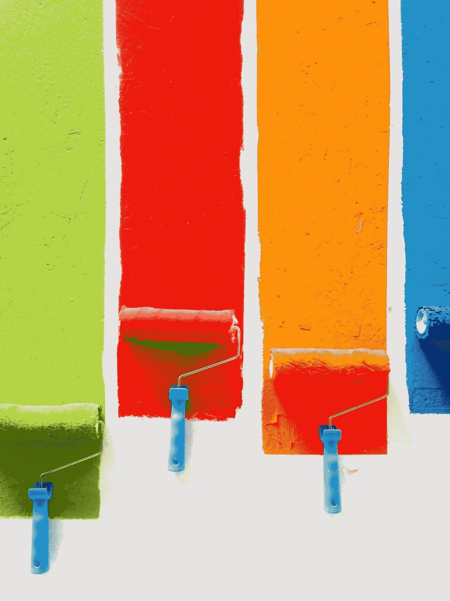

# iOS 版高迪:主题化和黑暗模式

> 原文：<https://betterprogramming.pub/gaud%C3%AD-for-ios-theming-and-dark-mode-86fe8fe60aeb>

## iOS 的简单主题管理



由 [David Pisnoy](https://unsplash.com/@davidpisnoy?utm_source=unsplash&utm_medium=referral&utm_content=creditCopyText) 在 [Unsplash](https://unsplash.com/s/photos/paint?utm_source=unsplash&utm_medium=referral&utm_content=creditCopyText) 上拍摄的照片

[Gaudí](https://github.com/gringoireDM/Gaudi) 是一个为简化在同一个应用中采用多个主题而编写的框架。

几年前，我在一家电子商务公司工作，有多个横幅来支持一个绿地项目。每个横幅都有不同的配色方案、不同的字体和不同的组件样式。

每个 UI 组件都不应该知道横幅的存在，否则添加/删除横幅会导致所有应用程序发生变化，这显然违反了多个坚实的原则。

此外，重塑一个应用程序通常需要很多改变，并且用旧的主题来测试新的主题需要更大的努力。

虽然您可以轻松地抽象样式，但根据 A/B 测试的不同，在运行时构建一个重新设计整个应用程序样式的机制并不容易。

一般来说，我们已经学会了通过采用不同的设计模式、架构和抽象层来保护自己免受这些变化的影响，但当涉及到颜色和主题时，我从未找到一个令人满意的案例研究来帮助我定义一组清晰的 API。

此外，我无法找到一个框架，可以帮助我在运行时轻松切换整个应用程序的主题。

高迪就是这么做的！它为颜色、字体和样式提供了一个抽象层，允许你轻松地将它们分组到一个`Theme`对象中，并允许你在运行时切换主题。

# 语义颜色

这个框架使用语义颜色名称来更好地适应[黑暗模式](https://developer.apple.com/documentation/xcode/supporting_dark_mode_in_your_interface)和同一应用程序中其他可能的主题。

和你的设计师一起把这些做好。就像苹果建议的那样，不要走捷径，不要改变语义颜色的语义。

高迪的`SemanticColor`枚举提供了一个关于那种颜色实际上是什么的清晰提示:

```
public enum SemanticColor: CaseIterable {
    case label(LabelColor)
    case fill(FillColor)
    case background(BackgroundColor)
    case groupedBackground(GroupedContentBackgroundColor)
    case separator(SeparatorColor)
}
```

这些`LabelColor`、`FillColor`、`BackgroundColor`、`GroupedContentBackgroundColor`中的每一个都有不同的具体语义颜色，如`primary`、`secondary`、`tertiary`等等。

不要使用`LabelColor`作为填充颜色。这将在你的项目中引入熵。请与您的设计师密切合作，遵守本规范。

当在你的代码中，你将以正确的方式使用`SemanticColor`时，改变你的应用程序的皮肤就像改变 20 行代码一样简单。您还可以通过使用新颜色创建一个新的主题对象来 A/B 测试不同的主题。

## **为什么语义颜色**

通过阅读`.red`，一个人会期望结果是一种红色的阴影，而阅读`primary`，没有期望。

这个框架旨在简化主题化。如果你使用一个`black`颜色的文本，看到`black`在黑暗模式主题中被渲染成白色会很奇怪。

出于这个原因，我决定采纳苹果关于使用语义颜色的建议，不仅支持黑暗模式，还允许不同的主题一起工作，从主题颜色和实际呈现的颜色保持一层语义抽象。

## **如何使用**

```
label.textColor = .semanticColor(.label(.primary))
```

这一行简单的代码将把标签的`textColor`设置为当前主题的主要标签语义颜色。如果主题改变，颜色也会改变。

您还可以通过扩展 color enum 来创建您的自定义语义颜色，让新颜色具有语义意义。例如，如果颜色是一个文本标签，那么你想像这样扩展`LabelColor`:

```
public extension LabelColor {
    static var myCustomSemanticColor: LabelColor {
        return .custom(color: .color(fromHex: "#123456"))
    }
}
```

我强烈建议您采用这种“扩展方法”，因为直接使用 enum 的`custom` case 可能很诱人，但将来当您不得不为另一个标签再次重复该颜色，或者为所有标签更改该自定义颜色时，这将会让您吃不消。

如果你的设计师用一种稍微不同的灰色，或者一种与最初商定的普通调色板不同的颜色让你感到惊讶，和他们谈谈，看看这种额外的颜色是否有必要，如果有必要，那么就扩展一下。

# 如何创建主题

创建一个主题就像创建一个符合协议`ThemeProtocol`的类一样简单。

对`ThemeProtocol`的唯一要求是从`SemanticColor`到`UIColor`的映射函数和`FontStyle`的等效映射函数。

你可能永远不会直接使用主题，也可能永远不会使用映射功能，因为 Gaudí为`UIColor`和`UIFont`提供了扩展，可以方便地访问当前活动的主题。

主题也允许使用`UIAppearance`到`AppearanceRuleSet`

一个`AppearanceRuleSet`是通过使用`UIAppearance`代理获得的一组外观规则。

这是一个`AppearanceRuleSet`,定制应用程序的所有导航栏、所有标签栏和标签栏项目的外观。

DSL 允许我们通过对`UIAppearance`对象的可定制属性使用`KeyPath`来创建规则。

您还可以用嵌套的`AppearanceRuleSet`对它们进行分组:

外观规则 DSL 也支持`if`和`else`语句。

外观规则集是可逆的。这意味着您可以在运行时将主题恢复为默认设置。

如果你的主题不需要全局外观，你可以使用`.empty`外观规则集。

## 是时候让高迪知道你的主题是当前的了

将您的`Theme`分配到您的`AppDelegate`中的`ThemeContainer`。

```
func application(_ application: UIApplication,
                   willFinishLaunchingWithOptions launchOptions: [UIApplication.LaunchOptionsKey: Any]?) -> Bool {
    ThemeContainer.currentTheme = YourTheme()
}
```

Gaudí提供了许多 UIKit 扩展来轻松访问颜色和字体，并轻松配置标签、按钮和字符串(`NSAttributedString`)。例如，要设置标题标签，您可以使用:

```
label.applyLabelStyle(.title(.regular), 
                      semanticColor: .label(.primary))
```

这将改变`UILabel`文本的字体(和大小)和颜色。要获得语义颜色的颜色，您也可以使用`UIColor`扩展:`UIColor.semanticColor(.fill(.primary))`

注意:不要跳过这一步非常重要，否则 Gaudi 将不会应用默认主题，这将导致应用程序在您试图使用任何 Gaudi 扩展来获取颜色和字体时崩溃。

在你的应用生命周期中，尽快将你的默认主题分配给`ThemeContainer`。

# **改变主题**

类似于默认主题的初始化，你可以在代码的任何地方使用`ThemeContainer.currentTheme`变量来切换主题。

`ThemeContainer.currentTheme = YourOtherTheme()`

当这种情况发生时，高迪将自动恢复先前的主题`UIAppearance`规则，然后应用新的规则，并在所有的`Themed`视图控制器上调用`applyTheme`。

## **主题为**

为了让 Gaudí在多主题应用程序中正常工作，需要在主题视图控制器中实现`Themed`协议。

如果没有这个协议实现，当主题改变时，非主题视图控制器的任何现有实例都不会改变它的外观。

将你所有的外观定制放入所需的`applyTheme`功能中。

对于`UITableView` / `UICollectionView`单元格，如果您在各自的数据源方法中定制它们的外观，那么只要您使用 Gaudí的颜色和字体，`applyTheme`函数中的一个简单的`reloadData`就会刷新它们的颜色和字体。

# 用高迪支持黑暗模式

最后是主菜:黑暗模式。用高迪，支持黑暗模式极其简单。此框架有两种不同的方式支持黑暗模式:

1.  实现两个不同的`Themes`并在`userInterfaceStyle`特征集合改变时切换它们。
2.  实现一个返回动态颜色的独特的`Theme`。

我们现在将解释如何实现这两者。

## 主题窗口

如果你决定拥有两个独立的主题，并根据需要在运行时切换它们，高迪提供了一个自定义的`UIWindow`来实现这一点。

在你的应用中初始化一个`ThemedWindow`的实例，把你的亮模式主题和暗模式主题传递给它

高迪将在运行时根据需要在两个主题之间进行切换。不需要额外的代码。简单告诉`Window`这两个主题是什么。

## **动态颜色**

如果你已经决定用一个独特的`Theme`来支持亮暗模式，那么你必须在你的`Theme` `color(forSemanticColor:)`映射函数中返回动态颜色。

这个框架为`UIColor`提供了方便的初始化器来支持这个用例:

`UIColor(lightColor: ..., darkColor: ...)`

并且:

`UIColor(lightColorHex: "#123456", darkColorHex: "#654321")`

# 摘要

总而言之，Gaudí是一个简单而强大的框架，为您的应用程序带来了对颜色、字体、字体样式和大小等主题属性的轻松管理。

它提供了一个 DSL 来编写易于阅读和可逆的`UIAppearance`规则，通过`Themed`协议，它给了`UIViewController`一个超级权力，每当`ThemeContainer`中的活动主题改变时，它就可以变异。

到目前为止，我已经在三个应用程序中使用了 Gaudí，其中两个是商业应用程序。与设计师一起工作，在几分钟内尝试新的颜色和字体，感觉棒极了。

我建议你试一试。关于高迪与`NSAttributedStrings`的能力，我可以告诉你更多，但这将是[未来帖子](https://medium.com/better-programming/compose-nsattributedstrings-easily-with-gaudi-da57a596c9c0)的主题。

你可以在 GitHub 上找到高迪[。可通过](https://github.com/gringoireDM/Gaudi) [CocoaPods](https://cocoapods.org/) 和 [SwiftPM](https://github.com/apple/swift-package-manager) 获得。