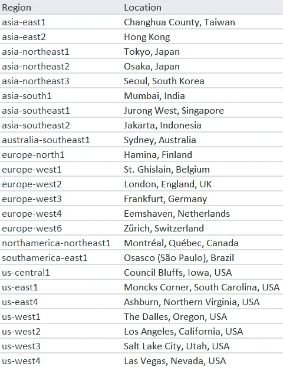
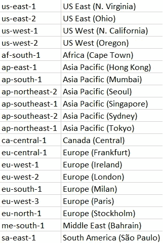
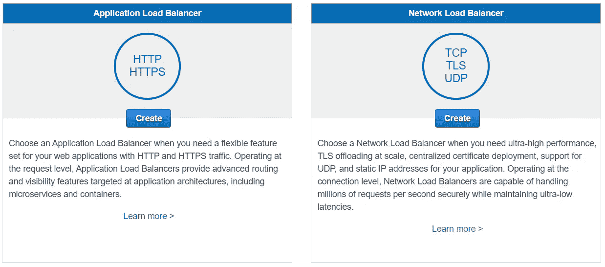
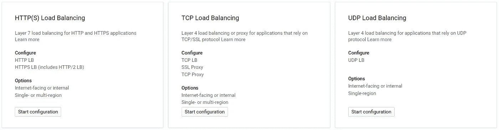

# AWS 和谷歌云平台网络——概念和服务

> 原文：<https://betterprogramming.pub/gcp-and-aws-networking-concepts-and-services-ef8264cfa5a8>

## 有什么不同和没有什么不同

艾莉娜·格鲁布尼亚克在 [Unsplash](https://unsplash.com/s/photos/network?utm_source=unsplash&utm_medium=referral&utm_content=creditCopyText) 上的照片

云网络背后的概念直接来源于前云时代的传统网络。与此同时，云提供商不得不处理组织其跨越全球的巨大物理网络的所有问题，不管他们的光纤是自有的还是租赁的。

每个云提供商都以自己的方式解决这些挑战。这影响了它们的特性或更高层次的概念，因此尽管所有这些概念都来自传统的网络，但它们实现的细节却各不相同。

谷歌广泛使用自己的软件定义网络 Andromeda，这不仅允许 GCP 快速配置和供应新的云资源，还允许更好的网络性能。

作为云先锋的 AWS 通常注定要采用更传统的解决方案，这肯定可以从网络结构中看出，而且他们还面临所有隐藏的障碍，这些障碍后来可能会被竞争对手绕过。

在深入研究之前，有一个常见的免责声明，您可能会在使用云时经常看到:

*由于 AWS 和 GCP 都发展得非常快，最近发布或更改的新内容总是有可能的，或者很快就会更改，所以直接在控制台中仔细检查总是值得的——有时甚至官方文档也可能过时。*

# AWS 和 GCP 网络产品和服务的比较

## 区域和分区

照片由[марьянблан| @ marjanblan](https://unsplash.com/@marjan_blan?utm_source=medium&utm_medium=referral)在 [Unsplash](https://unsplash.com?utm_source=medium&utm_medium=referral)

两家云提供商的资源和服务托管在全球多个地点。GCP 和 AWS 对这些位置使用相同的术语“区域”，这很直观，因为“区域”只不过是一个地理区域，如*美国-西方 1* 、*亚洲-东方 2、*等等。

GCP 地区:

GCP 地区

AWS 地区:

AWS 区域

对于这两家云提供商来说，区域由分区组成。在谷歌云中，它只是被称为“区域”，而在 AWS 中，它是“可用性区域”，简称为 AZ。区域以其所在的地区命名，加上一个额外的字母来区分不同的区域，例如 *us-west1-a、us-west1-b 等。*

简单地说，对于更熟悉前云时代基础架构的人来说，您可以认为“区域”只不过是一个数据中心。

区域*真的只是一个数据中心吗？*

对 AWS 来说是这样，正如你在这里看到的，AWS AZ *“是一个或多个离散的数据中心。”*

对于谷歌云来说，情况有所不同:*“*zone 托管在一个或多个集群中”，你可以在这里阅读。因此，谷歌云有可能在同一个数据中心有两个或更多的区域，只是在不同的物理集群上。

照片由[Santtu perki](https://unsplash.com/@santtupee?utm_source=medium&utm_medium=referral)在 [Unsplash](https://unsplash.com?utm_source=medium&utm_medium=referral) 上拍摄

例如，谷歌云区域 *europe-north1* 在这里被命名为“芬兰”，但是在芬兰只有一个谷歌数据中心，在小镇[哈米娜](https://www.google.com/about/datacenters/locations/hamina/)附近。这让我们别无选择，只能假设欧洲北部的所有区域实际上都在那里。

*为了简单起见，您可以假设 zone 只是两个提供商的数据中心。*

通常至少有三个区域位于或多或少的邻近位置，以形成一个区域。它们通过冗余链路相互连接，这就是高可用性的实现方式——如果一个区域出现故障，整个区域都不会受到影响。

区域名称有一个窍门。如您所知，区域被命名为住宅区加一个字母。在 GCP 和 AWS 中，分区名称到实际物理分区的映射是基于每个客户端完成的。这意味着，对我来说被称为美国-西方 1-a 区的东西，对你来说可能被称为美国-西方 1-b 区。

# 网络服务等级

网络服务层是谷歌云独有的，也是 AWS 所没有的。有两层:

*   标准层，更便宜，并提供“与其他公共云相当的性能”，如谷歌所言。
*   默认情况下，Premium Tier 是打开的，速度更快，并通过尽可能多地通过谷歌最广泛的专用光纤网络路由流量来实现。

关于网络层的更多信息可以在这里找到[。](https://cloud.google.com/network-tiers/docs/overview)

# 服务范围

有些服务是全球性的，存在于全球范围内，而其他服务则与某个地区甚至某个区域相关联，因此可能无法在每个地区都可用—通常，推广过程并不简单，可能需要一段时间才能在每个地区提供给定的服务。

# 虚拟私有云

蒂姆·莫斯霍尔德在 [Unsplash](https://unsplash.com?utm_source=medium&utm_medium=referral) 上的照片

虚拟专用云(Virtual Private Cloud，简称 VPC)是云的一个独立部分，在这里，您可以对绑定到特定项目或部门的所有云资源进行逻辑组织，或者按照您想要的任何其他分组进行组织。

从技术角度来看，VPC 可以理解为一个网络，但网络本身并不是 VPC。虚拟私有云是您在公共云中的私有资源池。

在高层次上，VPC 类似于 AWS 和 Google Cloud，但当你更仔细地观察时，你会发现有趣的差异。Google Cloud VPCs 是全球性的，VPC 内部的子网是区域资源，而 AWS 中的 VPC 是区域性的。

*事实上，当您在 GCP 创建新的 VCP 时，所有可用区域的子网都会自动创建，但是您可以切换到手动模式，只为您需要的区域定义子网。*

# 连通性

照片由[以色列宫](https://unsplash.com/@othentikisra?utm_source=medium&utm_medium=referral)在 [Unsplash](https://unsplash.com?utm_source=medium&utm_medium=referral) 上拍摄

AWS 和 GCP 都允许您在 VPC 之间以及与外部网络(如内部环境)建立网络连接。

我不会深入讨论用于连接外部网络的产品，我只是在这里简单地列出它们，因为这些都是非常具体的选项，只有大型组织才会感兴趣。当然，这两家提供商都有选择 VPN，连接到 VPC 或有可能有高速链接到其他云服务(而不是通过公共互联网连接到他们)。

让我们仔细看看 VPC 的对等和分享，因为它对大众更有用。

# VPC 对等和共享

GCP 和 AWS 都有两个名称几乎相同、用途相似的产品。 [*AWS VPC 对等*](https://docs.aws.amazon.com/vpc/latest/userguide/vpc-peering.html) 支持在 AWS 账户或区域内部或之间连接到 VPC。与 GCP 一样，所有虚拟生产中心都是全球性的，地区之间的联系不成问题。同样命名的 [*VPC 网络对等*](https://cloud.google.com/vpc/docs/vpc-peering) 使 GCP 项目之间的连接成为可能，不管是同一组织还是不同组织之间。

除了将 VPC 对等连接在一起，还有一种共享 VPC 的方法。使用 [*GCP 共享 VPC*](https://cloud.google.com/vpc/docs/vpc-peering) 您可以在多个项目之间共享 VPC 并进行集中管理和控制，而使用 [*AWS 共享 VPC*](https://docs.aws.amazon.com/vpc/latest/userguide/vpc-sharing.html) 多个帐户可以共享同一个 VPC。

# 负载平衡

照片由[乔丹·哈里森](https://unsplash.com/@jordanharrison?utm_source=medium&utm_medium=referral)在 [Unsplash](https://unsplash.com?utm_source=medium&utm_medium=referral) 上拍摄

谈到网络就不能不提负载均衡。GCP 和 AWS 都拥有为应用程序设置负载平衡所需的一切，但它们用来定义产品的原理是不同的。

AWS 负载平衡

有了 AWS，你就有了传统网络中通常预期的两个产品:一个 [*应用负载平衡器*](https://docs.aws.amazon.com/elasticloadbalancing/latest/application/introduction.html) ，它工作在 OSI 第 7 层，简单地说就是应用级或 HTTP(s );一个 [*网络负载平衡器*](https://docs.aws.amazon.com/elasticloadbalancing/latest/network/introduction.html) ，它工作在 OSI 第 4 层或传输层，可以路由 TCP、UDP 或 TLS 流量。两种负载平衡器都可以处理内部或外部流量。

GCP 负载平衡

[*GCP 云负载均衡*](https://cloud.google.com/load-balancing/docs/load-balancing-overview) 的文档让我们相信内部和外部的流量会通过不同的方法得到均衡。也许他们真的是，在内心深处，但事实上，在 GCP 控制台上，这一切看起来非常类似于 AWS。您有三种选择，而不是两种:HTTP(s)、TCP 和 SSL 以及 UDP。

GCP 负载平衡器的配置很容易，因为它隐藏了一些技术细节，这可能是由于谷歌底层网络更短暂的本质。例如，当设置负载平衡的目标时，您可以只选择实例组或区域网络端点组。但是对于 AWS，在选择目标之前，您必须手动勾选所有区域，并为每个区域选择一个子网，目标位于其中，这使得 GCP 负载平衡更加灵活和容易。

# 结论

总的来说，与 AWS 相比，GCP 的网络看起来更灵活，整体更好，AWS 自然是从前云时代的概念和实践发展而来的。

同时，AWS 拥有你在云中联网可能需要的一切，甚至更多。不管你是唯一的个人、小型创业公司还是大型企业。

GCP 在网络方面的优势主要是因为谷歌软件定义的网络架构[仙女座](https://cloudplatform.googleblog.com/2014/04/enter-andromeda-zone-google-cloud-platforms-latest-networking-stack.html)而实现的，但有时这种全球网络无非是良好的营销、UX 和明智的配置。

# 资源

## 自动警报系统

*   [全球基础设施](https://aws.amazon.com/about-aws/global-infrastructure/)
*   [VPC](https://aws.amazon.com/vpc/)
*   [VPC 对等](https://docs.aws.amazon.com/vpc/latest/userguide/vpc-peering.html)
*   [VPC 分享](https://aws.amazon.com/blogs/networking-and-content-delivery/vpc-sharing-a-new-approach-to-multiple-accounts-and-vpc-management/)
*   [应用负载平衡器](https://docs.aws.amazon.com/elasticloadbalancing/latest/application/introduction.html)
*   [网络负载均衡器](https://docs.aws.amazon.com/elasticloadbalancing/latest/network/introduction.html)

## GCP

*   [全球基础设施](https://cloud.google.com/infrastructure)
*   [谷歌仙女座网](https://cloud.google.com/blog/products/networking/google-cloud-networking-in-depth-how-andromeda-2-2-enables-high-throughput-vms)
*   [VPC](https://cloud.google.com/vpc)
*   [VPC 对等](https://cloud.google.com/vpc/docs/vpc-peering)
*   [VPC 分享](https://cloud.google.com/vpc/docs/shared-vpc)
*   [云负载均衡](https://cloud.google.com/load-balancing/docs/load-balancing-overview)